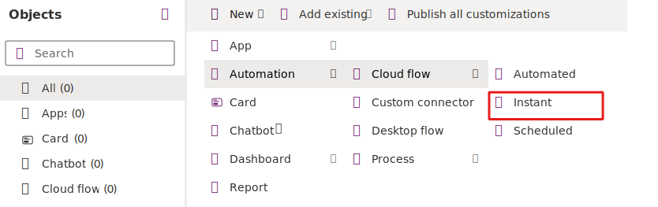
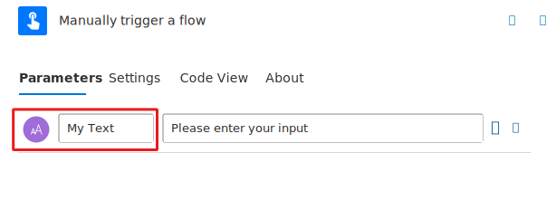
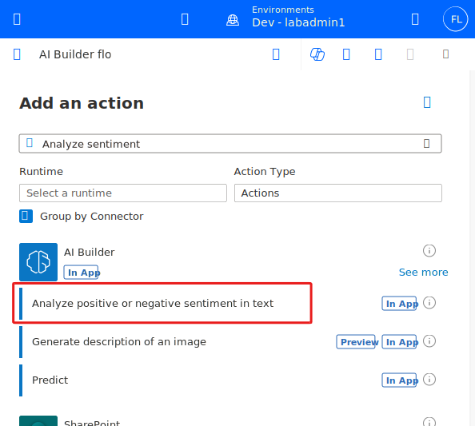
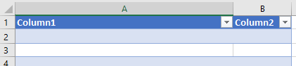
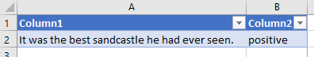

In this section, you discover and use AI Builder actions in Power Automate through the creation of a simple flow.

## Prerequisites

- Access to [Power Automate](https://flow.microsoft.com/?azure-portal=true).

- A license or trial of the [AI Builder](/ai-builder/administer-licensing).

- An [environment](/power-platform/admin/environments-overview) with a [Microsoft Dataverse database](/power-platform/admin/create-database). (Applicable only for work or school accounts).

- A Microsoft Office 365 account with access to OneDrive for Business and Excel Online (Business).

- A basic understanding of Power Automate and experience with creating a flow is recommended.

## Create a flow from a solution

Start by [signing in](https://flow.microsoft.com/?azure-portal=true) to Power Automate and then following all instructions in this section.

To add AI Builder actions in a flow, create the flow from a Microsoft Dataverse solution.

1. Go to **Solutions** from the navigation bar on the left and select **+ New solution**.

1. Enter **My AI Builder solution** for Solution name, select a Publisher, and then select **Create**.

1. Now select the **My AI Builder solution** solution to open it.

1. Select **+ New > Automation > cloud flow > Instant** in the action bar on the top of the screen. The flow designer screen appears and asks you to choose the trigger action.

    

1. Enter **My AI Builder flow** fo name, select **Manually trigger a flow** and then select **Create**.

1. Select the trigger and then select **Add an input**.

    

1. Select **Text**.

1. Name your input **My Text**, as shown in the following figure.

    

1. Select **+ Insert a new step** and then select **Add an action**. You now add an AI Builder action.

    

### Search for and add an AI Builder action

In this example, you add the AI Builder action that allows sentiment analysis. Choose one of the following options to help you accomplish this task:

1. In the search field, enter "Analyze sentiment" and select **Analyze positive or negative sentiment in text**.

    

1. Select **Sign in** if prompted.

### Configure the AI Builder action

Each AI Builder action has different parameters, depending on the underlying model requirements.

For the AI Builder sentiment analysis model, **Language** and **Text** are the two mandatory fields to fill in.

1. In the **Language** field, select **English** as the language.

1. Select the **Text** field and then select the **Enter the data from previous step** button.

    

1. Select **My Text**, which is defined in the trigger action.

    

    The **My Text** value is provided during flow testing, so you don't need to focus on it right now.

1. Select **Save.** Your flow is now saved with an autogenerated name. You can change it by selecting the generated name on the upper-left corner of the flow designer screen.

### Use the model's inference

For this exercise, you use a Microsoft Excel file in OneDrive to store the text sentiment that the AI model detects.

1. Create an Excel file named **AI Builder results.xlsx** in your OneDrive.

1. In this file, insert a table with two columns and then save the file (make sure that you use the **Insert > Table** function of Excel).

    

1. In **My AI Builder flow**, select **+ Insert a new step** and then select **Add an action**.

1. Search for add a row into table and select **Add a row into a table** action from Excel Online (Business).

1. Sign in if prompted.

1. Complete the **Location**, **Document Library**, and **File** fields to point to the Excel file you created.

1. In the **Table** field, select the name of the table that you created in your Excel file.

1. Select **Show all**.

    

1. Select  **Column 1** field and then select the **Enter the data from previous step button**.

1. Select **My Text** from the dynamic content pane.

1. Select  **Column 2** field and then select the **Enter the data from previous step button**.

1. Select **Overall text sentiment** from the dynamic content pane.

1. The Add a row into a table action should now look like the image below.

    

1. Select **Save**.

### Test the flow

Before productizing a flow, it's always a good idea to test it during design phase.

1. Select **Test** on the upper-right corner of the flow designer screen.

1. Select **Manually - Perform the starting action to trigger it.** and then select **Test**.

1. Select **Continue**

1. Provide the value of the **My Text** field from the trigger action. This text is what you want to analyze the sentiment for. For this example, we enter *It was the best sandcastle he had ever seen.*

1. Select **Run flow**

    

1. Select **Done**.

1. If your flow ran successfully, you would see all steps shown with a green checkmark.

    

1. You can expand the actions to view the running inputs and outputs of each action, which is a good way to debug your flow.

1. Check that the line is correctly added in the Excel file.

    

For more information, see [Use AI Builder in Power Automate](/ai-builder/use-in-flow-overview/?azure-portal=true).
