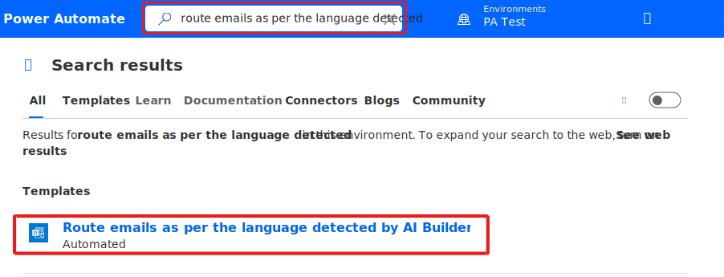
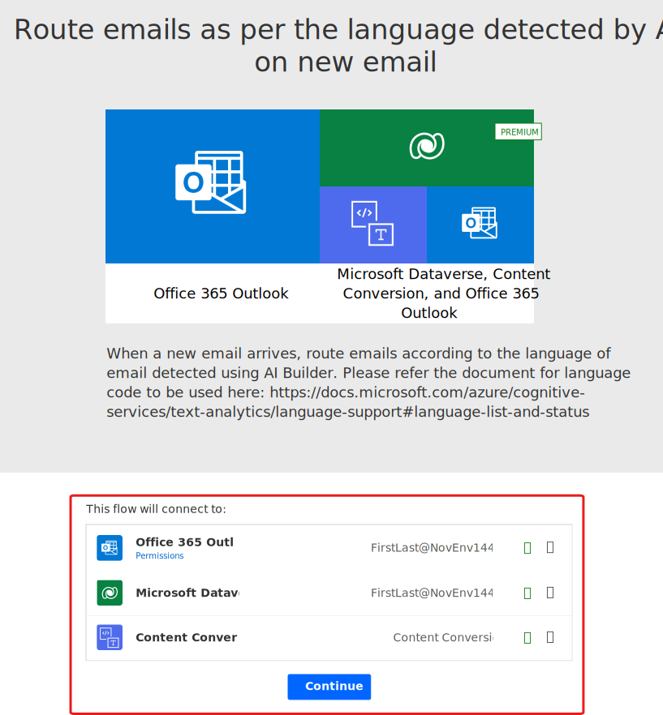
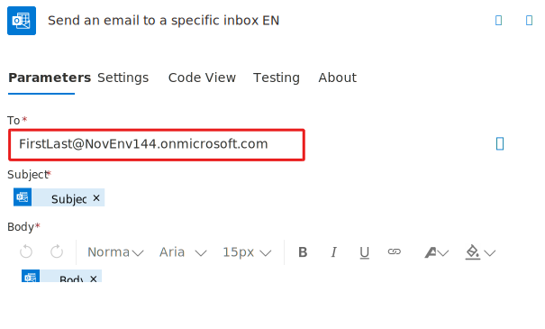

In this exercise, we use a flow template that connects to a preconfigured Language Detection model. This preconfigured Language Detection model is available in environments where *sample apps and data* are enabled.

1. Sign in to [Power Automate](https://ms.flow.microsoft.com/?azure-portal=true) using your organizational account.

1. Type *route emails as per the language detected* in the search box and select the **Search Icon**.

1. Select the **Route emails as per the language detected by AI Builder on new email** flow template.

    > [!div class="mx-imgBorder"]
    > 

1. At the bottom of the screen, under *This flow will connect to:* ensure all of your connections are entered correctly and select **Continue**. If any of the connections are missing or incorrect, you can't continue.

    > [!div class="mx-imgBorder"]
    > 

1. In the first 3 steps of this flow, it's checking a mailbox for new emails, then using the AI **Convert email to plain text by inputting 'Body' dynamic content** action and then using the **AI Builder Language Detection** to determine language.

    > [!div class="mx-imgBorder"]
    > 

In this example, we're just using our logged-in user account, but in a real-world scenario this would most likely be a shared Helpdesk mailbox.

1. This template has a couple of languages predefined, **EN** and **FR**. You could add more cases for other languages as well by selecting the **+** icon.

    > [!div class="mx-imgBorder"]
    > 

1. In the **Send an email to a specific inbox EN** step, select the **To** field and enter an email address. In this example, I use my mailbox. You can use your email address.

    > [!div class="mx-imgBorder"]
    > 

1. Repeat the previous step but enter a different email address. In this example, I use our **Helpdesk - Europe** mailbox.

1. Select **Save**.

Any new emails are now routed to the correct Helpdesk mailbox based on the language detected.

The flow should now save successfully.
