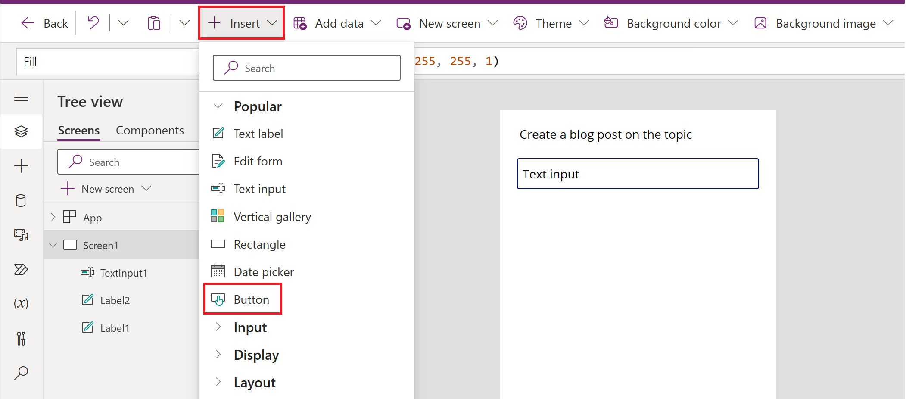
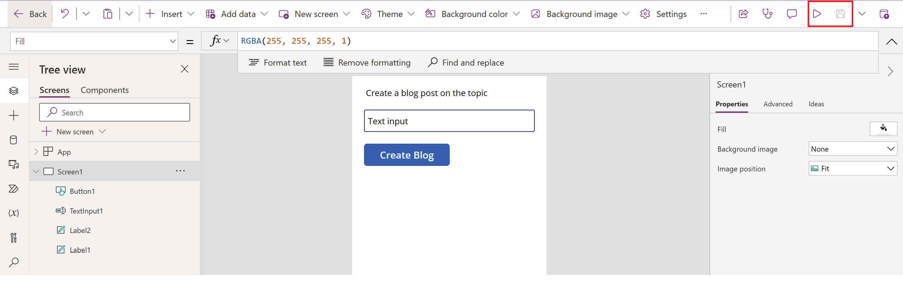

Your task for this exercise is to create an app from blank to create a blog post generator by using the AI Builder action **Create text with GPT**.

1. Sign in to [Power Apps](https://make.powerapps.com/?azure-portal=true).

1. On the left pane, select **Apps**.

1. Select **New app > Canvas**.

1. Enter **Blog creator** as the name and then select **Tablet** or **Phone** for the format of the app.

1. Select **Create**.

   > [!div class="mx-imgBorder"]
   > [](../media/canvas-create-text.png#lightbox)

1. From the bar menu, select **Insert > Text label**. Repeat this step to have two text labels.

   > [!div class="mx-imgBorder"]
   > [](../media/insert-text-label.png#lightbox)

   Now, **Label1** and **Label2** should display in your tree view.

1. Select **Label1** from the formula bar and then change the name from **Text** to **Create a blog post on the topic**.

   > [!div class="mx-imgBorder"]
   > [](../media/label-change-name.png#lightbox)

1. From the bar menu, select **Insert > Text input**.

   > [!div class="mx-imgBorder"]
   > [](../media/insert-text-input.png#lightbox)

1. From the bar menu, select **Insert > Button**.

   > [!div class="mx-imgBorder"]
   > [](../media/insert-button.png#lightbox)

1. Select **Button1** in the left pane, and from the right pane, change the name from **Button** to **Create Blog**.

   > [!div class="mx-imgBorder"]
   > [](../media/button-change-name.png#lightbox)

1. Select **TextInput1** in the left pane, and from the right pane, change the name from **Text** to **Response**.

1. Select **Button1** in the left pane and then select **OnSelect** from the dropdown menu.

1. In the formula bar, enter the following code:

   ```twig
   Set(TextBlogResult,
   'Create text with GPT'.Predict("Create a blog post on the topic " & TextInput1.Text & "the blog post should energize and motivate the audience.The blog post should be less than one page")
   );
   ```

   > [!div class="mx-imgBorder"]
   > [](../media/button-set-variable.png#lightbox)

1. Select **Label2** in the left pane. In the formula bar, enter **TextBlogResult.Text**.

   > [!div class="mx-imgBorder"]
   > [](../media/label-text-blog-result.png#lightbox)

Congratulations, you've created an app that uses an AI Builder **Create text with GPT** capability. In the upper right of the screen, select **Save** to save all changes in the app, and then select **Play** to test the application.

   > [!div class="mx-imgBorder"]
   > [](../media/save-play.png#lightbox)

### Observe the app in action

The following example shows the result of entering **Skiing in Norway** in the **Text input** box.

   > [!div class="mx-imgBorder"]
   > [](../media/blog-post-result.png#lightbox)

> [!IMPORTANT]
> Make sure that AI-generated content is accurate and appropriate before you use it.
