In this exercise, you'll learn how to create text from blank with text generation in a cloud flow.

Your task is to create an automated flow from blank when a new email arrives, summarize the email, send the response to Microsoft Teams by using the AI Builder action **Create text with GPT**.

1. Go to [Power Automate](https://make.powerautomate.com/?azure-portal=true).

1. On the left pane, select **Create > Automated cloud flow**.

1. Name your flow, for instance,  **Summarize emails**.

1. Select **When a new email arrives (V3)** as a trigger.

1. Select **Create**.

1. Select **Next step**.

1. Select **Html to text (Preview)**.

1. Select **Body** from the **Dynamic content** list.

   > [!div class="mx-imgBorder"]
   > [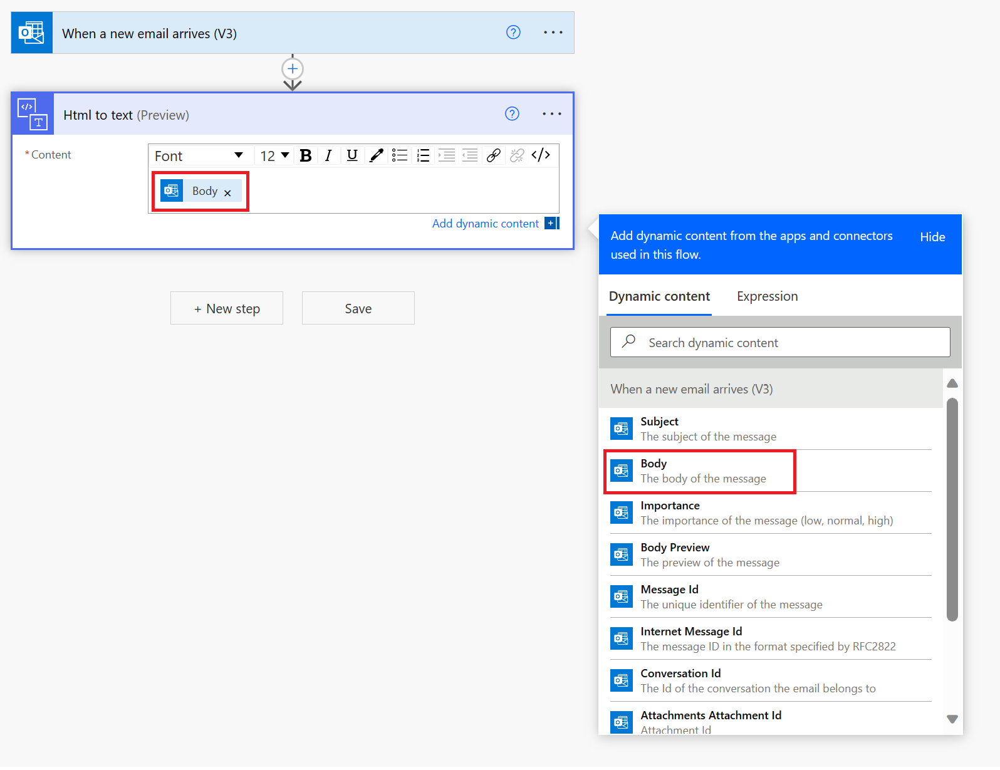](../media/html-text.png#lightbox)

1. Select **New step > AI Builder > Create text with GPT (preview)**.

   > [!div class="mx-imgBorder"]
   > [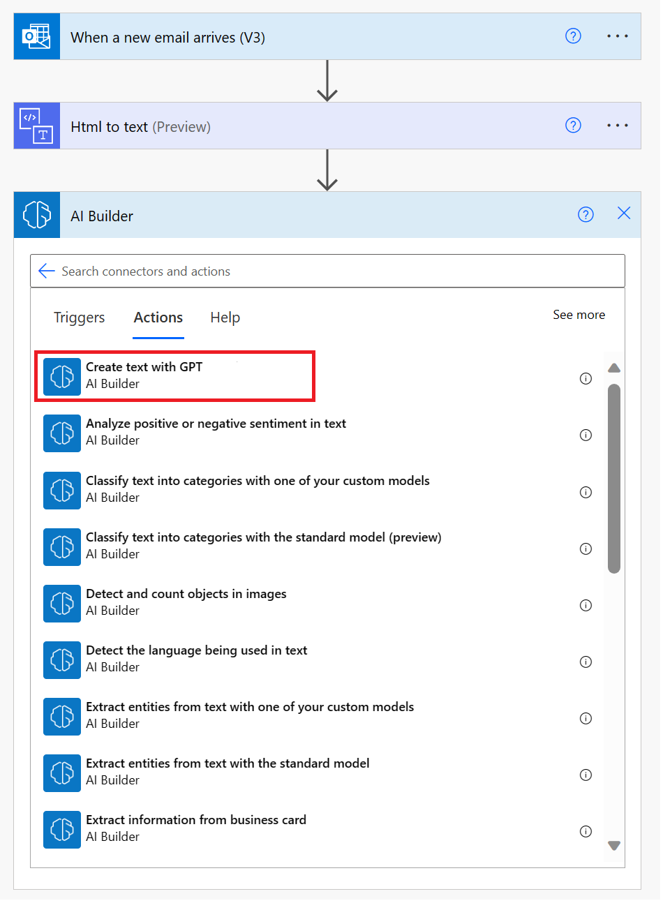](../media/create-text-action.png#lightbox)

1. Select **Create prompt > Start from blank**.

   > [!div class="mx-imgBorder"]
   > [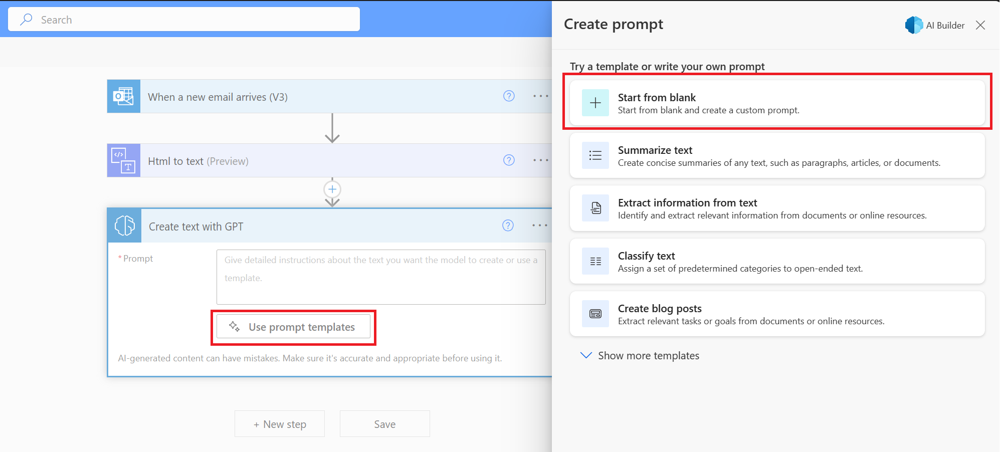](../media/use-prompt-start-blank.png#lightbox)

   > [!NOTE]
   > Make sure that AI-generated content is accurate and appropriate before you use it.

1. In the **Create prompt** window, describe the text that the model should create.

1. Add your email content between `###` and `###`.

   `###`

   `<Your Text>`

   `###`

1. Select **Test it out**.

   > [!div class="mx-imgBorder"]
   > [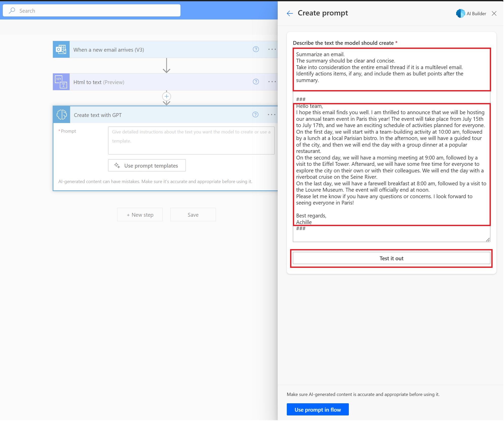](../media/describe-text-test.png#lightbox)

   > [!NOTE]
   > No user data has been stored; this exercise has been designed specifically to help you with your queries on text generation.

1. If you're satisfied with the response, select **Use prompt in flow**.

   > [!div class="mx-imgBorder"]
   > [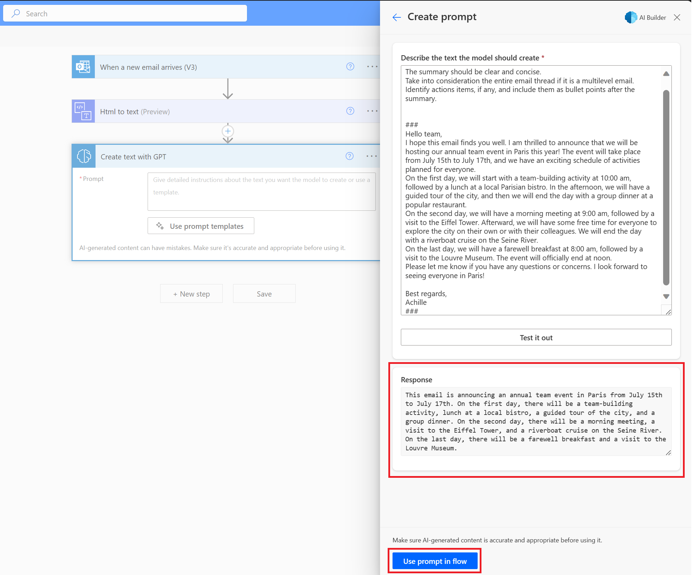](../media/test-response.png#lightbox)

   Before saving and running your flow, make sure that you replace your sample with the dynamic content that your flow is using.

1. In the AI Builder action **Create text with GPT**, select **The plain text content** option from the **Dynamic content** list.

   > [!div class="mx-imgBorder"]
   > [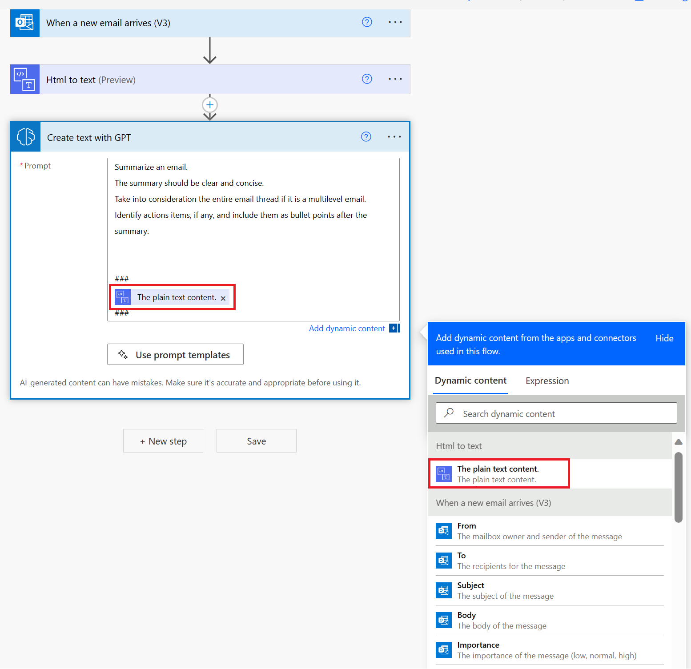](../media/select-plain-text-content.png#lightbox)

   > [!IMPORTANT]
   > To ensure safe practices, make sure that you exercise caution when sharing AI-generated content due to the possibility of errors and biases. Using human oversight before posting on platforms like Teams, internally and externally, is highly recommended.

1. Select **Next step > Approvals**.

1. Select **Start and wait for an approval** and then complete the following actions:

   1. In the **Approval type** field, enter **Select Approve/Reject - First to respond**.

   1. In the **Title** field, enter **Review summarized email**.

   1. In the **Details** box, select **Text** from the **Dynamic content** list.

   1. In the **Assigned to** field, enter the email alias of the approver.

   > [!div class="mx-imgBorder"]
   > [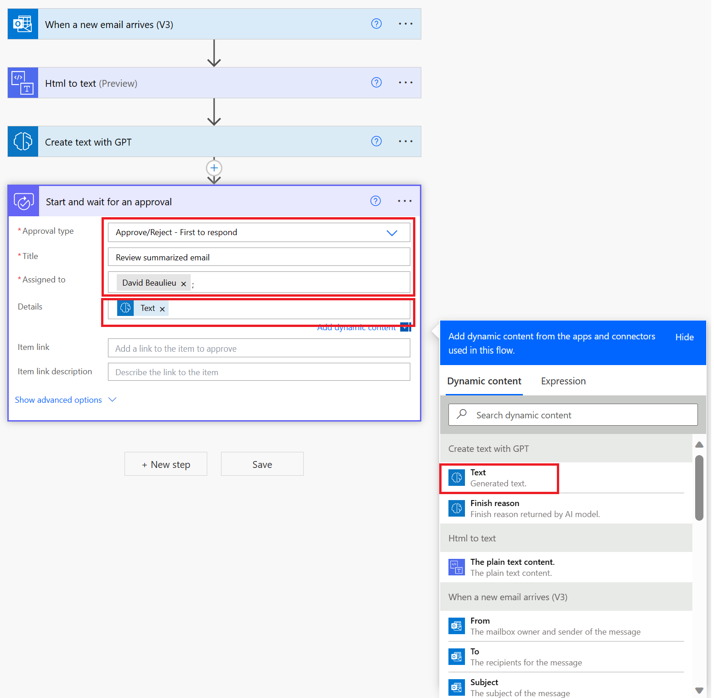](../media/start-wait-approval.png#lightbox)

1. Select **Next step >  Condition**.

1. In the **Condition** box, add **Outcome** from the **Dynamic content** list from the approval step as the condition to check.

   > [!div class="mx-imgBorder"]
   > [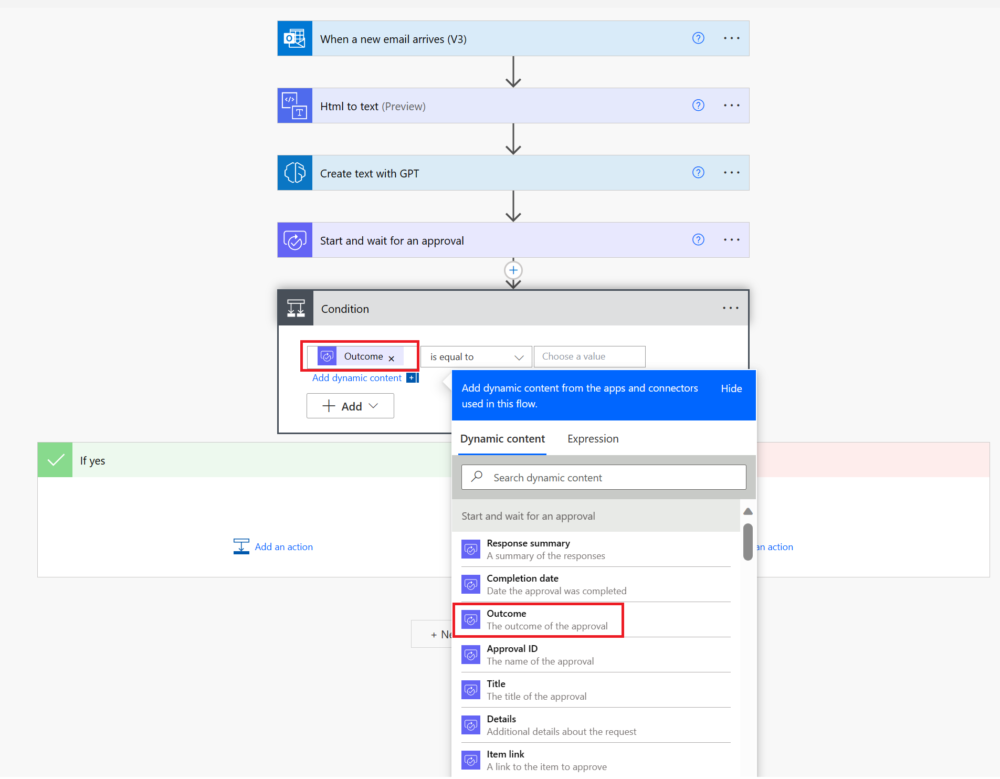](../media/approvals-set-outcome.png#lightbox)

1. In the **Condition** box, set **Approve** as the positive response to validate.

   > [!div class="mx-imgBorder"]
   > [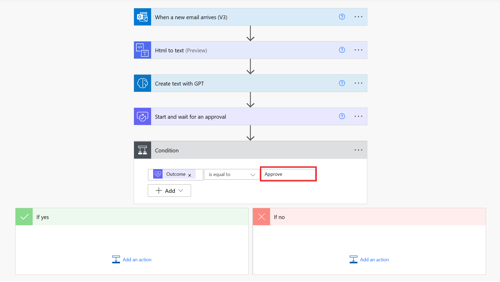](../media/approvals-set-approve.png#lightbox)

1. If the condition is true (which is Approve in this case), select **+ New step > Teams** and then select **Post message in a chat or channel**.

1. Use the AI-generated **Text** from the **Dynamic content** list as the content to post on a desired Teams chat or channel.

   > [!div class="mx-imgBorder"]
   > [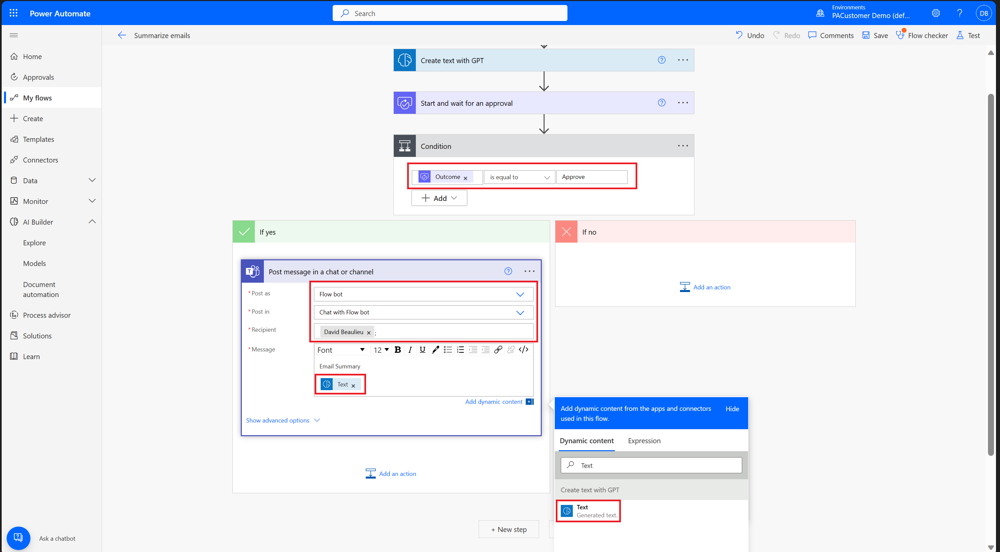](../media/post-message-chat.png#lightbox)

1. Select **Save** in the upper right and then select **Test** to try out your flow.

Congratulations, you've created a flow that uses an AI Builder to create text with GPT capability.

## Observe the approvals in action
To observe the approvals in action, follow these steps:

1. On the left pane, select **Approvals**.

1. Select the **Review summarized email** request.

1. On the right pane, you can review the **details** of the AI Text that has generated.

1. Choose your response as **Approve**, **Reject**, or **Reassign** (depending on your satisfaction with the generated text). For this exercise, select **Approve**.

1. Select **Confirm**.

   > [!div class="mx-imgBorder"]
   > [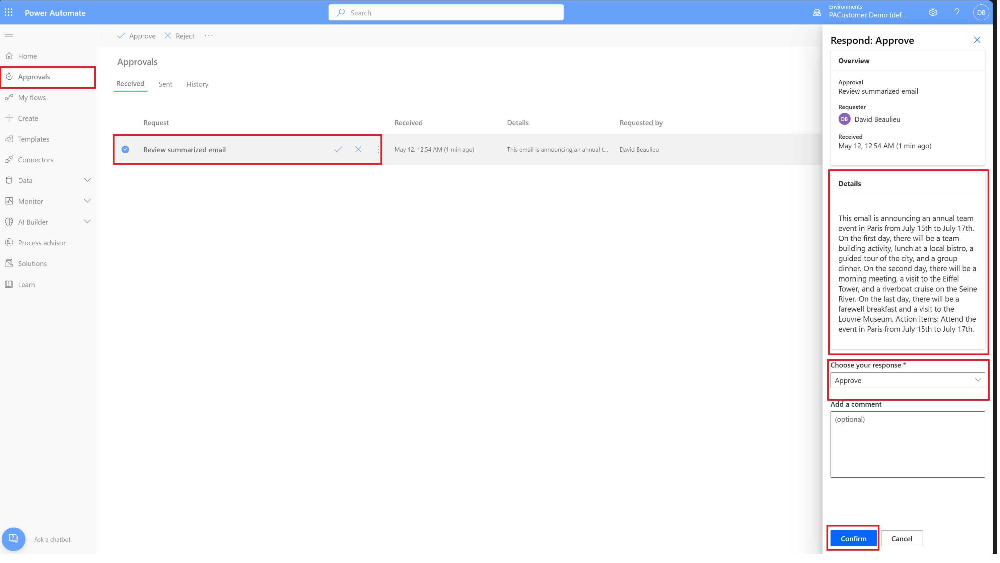](../media/approvals.png#lightbox)

The post message should show as having been sent to Teams.

   > [!div class="mx-imgBorder"]
   > [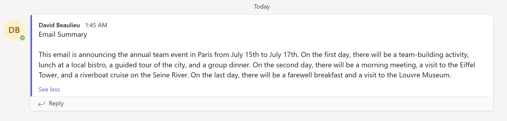](../media/teams.png#lightbox)

> [!IMPORTANT]
> Make sure that AI-generated content is accurate and appropriate before you use it.
