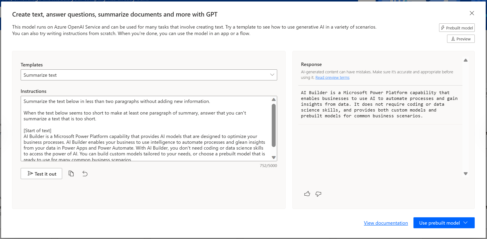
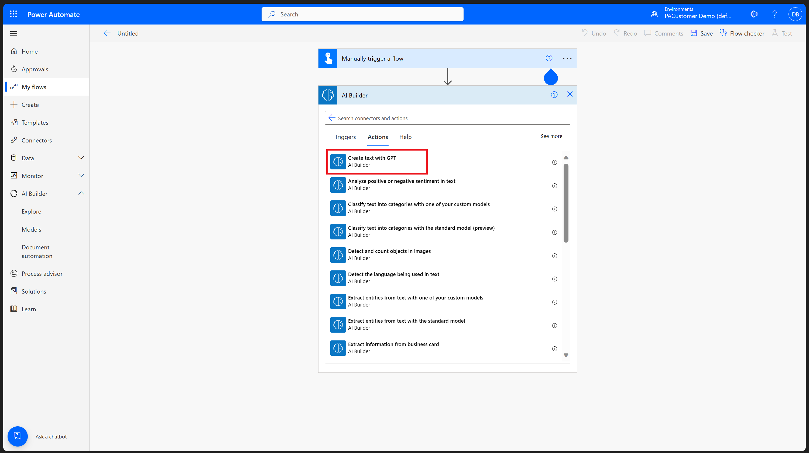
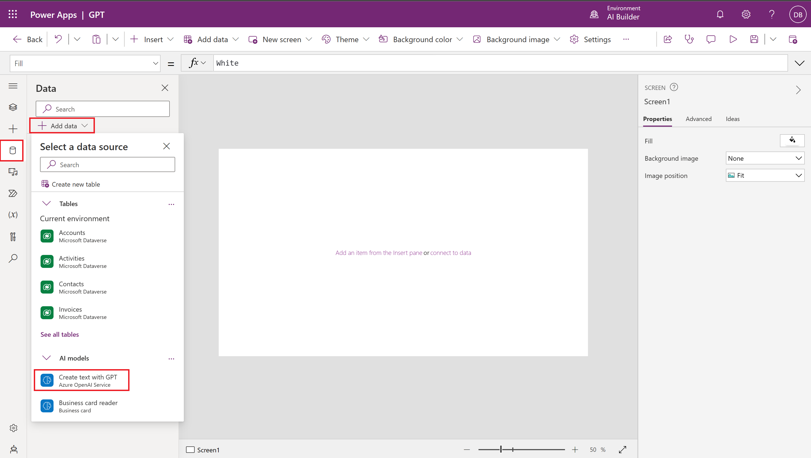

Text generation capability is a powerful tool in AI Builder. It helps you to create custom AI capabilities quickly and easily for natural language processing (NLP).

This capability enables you to build many use case scenarios, such as:

- Sentiment analysis

- Text classification

- Named entity recognition

- Summarization

- Translation

- Content recommendation

- Document clustering

- Content creation

It also allows you to use large language models for various purposes.

> [!div class="mx-imgBorder"]
> 

After you've crafted the correct prompt, you can automate interactions with a Generative Pretrained Transformer (GPT).

### Integrate text generation in AI Builder with Power Automate
The following screenshot shows how you can integrate text generation in AI Builder with Microsoft Power Automate. From the **Manually trigger a flow** action, select **Power Automate** and then select the **Create text with GPT - Power Automate** option under the **Actions** tab.

> [!div class="mx-imgBorder"]
> 

### Integrate text generation in AI Builder with Power Apps
The following screenshot shows how you can integrate text generation in AI Builder with Microsoft Power Apps. In the Power Apps maker portal, select the data icon, select **+ Add data**, and then in **Select a data source**, select **Create text with GPT - Azure Open AI Service** from the **All models** dropdown menu. 

> [!div class="mx-imgBorder"]
> 
