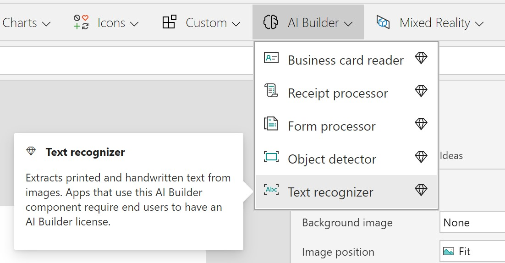
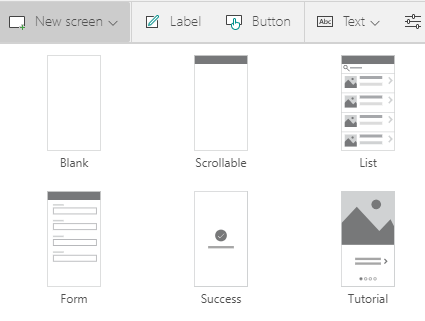

## Build a canvas Power App

The goal is to streamline the work of front-line worker. We will build a canvas Power Apps (See [What are canvas apps in Power Apps?](/power-apps/maker/canvas-apps/getting-started/?azure-portal=true)) that will allow to take a picture, automatically recognize the container identifier, and provide a guided experience to update state, shipment and arrival dates.

Use "Create" in Power Apps left menu and then "Canvas app from blank", name it Contoso Container Check-in, select "Phone" and then click on "Create".

## Retrieve identifiers from a photo

Let's enable John and Chandra to take a picture of a container and automatically retrieve the container identifiers. From "Insert" menu and "AI Builder" bar choose "Text Recognizer". This is the control that will allow to take or upload a picture and automatically recognize the container identifier.



Resize the control to fit in the screen and insert on the top a label editing the "Text" property to "Container Check-in" with blue background and white text centered.

## Provide feedback

We need to provide feedback to the user on what has been recognized. Selected Insert on the bottom a new label changing the "Text" property to "Selected Container:".

Aside insert a text Input and change the "Default" property to TextRecognizer1.SelectedText.

>[!NOTE]
>You can retrieve all the texts recognized with TextRecognizer1.OcrObjects and bind it to a table.

This will display the text manually selected by the user from the list of texts recognized by AI Builder.

Eventually, the user needs a button to see details on this container and enter the guided update experience.

## Insert a button

- Change the "Text" property to "Submit"
- Change "Fill" property to blue
- Change "Align" property to Center
- To navigate to next screen when the user clicks on submit, change "OnSelect" to Navigate(Screen2). (You will get an error until we create the next screen)

You should see this:


## Streamline work

To streamline the work of the front line worker minimizing information requested, we will provide a guided experience that allows the user to update the table data but ask him only the information relevant at this stage of the shipment. Insert a new Form Screen (See [Add a screen to a canvas app and navigate between screens](/power-apps/maker/canvas-apps/add-screen-context-variables/?azure-portal=true))



Change the title "Text" property to "Update shipping."

Edit the EditForm1 (See [Show, edit, or add a record in a canvas app](/power-apps/maker/canvas-apps/add-form/?azure-portal=true))

- To bind the edit form to the table previously created, Click on connect to data on the view and select 'Container Shipments' on the left pane**

- Change the property "DataSource" to 'Container Shipments'

### Enter the fields that will be displayed in the form

In the right pane, click on "Edit Fields" and add "Origin," "Shipping Date," "Destination," "Arrival Date," "Is Fragile," and "Delivery State," and remove "Created On."

### Provide a guided experience

We need to show only and allow change only on relevant fields depending on the state of shipment. In this case, the user will change the "Shipping Date" when shipping the container and "Arrival Date" when receiving the container, other fields will be hidden on not updatable.** Change the "DisplayMode" of "Name", "Origin", "Destination", "Is Fragile" and "Delivery State" to View.

## Display the proper container information

Retrieve the one corresponding to the text previously selected by the user.** This can be achieved by setting the "Item" property of the EditForm1 to First(Filter(\'Container Shipments\', Name = TextInput1.Text)) on the advanced properties.

The screen will behave differently depending on the state of the container. When it is waiting to be shipped, the user will be able to change the "Shipping Date" and when receiving it the "Arrival Date".

Edit "Shipping Date\_DataCard1" (unlock the properties on the left pane, see [Unlock and customize a card](/power-apps/maker/canvas-apps/customize-card?azure-portal=true#unlock-and-customize-a-card)).

- To force the user filling the shipment date, change the "Required" property to True

- The user shouldn't change the shipping date after shipment. Let's make it editable only when it is waiting to be shipped then.
    You can achieve this by changing the "DisplayMode" property to:

    ```If(ThisItem.'Delivery State' <> ContainerStates.Waiting, DisplayMode.View, DisplayMode.Edit)```

Edit "Arrival Date\_DataCard1" (unlock the properties on the left pane)

- The arrival data is relevant only when container is being received or delivered, so we should show it only in this case. Change the "Visible" property to ThisItem.\'Delivery State\'\<\> ContainerStates.Waiting

- To enforce the user filling the shipment date when receiving the container**, change the "Required" property to:

    ```ThisItem.'Delivery State'<> ContainerStates.Waiting```

- This arrival date should be changed once when container is being received otherwise it should be just displayed. Change the "DisplayMode" property to:

    ```If(ThisItem.'Delivery State'= ContainerStates.Delivered,DisplayMode.View, DisplayMode.Edit)```

We now need to build the logic to update the state when the user is submitting the change and prevent changes to happen after the container has been delivered.

```Edit "IconAccept1"```

- To change the state to In Transit when the container is being shipped and delivered when being received and submitting changes, change the "OnSelect" property to

    ```If(First(Filter('Container Shipments', Name = TextInput1.Text)).'Delivery State'= ContainerStates.Waiting, Set(valState, ContainerStates.'In Transit'), Set(valState, ContainerStates.Delivered));SubmitForm(EditForm1);```

- To not display the submitting button when the container has been already delivered, change the "Visible" property to:

    ```'Delivery State_DataCard1'.Default <> ContainerStates.Delivered```

- To update the container state automatically,

    ```*edit "Delivery State_DataCard1" (unlock the properties on the left pane) change the "Update" property to valState```

Once a change has been successfully submitted or canceled changes, we need to navigate to the previous screen. We also need to ensure the form is reset each time we enter screen.

- To refresh the form when entering the screen,

    ```** edit "Screen2" and change "OnVisible" property to Refresh('Container Shipments');ResetForm(EditForm1);```

- To get back to the scanning screen when changed have been applied, edit the

    ```"EditForm1"```

     and change

     ```"OnSuccess" property to Navigate('Screen1')```

- To get back to the scanning screen when the user hit the cancel button,** edit the "IconCancel1" and change "OnSelect" property to Navigate(\'Screen1\')

You should get this:


## Summary

We have successfully built a phone application streamline the front-line worker task to update container shipments thanks to a guided flow. We are now ready for running the business.
