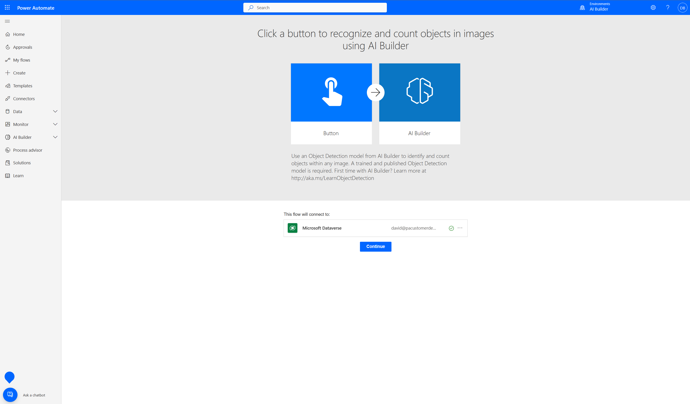
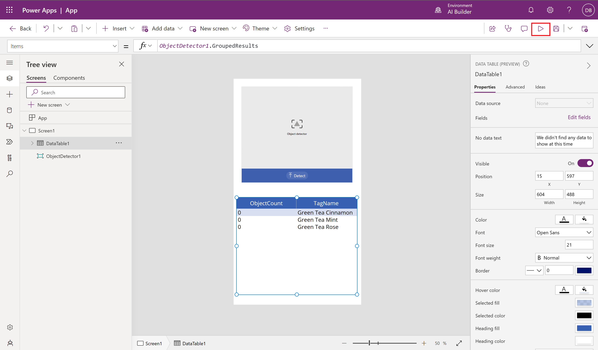

Learn how to use your Object detection model in Power Apps.

### Quick test

After your model has completed training, you can view important details about your newly trained model on a details page.

> 

To see your model in action, select **Quick test**.

> 

Drag and drop or upload an image from your device to test. From the provides sample data https://go.microsoft.com/fwlink/?linkid=2103171, use the files from the Test folder **AIBuilder_Lab\Lab Images\ObjectDetection_GreenTea\Test** that we didn’t use for training.

> 

You will now be able to view the detected fields that you chose and the associated confidence scores for retrieving the individual fields compared to the trained model.

### Publish your model

Your model can't be used until you publish it. If you're satisfied with your model, select **Publish** to make it available for use.

> 

### Use your model in Power Automate

Now that your model is published, you can use your Object detection model in a flow. A special component is available for you to add that analyzes any image and detects objects based on your trained object detection model.

1. Select **Use model**.
2. Select **Build intelligent automations**.
3. Make sure that you are signed into the flow and then select **Continue** to confirm the creation of the flow.

   > 
 

   The flow has already been configured to run manually. Let's see it in action!

   > 

4. Select **Save** on the top right to test the flow.
5. Select **Test**.
6. Select **Manually** and then select **Test**.
7. Select **Import** and Select an image from your local device.
8. Select **Run Flow**.

After a few seconds, you will see the flow running. The flow will extract the data. 
Congratulations! You’ve built an intelligent automation flow. You can then customize the flow to your needs to perform any other action you may want. 

### Use your model in Power Apps

Now that your model is published, you can use your Object detection model in a canvas app. A special component is available for you to add that analyzes any image and detects objects based on your trained object detection model.

1. Select **Use model**.
2. Select **Build intelligent apps** to begin the canvas app creation experience.
3. Within your canvas app, an object detection component is automatically added and linked to your published Object detection model (*Object Detection Green Tea in this example*). Going forward, you can select Insert > AI Builder to view the list of AI Builder components and then select Object detector to add an object detector component. Make sure that you select the correct model; only published models will appear in the drop-down list.

   > 
 
4. Select **Insert** and then add a **Data table (preview)** component. 
5. To bind the Object detector component to one of the data tables, select the Data table **DataTable1** component and replace the formula bar value with **ObjectDetector1.GroupedResults**. 

   > 

6. Select **Edit Fields**, Select **Add Field**, Select **ObjectCount** & **TagName**, and Select **Add**

   > 

7. Select **Play** on the upper right of the Power Apps studio to preview the app. 

   > 

8. Select **Detect** and then select the image from your local device. 

   > 

You should be able to examine the count of objects per Tag Name. 

   > 

Congratulations! You’ve built an intelligent app. 
