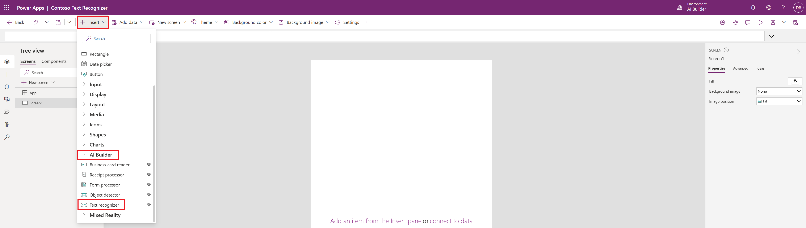
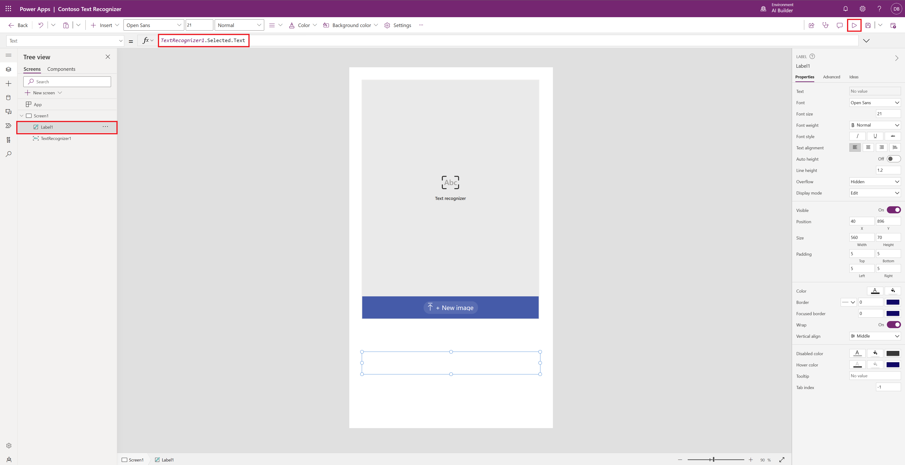
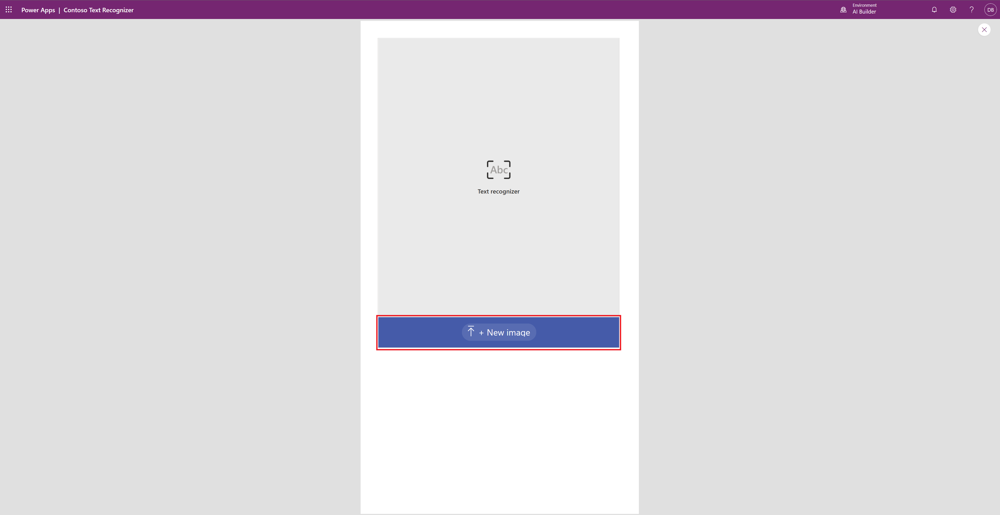
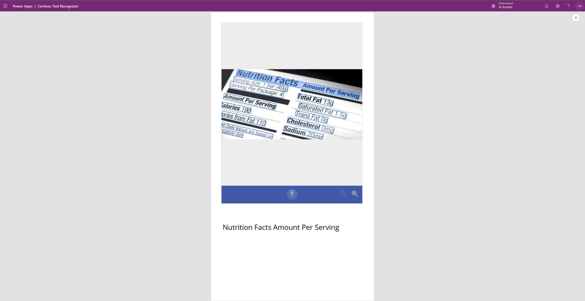
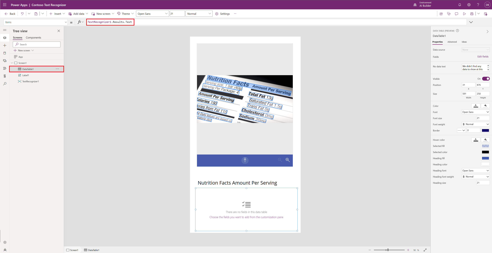
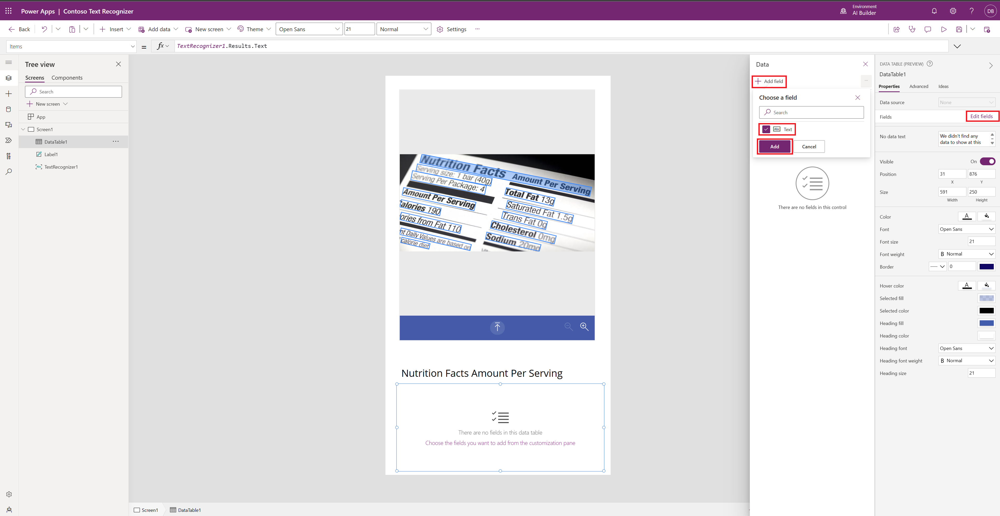
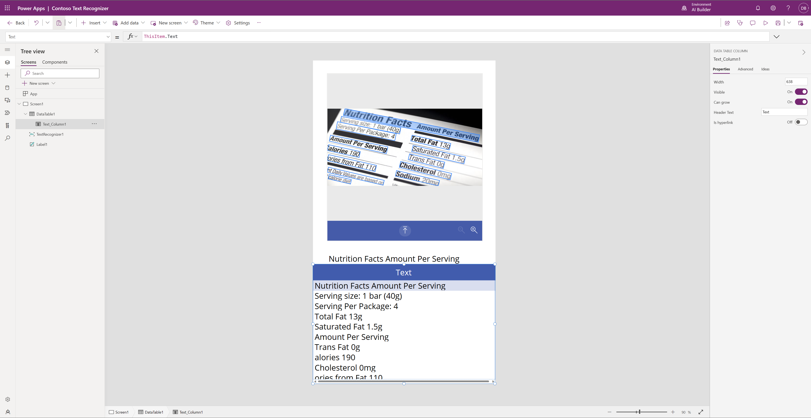

Your task for this exercise is to take a picture, or upload an existing one from the file system, and then retrieve text lines that are present in the image. Then, you will build a Power Apps canvas app and will use the Text recognizer component, which can be useful for assisted data entry. For more information, see the What are canvas apps in Power Apps? and the Use the Text recognizer component articles in Power Apps documentation.

## Create an application in Power Apps

To create an application in Power Apps, follow these steps: 

1.	Select **+ Create** in the Power Apps menu
2.	Select **+ Blank app** 
3.	Select **Blank canvas app** 
4.	Select **Create** 
5.	Name the canvas app **Contoso Text Recognizer**
6.	Select **Phone**
7.	Select **Create**

Your next task is to give users the ability to automatically retrieve the text lines that are visible in the image.

1. From **+ Insert > AI Builder**, select **Text recognizer (preview)**. This control allows you to take or upload a picture and automatically recognizes the container identifier.

    
2. Resize the control to fit in the screen.

## Show results of model’s extracted information

To show results of model’s extracted information, follow these steps: 

1.  Select **Insert Text label** 
2.  Select **Label1** and type **TextRecognizer1.Selected.Text** in the Formula Bar 
3.  Select Run  

This will display the text that was manually selected by the user from the list of texts that were recognized by AI Builder. 

 

4.  To analyze an image, select **+ New image** and then select an image from your device. You can also take a picture with your mobile device. 

AI Builder Text recognition will now process the image and will display the recognized text in blue bounding boxes. 
You can also manually select a bounding box with your mouse on a computer or by tapping directly on a bounding box on a touch-enabled device.

 
 
 

## Retrieve the list of all text lines and display it to the user

To retrieve the list of all text lines that are present in the image and then display it to the user.  

This change will bind the list of recognized text lines to the data table. 
 
1.  Select **+ Insert** and Type **Data table**, Select **Data table (preview)** 
2.  Select **DataTable1** and type **TextRecognizer1.Results.Text** in the Formula Bar 

 

3.  On the right pane, select **Edit Fields**, select **+ Add field**, Select **Text** and select **Add**

 
 
 All recognized text should be visible in the table beneath the image. 
 
  

AI Builder Text recognition is able to recognize various printed character fonts and handwritten text.

You can use these results in many possible ways, such as saving it on your Microsoft Dataverse environment or other database with the help of connectors. For more information, see [Show, edit, or add a record in a canvas app](/powerapps/maker/canvas-apps/add-form/?azure-portal=true).
