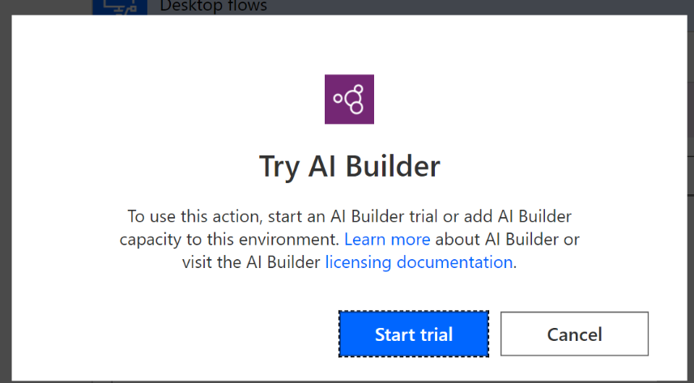
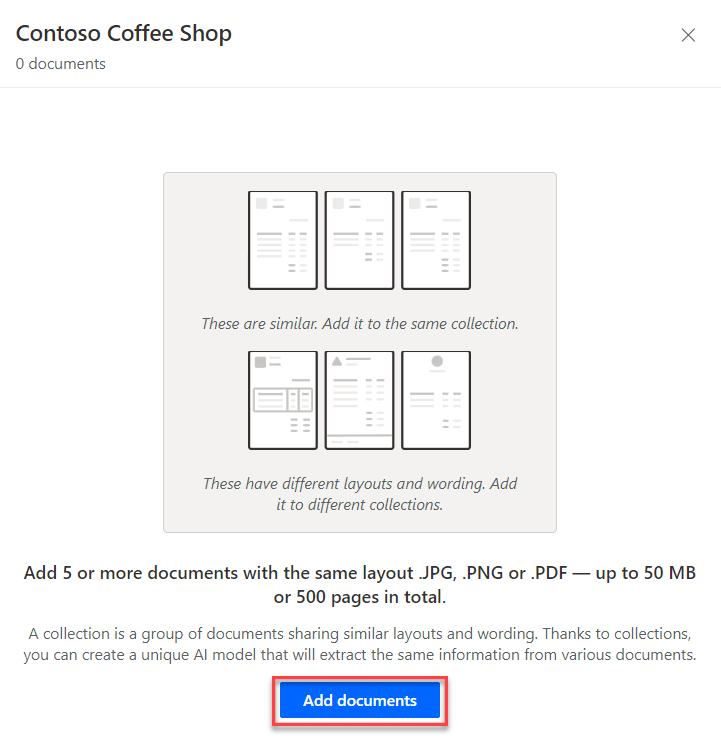
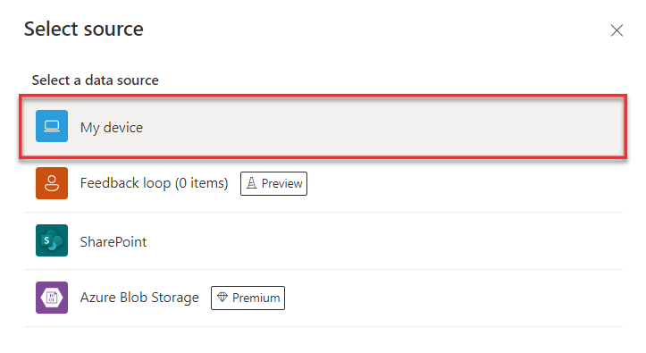
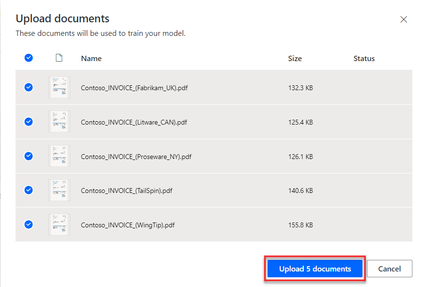
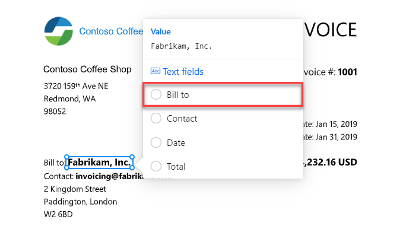
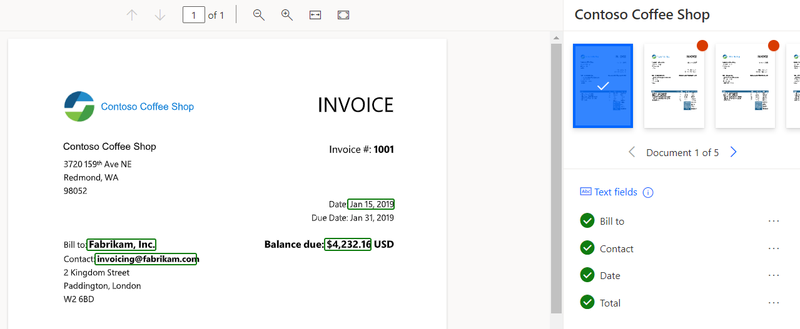
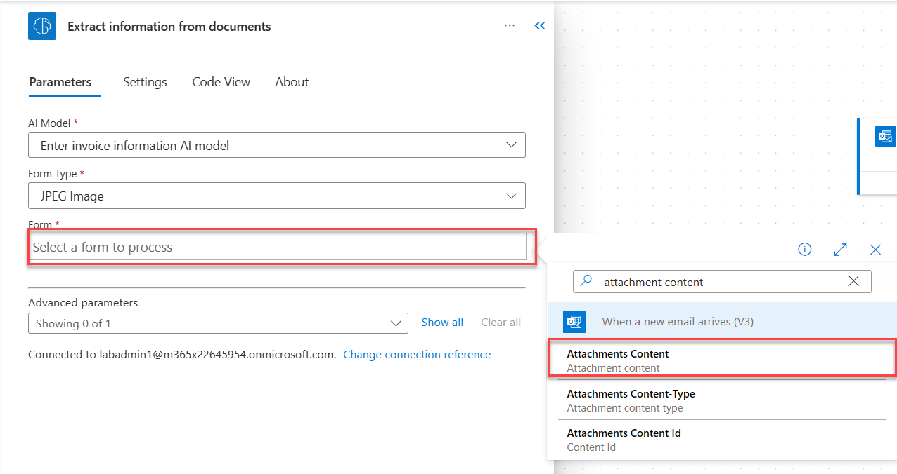
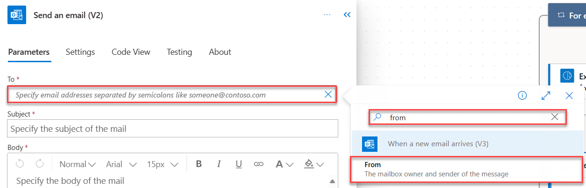
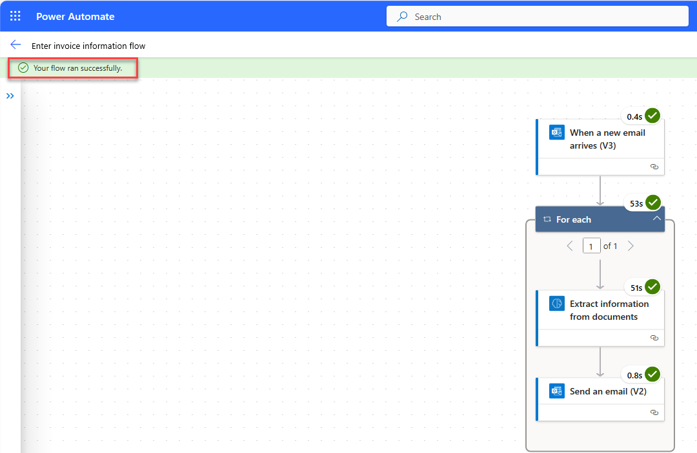
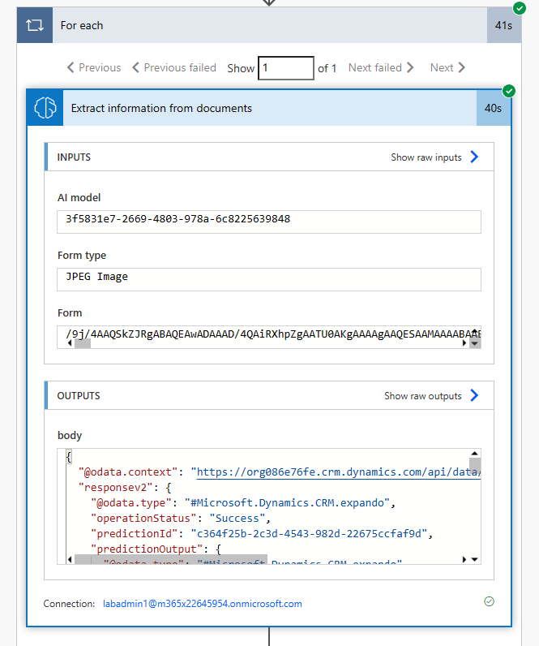

In this exercise, you build and use AI models to enhance user experience in workflows.

1. Open a new web browser and then go to [https://make.powerautomate.com](https://powerautomate.microsoft.com/?azure-portal=true). Sign in if needed and then make sure that you're in the correct environment.

1. In the left navigation pane, select **AI hub**, then select **AI models** near the middle of the screen.

   > [!div class="mx-imgBorder"]
   > 

   > [!NOTE]
   > A prompt may appear, stating that you need to get **AI Builder**. You can opt in for a free, 30-day trial, which starts automatically after you complete these steps. Select the **Start trial** button.
   >
   > [!div class="mx-imgBorder"]
   > 

1. A prebuilt invoice processing model is available for you to use for processing most invoices directly. However, for this training, you learn how to build your own custom model. From the models section, select the **Document Processing** model. The model should also say **Extract custom information from documents**. If your model results are filtered by **Most popular**, then it's the second result.

   > [!div class="mx-imgBorder"]
   > 

1. From the **Extract custom information from documents** dialog, select the **Create custom model** button located in the lower-right corner.

   > [!div class="mx-imgBorder"]
   > 

1. Select the **pencil** icon to the left of the model name to begin editing. In the **Model name** field, name the model as `Enter invoice information AI model`. Select the **Rename** button.

   > [!div class="mx-imgBorder"]
   > 

1. Select **Structured documents** and then select **Next**.

   > [!div class="mx-imgBorder"]
   > 

1. Create four fields for your AI model. Select the dropdown menu next to the **+ Add** button and then select the **Text field** option.

   > [!div class="mx-imgBorder"]
   > 

1. Within the **Text field** dialog, in the **Name** field, enter `Bill to`. Select **Done**.

   > [!div class="mx-imgBorder"]
   > 

1. Repeat these steps until you add the following four fields. Keep in mind that you already added the **Bill to** field.

    - Bill to

    - Contact

    - Date

    - Total

   > [!div class="mx-imgBorder"]
   > 

1. After you add all four fields, select the **Next** button in the lower part of the screen.

1. Collections allow for the grouping of documents for a particular organizer, customer, or counterparty. Create a collection for Contoso by selecting the **New collection** button.

   > [!div class="mx-imgBorder"]
   > 

1. Select **Collection 1** and then rename it to `Contoso Coffee Shop`.

   > [!div class="mx-imgBorder"]
   > 

1. Select the plus (**+**) sign in the center of the collection and then select the **Add documents** button to upload your sample PDF files from the module resources folder.

   > [!div class="mx-imgBorder"]
   > 

1. For this exercise, you upload the files from **local storage/source**. (Your local storage might be named something different than the one shown in the following figure. For this demonstration, the local storage is called **My device**.)

   > [!div class="mx-imgBorder"]
   > 

   Select the following documents from your local storage by locating them within the file you saved and then holding the **Ctrl** key and selecting them. Then, select **Open**. (You can find the documents under the **AutomationIAD-Learn-student-files** folder, then the files are under **Lab #6 Training data for AI Builder**).

    - Contoso_INVOICE_(Fabrikam_UK).pdf

    - Contoso_INVOICE_(Litware_CAN).pdf

    - Contoso_INVOICE_(Proseware_NY).pdf

    - Contoso_INVOICE_(TailSpin).pdf

    - Contoso_INVOICE_(WingTip).pdf

   > [!div class="mx-imgBorder"]
   > 

1. Locate and ensure that the five PDF files that are used for this training are selected. Then, select the **Upload 5 documents** button located in the lower part of the **Upload documents** dialog.

   > [!div class="mx-imgBorder"]
   > 

1. After the documents are uploaded, a success message appears, similar to the one in the following figure. Select **Done** to continue.

   > [!div class="mx-imgBorder"]
   > 

1. In the **Add documents** dialog, select the **Next** button.

   > [!div class="mx-imgBorder"]
   > 

1. After the system finishes the loading process, you need to tag your documents. Tag the documents one by one, to the correct value of the corresponding fields so that you can teach AI Builder how to extract values from this form example.

1. Ensure that you're currently viewing the first document. By using a drag-to-highlight method, highlight the **Bill to** contact within the document (don't include "Bill to" in your highlight, only highlight the contact). After you highlight the contact in the document, a menu with field options will appear.

1. Select the **Bill to** field option from the menu. The system should tag the document information to the **Bill to** field within the list to the right of the screen. A green check mark appears to confirm the tag.

   > [!div class="mx-imgBorder"]
   > 

1. Use the same process to highlight the **Contact** information within the first document. Then, from the field menu that appears, select the **Contact** field. A green check mark appears in the list to signify that the tag is made within this document.

   > [!div class="mx-imgBorder"]
   > 

1. Repeat the previous steps to tag the **Date** and **Total** information from the first document to the proper field. In the upper part of the screen, the first document shows as shaded with a blue color. This shading indicates that all possible tags within this document are made. Your screen should resemble the following figure.

   > [!div class="mx-imgBorder"]
   > 

1. In the upper portion of your screen, use the arrows to switch to the next document. Repeat the same process to tag the correct information within the document to the proper field. Repeat this step for the remaining documents until all five documents show as shaded in blue, indicating that all possible tags are made within each document.

   > [!div class="mx-imgBorder"]
   > 

   > [!NOTE]
   > Select only the field value without the field title from the document. For example, select **Jan 15, 2019** and then tag it as **Date**.
   >
   > If you've mistakenly tagged a field, you can right-click the field from the list to the right of the screen and then select the **Remove tag** option.

1. After you finish making all possible tags within the five documents, select the **Next** button located in the lower left of the screen.

   > [!div class="mx-imgBorder"]
   > 

1. Now, you're ready to train your AI Builder model. To do so, select the **Train** button located in the lower left of the screen. This process might take a few minutes to complete.

   > [!div class="mx-imgBorder"]
   > 

1. The window in the following figure appears while the model is training. Select the **Go to models** button.

   > [!div class="mx-imgBorder"]
   > 

1. After the AI Builder model training is complete, the status changes to **trained**. Select the **title** of the model to gain access to more options. Here you can **publish** your AI Builder model by selecting **Publish**.

   > [!NOTE]
   > Publish your model when you want to make it available to users in your Power Automate environment.

   > [!div class="mx-imgBorder"]
   > 

1. Now you have an AI Builder model trained and published. Next, you use this AI Builder model that you trained in your automation. From the menu to the left of the screen, select **Solutions** and then open **Invoice processing solution**.

   > [!div class="mx-imgBorder"]
   > 

1. Select **Add existing** and then select **AI Model**.

   > [!div class="mx-imgBorder"]
   > 

1. Select the model that you created and then select **Add**.

   > [!div class="mx-imgBorder"]
   > 

1. Open **Use Outlook email to trigger Desktop flow**.

   > [!div class="mx-imgBorder"]
   > 

1. Select the  **Edit** button from the top of the screen.

   > [!div class="mx-imgBorder"]
   > 

1. Select the **Run a flow built with Power Automate for desktop action** by selecting the action card and then select the ellipsis to select **Delete**.

   > [!div class="mx-imgBorder"]
   > 

1. Select **+** to add a new step to the flow. After selecting the plus sign, select **Add an Action** located under the **+** that was selected.

   > [!div class="mx-imgBorder"]
   > 

1. Within the search bar, search for `extract information from` and then select **Extract information from documents - AI Builder** from the list.

   > [!div class="mx-imgBorder"]
   > 

1. From the **AI model** dropdown menu, select **Enter invoice information AI model**.

1. From the **Form type** dropdown menu, select **JPEG Image**.

1. Select the **Form** field, and then select the blue **lightning bolt** button on the side of the pane. After selecting the **lightning bolt** button search for `Attachments Content` in the **Dynamic Content**. Then select **Attachments Content**.

   > [!div class="mx-imgBorder"]
   > 

   > [!NOTE]
   > After you've populated the **Form**  field with the **Attachments Content** array, an **Apply to each** loop, named "**For each**", is added automatically to the flow designer around the AI Builder action. This result occurs because the **Attachments Content** array could include more than one attachment, so the **Apply to each** control ensures that the AI Builder model processes each file attachment separately. In this module, you only need to send a single attachment.

1. The **Apply to Each** loop might be collapsed. To expand it, select the down arrow next to the title.

1. Select the AI Builder action to expand the card for more details. Change the flow name by double-clicking the name in the upper left of the screen and then entering the new name as `Enter invoice information flow`. In the upper-right corner of the screen, select **Save**.

   > [!div class="mx-imgBorder"]
   > 

1. To verify the AI Builder model processing result, you add another action to send yourself a verification email to the sender. This email acknowledges that the invoice was received. Add another action by selecting the **+** button and then **Add an Action** under the AI Builder action.

   > [!div class="mx-imgBorder"]
   > 

1. Within the search box, search for `send an email`. Then, from the list, find and select **Send an email (V2)** under the Office 365 Outlook action options.

   > [!div class="mx-imgBorder"]
   > 

1. In the **To** field, select the box and select **Enter custom value**. This causes the **lightning bolt** button to appear. Select that and it takes you to the Dynamic Content search bar. In the search bar, search for `from` and then select **From - The mailbox owner and sender of the message**.

   > [!div class="mx-imgBorder"]
   > 

1. Fill in the rest of the fields for the email step by using the following values and information:

   - **Subject** field - Enter `Thanks for sending the invoice`

   - **Body** field - Enter the following content:

      `We received an invoice with the details below:`

      `Total:` (enter the **Total value** from the **Dynamic content** pane)

      `Date:` (enter the **Date value** from the **Dynamic content** pane)

      `Contact:` (enter the **Contact value** from the **Dynamic content** pane)

      `Bill to:` (enter the **Bill to value** from the **Dynamic content** pane)

      `We will process and get back to you shortly.`

      `Thanks,`

      `Contoso Coffee Shop`

   > [!NOTE]
   > To find the values for the body of the email, search in the **Dynamic content** pane (the lightning bolt icon) for each value. The values will appear as written in the previous step.
   >
   > [!div class="mx-imgBorder"]
   > 

1. After you finish filling in the information, select **Save** in the upper-right corner of the screen.

1. Select the **back** button in the upper left of the screen, before the flow name, to return to the flow detail page.

   > [!div class="mx-imgBorder"]
   > 

1. Trigger the flow to test by sending an email. In a separate web browser tab, open the Office 365 Outlook app. Sign in if needed.

1. Compose a new email with the following settings and information:

   - **To** field - (email address of the user identity that you're using in this module)

   - **Subject** field - `New invoice`

   - **Attachments** - new-invoice.jpg *(from the module resource files)*

   > [!NOTE]
   > This attachment can be in JPG or PDF format; the AI Builder model can process both. This exercise uses a JPG file for example purposes.

   > [!NOTE]
   > Your email signature might be viewed as an attachment, and it will block this flow logic unless you add more validation. We recommend that you try to send the email without your signature.

1. Send the email. The flow should be triggered to run automatically.

1. Return to the flow detail page in the original tab. Notice that a new run starts. You might need to select the **Refresh** button a few times to view the new run history.

   > [!div class="mx-imgBorder"]
   > 

1. Select the new run to view its details. It shows whether your flow ran successfully or not.

   > [!div class="mx-imgBorder"]
   > 

1. You can also select the title to expand the **Apply to each** action and the **AI Builder** action to view the output from the **Predict** action. It should contain the real time data parsed from the email attachment file. The following actions can consume that output, a concept covered in the module **Integrate with Microsoft Teams to get approvals - Online Workshop**.

   > [!div class="mx-imgBorder"]
   > 

You should also receive an acknowledgment email with the AI Builder process results against the JPG invoice file.

> [!div class="mx-imgBorder"]
> 
