In this exercise, you'll build a Microsoft Power Automate flow that uses the Create text with GPT model in AI Builder to extract information from an email that a customer has sent requesting a real estate showing. The Create text with GPT model extracts the customer's name, address of the property that they want to view, and the date and time of the showing from the email. Then, the model sends a message to a Microsoft Teams channel with the extracted information.

You can use this extracted information to create a record in a Dataverse table. However, that action is beyond the scope of this lab.

1. Sign in to [Power Automate](https://make.powerautomate.com/?azure-portal=true).

1. On the left pane, select **Create > Automated cloud flow**.

   > [!div class="mx-imgBorder"]
   > [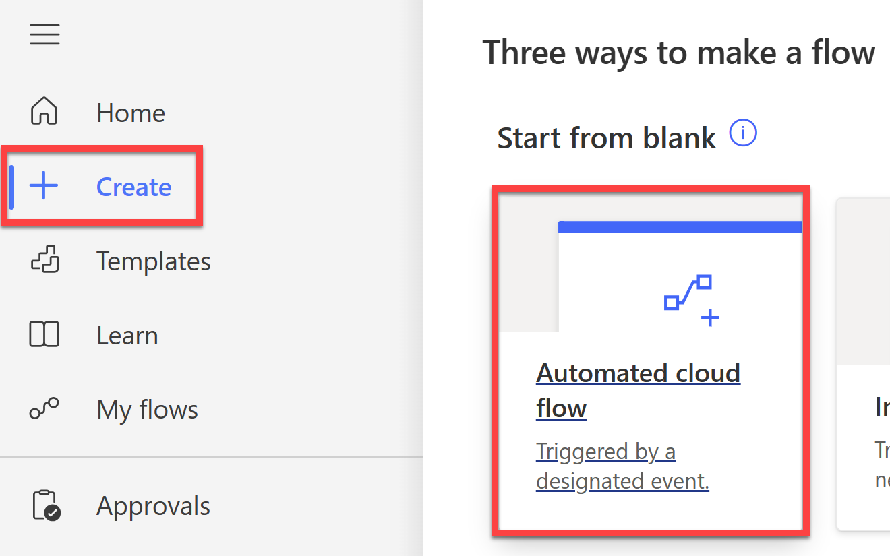](../media/select-automated-cloud-flow.png#lightbox)

1. Name the flow as **Extract details for Real Estate Showing**.

1. In the **Search all triggers** box, enter **when an email arrives** and then select the **When a new email arrives** trigger.

   > [!div class="mx-imgBorder"]
   > [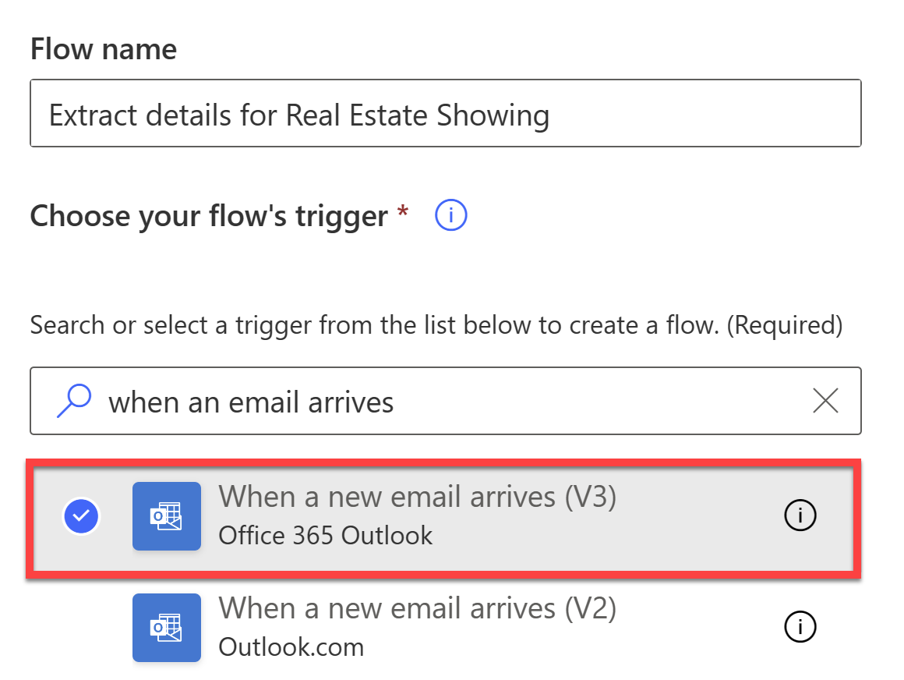](../media/select-when-email-arrives.png#lightbox)

1. Select **Create**.

1. Select **Show advanced options** on the **When a new email arrives** trigger.

1. In **Subject Filter**, enter "[Query]".

   > [!div class="mx-imgBorder"]
   > [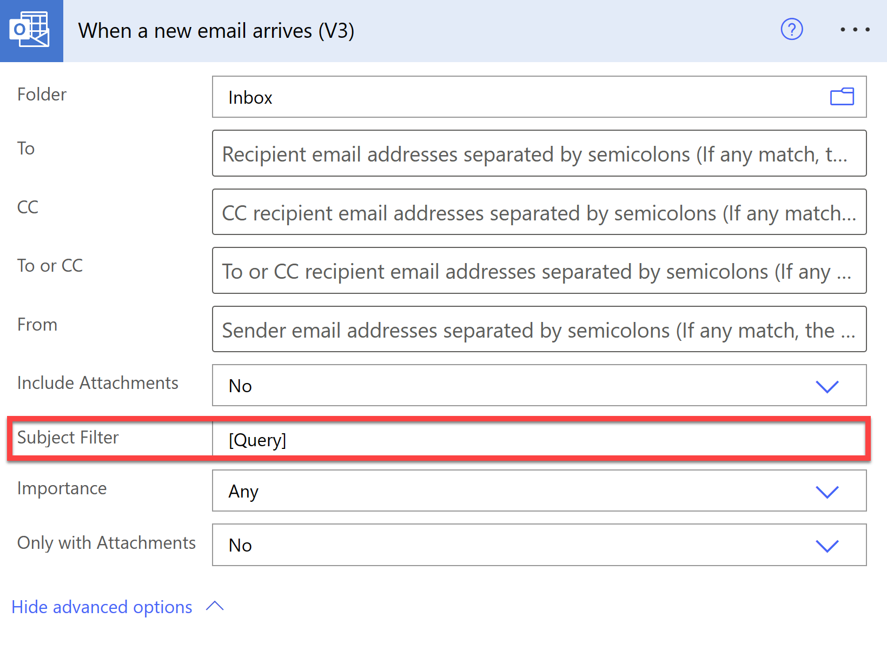](../media/add-subject-filter.png#lightbox)

   > [!NOTE]
   >
   > This step ensures that the flow only runs when the subject of the email contains the word "Query" (for the purpose of this lab).
   >
   > In a real scenario, you might have a separate email address that handles customer queries, so you won't need to filter by subject.

1. Select **New step** and then select **AI Builder**.

   > [!div class="mx-imgBorder"]
   > [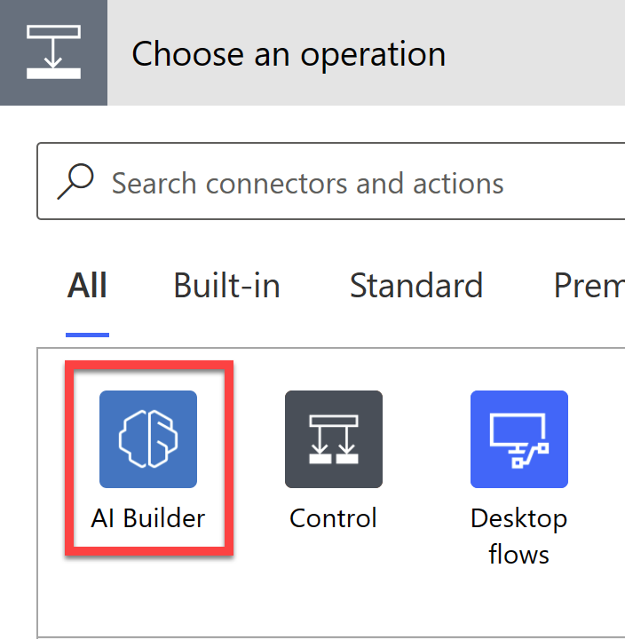](../media/select-ai-builder.png#lightbox)

1. Select **Create text with GPT** in the list of actions.

   > [!div class="mx-imgBorder"]
   > [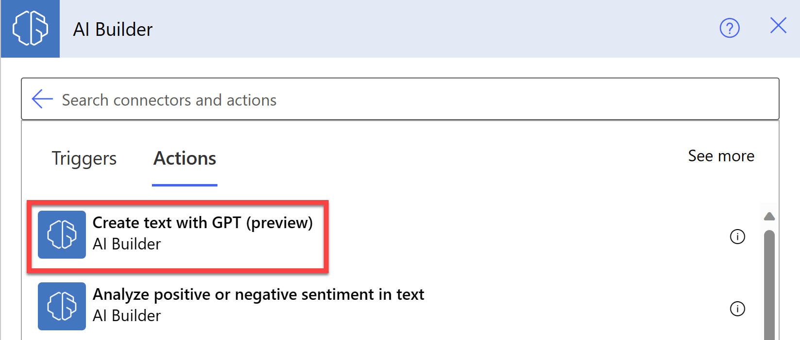](../media/select-create-text-gpt.png#lightbox)

1. Select **Create prompt** and then select **Start from blank**.

   > [!div class="mx-imgBorder"]
   > [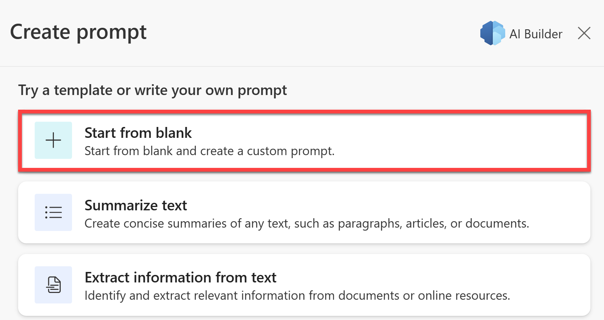](../media/select-start-blank.png#lightbox)

1. Paste the following text into the **Describe the text the model should create** box:

   ```
   Extract "Name", "Address", "Date", and "Time" from the text below.

   When the text below has less than a couple of words, answer that you can't extract information.

   [Start of text]
   Good day,

   I hope this email finds you well. My name is <Your name>, and I am currently in the market for a new property. I came across your listing for the property located at 210 Pine Road, Portland, OR 97204, and am very interested in learning more about it.

   I would like to kindly request a viewing of this property on September 15th at 3:30 PM. I believe this time is within the normal hours for showings, but if there are any conflicts or alternate time suggestions, please let me know at your earliest convenience.
   [End of text]
   ```

   > [!div class="mx-imgBorder"]
   > [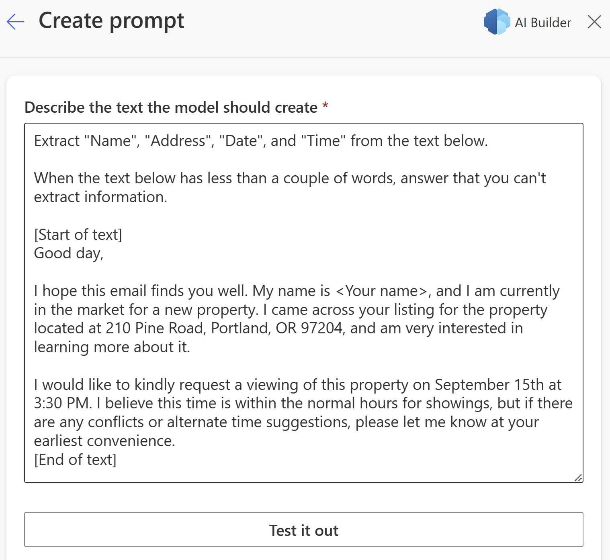](../media/paste-text.png#lightbox)

   The preceding prompt uses the basic formula for creating a GPT prompt (**instruction** and **context**), where the first part of the prompt is the **instruction** component:

   `Extract "Name", "Address", "Date", and "Time" from the text below. When the text below has less than a couple of words, answer that you can't extract information.`

   The following text is the **context** component of the formula:

   `[Start of text] context [End of text]`

   The instruction tells the model what it should do. The context is the information that the model needs to follow the instruction. In an automation task, the instruction is constant and dynamic content provides the context, which you'll update in the next step.

1. Select **Test it out** to see if GPT extracts the correct information from the text.

   After a few seconds of preparing a response, the GPT model should be able to extract the relevant information from the example prompt, as shown in the following image.

   > [!div class="mx-imgBorder"]
   > [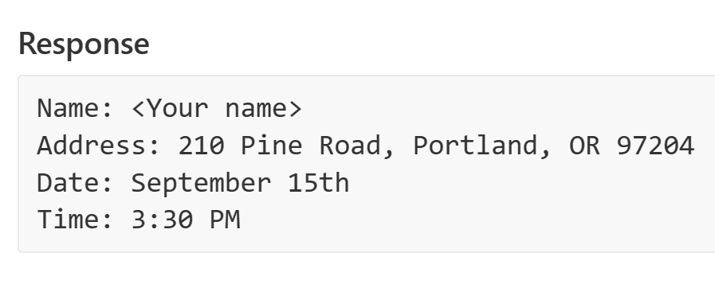](../media/test-it-out-response.png#lightbox)

1. Select **Use prompt in flow**.

1. Delete the example email from the **Prompt** and then replace it with the **Body** dynamic content of the email from the trigger.

   > [!div class="mx-imgBorder"]
   > [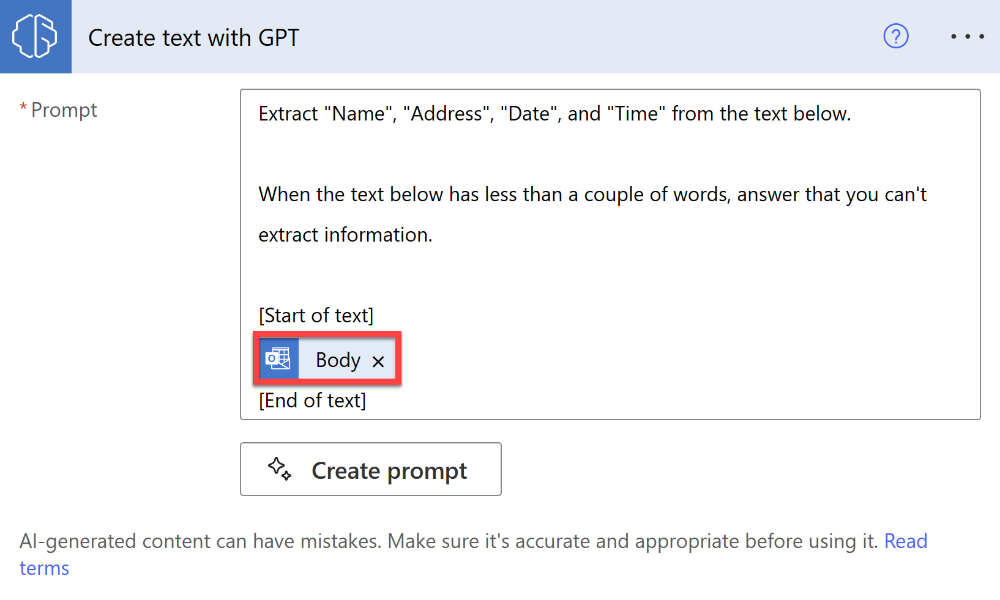](../media/replace-prompt-email-body.png#lightbox)

   Whenever an email arrives, GPT attempts to extract the relevant information from the email body.

   AI-generated content can be factually incorrect, inappropriate, or biased. We strongly recommend that you institute a practice of inserting [human oversight](/ai-builder/azure-openai-textgen?azure-portal=true#human-oversight) in workflows that use AI-generated text before it's posted or used anywhere.

   Now, you'll add an approval step so that a human can review the extracted information.

1. Select **New step** and then search for and select **Approvals**.

1. In the list of actions, select **Start and wait for an approval of text**.

1. In the **Title** box, enter **Review extracted information**.

1. In the **Suggested text** box, add the **Text** dynamic content from the **Create text with GPT** action.

   > [!div class="mx-imgBorder"]
   > [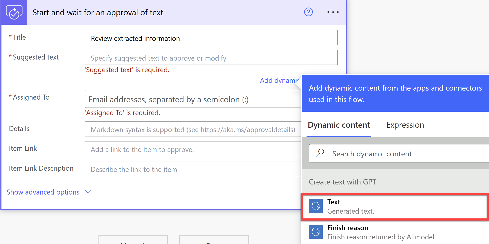](../media/add-text-dynamic-content.png#lightbox)

1. In the **Assigned To** box, enter the email address that you're using for this lab.

1. In the **Details** box, enter the following text:

   `Please review the extracted information and edit as necessary.`

   The action should resemble the following screenshot.

   > [!div class="mx-imgBorder"]
   > [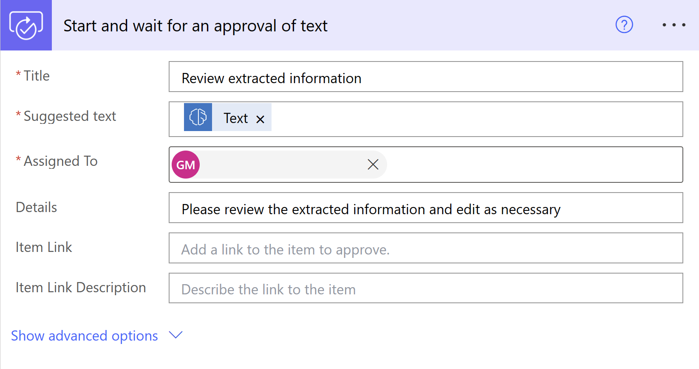](../media/approval-action.png#lightbox)

1. Select **New step**, search for **Control**, and then select **Condition**.

1. Select the **Choose a value** box and then select **Outcome** from the **Dynamic content** pane.

1. Select **is equal to** for the condition and then enter **Approve** for **Choose a value**.

   > [!div class="mx-imgBorder"]
   > [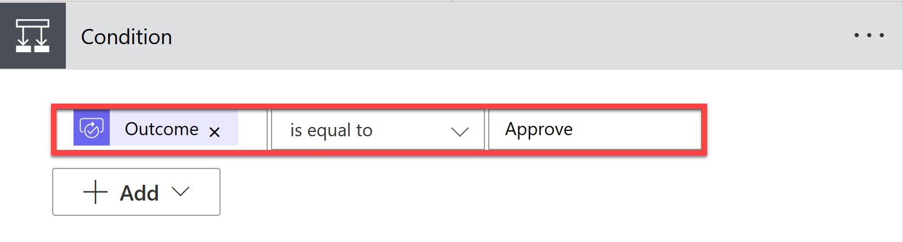](../media/add-condition.png#lightbox)

1. In the **If yes** box, select **Add an action**. Search for **Teams** and then select **Post message in a chat or channel**.

1. Select **Flow bot** from the **Post as** dropdown menu, and then select **Chat with Flow bot** from the **Post in** dropdown menu.

   > [!div class="mx-imgBorder"]
   > [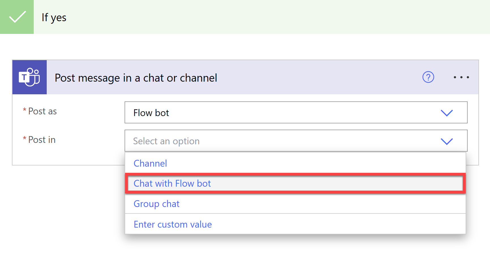](../media/post-teams.png#lightbox)

1. In the **Recipient** box, enter the email address that you're using for this lab.

1. For the **Message** box, enter the following text:

   ```
   Please add the following Real Estate Showing Request.

   Client Email:
   ```

1. Select **Add dynamic content** and then select the **From** option from the **When a new email arrives** action.

   > [!div class="mx-imgBorder"]
   > [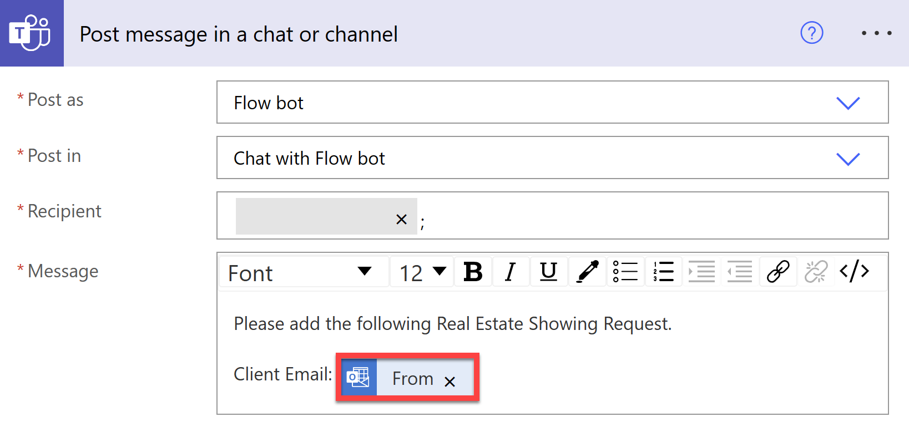](../media/add-dynamic-content.png#lightbox)

1. Beneath the **Client Email** line, select the **Accepted text** dynamic content from the **Start and wait for an approval of text** action.

   > [!div class="mx-imgBorder"]
   > [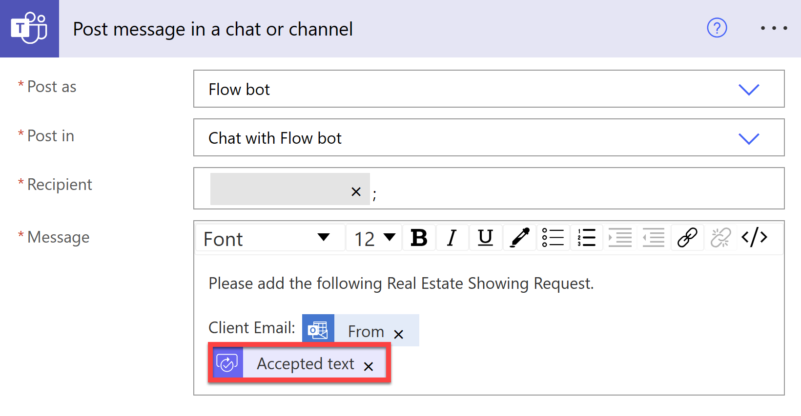](../media/add-accepted-text-dynamic-content.png#lightbox)

   This step sends a direct Teams message to you with the Client Email and the Accepted text from the approval action to remind you to create a record in the Real Estate Showings app from Microsoft Power Apps.

   You can automate the record creation by converting the extracted entities into a JSON object and then using that object to create a record in the Real Estate Showings app and Dataverse table. However, that action is beyond the scope of this lab.

   In the **If no** box, you can add a **Send an email** action to notify the sender that insufficient information was provided for booking the showing. However, you can add that action in your own time.

1. For now, save the flow and test it. Select **Save** and then **Test**.

1. Select **Manually** and then select **Test**.

1. From any email address, send an email to the email address that you're using for this lab with the subject of `[Query] - New Booking Request` and the following body content:

   ```
   Hello,

   I trust you're doing well. I'm John Doe and I'm actively searching for a new home. Your listing for the property at 789 Maple Avenue, Lexington, KY 40502 has caught my attention, and I'm eager to find out more.

   Could I arrange to see the property on September 29th at 1:45 PM? I think this falls within your usual showing times, but if that doesn't work for you or if you have other time options, I'd appreciate it if you could inform me as soon as possible.
   ```

1. Open Outlook, which should show the email that you've sent to yourself followed by the **Approval** request with the extracted information, as shown in the following screenshot.

   > [!div class="mx-imgBorder"]
   > [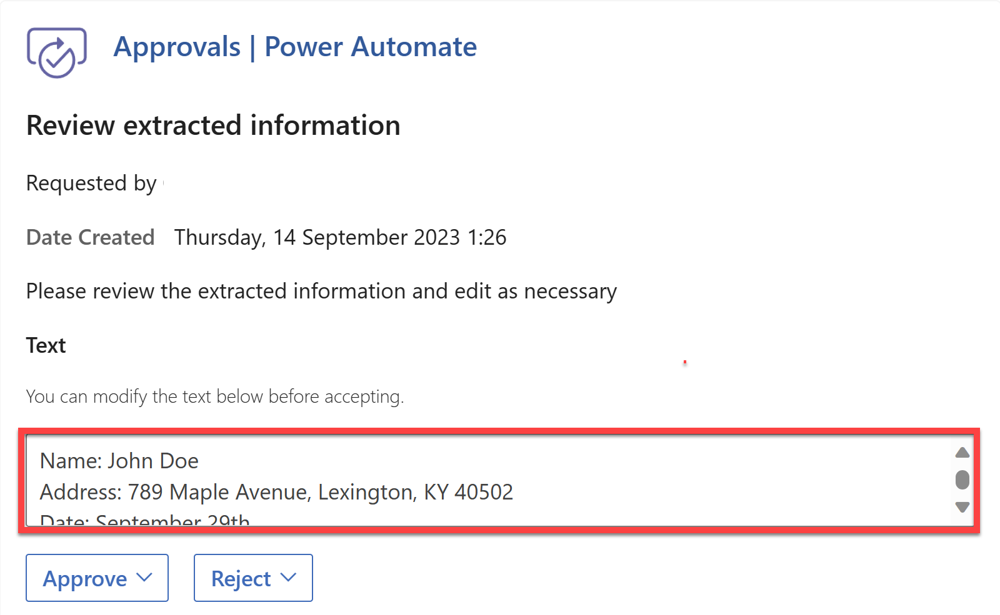](../media/approval-request.png#lightbox)

1. Select **Approve** and then open Teams. After the request is approved, you should receive a message from the flow bot with the extracted information, as shown in the following image.

   > [!div class="mx-imgBorder"]
   > [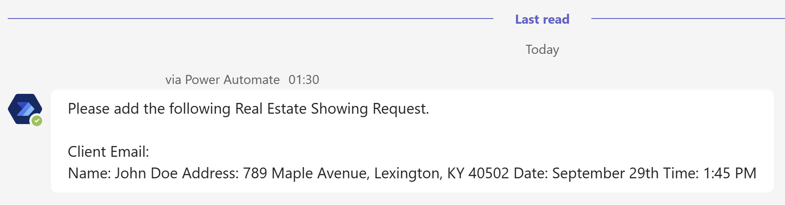](../media/teams-message.png#lightbox)

1. Return to your Power Automate flow, where the flow should show a successful run.

   > [!div class="mx-imgBorder"]
   > [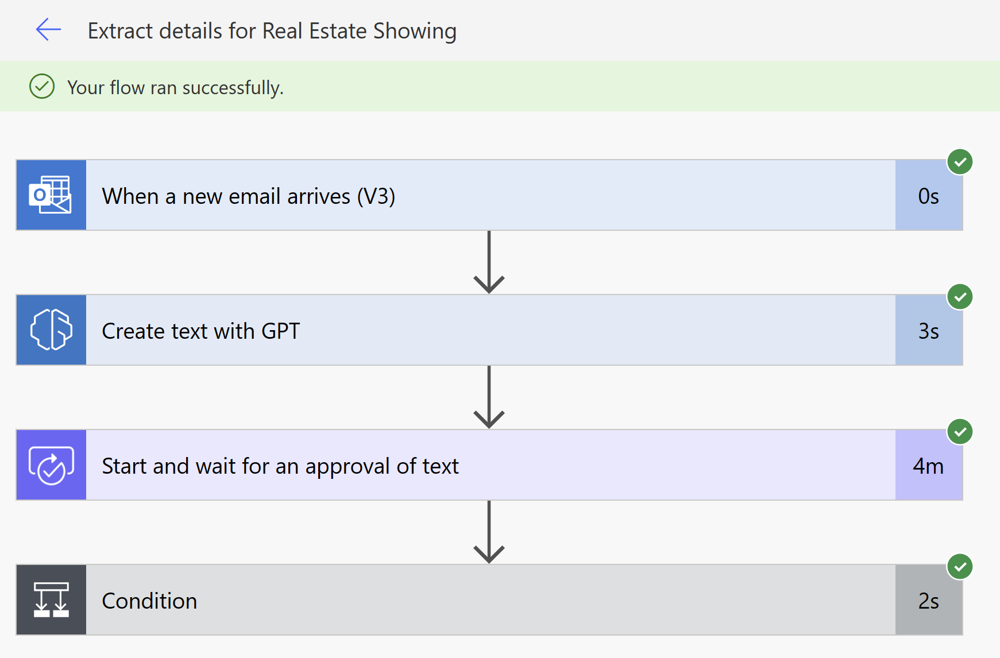](../media/flow-run.png#lightbox)
