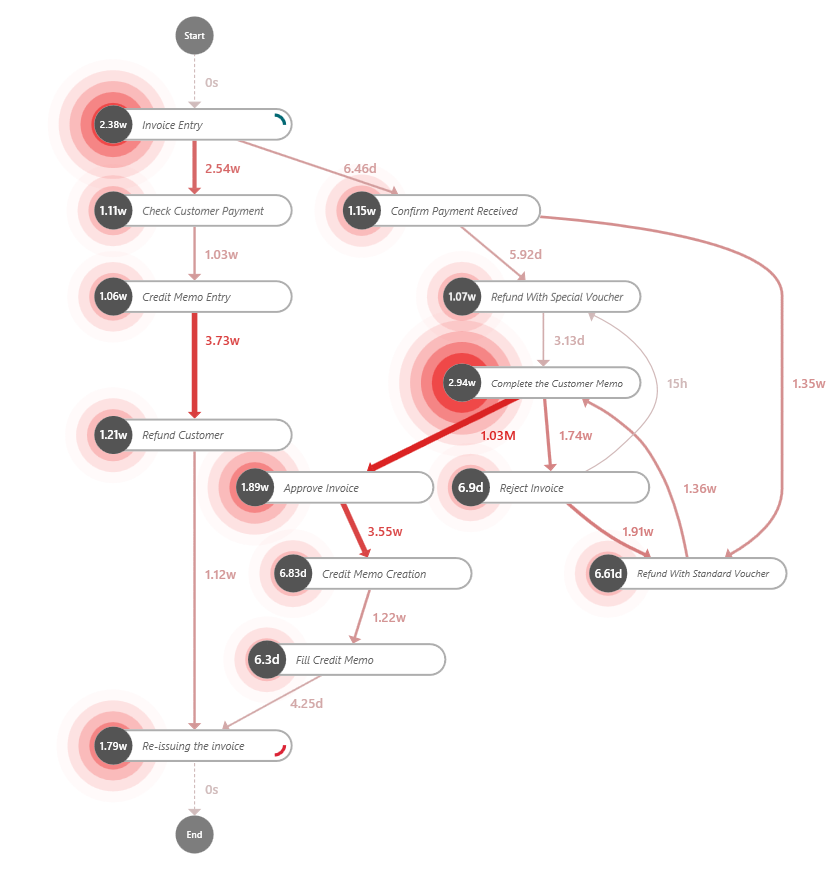
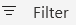

In this exercise, you'll use the power of process mining to delve into your organization's accounts payable refunding process, uncover insights, and pinpoint inefficiencies. 

Start by exploring the different process maps:

1.  As you review the process map, notice that the **Invoice Entry** and **Re-issuing the invoice** activities have the highest number of cases, which is expected because they're the starting and ending points of the process. The next activity with the most cases is **Complete the Customer Memo**.

	> [!div class="mx-imgBorder"]
	> 

1.  In the **Customize** panel on the right, select the **Performance** button, which has a stopwatch icon. Ensure that **Total duration** is selected from the **Performance context type** dropdown menu. This selection will show a process map based on time.

	> [!div class="mx-imgBorder"]
	> 

    The **Complete the Customer Memo** activity takes the most total time of 2.94 weeks.

	> [!div class="mx-imgBorder"]
	> 

1.  Use the **Customize** panel, as you did previously, to select **Mean duration** from the dropdown menu.

	> [!div class="mx-imgBorder"]
	> 

    The **Complete the Customer Memo** activity has the third longest mean duration at 4.38 hours. However, the **Refund with Special Voucher** activity has a mean duration of 14.98 hours, which is over 10 hours longer than the activity with the second longest duration.

1.  Select the **Finance** button from the **Customize** panel and then select **InvoiceValue** and **Total** from the dropdown menu.

	> [!div class="mx-imgBorder"]
	> 

Of the total 182,000 dollars that flow through the entire process, about 50 percent (90,000 dollars) is involved in the **Complete the Customer Memo** activity.

> [!div class="mx-imgBorder"]
> 

## Complete the Customer Memo exploration

After exploring the details in the preceding steps, you've decided to take a closer look at the **Complete the Customer Memo (CCM)** activity. This activity has several notable characteristics that make it a great candidate for further investigation, including a high number of cases, the longest total duration, a relatively long mean duration, and the fact that it involves about 50 percent of the total invoice value in the process.

You'll use the **Process compare** feature to compare the paths that include the CCM activity to those without it. To do so, you'll need to filter to create paths with and without CCM.

1.  In the lower-left corner of your screen, select the **Filter** button.

	> [!div class="mx-imgBorder"]
	> 

1.  Select **Add filter** from the upper left of your view and then select **Attributes** from the dropdown menu.

	> [!div class="mx-imgBorder"]
	> 

1.  Filter according to what's shown in the following screen, which will create a view that includes the **Complete the Customer Memo** activity. Select **Apply**.

	> [!div class="mx-imgBorder"]
	> 

1.  A process map will appear, as shown in the following screen. This process map only includes the paths without the CCM activity.

	> [!div class="mx-imgBorder"]
	> 

1.  In the command bar, select the dropdown menu next to the **Save** button and then select **Save as**.

	> [!div class="mx-imgBorder"]
	> 

1.  In the View name field, enter the view name as **without CCM**. Select **Save**.

	> [!div class="mx-imgBorder"]
	> 

1.  Repeat the previous steps, with the following exceptions: 

    1.  Filter according to what's shown in the following screen (select **Includes** from **Filter result** dropdown menu).

		> [!div class="mx-imgBorder"]
		> 

    1. In the **View name** field, name the view as **with CCM**, as shown in the following screenshot.

		> [!div class="mx-imgBorder"]
		> 

	This process map is for cases that include the CCM activity.

	> [!div class="mx-imgBorder"]
	> 

	Next, you'll compare the two new views that you created.

1.  Select the **Process compare** feature from the left navigation.

	> [!div class="mx-imgBorder"]
	> 

1.  Select **Add layer**, and then from the **Views** dropdown menu, select **without CCM** and then select **Add layer**.

	> [!div class="mx-imgBorder"]
	> 

1. Select **Save as** from the **Save** button and then save the view as **compare CCM**.

	Review the process map that compares cases that have the **Complete Customer Memo** activity and those without.

	> [!div class="mx-imgBorder"]
	> 

	The **green** nodes are activities that are common to both cases of with and without CCM. For example, the **Invoice Entry** activity is one that occurs in cases with the **Complete the Customer Memo** activity and those without it.
	
	The **red** nodes are activities that are specific to cases that don't have the CCM activity. For example, cases that have **Complete the Customer Memo** don't have the **Check Customer Payment** activity.
	
	The **blue** nodes represent activities that are particular to cases that include the CCM activity. For example, cases that don't have CCM, don't have **Confirm Payment Received**.

	The number at a specific activity node is calculated by subtracting *the number of cases that have that activity but don't have CCM* from *the number of cases that have that activity and the CCM activity*, for example:
	
	-   Invoice Entry: 65 - 68 = **-3**
	
	-   Check Customer Payment: 0 - 68 = **-68**
	
	-   Confirm Payment Received: 65 - 0 = **65**

	> [!div class="mx-imgBorder"]
	> 

	From your observations of the map, you notice that that cases *with* **Complete Customer Memo** are much more complex than cases without. You can discern this factor based on the complexity of the blue web. As a result, you investigate further to determine if CCM might be causing this complexity.

1. Select the **Complete the Customer Memo** node.

	> [!div class="mx-imgBorder"]
	> 

1. In the **Compare detail** pane on the right, scroll to the **Rework** section. The **Rework count (%)** metric shows that CCM causes 42.48 percent rework, meaning that 42.48 percent of the cases that involve completing the customer memo must be redone.

	> [!div class="mx-imgBorder"]
	> 

1. To contact an employee who mostly works on this step of the process, scroll to the bottom of the pane, and from the **Top attributes** dropdown, select **Resource**.

	> [!div class="mx-imgBorder"]
	> 

1. Addison and Jackie appear to be the two employees who work the most on this activity. Therefore, you set up a meeting with both employees to discuss how they perform this activity.

	> [!div class="mx-imgBorder"]
	> 

	Addison and Jackie describe that the **Complete the Customer Memo** activity is repetitive. It involves manually copying customer information from a spreadsheet and then entering the information into a customer memo document.
	
	Then, they send the document to their managers for signatures and approval of the invoice. The managers might approve or reject the invoice based on the customer memo, as shown in the process map.

	> [!div class="mx-imgBorder"]
	> 

	Addison and Jackie mention that, due to the high standards in their department, minor errors in the memo would cause their managers to reject the invoice, leading to other work and lost time. You immediately determine that this issue is causing the high total and average duration for the CCM activity and the high rework percentage.
	
	As a seasoned business analyst, you understand that the repetitive and manual process can be streamlined with automation, which would significantly reduce the time to complete the process and minimize the risk of rework. As a result, you quickly turn to Power Automate in search of a solution that will automate the process, increase efficiency, and lead to cost savings for the company.

1. Return to Power Automate web and go to **My flows** from the left navigation.

1. Select **New flow** and **Template** from the dropdown menu.

	> [!div class="mx-imgBorder"]
	> 

1. Based on the activity that Addison and Jackie described, you search for **Excel templates** in the search bar and then select the **Generate agreement for selected Excel row, send for review & signature** template.

	> [!div class="mx-imgBorder"]
	> 

This template nearly matches the scenario for the CCM activity. After slightly editing the flow to fit the specific use case, you present it to Addison and Jackie. They use the flow to automate the **Complete the Customer Memo** activity, and then their managers use it to quickly and seamlessly approve invoices based on the customer memos.

A few weeks later, you check in with Addison and Jackie. You discover that this automation has reduced the total process time by 15.31 days, which is over two weeks' time saved from discovering and automating an inefficiency in the process. This scenario exemplifies the benefits of hyperautomation.
