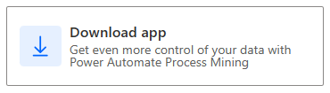
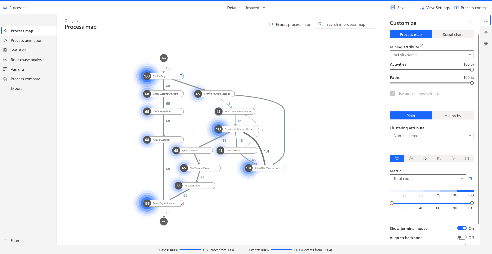

> [!NOTE]
> The following is needed to successfully complete this exercise
> - Completion of the [Analyze process mining reports in Power Automate](/training/modules/process-advisor-introduction) module.
> - Power Automate per-user plan with attended RPA or Power Automate trial [license](/power-automate/process-advisor-overview#licensing)
> - [Process mining add-on](/power-automate/process-advisor-overview#licensing)

Follow these steps to download the powerful Minit desktop app and then find the process that you've created on the web.

1.  Access the **Process mining** homepage by going to **[Microsoft Power Automate](https://flow.microsoft.com/?azure-portal=true)**, signing in and navigating to **Process mining**.

1.  In the **Understand your business better than ever** section, select **Download app**.

	> [!div class="mx-imgBorder"]
	> 

1.  Launch the app from where it was saved on your computer. If you're running the Windows 11 operating system, the desktop application should show up in your start menu.

1.  Sign in with the same email address that you used for process mining on the web and then authenticate by using your password.

1.  On the same screen, look for your process titled **Accounts Payable Refunds** and then select the **Default** view to open your process. For your process to show up, you should have created a process mining report in the Power Automate web portal.

After you've completed these steps, you should land on the following screen. Review the process map. It should look familiar; it's the same map that you previously viewed on the web.

  > [!div class="mx-imgBorder"]
  > 

