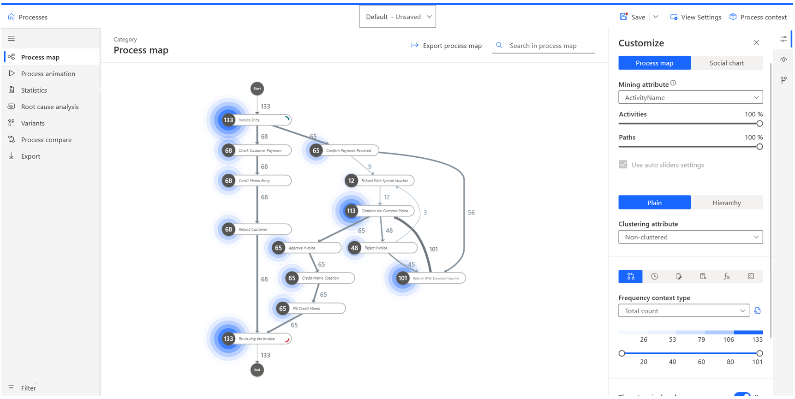

The Microsoft Power Automate Process Mining desktop app is a feature-rich application that's closely integrated with the process mining capability in Power Automate. It offers a wide range of tools that help you gain a deeper understanding of your business processes beyond what's available on the web portal. You can gain deep insights into how your processes run, identify the root causes of inefficiencies, and generate valuable outputs for your organization. Refer to the following table for an overview of the features in the desktop app.

  |     Feature                 |     Description                                                                                                                                            |
|-----------------------------|------------------------------------------------------------------------------------------------------------------------------------------------------------|
|     Process   map           |     Represents the sequence of tasks in a process based on data that you can customize with filters and time metrics.                                  |
|     Statistics              |     Provides   a statistical overview of the properties of the process through summary   charts and reports.                                               |
|     Variant   DNA           |     Provides   a visual overview of all process variants that are found during the analysis.                                                                    |
|     Process   comparison    |     Compares   processes at the level of the process map or at the more detailed level of   activities and edges (arrows from one activity to another).    |
|     Root cause analysis     |     Shows   hidden connections in your data to identify the key differences between   cases.                                                               |
|     Filtering               |     Eliminates/selects   some parts of a process to focus on others.                                                                                       |
|     Custom   metrics        |     Allows   you to combine different operations, functions, and constants in a formula   editor to define your own custom or calculated metrics.          |
|     Business   rules        |     Allows   you to define and evaluate KPIs based on your thresholds and limits.                                                                          |

The following image shows the desktop application **Process map** page and its features (explained in corresponding numerals).

1.  **View dropdown menu** - Select different created views of the process.

2.  **Left navigation pane** - Lists the main features of the desktop app (refer to the descriptions from the preceding table).

3.  **Filter** - Select only certain parts of the process.

4.  **Process map** - Shows the sequence of tasks in a process.

5.  **Customize panel** - Customize your process map.

	> [!div class="mx-imgBorder"]
	> 

In this module, you'll learn how to:

-   Install the Power Automate Process Mining desktop application and open your process.

-   Use the process map feature.

-   Use the filtering feature.

-   Use the process compare feature.
