Previously, you learned how to create a Contoso Coffee machine request and begin the self-approval process of the machine request. In this exercise, you’ll change the input information of the business approval process so that the workflow includes a manager approval stage when the value of the machine request is more than USD 400.00.

## Open the business approval process
Your first task is to open the business approval process by following these steps:

1. Open the Business Approval Management application, as previously described.

2. Switch to the Approvals Designer in the lower-left pane.

 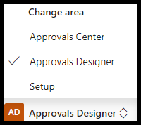

3. Select the **Machine Requests** business approval to edit it.

 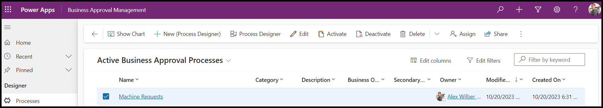

## Add new business approval data
Your next task is to add new business approval data by following these steps:

1. With the workflow open, select **Process Designer** from the command bar.

 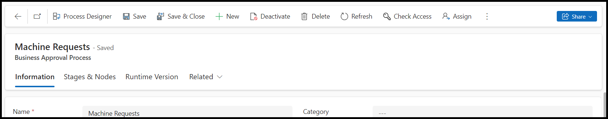

2. In the Process Designer, select **Variables** to add new business approval data.

 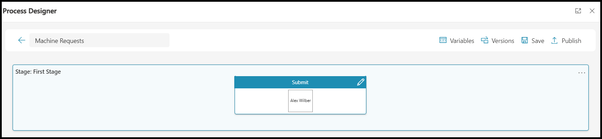

3. Select **+ Add** and then enter **Name** under the **Field Name** column and **Text** under the **Data Type** column. Select **+ Add** again and then enter **Price** under **Field Name** and **Number** under **Data Type**.

 > [!NOTE]
 > The [Define application data](/power-automate/guidance/business-approvals-templates/configure-preset-approvals?azure-portal=true#define-application-data) section of the Configure preset approvals guide provides more information on each data type.

 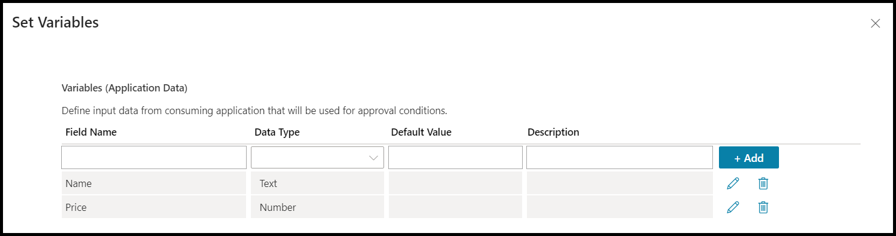

4. To close the variables, select the **X** adjacent to the **Set Variables** heading in the upper-right of the screen.

## Add a new conditional stage
In this task, you’ll add a new conditional stage by following these steps:

1. In the Process Designer, select the plus (**+**) icon to add a new stage.

2. In the **Create Stage** dialog, enter the information from the following table.

   |Field|Value|
   |-----|-----|
   |Name |Manager Approval|
   |Condition|Select **If/Else**|
   |Source|Select **Request Data**|
   |Request Data|Select **Price**|
   |Operand|Select **Greater Than**|
   |If Price Greater Than (>)|Enter value of 400|

 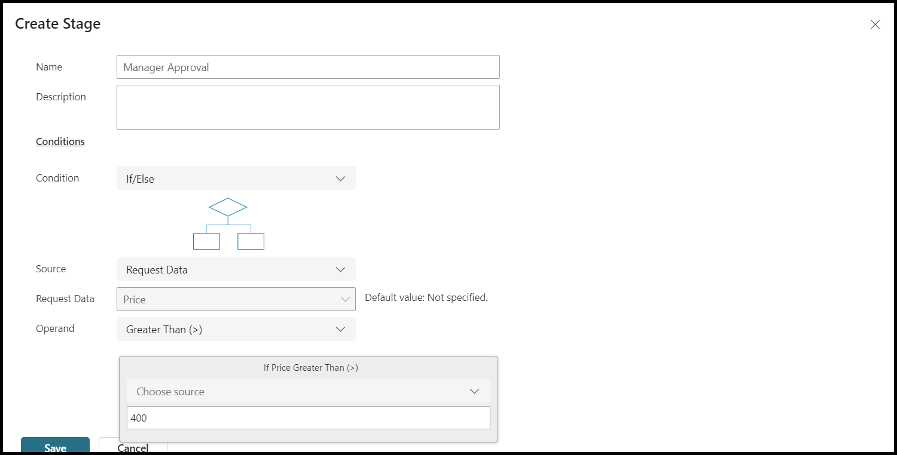

   > [!NOTE]
   > The **If/Else** condition is one possible choice that you can make. You can also use [Switch](/power-automate/guidance/business-approvals-templates/configure-preset-approvals?azure-portal=true#adding-conditional-stage---switch-condition) as an alternative conditional based on request data or the value of a previous node.

## Save the stage and refresh the designer

1. Select **Save** to save the new stage.

  > [!NOTE]
  > After you save the Process Designer with a conditional stage, the changes can take some time to reload.

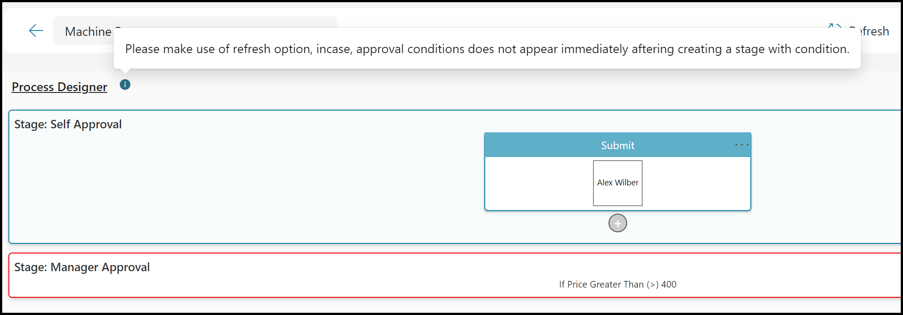

2. Select **Refresh** to reload the Process Designer with the **TRUE** and **FALSE** options.

 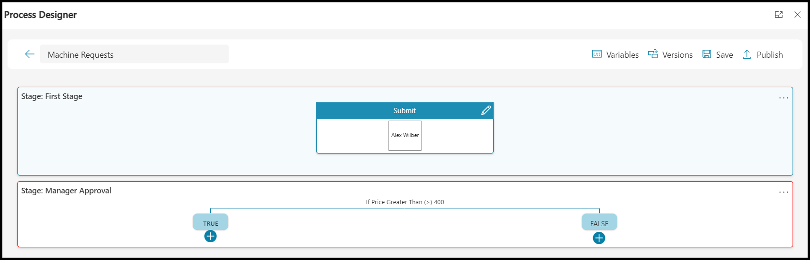

## Save the workflow

Select **Save** in the Process Designer to update the workflow with two stages.

> [!NOTE]
> When you select **Save**, the workflow is saved to Dataverse and reopened in a later workflow as needed.

## Add a condition for approval above USD 400
In this task, you’ll add a condition to approve machine requests that are above USD 400.00.

1. Select the plus (**+**) icon under the **TRUE** node.

2. In the **Create Node** dialog, enter the information from the following table.

 > [!NOTE]
 > The [Define the first node](/power-automate/guidance/business-approvals-templates/configure-preset-approvals/?azure-portal=true#define-the-first-node) documentation provides more information on allowable node values.

   |Field|Value|
   |-----|-----|
   |Name|Above $400 Approval|
   |Approver|Select your user account from the selection list|
   |Add|Select the **Add** button to add your user account as the manager approver|

 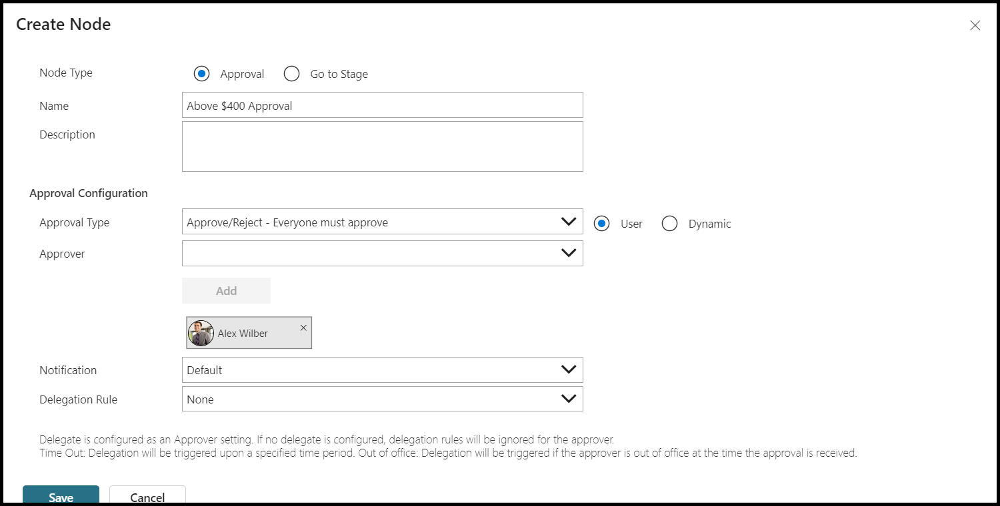

3. Select **Save** to save the new node.

 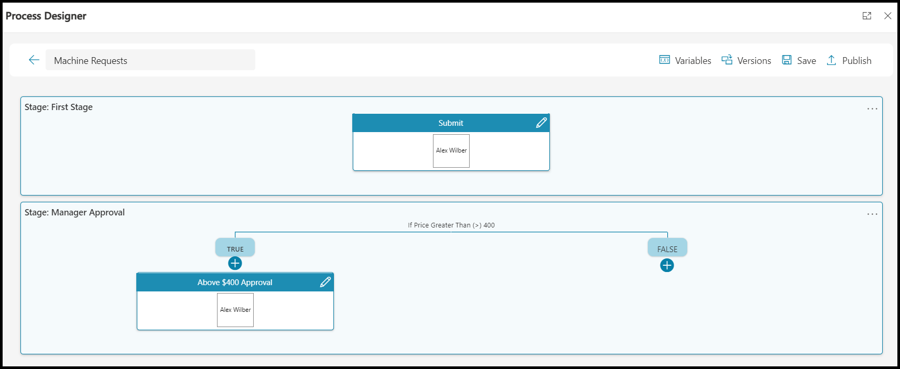

4. Select **Publish**.

 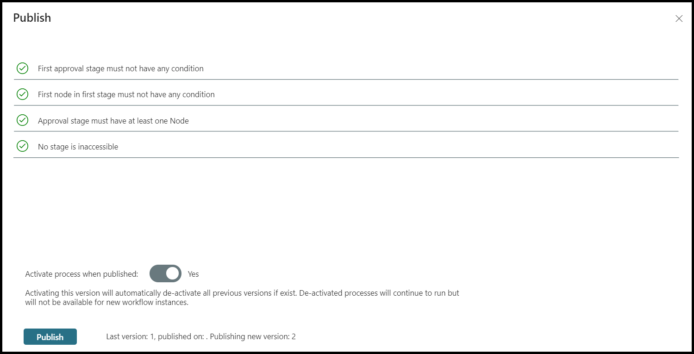

5. Confirm that validation checks pass and then select **Publish** to confirm the publish.

6. Wait for the publish to complete. You can select the **Refresh** button to update the publish status.

 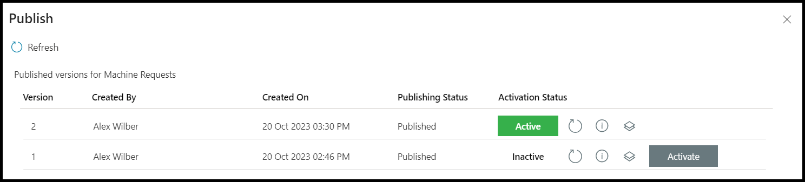

7. Select the **X** in the upper-right corner of the **Publish** dialog to close it.

8. Select **X** to close the Process Designer.

## Edit the machine request cloud flow
In this task, you’ll edit the machine request cloud flow by following these steps:

1. Select **Solutions** in the Power Apps portal or Power Automate portal.

2. Ensure that you select the environment where you're completing this workshop.

3. Open the **Contoso Coffee Approvals** solution.

4. Select the **Machine Request** cloud flow.

5. Select **Edit** from the command bar.

## Update the business approval process
To update the business approval process, follow these steps:

1. Open the **Start business approval process** card.

2. Enter the information from the following table.

   |Field|Value|
   |-----|-----|
   |Workflow Process|Machine Requests (v2)|
   |Name|Select **Machine Name** from dynamic content|
   |Price|Select **Price** from dynamic content|
   |Show advanced options|Select **Show Advanced options**|
   |Additional Information|Enter **Premium machine requested**|

    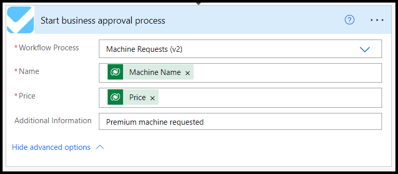

3. Select **Save** to update the cloud flow with the new workflow version and request data variables.

## Test a multistage approval with a new machine request
In this task, you’ll test a multistage approval with a new machine request by following these steps:

1. Select **Machine Ordering App**.

2. Select two machines with a value greater than USD 400, such as the **Smart Brew 300**.

3. Select **Compare 2 items**.

4. Select **Submit machine request**.

5. Select **OK** to close the confirmation.

## Approve the first stage
Follow these steps to approve the first stage:

1. Open the [Power Automate portal](https://make.powerautomate.com) that you had previously opened.

2. Ensure that you’ve selected the environment where you're performing this workshop.

3. Select **Approvals** from the left navigation.

 > [!NOTE]
 > The system can take up to one minute to send the approval. You might need to refresh the page to view the generated request.

4. Select the new **Machine Requests Approval - Submit** Approval received and select **Approve**.

5. Select **Confirm**.

6. Select **Done** to close the approval response.

## Approve the manager approval
In this task, you’ll approve the manager’s approval. 

1. Refresh the **Approvals** tab.

2. Select **Machine Requests Approval - Above $400 Approval** and then select **Approve**.

 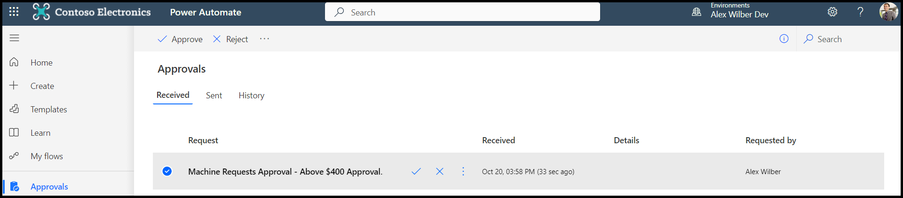

3. Select **Confirm** to confirm the manager approval.

4. Select **Done** to close the approval response.

## View the approved multistage approval
To view the approved multistage approval, follow these steps:

1. Open the **Business Approval Management** application.

2. Select **Approvals Center** from the left pane.

3. Select **Approvals Instances**.

 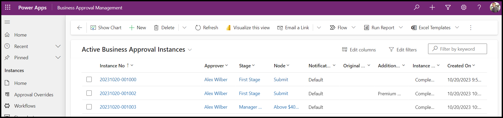

In this unit, you published a new version of the business approval workflow. Your first step involved adding new request data variables for name and price. Then, you used a price variable in a new manager approval stage, where the price was more than USD 400.00, to request an extra approval. Then, you edited the **Machine Request** cloud flow to use the new v2 workflow that includes the name and price variables. Your last task was to map the **Machine Name** and **Price** as request data so that you could use them to supply data that’s required by the workflow.
