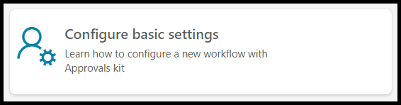
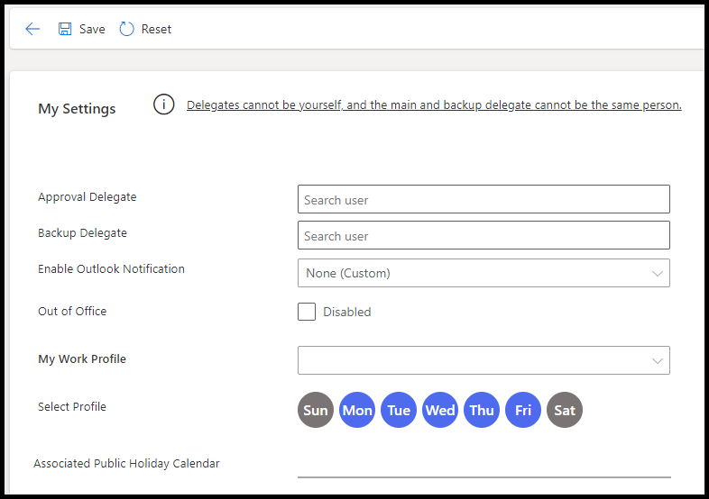
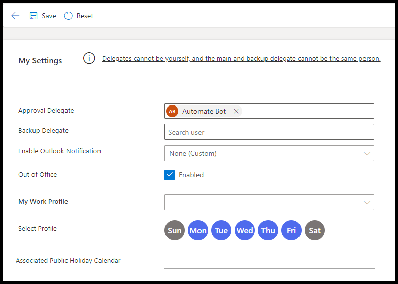

A key element of the Approvals Kit is that you can specify delegate approvers when you're out of the office or on holiday. These settings ensure that the approval process can continue smoothly, even if the primary approver is unavailable. In the **Configure basic settings** section of the Business Approval Management application, you can set these delegate approver values.

This workshop module provides step-by-step instructions for defining delegated approvers and handling out-of-office approvers. In this unit, you learn how to edit basic settings of the Business Approval Management application to set delegate approvers, and you learn how to handle out-of-office approvers by using the Approvals Kit.

> [!NOTE]
> For more information, see [Set up out of office and delegation](/power-automate/guidance/business-approvals-templates/setup-out-of-office-and-delegation/?azure-portal=true).

## Open the basic settings configuration
Your first task is to open the basic settings configuration by following these steps:

1. Open the **Business Approval Management** application in the workshop environment that’s assigned to you.

2. From the home page, select the **Configure basic settings** panel.

 

3. Review the settings screen to get familiar with the information that you can provide.

 

## Define the approval delegate and set out of office
In this task, you define the approval delegate and then set the out-of-office feature.

1. In the **Approval Delegate** field, search for another user who can act as an approver. Alternatively, you can enter the auto approver test user that your instructor has set up in Microsoft Power Platform for workshop users.

2. For the **Out of Office** section, select the **Enabled** checkbox.

 > [!NOTE]
 > For this workshop, you’ll use the **Out of Office** feature. Defining your work profile and public holidays are other scenarios where your delegated approvers are also used to route the approval request to the correct approver.

3. Select **Save**.

 

## Update the business approval
To update the business approval, follow these steps:

1. Select **Approval Designer** from the lower-left navigation pane.

1. Select **Processes**.

1. Select **Machine Requests** from the list.

1. Select **Process Designer** from the command bar.

1. For the **Submit** node, select the ellipsis (**...**) menu.

1. Select **Edit Node**.

1. Change the **Delegation Rule** to **Out of Office**.

1. Select the **Save** button to update the delegation rule.

1. Select the **Save** button to save the changes to the workflow.

1. Select the **Publish** button to create a new version of the workflow.

## Edit the cloud flow

To use the newly published workflow, follow these steps to update it to the new version:

1. Select **Solutions** from the left navigation pane.

1. Select the **Contoso Coffee Approvals** solution that you previously created.

1. Select **Machine Request** from the list.

1. Select the ellipsis (**...**) menu and then select **Edit**.

1. Select the **Start business approval process** node.

1. Ensure that the new version of the workflow process is selected.

1. Select **Save** from the command bar.

## Create a new machine request
Follow these steps to create a new machine request:

1. Sign in to [Power Apps](https://make.powerapps.com).

1. Select the assigned Approvals Kit environment for this workshop content.

1. Select **Apps > Machine Ordering App**.

1. If prompted, select **Allow** for the **Office 365 Users** connector.

1. Select a few machines that have a price that’s less than USD 400.00 and then select **Compare**.

1. Select a machine and then select **Submit**.

1. Select **OK** to close the submitted machine request.

## Check approvals
To check approvals, follow these steps:

1. Open the [Power Automate portal](https://make.powerautomate.com/?azure-portal=true).

1. Select the assigned Approvals Kit environment for this workshop content.

1. From the left navigation pane, select **Approvals**.

1. Wait a few minutes and then refresh and verify that an approval hasn't been generated.

This workshop unit covered the basic out-of-office scenario for the Approvals Kit. It provided step-by-step instructions for defining and testing delegated approvers when you're out of office.

The workshop demonstrated how to edit the basic settings of the Business Approval Management application to set delegate approvers. It also included how to handle out-of-office approvers by using the Approvals Kit. You could extend this workshop to test your work, define your work profile, or define public holidays as examples of when to use delegation.
