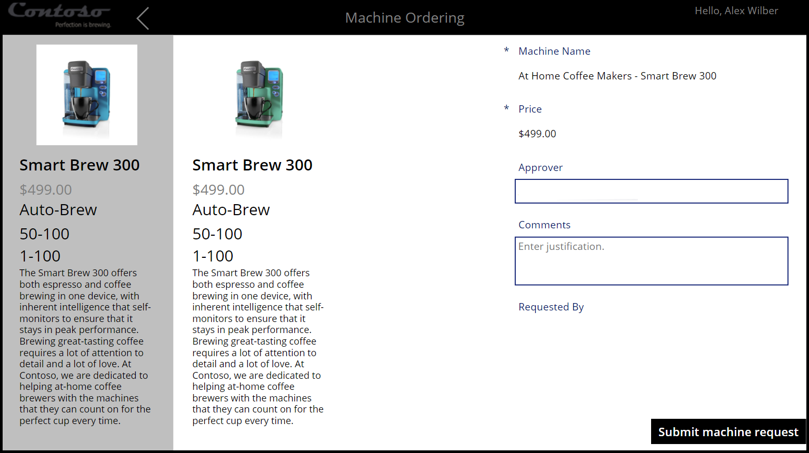

The Approvals Kit learning workshop builds on the second module of the App in a Day workshop from [Microsoft Copilot Studio](https://powerplatform.microsoft.com/training-workshops/?azure-portal=true).

## Workshop scenario

To act on a business owner’s request, you take on the role of helping to remove the manual work around the business approval process at Contoso Coffee. The current process conditionally involves multiple stages of approval depending on the requested machines, which results in delays and inefficiencies.

The objective of this workshop is to help you build an approval process that extends the current low-code Contoso Coffee request process. The extension creates an automated business approvals process that’s streamlined and efficient.

This workshop builds on the skills and knowledge that you’ve gained from the App in a Day workshop, which covered how to build a canvas app and store data in Dataverse. In this workshop, you use the data that’s stored in Dataverse to trigger the defined business approval process.

During this workshop, you learn how to identify different levels of approval that are required for each machine request. Additionally, you learn how to determine the appropriate level of approval based on the value of the machine and how to create an automated workflow that facilitates the approvals process.

## Prerequisites

Before you start this module, ensure that you meet the following prerequisites in a Microsoft Power Platform environment:

- The Contoso Coffee solution is imported.

- A current version of the Approvals Kit is installed and set up.

- You’re assigned the role of [Environment Maker](/power-platform/admin/database-security?azure-portal=true#environments-with-a-dataverse-database) so that you can add a new business approvals cloud flow to integrate with Contoso Coffee.

## What to do if you’re missing prerequisites

If you’re missing prerequisites for this workshop, the following links could be useful in helping you prepare:

1. Create or request access to a shared development environment. When you don't have access to a shared development environment, you can [Create a developer environment with the Power Apps Developer Plan](/power-platform/developer/create-developer-environment/?azure-portal=true).

1. Review the **Import the Contoso Coffee solution** unit from this module.

1. Install, or have your administration team install, the Approvals Kit by using the [setup guide](/power-automate/guidance/business-approvals-templates/setup/?azure-portal=true).
