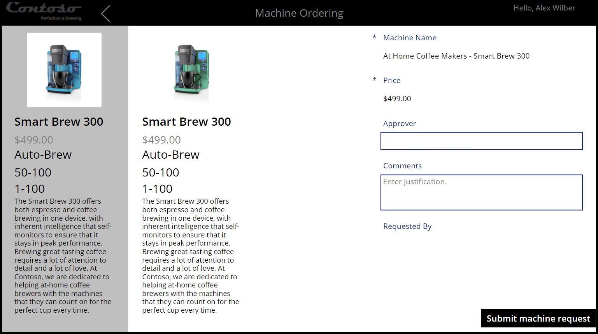
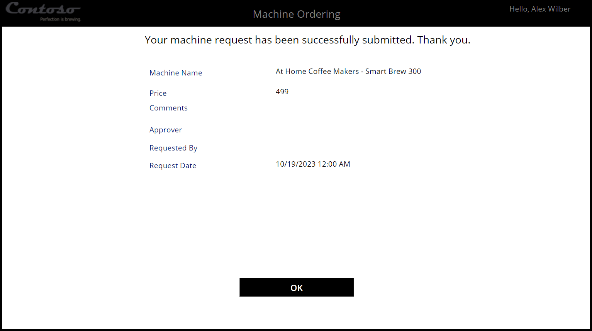

In this unit, you create your first approval for creating a machine request.

## Create a Contoso Coffee machine request

By completing the second module of the App in a Day workshop, or by having the Contoso Coffee application imported into your environment, you can create a machine request. Before you begin creating the business approval for this process, you should first review the request process.

> [!NOTE]
> If you don’t have the Contoso Coffee Machine Ordering app imported in your environment, follow the steps outlined in the **Import the Contoso Coffee solution** unit of this module to get started.

1. Sign in to [Power Apps](https://make.powerapps.com/?azure-portal=true).

2. Select the assigned Approvals Kit environment for this workshop content.

3. Select **Apps** and then select **Machine Ordering App**.

 

4. If prompted, select **Allow** for the **Office 365 Users** connector.

 

5. Select a few machines and then select **Compare**.

 

6. Select one machine and then select **Submit machine request**.

 

7.  Select **OK** to close the submitted machine request.

 

8. Close the application.

9. In Power Platform admin center, select **Tables** and then search for and select **Machine Order**.

 

10. Select the **Data** tab and then make sure that you have at least one record in the table.

## Approvals Kit vs. Approvals Connector

Now that you're familiar with the Contoso Coffee application and how the data is stored in Dataverse, the next key step is for you to create an approval process for machine requests.

To help with this decision, the business has provided the information that’s shown in the following diagram.

| Scenario | Notes |
|----------|-------|
| Manager approvals | Manager approval is required for machine requests above USD 400.00. |
| Approver availability | Depending on the approver's location, different holiday schedules or working schedules apply. Waiting for approvals can cause delays until an approver returns. |
| Handling holidays | Approvers might be on holiday when a request is submitted. Therefore, delays could occur in processing the approval request or confusion might result over who’s an alternate approver. |

With these factors, for this workshop, assume that you can use the Business Approvals Kit to respond to submitted coffee machine requests.

  > [!NOTE]
  >
  > If the Approvals Kit isn’t an available option, or if the approval process is a simple approval type, then the [Automate an approval process in Power Automate](/training/modules/approvals-power-automate/?azure-portal=true) learning module would be another option. If you’re selecting the Approvals Connector, you can consider other custom Power Automate flows and Microsoft Power Platform components as options.
  >
  > The [Approvals Kit comparison](/power-automate/guidance/business-approvals-templates/approvals-kit-comparison/?azure-portal=true) provides more information to help you decide which connector to use in your solution.

## Create an Approvals Kit workflow

After verifying that you can successfully create the Contoso Coffee machine request, and after you select the Business Approvals Kit regarding how you plan to process approvals, you can create a one-stage and one-node approval process so that you can self-approve the machine request.

> [!NOTE]
> If you don’t have the Approvals Kit installed in your environment, the [Business approvals kit manual setup](/power-automate/guidance/business-approvals-templates/setup/?azure-portal=true) guide or the [Instructor Guide](https://aka.ms/approvals-kit/instructor) could help your Center of Excellence team or trainer provide an environment so that you can follow this workshop module.

1. Select **Apps**, select the ellipsis (**...**) menu next to **Business Approval Management**, and then select **Play**.

2. If prompted, select your account and then enter your account password.

3. Select **Continue** to close the welcome screen if it appears.

4. Select **Configure a Workflow** from the Home navigation item.

 

5. Enter the name of your workflow as **Machine Requests**.

6. Select the plus (**+**) icon to create the first approval stage.

7. Enter **Self Approval** as the name of the stage and then select **Save**.

 

8. Wait for the stage to be created. Select the gray plus (**+**) icon to create a node for the created stage named **Self Approval**.

 

9. In the **Create Node** dialog, name your first node **Submit** and then select your user account from the **Approver** dropdown list.

 

10. Select **Save** to save the first node.

11. Wait for the node to be created.

 

12. Select **Save** to save your workflow.

 

## Publish the approval workflow

After you create the workflow definition, your next step is to publish the workflow so that you can trigger an approval when a machine request is created. Whenever you publish the workflow, a new version is created.

1. Select **Publish**.

2. Verify that you can publish the workflow and then select **Publish**.

 

3. Wait for the workflow to be published. Select **Refresh** to update the publish status.

 

You’ve now learned about the process of creating a Contoso Coffee machine request, defining a simple approval workflow, and publishing the first version of this workflow.

The publish task created an active version of your workflow. As you change and adapt a workflow, you can publish new versions to react to changing business rules or to revert to an earlier version.

The **Trigger approval** unit builds on these two elements to show you how to use a Power Automate cloud flow to begin an approval workflow whenever a machine request is submitted.
