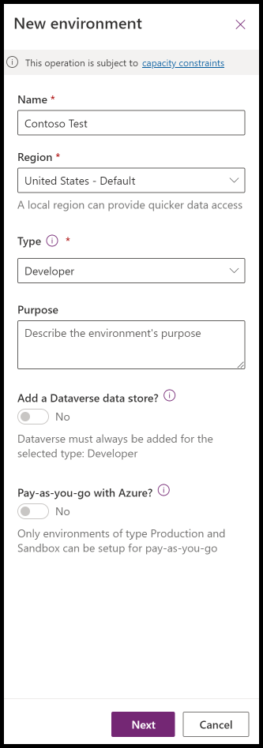

If you don't have an environment with the Contoso Coffee solution, follow these steps to import the solution.

> [!NOTE]
> Follow these steps to check whether the Contoso Coffee solution is loaded or not:
>
> 1. Open the [Power Apps portal](https://make.powerapps.com).
>
> 2. Select the environment that’s assigned to you for completing this workshop. If you don’t have an environment, continue with the following steps.
>
> 3. Select **Apps** from the left navigation pane.
>
> 4. Verify that **Machine Ordering App** is in **My apps** or **Shared with me**.
>
> 5. If **Machine Ordering App** is available, then you can skip this unit and continue to the next unit.

## Create a new environment
To create a new environment, follow these steps:

1. Open a new browser tab, go to [Power Platform admin portal](https://aka.ms/ppac/?azure-portal=true
), select **Environments**, and then select **New Environment**.

2. Provide an environment name, select **Developer** from the **Type** dropdown menu, select the **Region**, and then select **Next**.

 > [!div class="mx-imgBorder"]
 

3. Select **Language**, **URL**, and **Currency**, select **No** for **Deploy sample apps and data**, and then select **Save**.

4. Wait for the environment to be created.

## Import the solution

In this task, you import the completed second module solution from the App in a Day workshop:

1. Go to [Power Apps maker portal](https://make.powerapps.com/?azure-portal=true).

1. Make sure that you’re in the **Contoso** test environment that you created.

1. Select **Solutions > Import**.

1. Select **Browse**.

1. Select the Contoso Coffee solution zip file (**ContosoCoffee_1_0_0_2.zip**) that’s located in **Completed Lab Solution for students** and **Module 2** folder, and then select **Open**.

 > [!NOTE]
 > The English language version of the Contoso Coffee Module 2 solution is in the [AppinaDay Trainer Package.zip](https://aka.ms/appinadayTrainer/?azure-portal=true) or [Other Languages](https://aka.ms/AIADLocalTrainer/?azure-portal=true).

## Complete the import

After you select the file, follow these steps to complete the import:

1. Select **Next**.

1. Select **Import**.

1. Wait for the solution import to complete.

1. After the import is complete, select **Publish All Customizations** and then wait for the publishing to complete.

## Play the Machine Ordering app
Your next task is to play the Machine Ordering app by following these steps:

1. Select **Apps**, select the ellipsis (**...**) menu next to **Machine Ordering App**, and then select **Play**.

1. When the application opens, select **Allow** for the **Office 365 Users** connection.

1. Select a few machines and then select **Compare**.

1. Select one machine and then select **Submit**.

1. Review the machine request, and then select **OK** to close the request.

1. Close the application.

## Create the Machine Order table
In this task, you create the Machine Order table by following these steps:

1. Select **Tables**. Search for and then select **Machine Order**.

1. Select the **Data** tab and then make sure that you have at least one record in the table.

You’ve now completed the process of manually importing the Contoso Coffee Microsoft Power Platform solution into an environment.

## Troubleshooting

This module assumes that you can create a new developer environment if one hasn't been assigned to you. Organizations can [Control environment creation](/power-platform/admin/control-environment-creation/?azure-portal=true). If you can’t create a new environment, you need to request a development environment.

To import the Contoso Coffee solution, you need the [Environment Maker](/power-platform/admin/database-security?azure-portal=true#environments-with-a-dataverse-database) role assigned in the environment.

To use the Contoso Coffee solution, you need to ensure that the following connectors are turned on in the [Data loss prevention policy](/power-platform/admin/prevent-data-loss/?azure-portal=true) that’s applied to your environment.

|Connector| Description |
|---------|-------------|
|[Microsoft Dataverse (legacy)](/connectors/commondataservice/?azure-portal=true)| Load and save machine requests. |
|[Office 365 Users](/connectors/office365users/?azure-portal=true) | Use to  perform various actions, such as to get your user profile. |
