Previously, you learned how to create a Contoso Coffee machine request and a simple approval workflow that, when triggered, sends an approval to you for approval. This module extends this functionality by using a Power Automate cloud flow to begin a business approval process when a machine request is created in Dataverse.

> [!NOTE]
> If you’re not familiar with approvals in Power Automate, the [Get started with approvals](/power-automate/get-started-approvals/?azure-portal=true) article provides some examples of what you can achieve with the standard Microsoft Power Platform Approvals Connector together with Power Automate. The Approvals Kit extends similar approval scenarios with extra features, as discussed in the following sections.

## Example process

An example process involves a basic self-approval by using the Contoso Coffee scenario, where a request is triggered when new request data is added to Dataverse. Later modules extend this workflow where a second manager approval is requested when the value of the machine request is greater than USD 400.00.

You could build this combined scenario by using multiple Power Automate cloud flows, but this scenario can be time-consuming to develop. By using the Approvals Kit, you can model the same process quickly and then focus on setting up the business approvals process.

## Workshop structure

The goal of this workshop is to incrementally build your knowledge of the Approvals Kit. The first module is intentionally basic to help you get familiar with the kit.

The Approvals Kit provides a no-code way of defining multistage approvals and conditions like the ones that the next unit covers.

Later modules of this workshop also demonstrate features, such as handling for delegated approvals and out-of-office support, which help make building complicated approvals processes easier because you don’t need to build these features by using Microsoft Power Platform solutions.

> [!NOTE]
> If you want to explore this topic further, see the [Approvals Kit Comparison](/power-automate/guidance/business-approvals-templates/approvals-kit-comparison/?azure-portal=true) documentation.

## Create a solution

The first task is to create a Microsoft Power Platform solution to create a container so that you can group your related platform resources together.

> [!NOTE]
> If you're new to the concept of solutions, the [Solutions overview](/power-apps/maker/data-platform/solutions-overview/?azure-portal=true) and [Solution concepts](/power-platform/alm/solution-concepts-alm/?azure-portal=true) articles provide further information.

1. Sign in to [Power Apps](https://make.powerapps.com/?azure-portal=true).

1. Select the assigned Approvals Kit environment for this workshop content.

1. Select **Solutions** from the left navigation pane. If the item isn’t in the left navigation pane, select **...More** and then select **Solutions**.

1. Select **New Solution**.

1. Enter the solution display name of **Contoso Coffee Approvals**.

1. Select **Contoso** as the publisher.

   For more information, see [Solution publisher](/power-apps/maker/data-platform/create-solution?azure-portal=true#solution-publisher).

1. Select **Create**.

1. Wait for your solution to be created.

## Create a cloud flow

In your created solution, complete these steps:

1. Select **New > Automation > Cloud flow > Automated**.

   For more information, see [Create a cloud flow in a solution](/power-automate/create-flow-solution).

2. Enter **Machine Request** as the flow name.

3. Search for a trigger by entering **Dataverse** to choose your trigger.

4. Select the **When a row is added, modified or deleted (Microsoft Dataverse)** trigger.

5. Select **Create**.

6. Select **Added** from the **Change type** dropdown menu.

7. Select **Machine Orders** from the **Table name** dropdown menu.

8. Select the scope of the change, such as **Organization**. For more information, see [Scope](/power-automate/dataverse/create-update-delete-trigger#scope).

 > [!NOTE]
 > For more information on Dataverse trigger parameters, see [Trigger flows when a row is added, modified, or deleted](/power-automate/dataverse/create-update-delete-trigger).

 > [!div class="mx-imgBorder"]
 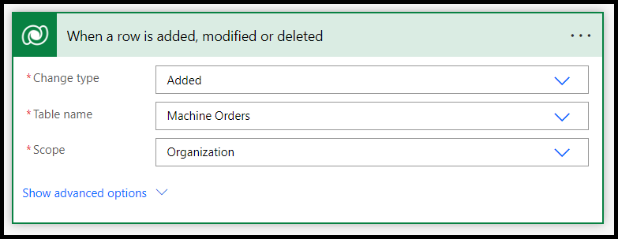

9. Select **New Step**.

10. Select the **Custom** tab.

11. Select the **Start business approval process** action.

 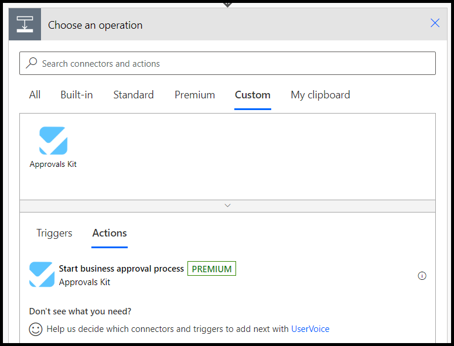

12. Select **Sign in** if prompted and then select your account.

13. If prompted, select **Allow access** to confirm creation of the Approvals Kit connection.

 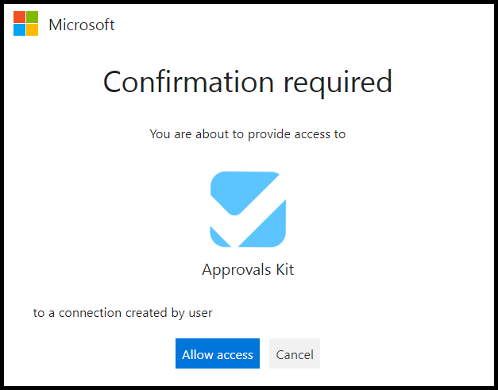

14. Select the **Machine Requests (v1)** workflow process that you published in the **Create your first Approval Kit workflow** unit.

 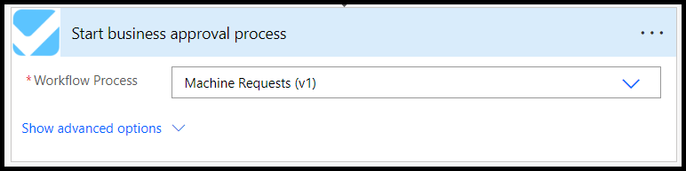

15. Select **Save**.

16. Wait for the cloud flow to save.

## Create a new machine request

Now that you’ve defined a cloud flow trigger for the **Machine Order** table, you can complete the following steps to create a new machine request that triggers an approval workflow.

1. Select **Apps** and then select **Machine Ordering App**.

 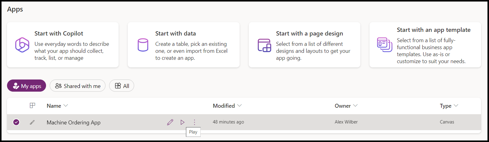

2. If prompted, select **Allow** for the **Office 365 Users** connector.

 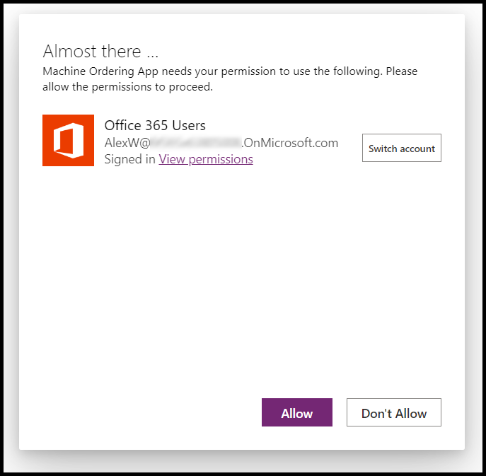

3. Select a few machines and then select **Compare**.

 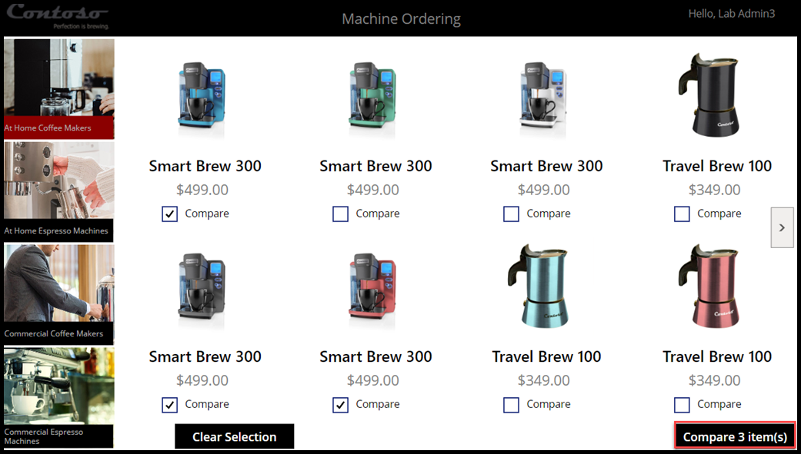

4. Select one machine and then select **Submit**.

 

5. Select **OK** to close the submitted machine request.

 > [!div class="mx-imgBorder"]
 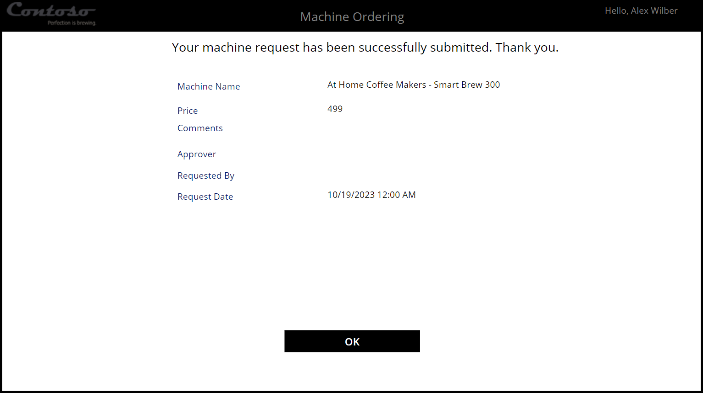

6. Close the application.

## Approve the request

After you submit the machine request, the system triggers the cloud flow, which begins your defined business approval process. Use these steps to approve the request in the Power Automate portal.

> [!NOTE]
> The exercises in this workshop are completed in the approval that’s available in the Power Automate portal. If the user is set up with an Office 365 license, the approval is also available through Outlook or in [Microsoft Teams](/power-automate/teams/native-approvals-in-teams).

1. Open the [Power Automate portal](https://make.powerautomate.com/?azure-portal=true).

2. Select the assigned Approvals Kit environment for this workshop content.

3. From the left navigation pane, select **Approvals**.

4. Wait for the approval to be sent.

5. Select the received approval.

6. Select **Approve**.

 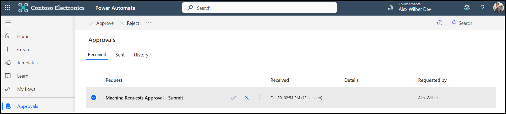

7.  Select **Confirm** to approve the approval.

 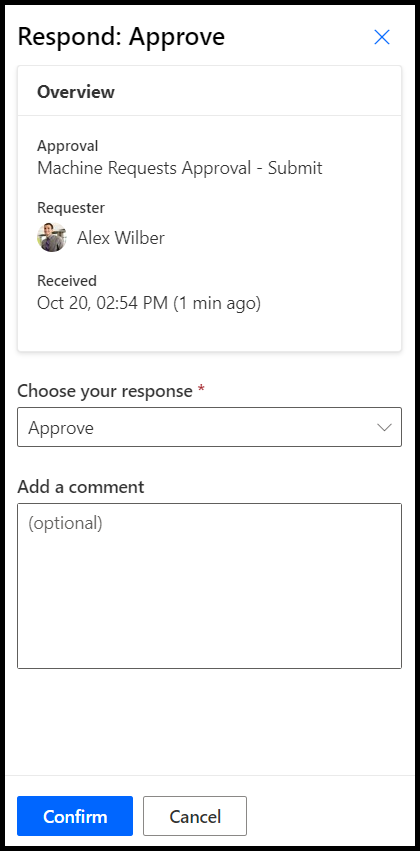

8.  Select **Done** to close the approval after it’s confirmed.

## View the completed approval

In this task, you use the Business Approval Management application of the Approvals Kit to view the updated status of the approved request.

1. Select **Solutions** from the left navigation pane of the Power Automate web portal.

2. Select **Business Approval Kit** from the list of solutions.

3. Select **Apps** from the **Objects** navigation item.

4. Select **Business Approval Management** from the list of apps.

5. Select the ellipsis (**...**) menu next to the application name and then select **Play**.
  
6. Select **Approval Instances** from the left navigation pane.

7. Select the completed approval.

 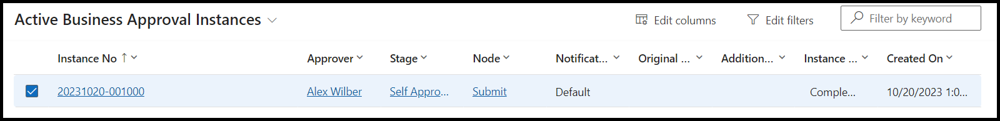

8. Review the details and then notice that the **Outcome** field shows **Approve**.

  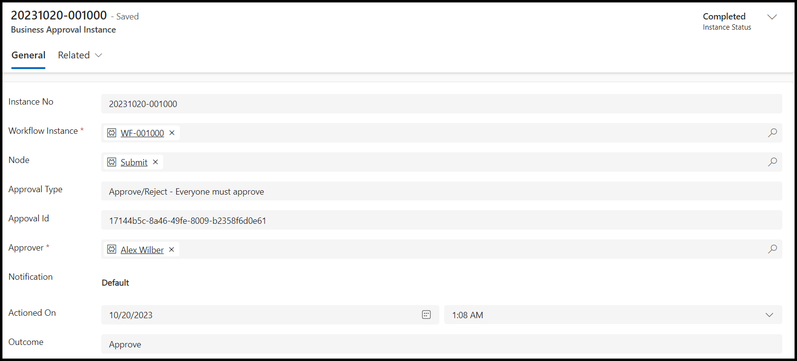

In this unit, you combined the Contoso Coffee Machine Request solution with the business approval that you created in the **Create your first Approval Kit workflow** unit. Additionally, you created a Power Automate cloud flow, combining a Dataverse trigger for the Machine Order table and the Approvals Kit connector to begin a selected business approval process.

You also used the **Business Approval Manager** application to view the results of the completed business approval. If you received an error in the process, or if the stage hasn’t been completed, the instance status would be **Running** or **Error**.
