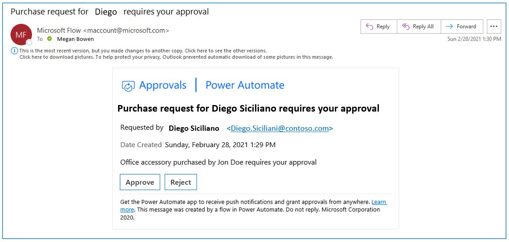
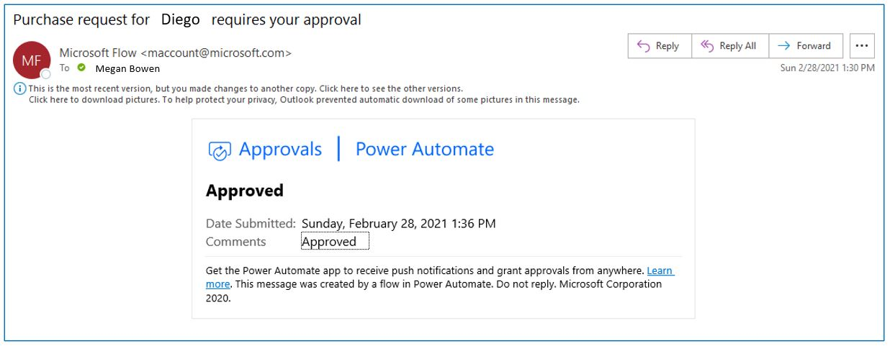
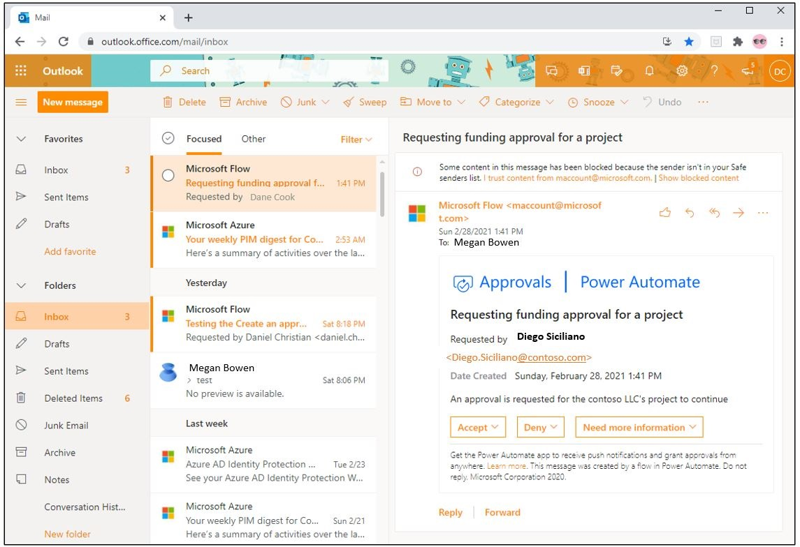
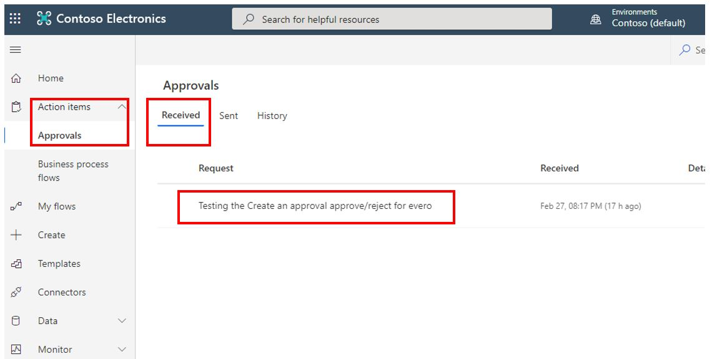
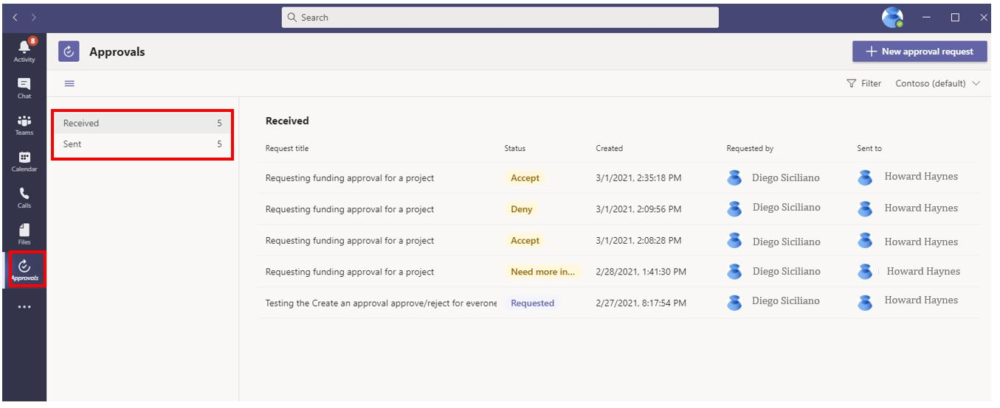
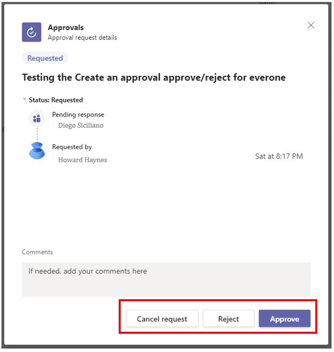

The approval action provides the flexibility to approve or reject across various platforms. This section will focus on four of those platforms.

## Respond from Microsoft Outlook

The **Approvals** connector in Power Automate gives you the flexibility to approve directly from Microsoft Outlook. This feature works for approve and reject responses and also for custom responses.

> [!div class="mx-imgBorder"]
> 

After the approval has been made, the email body automatically updates, as shown in the following screenshot. It updates to ensure that you don't approve or reject multiple times.

> [!div class="mx-imgBorder"]
> 

## Respond from Power Automate through an internet browser

Microsoft Outlook gives you the flexibility to access Outlook web apps through the browser and accept the approvals from there as well.

> [!div class="mx-imgBorder"]
> 

Similar to the desktop Outlook client, you have the flexibility to add a comment from the browser.

> [!div class="mx-imgBorder"]
> 

After the approval process has been completed, the email body automatically updates. It updates to ensure you don't approve or reject multiple times.

Additionally, you can sign in to [https://flow.microsoft.com](https://flow.microsoft.com/?azure-portal=true), select the **Action items** drop-down menu, and select **Approvals**. The **Received** section will show the item that is pending your approval.

> [!div class="mx-imgBorder"]
> 

> [!div class="mx-imgBorder"]
> 

## Respond from Power Automate mobile device app

You can accept approvals by using the Power Automate app in your smartphone.

In the Power Automate app, select **Activity** in the lower-left corner of the screen. In the top menu of the next screen, select **Approvals**, which will show pending approvals that you can complete by using the available options.

> [!div class="mx-imgBorder"]
> 

## Respond from Microsoft Teams

Microsoft Teams includes approvals as a built-in app that you can use to approve directly from inside Teams. In the side navigation pane, select the ellipsis (**...**) button, which provides you with a list of options, including **Approvals**.

> [!div class="mx-imgBorder"]
> 

Select the **Approvals** option, which will show the approvals that are assigned to you and their status.

> [!div class="mx-imgBorder"]
> 

You can also approve and reject approvals directly from inside Teams by selecting the pending approval.

> [!div class="mx-imgBorder"]
> 
