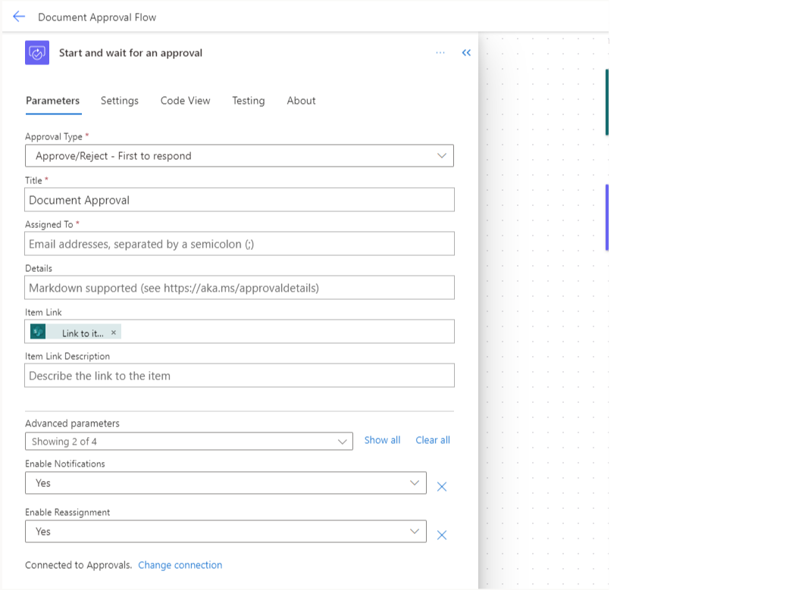
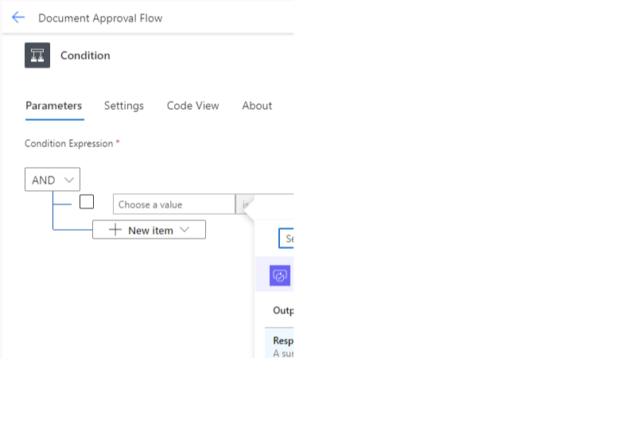
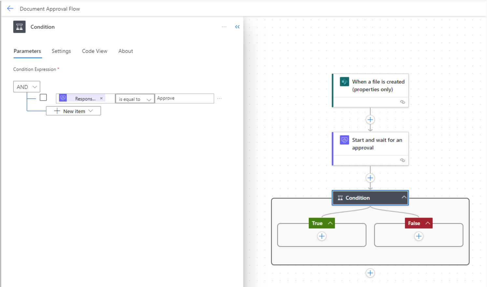
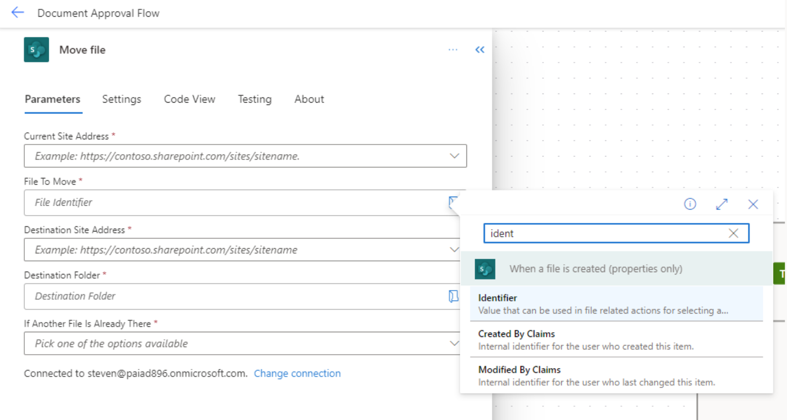

In this unit, you learn how to build a business-friendly scenario that uses approvals.

In this scenario, anyone who has access to the SharePoint library can add a document. When the document is created, an approval starts that allows certain users to approve. If the document is approved, it stays in the document library. If the document is rejected, then it's moved to a separate folder.

## Prerequisites

- Access to [Power Automate](https://flow.microsoft.com/?azure-portal=true)

- A Microsoft Office 365 account with access to SharePoint

## Step 1: Create a document library

First, let's create a library.

1. On your SharePoint site home page, select **+ New** and then **Document Library**.

1. Name your library **Approvals Library** and then select **Create**.

   > [!div class="mx-imgBorder"]
   > 

1. In your new document library, at the top, choose **+ New** and select **Folder**.

1. Name your folder **Rejected Documents** and select **Create**.

   > [!div class="mx-imgBorder"]
   > 

	Now, let's create our approval flow.

1. Next go to the [Power Automate maker portal](https://make.powerautomate.com/?azure-portal=true).

1. Select **Create** from the left side bar and then choose **Automated cloud flow**.

   > [!div class="mx-imgBorder"]
   > 

1. Name your flow **Document Approval Flow**.

1. Search *file* and then choose **When a file is created (properties only)** SharePoint trigger.

1. Select **Create**.

   > [!div class="mx-imgBorder"]
   > 

1. Select the **When a file is created (properties only)** trigger and choose your SharePoint site and Library Name on the left.

1. Select the **+** icon under the **When a file is created (properties only)** trigger and choose **Add an action**.

1. Search for *approval* and choose **Start and wait for an approval** action.

   > [!div class="mx-imgBorder"]
   > 

1. Choose **Approve/Reject - First to respond** from the **Approval Type** dropdown.

1. Title the approval **Document Approval**.

1. Assign the approval to your account (For testing purposes. You can always come back and choose a different approver later if you wish.).

1. Put your cursor in the **Item Link** box and select the lightning bolt icon next to it. This pulls up your dynamic content for this section.

1. Choose **Link to item** in the pop-up window.

   > [!div class="mx-imgBorder"]
   > 

1. Select the **+** icon under the **Start and wait for an approval** step and choose **Add an action**.

1. Search for *condition* and choose **Condition** action.

   > [!div class="mx-imgBorder"]
   > 

1. In the **Condition** window select **Choose a value** on the left, select the lightning bolt icon again, and select **Response Summary**.

   > [!div class="mx-imgBorder"]
   > 

1. Put your cursor in the **Choose a value** box on the right side and type **Approve**.

   > [!div class="mx-imgBorder"]
   > 

1. Select the **+** icon under the **False** side of the condition and choose **Add an action**.

1. Search for *move* and choose **Move file** action.

   > [!div class="mx-imgBorder"]
   > 

1. Choose your SharePoint site address from the first dropdown.

1. Select the **File Identifier** under **File to Move**, and choose the lightning bolt icon again.

1. Search for *identifier* and select the **Identifier** field from the SharePoint action.

   > [!div class="mx-imgBorder"]
   > 

1. Choose the same SharePoint site for the **Destination Site Address**.

1. For the **Destination Folder**, select the folder icon on the right side. Find your **Approvals Library** and select the arrow to the right of its name. Then select the folder name **Rejected Documents**.

1. Under **If Another File Is Already There** choose **Move with a new name**.

   > [!div class="mx-imgBorder"]
   > 

1. **Save** your flow with the button in the top right corner.

   > [!div class="mx-imgBorder"]
   > 

To test your flow, go back to your SharePoint **Approvals Library** and add a new document.

After a short amount of time, an approval appears under the approvals section of the [Power Automate maker portal.](https://make.powerautomate.com/)

> [!div class="mx-imgBorder"]
> 

Select the approval and choose your response. If you choose **Reject**, refresh your SharePoint **Approvals Library** and the document is gone. Select the **Rejected Document** folder and you can see your file moved there.

Congrats! You built an approval flow that allows users to approve or reject documents in a SharePoint document library.

> [!div class="mx-imgBorder"]
> 

You can easily edit or extend this approval flow to better fit your needs. Or check out the approvals Power Automate Templates to give yourself various starting places for your own approvals.
