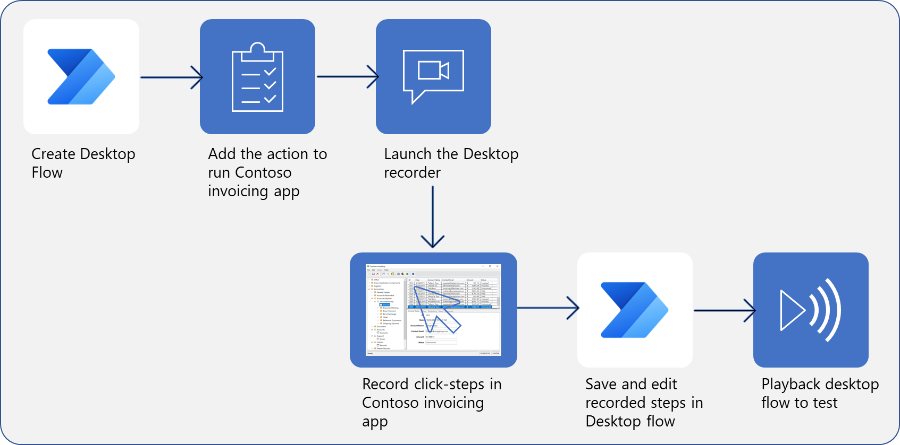

Microsoft Power Automate for desktop flows broaden the robotic process automation (RPA) capabilities in Power Automate by enabling users to automate the everyday, repetitive web and desktop processes. Learning Power Automate and how to build a desktop flow is the first step in designing an RPA solution.  

> 
**Steps to create, record, and run a desktop flow**

In this module, you'll:

- Learn about Power Automate flows.

- Create a new desktop flow.

- Record actions that are performed in a desktop-based application.

- Perform a test run of the new desktop flow.
