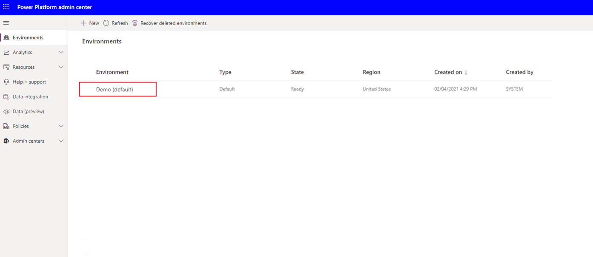
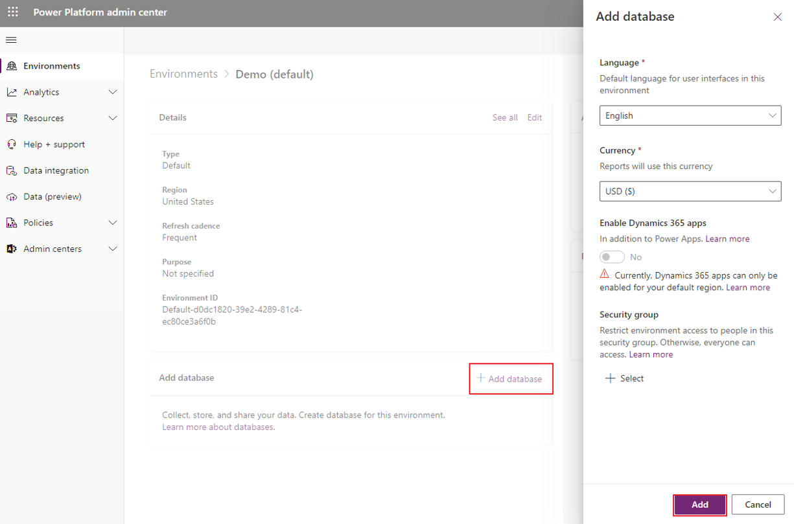
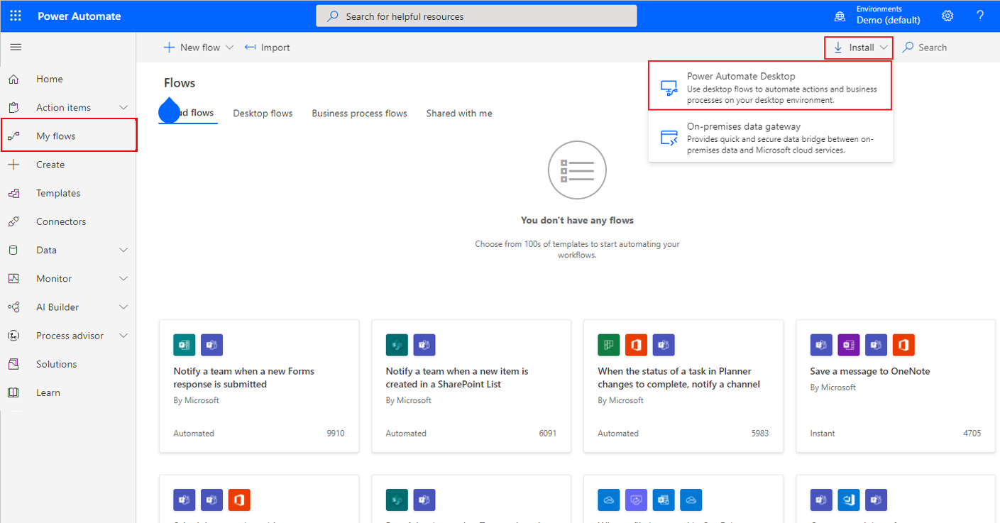
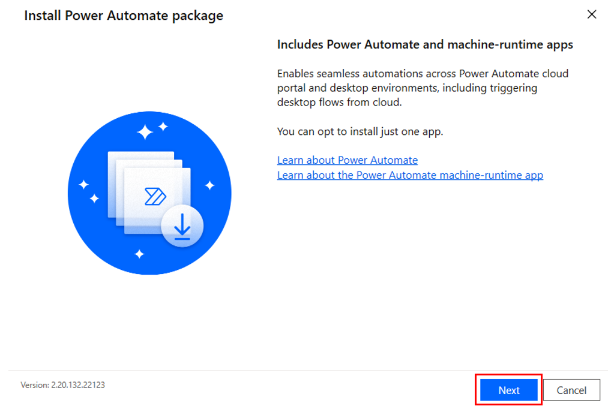
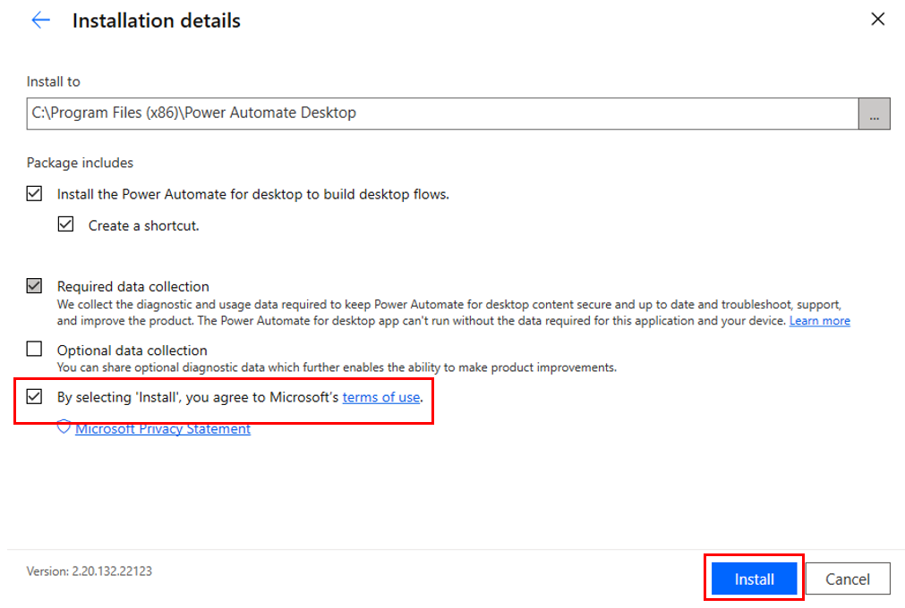
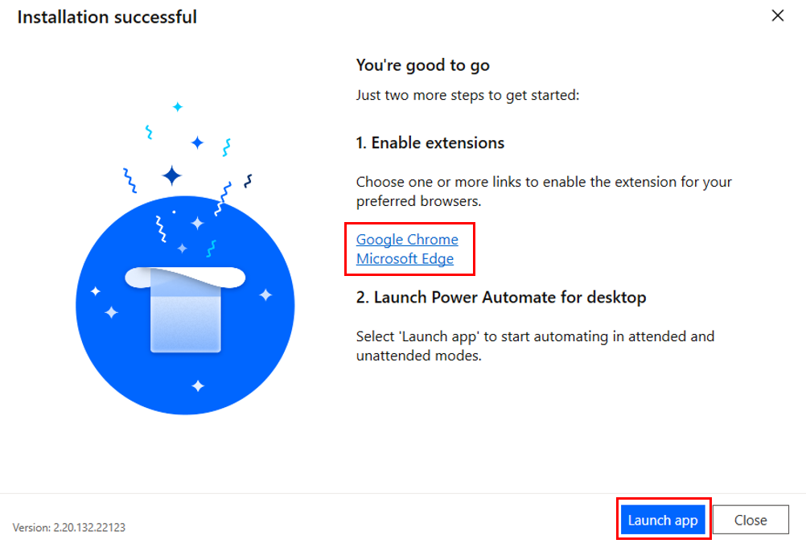

Creating and running automation systems in Power Automate requires you to have access to make changes to the environments in your tenant and to have the appropriate licenses and permissions. If you don't already have admin access to a valid tenant, you might want to start a [free trial](https://www.microsoft.com/microsoft-365/enterprise/office-365-e3?activetab=pivot%3aoverviewtab/?azure-portal=true). In addition, you'll need a Power Automate user plan with attended RPA license to complete this module. You can sign up for a [free trial](https://flow.microsoft.com/pricing/?azure-portal=true) if you don't already have this license.

In this unit, you'll complete two tasks: 
1. Set up a trial Power Automate environment. An environment is a space to store, manage, and share your organization’s business data, apps, and flows. 
2. Set up the Contoso Invoicing application, which you'll use throughout the **Automate processes with robotic process automation and Power Automate for desktop** learning path to help you explore and learn the concepts and actions that are available in desktop flows.

## Create a trial environment with a database

After you've successfully signed in to a valid tenant, go to the [Microsoft Power Platform admin center](https://admin.powerplatform.microsoft.com/environments/?azure-portal=true). You'll need to create a trial environment with a database. Select **Environments** and then select your automatically created environment: **Demo (default)**.

If you're using an existing tenant rather than creating a trial for this exercise, you can use the default environment or create a new one to keep it separate from your existing solutions.

> [!div class="mx-imgBorder"]
> 

Now that you're in your chosen environment, you can add a database by selecting **Add database**. In the subsequent dialog, you can specify the requested values but can keep the defaults. Select **Add**. You might be prompted to sign in again before creating your database, after which, your database should provision appropriately.

> [!div class="mx-imgBorder"]
> 

Creating your database might take up to one minute; afterward, you can continue to the next steps.

If you're using a trial environment, consider setting up a profile in your browser to prevent you from being signed out of your existing Microsoft account.

## Software installation

The following exercises require you to install various software on your computer. The following steps will guide you through the download and installation of Power Automate, the required extensions, and the Contoso Invoicing app.

If you've already installed Power Automate, ensure that you're running the latest available version.

### Power Automate

Go to [Power Automate](https://flow.microsoft.com/?azure-portal=true) and sign in with the account that you used to create your environment and database. After you've signed in, select **My flows > Install > Power Automate**.

> [!div class="mx-imgBorder"]
> 

When the download completes, select the file to open and run the installer. Select **Next** and, on the subsequent screen, select the final checkbox and then select **Install**. This action will install the Power Automate app and the browser extensions for Microsoft Edge and Google Chrome.

> [!div class="mx-imgBorder"]
> 

> [!div class="mx-imgBorder"]
> 

When the installation is complete, select the link of your preferred browser and then follow the instructions to enable the extension. After the extension has been enabled, you can launch the Power Automate app.

> [!div class="mx-imgBorder"]
> 

After launching the app, sign in by using the account that you used to set up your environment and database.

## Contoso Invoicing app

A major benefit of using desktop flows is the ability to perform actions on desktop applications. For the flow that you're creating, you'll use an invoicing application to explore the concepts and actions that are available to you in desktop flows. After completing the module, you can use what you've learned to run desktop flows on your own applications and to automate existing processes.

Download the [Contoso Invoicing app](https://github.com/MicrosoftDocs/mslearn-developer-tools-power-platform/raw/master/power-automate-desktop/contoso-invoice-app/ContosoInvoicingSetup.zip), extract the contents, and then install the application and explore the elements.

> [!div class="mx-imgBorder"]
> 

Now, you're ready to get into the details of Power Automate.
