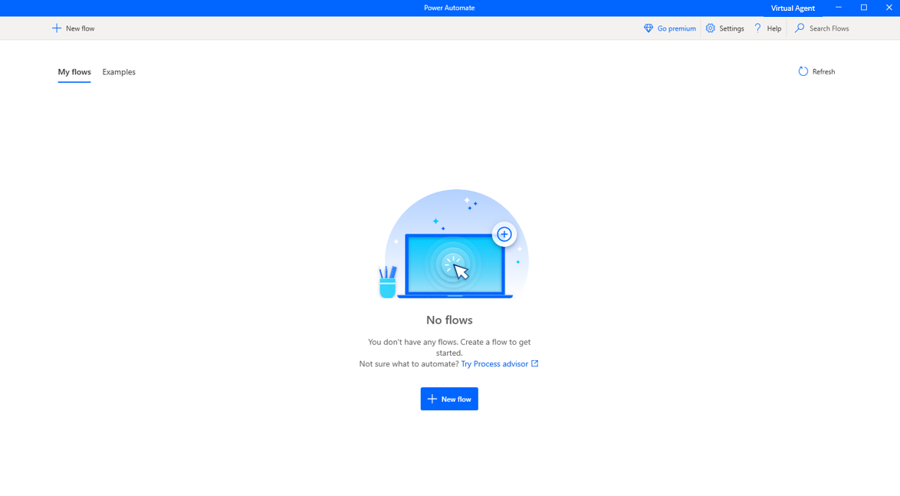
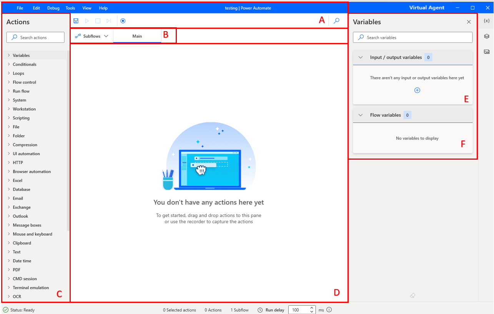
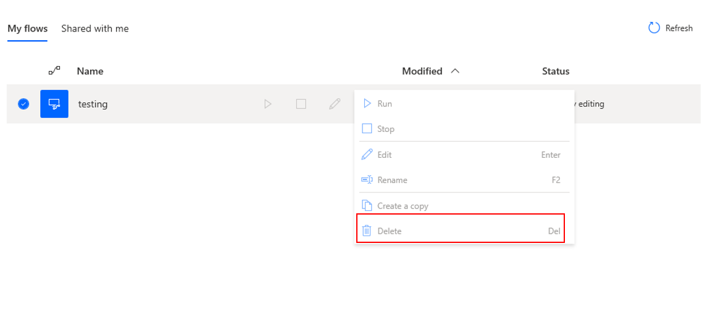

You've downloaded the appropriate software and have the necessary licenses to create your first desktop flow. Your next task is to become familiar with the software. 

In this module, you'll complete the following three tasks: 
1. Open the Power Automate Desktop app.
2. Create a new desktop flow and explore the editing environment.
3. Exit the flow editing environment and delete the test flow.

Watch the following demo video of the steps in this unit.

> [!VIDEO https://www.microsoft.com/en-us/videoplayer/embed/RE5cV2D]

Open and explore Power Automate. Under **Flows**, your existing desktop flows will display, and you can edit, start, or delete them. You can explore the creating or editing a flow process by selecting the **+ New flow** button in the upper-left corner.

> [!div class="mx-imgBorder"]
> 

Name your flow and then select **Create**. The specifics of the name aren't important; it's temporary and meant to help you become familiar with the app. You'll delete this flow shortly.

After you've created your new test flow, the Power Automate designer will display. The designer contains several elements for you to focus on:

-   **Toolbar** (A) - Contains basic operations for use with actions (**Save**, **Undo**, **Copy**, **Debug**, and **Paste**) and buttons to start the desktop/web recorders and control the process implementation (**Start**/**Pause**/**Stop**).

-   **Subflows** (B) - Allows you to create subflows under your **Main** flow.

-   **Actions pane** (C) - Contains all Power Automate actions and includes a search bar that helps you find specific actions by matching the action name to the text string.

-   **Workspace** (D) - Contains all actions that are added to the process so far. Functions are separated into tabs.

-   **Input/output variables** (E) - Contains all variables that you've created in the process.

-   **Flow variables** (F) - List of all variables that are used in the process.

> [!div class="mx-imgBorder"]
> 

Save your flow and close the window. Your new flow should appear in the list. Select the ellipsis (**...**) button to expand the options for that flow and then delete it.

> [!div class="mx-imgBorder"]
> 

Now that you're familiar with Power Automate, you can create a flow.
