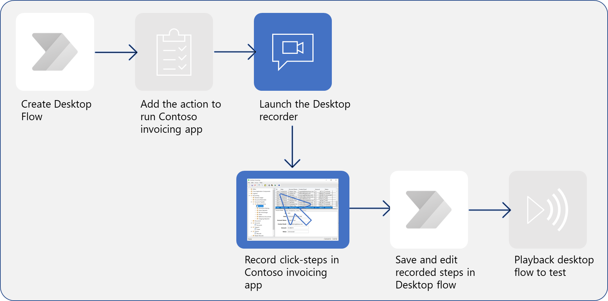
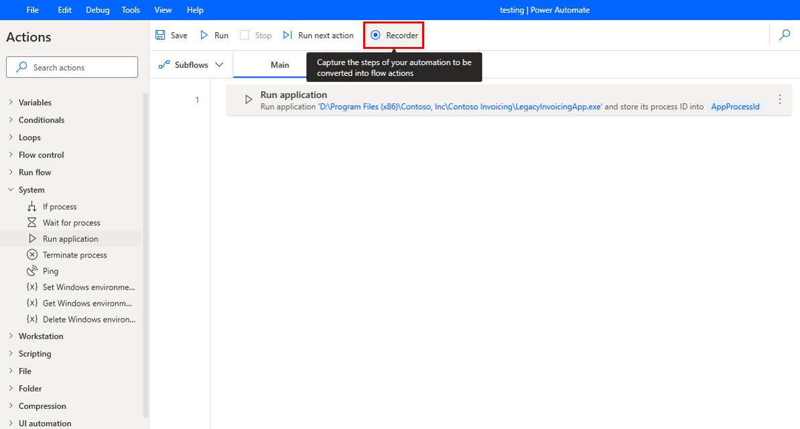
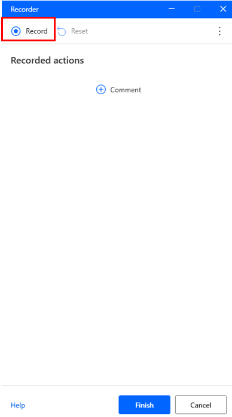
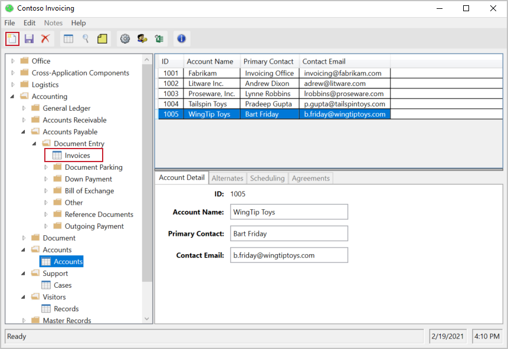
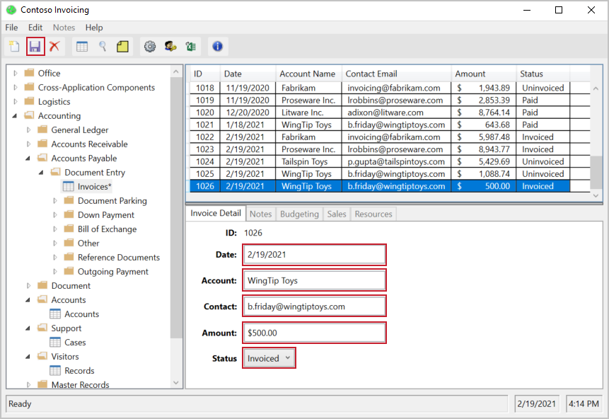
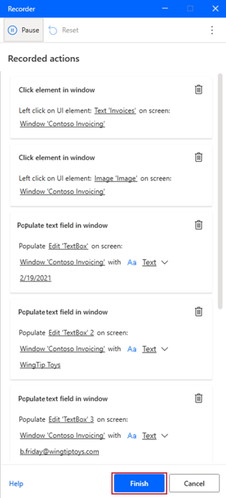

In this unit, you'll learn how to record Power Automate for desktop actions. 

> 

Watch the following video demonstration of the steps that you'll complete in this unit.

> [!VIDEO https://www.microsoft.com/en-us/videoplayer/embed/RE5cFQO]

> [!NOTE]
> Before getting started, you should be aware of some cleanup items. The process will be more effortless if you exit out of unnecessary applications while you're recording. If you have more browsers or programs running, you should close them now. Additionally, it will be difficult to read the instructions and perform the actions that are required for the recording simultaneously. You might want to read through this unit completely before performing the outlined steps. With those items out of the way, you're now ready to begin recording.

To begin recording your desktop actions, open the Contoso Invoicing app (see [Set up the environment](/training/modules/build-first-desktop-flow/2-set-up-environment) unit of this module) and the **Desktop recorder** in Power Automate. If your application isn't maximized, the desktop recorder will show as an icon without text in the toolbar. Select the **Start recording** button in Power Automate.

> [!div class="mx-imgBorder"]
> 

> [!div class="mx-imgBorder"]
> 

As you record, make sure that you go slowly and wait several seconds between actions. A red outline will display on a control before you select it, and a blue highlight will display afterward. If these outlines and highlights don't appear, your actions might not be recorded properly.

In the Contoso Invoicing app, select **Invoices** and then create a new record by selecting the appropriate icon in the upper left.

> [!div class="mx-imgBorder"]
> 

Complete the required information for the invoice: **Date**, **Account**, **Contact**, **Amount**, and **Status**. You can use whatever values you want, or you could copy the values that are used in the following screenshot. Edit the **Date** field, even if it has the value that you want. This action will allow you to change it through the flow instead of always having to use the default date. Be sure to only use your mouse, not keyboard shortcuts, to go to the next field. You can pause the recording or delete actions if you make a mistake.

When you're finished, select the **Save** icon to save your record.

> [!div class="mx-imgBorder"]
> 

Return to the recording, pause it in Power Automate, and then select **Finish**. Your recorded actions should look similar to the following screenshot.

> [!div class="mx-imgBorder"]
> 

After you've selected **Finish**, your newly recorded actions will display beneath the action to open your app. The action of closing the app wasn't recorded. Additionally, this unit didn't demonstrate how running your flow will result in a new instance of the app being open for every run.
