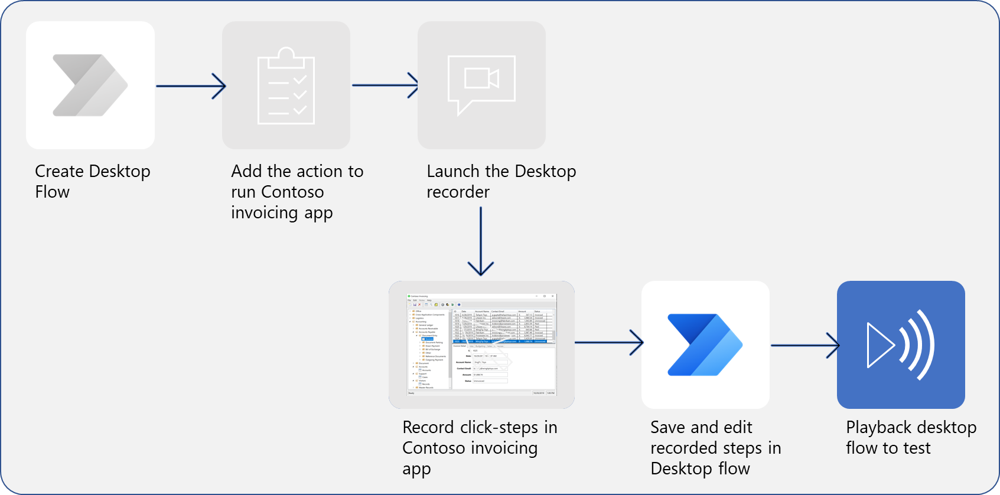
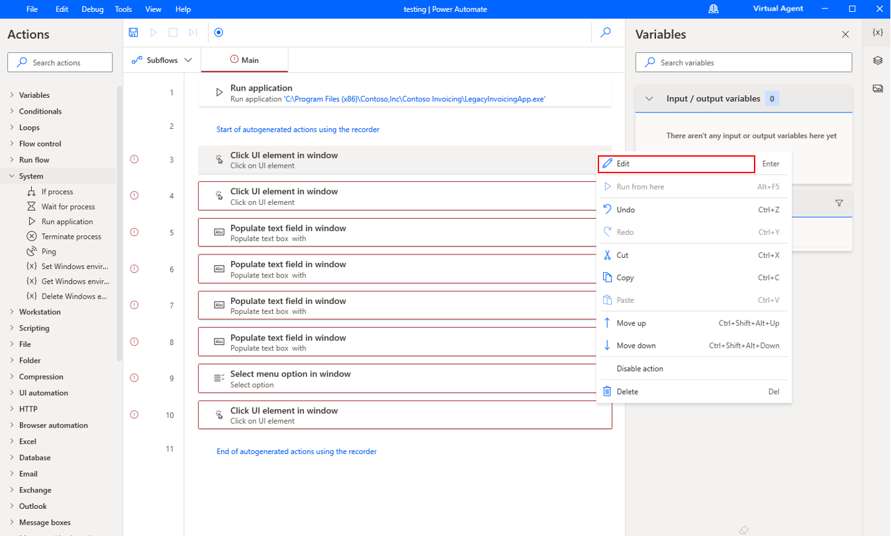
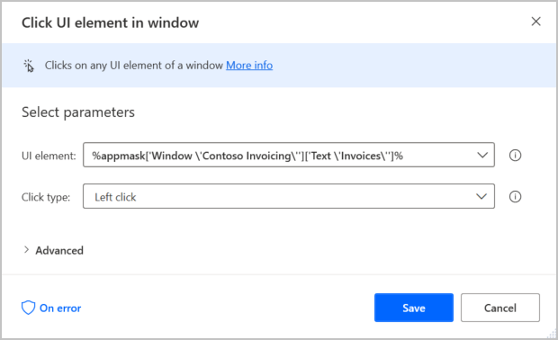
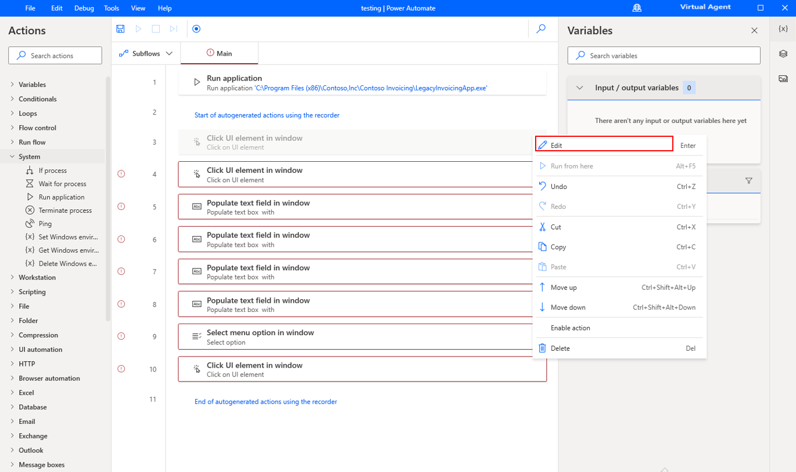
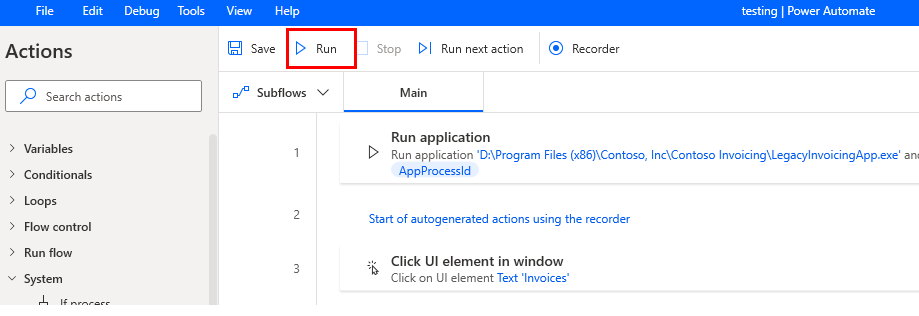

Your next task is to edit and test the recorded actions.

> [!div class="mx-imgBorder"]
> 

You can edit the list of recorded actions by selecting the ellipsis (**...**) menu and then selecting **Edit**. In the subsequent dialog, you can correct mistakes that you made during recording. For example, you can reorder, copy, or delete actions as needed.  

> [!div class="mx-imgBorder"]
> 

> [!div class="mx-imgBorder"]
> 

Additionally, you can **Delete** unnecessary or duplicate steps in the ellipsis (**...**) menu.

> [!div class="mx-imgBorder"]
> 

Test your flow by selecting the **Run** icon in the toolbar. Avoid using your computer to perform actions while the test is running.

> [!div class="mx-imgBorder"]
> 

When your test is successful, select the **Save** icon.
