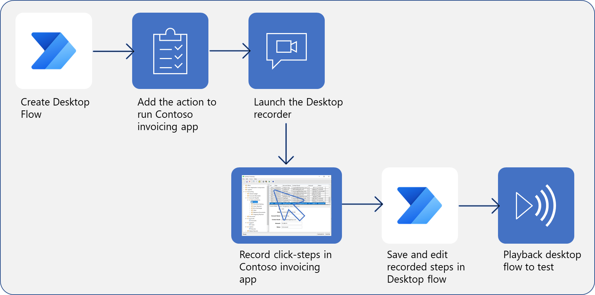

Power Automate for desktop flows broaden the RPA capabilities in Power Automate by enabling users to automate everyday, repetitive web or desktop processes. Learning Power Automate and how to build a desktop flow is the first step in designing an RPA solution.  

> [!div class="mx-imgBorder"]
> 
**Steps to create, record, and run a desktop flow**

In this module, you've learned about the following concepts:

- Power Automate and how to create a new desktop flow. 

- Recorded actions that are performed in a desktop-based application. 

- How to complete a test run of the new desktop flow.  

## Key takeaways

Key takeaways of this module include:

- Desktop flows allow you to create custom automations; however, you'll need to have access to make changes to the environments in your tenant and have the appropriate licenses and permissions.  

- Recording your actions is as simple as pressing a button.

- RPA is accessible to anyone who uses the Power Automate application.
