In this exercise, you create your first flow by using Power Automate for Teams. For this example, you create an automated workflow that creates a Planner task each time a message with the word "task" in the subject line is posted to a Teams channel. The flow needs a Planner to create the tasks in. You can identify an existing Planner plan or create a new one.

## Step 1: Create a new flow

To create a new flow, follow these steps:

1. From Teams, open the **Power Automate** application.  (If Power Automate doesn't appear in the rail, select the ellipsis in the rail and search for it).  Notice that the **Home** tab includes a list of the currently active flows and some Teams templates to choose from.

1. From the **Home** tab, select **+ New flow**, which takes you to the **Create** tab.

   > [!div class="mx-imgBorder"]
   > [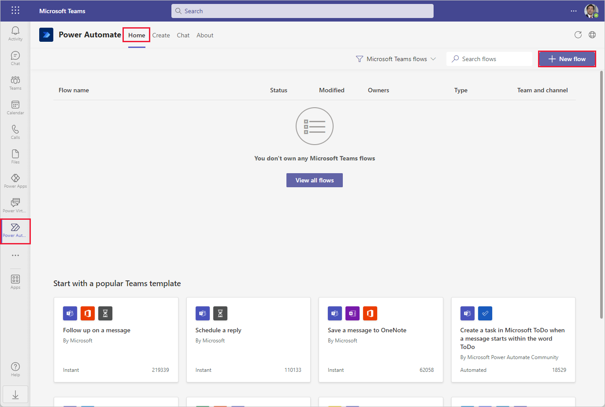](../media/power-automate-home.png#lightbox)

1. In the **Create** tab, notice that the menu down the left side gives you the option to select templates related to the task you’re trying to automate.  Select **+ Create from blank** in the top right of the screen.

   > [!div class="mx-imgBorder"]
   > [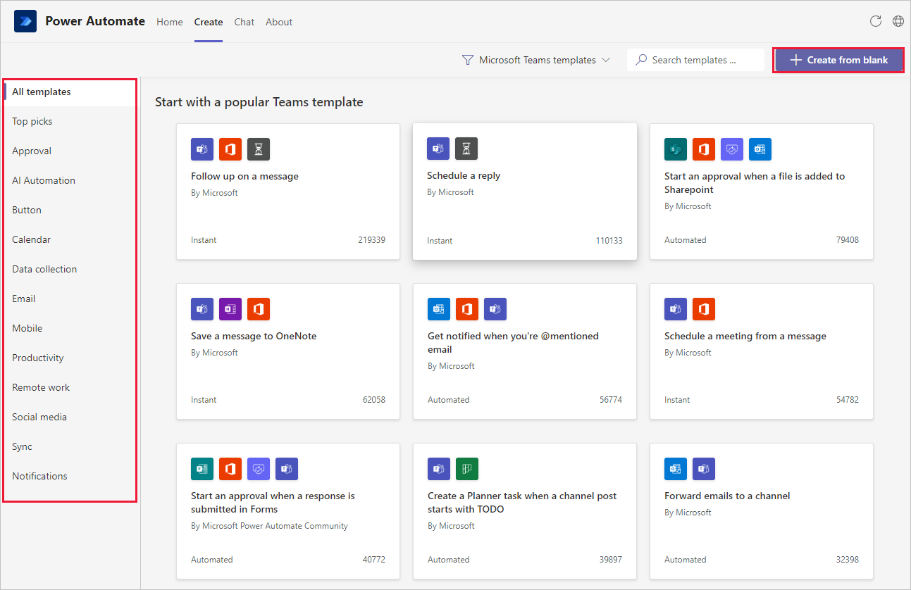](../media/power-automate-create.png#lightbox)

1. Notice how **Power Automate** initiates a new flow within Teams. Rename your flow by selecting the word *Untitled* in the upper left of the menu bar and type in a name.  Next, we create the flow.

   > [!div class="mx-imgBorder"]
   > [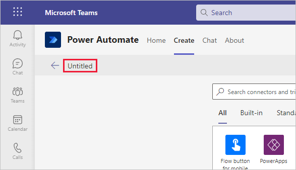](../media/power-automate-save.png#lightbox)

## Step 2: Build the flow in Power Automate editor

In the **Search connectors and triggers** search field, search for "Teams when a new channel" and select the trigger **When a new channel message is added**.

To have the flow monitor the correct Teams channel for new messages, make selections from both the **Team** and **Channel** drop-downs. The channels automatically filter based on the **Team** that is selected.

Select **New step** to continue.

> [!div class="mx-imgBorder"]
> [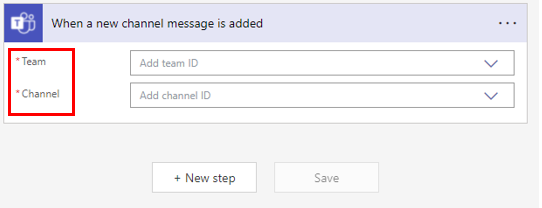](../media/image-3.png#lightbox)

Now let's add a condition to search the subject of the messages to see if they have the word "task" in them. In the **Choose an operation** menu, select **Condition** from the available actions. (If you don't see it, enter **Condition** in the search field and then select it from the search results.)

> [!div class="mx-imgBorder"]
> [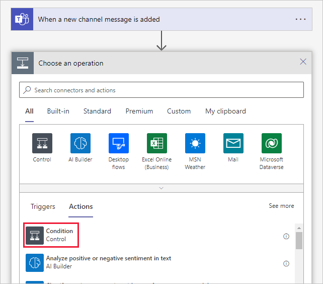](../media/choose-condition.png#lightbox)

Within the **Condition** step, select the **Choose a value** field to view the available dynamic content. Dynamic content is the information that the flow has available based on the triggers and previous steps that took place.

> [!div class="mx-imgBorder"]
> [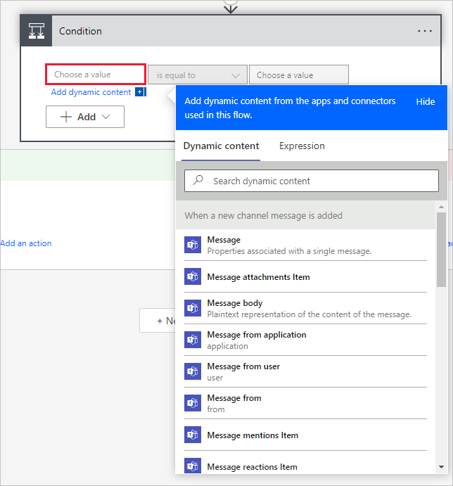](../media/dynamic-content.png#lightbox)

1. From the list of dynamic content, scroll down and select **Message subject**. (Alternatively, you can input *subject* in the Search field to narrow the results.)

1. In the middle drop-down menu, select **contains**.

1. Enter **task** in the box on the right.

> [!div class="mx-imgBorder"]
> [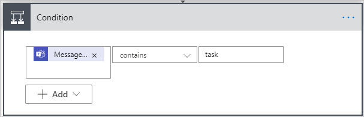](../media/image-4.png#lightbox)

Now, when the **Message subject** contains the word "task," it performs actions in the **If yes** area. The conditions in Power Automate are case-sensitive, so you need to add a few more conditions to detect common variations such as "Task" and "TASK." Select **+ Add** and then select **+ Add Row**. Use the same condition each time with **Message subject** from dynamic content.

A new selection appears at the top of the **Condition** window to switch between the following statements:

- **And** - All conditions must be true.

- **Or** - Only one of the conditions must be true.

Change the selection to **Or**.

> [!div class="mx-imgBorder"]
> [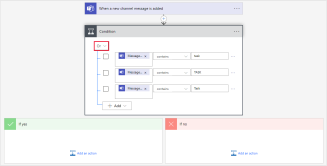](../media/new-channel-message.svg#lightbox)

The **Condition** action provides two options for further actions, **If yes** and **If no**. If the condition is true, then we create a new Planner task. We don't need any actions if the condition is false, so we leave the **If no** condition blank.

In the **If yes** condition box, select **Add an action**.

Enter *planner* and then select **Create a task** from the results.

> [!div class="mx-imgBorder"]
> [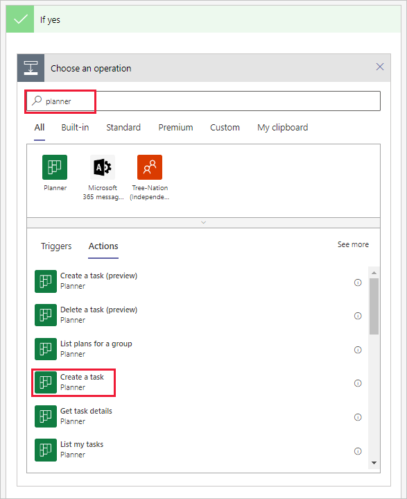](../media/image-7.png#lightbox)

The **Create a task** step appears in the **If yes** field for your **Condition** step. Fill out the needed information for the Planner task as in this table.

| Field | Value |
|-------|-------|
| Group ID | Select the group that has your Planner |
| Plan ID | Select the Planner for the new task |
| Title | Select dynamic content **Message body content** |
| Start Date Time | Select dynamic content **Message created DateTime** |

When you complete the task, select **Save** at the bottom of the editing window, or in the toolbar to complete the flow.

You can now review the flow and see how it works. The flow is triggered when a new message is posted in a specific Teams channel. Next, you should check for the word "task" in the message subject. If yes, the system creates a new Planner task. If no, the system doesn't take action.

> [!div class="mx-imgBorder"]
> [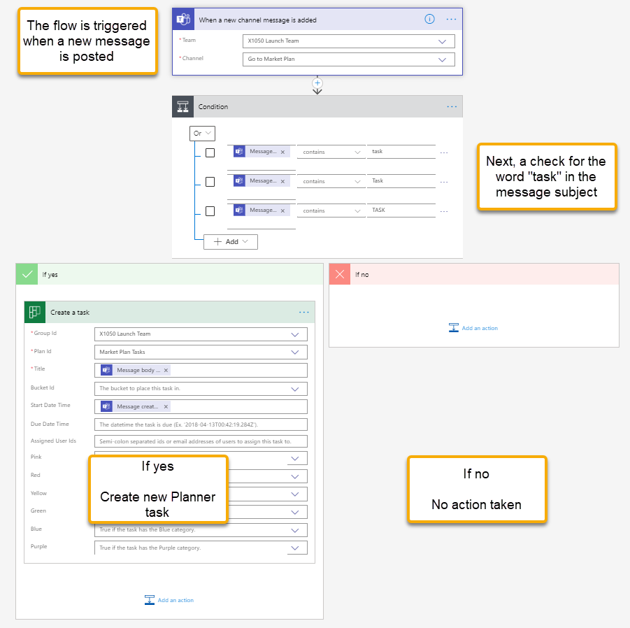](../media/image-8.png#lightbox)

## Step 3: Test the flow

Send a message to the Teams channel that the flow is monitoring. Press the format icon under your message to bring up the format with the subject header.

> [!div class="mx-imgBorder"]
> [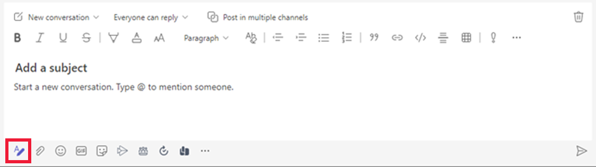](../media/format-message-subject.png#lightbox)

In the subject line, enter a subject including the word **task** and send the message.

> [!div class="mx-imgBorder"]
> [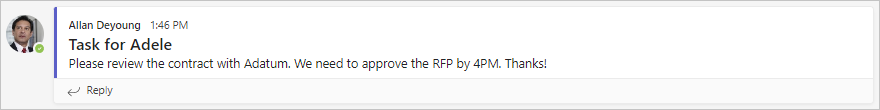](../media/image-9.png#lightbox)

The Teams connector checks for a new message in three-minute intervals. Next, [open Planner](https://tasks.office.com/Home/Planner/) and watch for the new task to be created. The message body should be the task title. Select the task to check the start date and see if it was set to the same date as the message.

> [!div class="mx-imgBorder"]
> [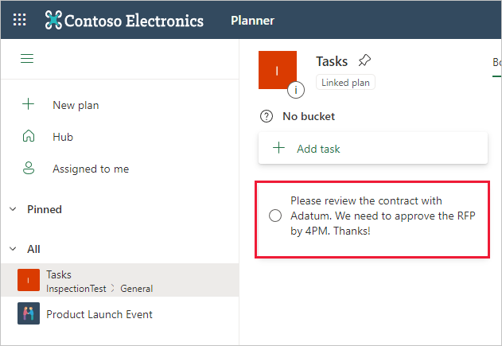](../media/image-10.png#lightbox)

You can view the flow's run history for the last 28 days to see how long it takes the flow to run and if it was successful:

1. Open Power Automate for Teams.

1. From the **Home** tab, select the flow that you created, listed under **Flow name**.  The details screen view shows you more information on your flow and the **28-day run history**.

> [!div class="mx-imgBorder"]
> [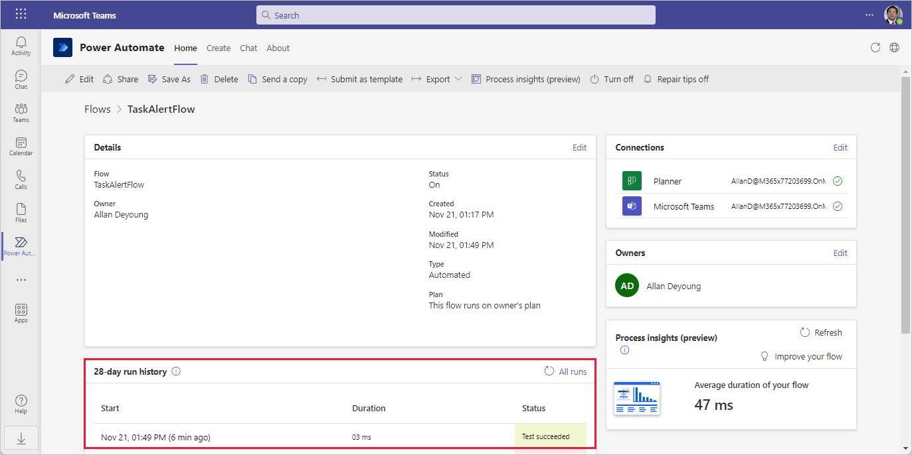](../media/power-automate-history.png#lightbox)

Select the run, by selecting the date/time to see more information and troubleshoot each step of the flow. You can select each step and expand it to see the data/results. In this screenshot, we expanded the **Condition** and **Create a task** steps so you can get an idea of the data flow.

> [!div class="mx-imgBorder"]
> [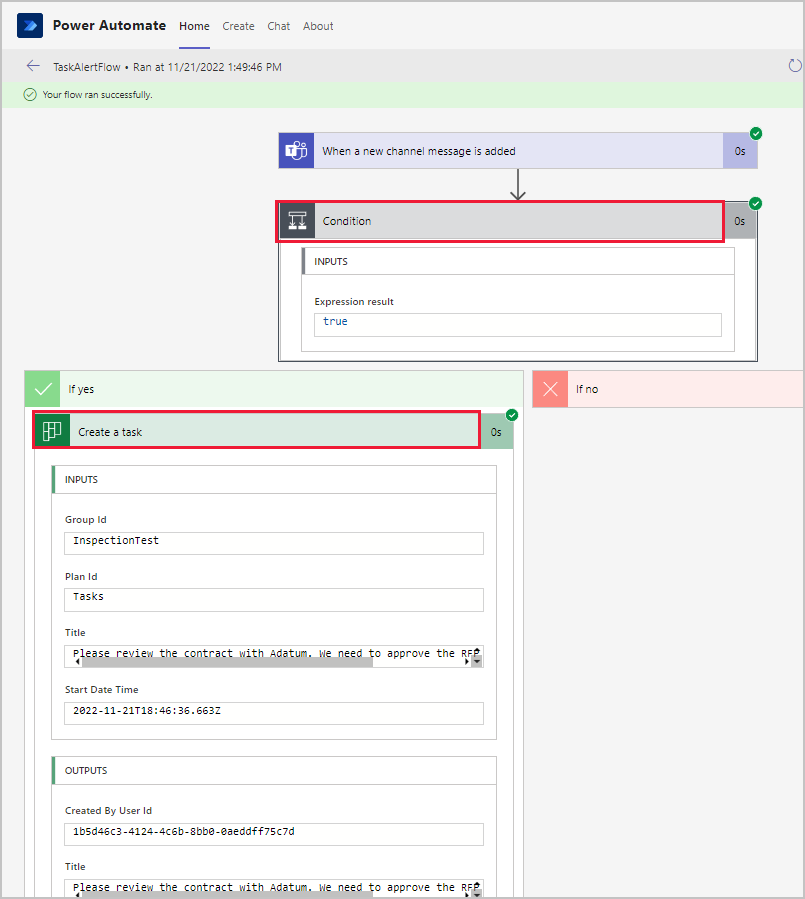](../media/check-run.png#lightbox)
