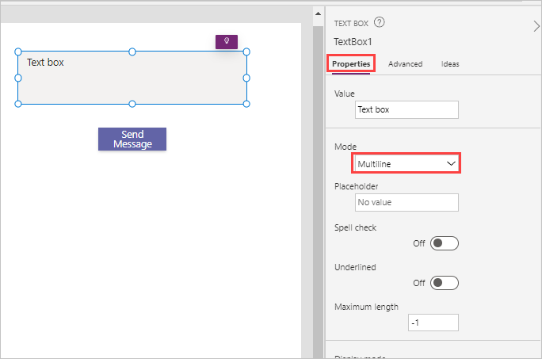
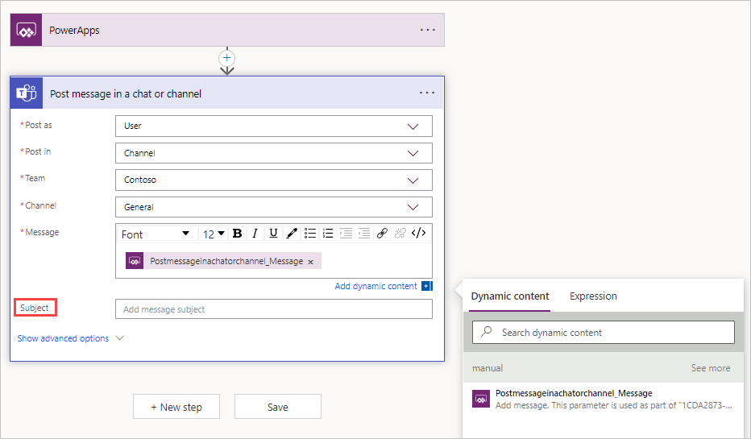

Flows can be used to automate a sequence of actions from within your Power Apps application. For example, when a new customer record is created, you could start an approval process, add a new SharePoint list item, or email a forms survey to your customer. This feature allows for more consistent business processes and less manual work.

The key feature that makes this ability so powerful is that needed information is passed from the app to a flow when it's triggered. The following steps demonstrate how to connect a flow to Power Apps with a simple app to send a message to Teams. The goal is when **Button1** is pressed, the contents of **TextBox1** will be passed to the flow to become a message in Teams.

## Step 1 - Create the Power Apps application

To create the Power Apps application, follow these steps:

1. Open the Power Apps app in Teams from the **Home** tab select **+ New App**.

1. Select a team to store the app and then select **Create**.

1. Name the app **Trigger Flow From App** and then select **Save**.  Your created app will show a blank screen with a center screen menu displaying the options to start the screen **With data**, **With layout**, **Or drag and drop an item from the Insert pane**.

   > [!div class="mx-imgBorder"]
   > 

1. From the command ribbon at, the top select the **+ Insert** button and you'll see a selection menu popup appear (alternatively you can select the **+** in the left side rail, and you'll have a similar menu); then select a **Text box**.

   > [!div class="mx-imgBorder"]
   > 

   > [!TIP]
   > You can enter a control name in the search field in the **Insert** pane if you don't see the control you're looking for right away.

1. Next, using the exact same step, insert a **Button**. 

1. Position the controls on the screen to resemble the image below. You can select and drag them around. Resize the text box to make it a little taller by clicking and holding while dragging one of the dots on the upper or lower edge.

   > [!div class="mx-imgBorder"]
   > 

1. Change the following properties of **TextBox1** and **Button1** first by selecting them and using the **Properties** tab.

    TextBox1 Mode - **Multiline**

    Button1 Text - **Send Message**

    > [!div class="mx-imgBorder"]
    > 

## Step 2 - Create and connect a flow

To create and connect a flow, follow these steps:

1. To connect a flow, select the item and event that will start the flow. Because you want the flow to trigger when **Button1** is pressed, select the button and then select **OnSelect** from the drop-down menu.

   > [!div class="mx-imgBorder"]
   > 

1. To create a flow and link it to the app, select the **Power Automate** button from the **Power Apps** side rail. A **Power Automate** add/create flow menu appears immediately on the right once you select the rail button.

   > [!div class="mx-imgBorder"]
   > 

1. Select **Create a new flow**. A **Create your flow** popup appears, allowing you to select a pre-existing template or **+ Create from blank**. Select **+ Create from blank**.

   > [!div class="mx-imgBorder"]
   > 

1. Give your flow a new name by selecting **Untitled** and then entering **Power Apps to Teams Message**.

   Notice that your new flow already has the **PowerApps** trigger.

   > [!div class="mx-imgBorder"]
   > 

1. To add an action, select **+ New Step** just below your trigger.

1. Enter **Teams post message** in the search box and select **Post message in a chat or channel** (it should be at the top of the list, but if not, you can scroll down to find it).

   > [!div class="mx-imgBorder"]
   > 

1. In the Post as section, select **Flow bot** (this should be the default selection). This will send your messages as the Flow bot instead of a specific user. So essentially, the messages will be sent as a generic user.

1. For the **Post in** section, select **Channel**.

1. Now, select the **Team** and **Channel** that you want the message to be sent to.

1. The message will be provided by the Power Apps application when it's triggered. Select in the **Message** text box to bring up **Dynamic content** and then select **Ask in PowerApps**.

   > [!div class="mx-imgBorder"]
   > 

1. Notice that the dynamic content inside of the message field has something that looks like the title of this flow step with the spaces removed and *_message* at the end. Select the **Save** button under this step.

   > [!div class="mx-imgBorder"]
   > 

1. Once the flow saves, the **Power Automate** editor closes. In the **Power Automate** pane on the left side of your editing canvas, select the **+ Add flow**, then look for your new flow titled **Power Apps to Teams Message** and select it.

   > [!div class="mx-imgBorder"]
   > 

   After a few moments, the **Add flow** popup closes and your new flow appears in the **Power Automate** pane under **In your app**
   
1. With **Button1** selected and your **OnSelect** property displayed in the *fx* field (which is currently **false**), enter 'PowerApps' in the formula field and select **PowerAppstoTeamsMessage.Run** from the suggested input just below the *fx* entry field.

   > [!div class="mx-imgBorder"]
   > 

1. The command to run the flow will appear in the formula bar. Notice how you still have error indicators in your app; that's because you need to pass a parameter from Power Apps into the flow. Complete the formula by entering  **Textbox1.Value)** so that your formula looks like the image below:

   > [!div class="mx-imgBorder"]
   > 

    Notice how the error indicators disappear as you complete the formula. Now when you enter text in the text box, and select your **Send Message** button, that text will be posted inside of the Teams room that you designated in your Power Automate flow.

1. Make sure to **Save** your app before continuing (note if your **Save** icon is disabled, Power Apps has already saved it for you).

## Step 3 - Test the app and flow

Before publishing any application to **Teams**, you can test it by selecting **Preview** from the toolbar.

1. From the toolbar, select **Preview** (alternatively select **F5**).

1. Delete the existing text and enter a message into the text box; then select **Send Message**.

   > [!div class="mx-imgBorder"]
   > 

1. Switch to the Teams channel to see the message in Teams.

   > [!div class="mx-imgBorder"]
   > 

1. In the Power Apps editor, close preview mode by selecting the **X** icon or by pressing the **Esc** key. 

Now let's edit the flow and change the **Post as** from **Flow bot** to **User**. To edit a flow you've connected to Power Apps, follow the steps below:

1. Select your **Power Apps** icon in the side rail.

1. From **Recent apps** select your app.

   > [!div class="mx-imgBorder"]
   > 

1. Select the **Power Automate** tab from the Power Apps editor side rail, then select the ellipsis just to the right of your flow from the Power Automate pane.

   > [!div class="mx-imgBorder"]
   > 

1. Select **Edit** and the Power Automate editor will popup on your screen.

   > [!div class="mx-imgBorder"]
   > 

1. Select your step **Post message in a chat or channel** action and it will expand. In the **Post as** field, change this to **User**.

1. In the Message section, clear out the dynamic content and then readd it back to the field. When you update the Post as section, it's not uncommon for dynamic content to also need updated.

   > [!div class="mx-imgBorder"]
   > 

   Also make note that there's an extra field for **Subject** now after the **Message** field. The subject isn't required, so you don't need to fill that in. You can if you want to see how it looks when you send your next message.

   > [!div class="mx-imgBorder"]
   > 

1. Select **Save** and then the **X** in the upper right corner of the flow editor to return to the app. You may notice that your app refreshes with the new changes in this flow.

1. Once again, put your app in preview mode, enter text in your text box and press **Send Message**. 

1. Return to your Team message board and you should see the new post. It now posts as the user.

   > [!div class="mx-imgBorder"]
   > 
