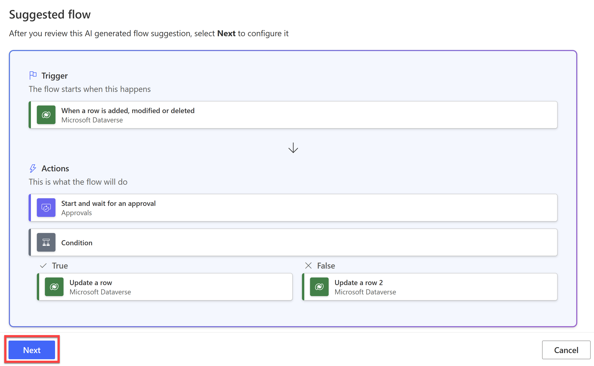
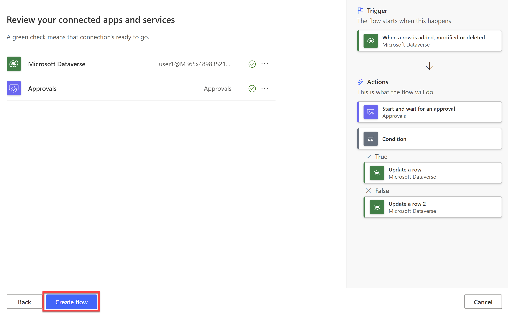
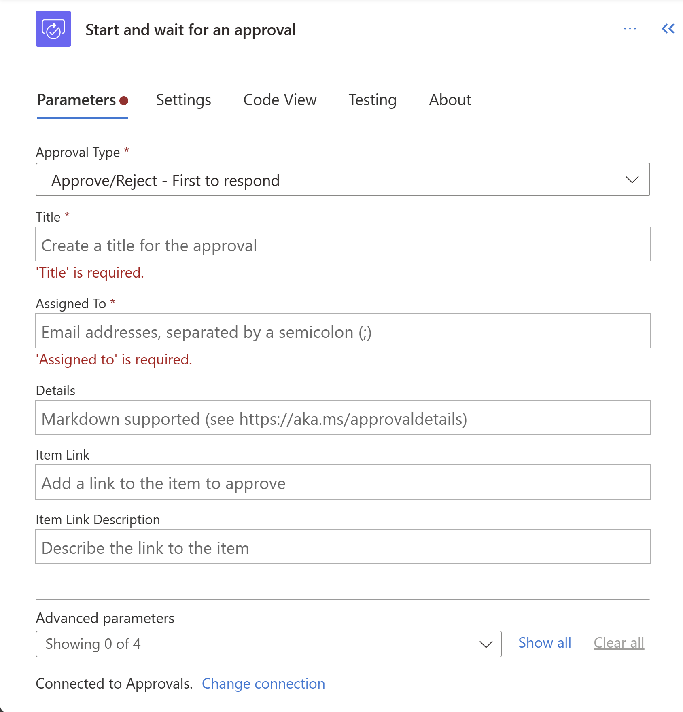
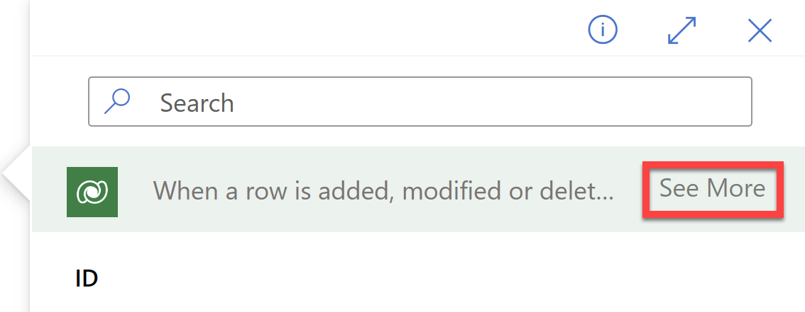
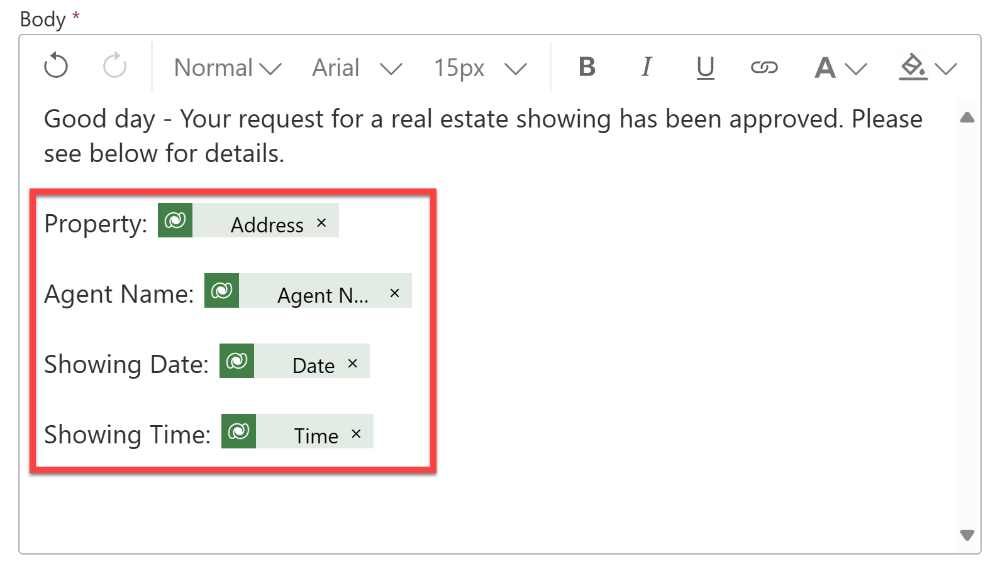
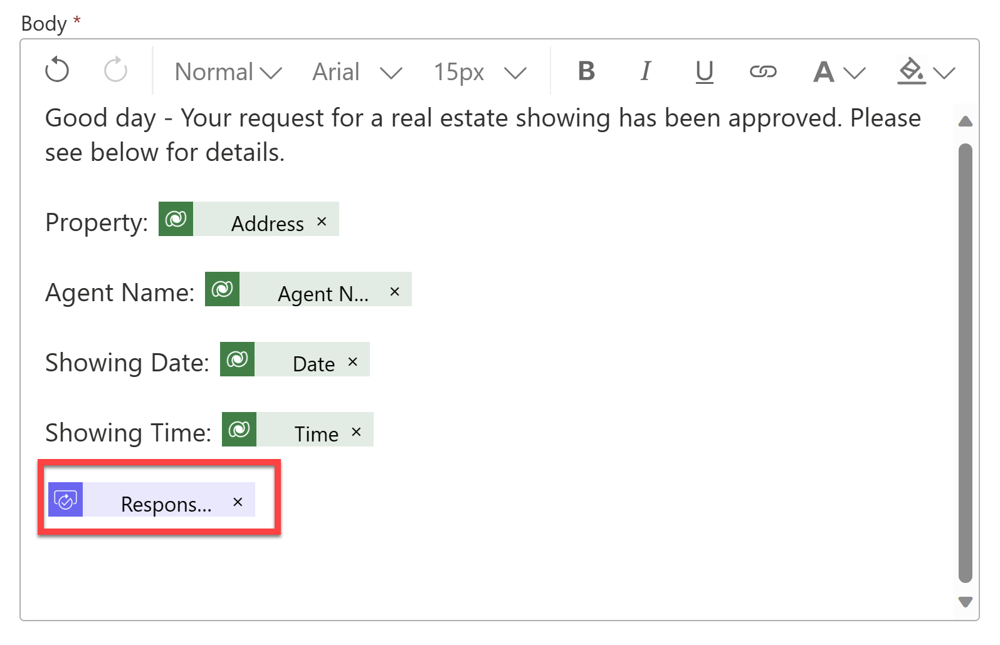
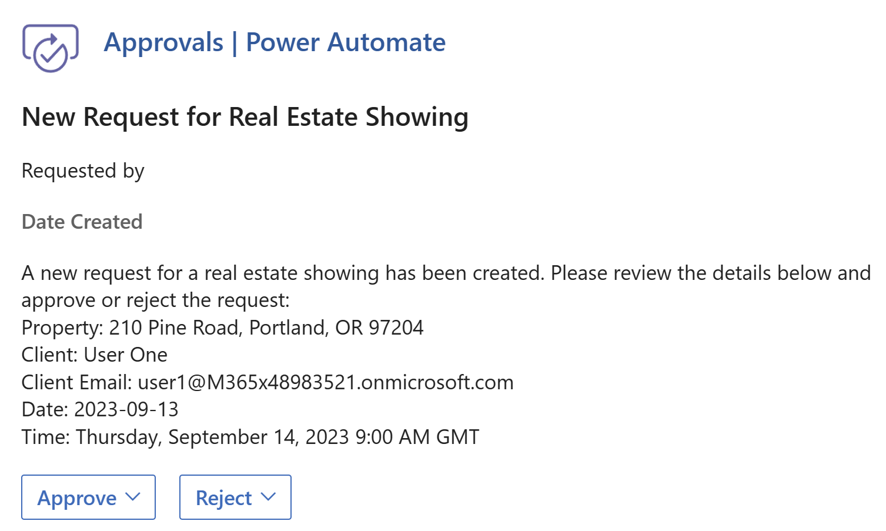
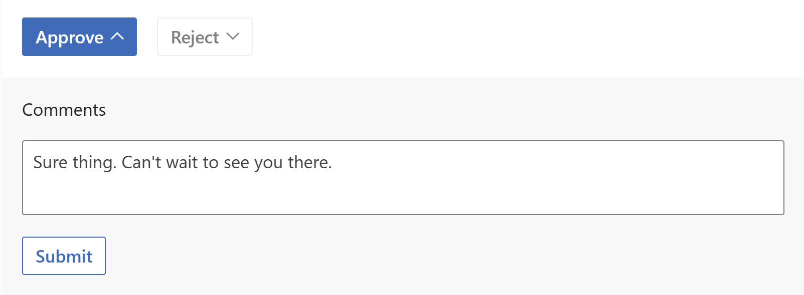

In this exercise, you'll create an automation by using Copilot in Power Automate to automate the approval process for a real estate showing. You'll use Copilot to create a flow that sends an email to the real estate agent when a new showing is requested. Then, the agent can approve or reject the showing request from within the email.

Follow these steps to create a flow by using Copilot.

1. Sign in to [Power Automate](https://make.powerautomate.com/?azure-portal=true).

1. In the center of the **Home** page within Power Automate, in the text field on **Start building your flow with Copilot**, enter the following prompt:

   `request approval when a Dataverse record is created`

   Select the **Submit** button.

   > [!div class="mx-imgBorder"]
   > 

1. From the prompt, Copilot provides the outline for a suggested flow that you can review. To accept the flow, select **Next**.

   > [!div class="mx-imgBorder"]
   > 

1. Review the connected apps and services. If a connection hasn't been made, edit or fix it and then select **Create flow**.

   > [!div class="mx-imgBorder"]
   > 

   The Edit with Copilot designer opens with your flow along with a Copilot chat window on the right.

   > [!div class="mx-imgBorder"]
   > 

1. Set up some parameters by selecting the **When a row is added, modified or deleted** trigger.

   A panel on the left side of the screen shows the trigger details, including an empty **Table Name** parameter that's required.

   > [!div class="mx-imgBorder"]
   > 

1. From the **Table Name** dropdown menu, search for and select **Real Estate Showings**.

   > [!div class="mx-imgBorder"]
   > 

1. Select the **Start and wait for an approval** action.

   Notice that the **Approval Type** parameter is missing.

   > [!div class="mx-imgBorder"]
   > 

1. From the **Approval Type** dropdown menu, select **Approve/Reject - First to respond**.

   After you select the **Approval Type**, more parameters are now available.

   > [!div class="mx-imgBorder"]
   > 

1. In the Copilot chat window, enter the following prompt:

    **Add "New Request for Real Estate Showing" as the Title parameter for the Start and wait for an approval action**

   It takes a few seconds for Copilot to process the prompt. When processing is complete, the **Title** parameter is populated with the prompt text.

   > [!div class="mx-imgBorder"]
   > 

1. For the **Assigned To** parameter, enter the email address that you're using for this lab. This email address is the one that receives the approval request.

1. For the **Details** parameter, enter the following text:

   **A new request for a real estate showing has been created. Please review the details below and approve or reject the request:**

   **Property:**
   **Client:**
   **Client Email:**
   **Date:**
   **Time:**

   > [!div class="mx-imgBorder"]
   > 

1. Place your curser next to **Property:** in the **Details** parameter and then select the lightning icon to open the **Dynamic content** pane.

   > [!div class="mx-imgBorder"]
   > 

1. In the **Dynamic content** pane, select **See More** to expand the list of available dynamic content.

   > [!div class="mx-imgBorder"]
   > 

1. Scroll down until you find the **Address** field and then select it.

   > [!div class="mx-imgBorder"]
   > 

   The **Address** dynamic content field is now added to the **Details** parameter.

   > [!div class="mx-imgBorder"]
   > 

1. Complete the same steps for the **Client**, **Client Email** , **Date**, and **Time** fields.

   When you're done with the rest of the fields, the values should resemble the following image.

   > [!div class="mx-imgBorder"]
   > 

1. With the **Details** parameter completed, you can collapse the **Start and wait for an approval** action by selecting the double arrow icon.

   > [!div class="mx-imgBorder"]
   > 

1. Select the **Condition** action.

   > [!div class="mx-imgBorder"]
   > 

1. Select the **Choose a value** box and then select **Outcome** from the **Dynamic content** pane.

   > [!div class="mx-imgBorder"]
   > 

1. Select **is equal to** for the condition and then enter **Approve** for **Value**.

   > [!div class="mx-imgBorder"]
   > 

1. Collapse the **Condition** action and then select the **Update a row** action under the **True** branch of the condition.

1. From the **Table Name** dropdown menu, search for and select **Real Estate Showings**.

1. Select the **Row ID** field and then select the **Real Estate Showings** unique identifier field from the **Dynamic content** pane.

   > [!div class="mx-imgBorder"]
   > 

    Whenever you create a table in Microsoft Dataverse, a column is automatically created with the same name of the table. This column serves as the unique lookup ID for the record (or row) that was created.

1. Select **Show all** under **Advanced parameters**.

   > [!div class="mx-imgBorder"]
   > 

1. Select **Confirmed** from the **Status** dropdown menu.

   > [!div class="mx-imgBorder"]
   > 

   When a showing is approved, the **Status** field in the **Real Estate Showings** table is updated to **Confirmed**.

1. Collapse the **Update a row** action and then select the **Update a row** action under the **False** branch of the condition.

1. From the **Table Name** dropdown menu, search for and select **Real Estate Showings**.

1. Select the **Row ID** field and then select the **Real Estate Showings** unique identifier field from the **Dynamic content** pane.

1. Select **Show all** under **Advanced parameters**.

1. Select **Canceled** from the **Status** dropdown menu.

   When a showing is rejected, the **Status** field in the **Real Estate Showings** table is updated to **Canceled**.

1. Collapse the **Update a row** action.

1. In the Copilot chat window, enter the following prompt and then submit:

   **Under the "Update a row" action for both branches in the condition, add a new "Send an email (V2)" action**

   After a few seconds, Copilot should explain what it did, as shown in the following image.

   > [!div class="mx-imgBorder"]
   > 

   The updated flow should display.

   > [!div class="mx-imgBorder"]
   > 

1. Select the **Send an email** action under the **True** branch of the condition.

1. Select the **To** field, remove the `example@example.com` email address, and then select the **Client Email** field from the **Dynamic content** pane.

1. For the **Subject** field, enter the following text into the Copilot chat window and then press the **Enter** key on your keyboard:

   **Add "Your request for a real estate showing has been approved" as the Subject parameter for the Send an email action**

   The **Subject** field should populate with the prompt text.

   > [!div class="mx-imgBorder"]
   > 

1. For the **Body** field, enter the following text into the Copilot chat window and then press the **Enter** key on your keyboard:

   **Add "Good day - Your request for a real estate showing has been approved. Please see below for details." as the Body parameter for the Send an email action**

   The **Body** field should populate with the prompt text.

   > [!div class="mx-imgBorder"]
   > 

1. Enter the following content after the **Body** text:

   **Property:**

   **Agent Name:**

   **Showing Date:**

   **Showing Time:**

   Add the **Address**, **Agent Name**, **Date**, and **Time** fields from the **Dynamic content** pane to the appropriate lines in the **Body** text.

   > [!div class="mx-imgBorder"]
   > 

1. Add the **Response summary** field from the **Dynamic content** pane to the end of the **Body** text.

   > [!div class="mx-imgBorder"]
   > 

1. Collapse the **Send an email** action.

1. Select the **Send an email** action under the **False** branch of the condition.

1. Select the **To** field, remove the `example@example.com` email address, and then select the **Client Email** field from the **Dynamic content** pane.

1. For the **Subject** field, enter the following content into the Copilot chat window and then press the **Enter** key on your keyboard:

   **Add "Your request for a real estate showing has been rejected" as the Subject parameter for the Send an email action**

1. For the **Body** field, enter the following text into the Copilot chat window and then press the **Enter** key on your keyboard:

   **Add "Good day - Your request for a real estate showing has been rejected. Please see below for details." as the Body parameter for the Send an email action**

1. Enter the following content after the **Body** text:

   **Property:**

   **Agent Name:**

   **Showing Date:**

   **Showing Time:**

   Add the **Address**, **Agent Name**, **Date**, and **Time** fields from the **Dynamic content** pane to the appropriate lines in the **Body** text.

1. Add the **Response summary** field from the **Dynamic content** pane to the end of the **Body** text.

   > [!div class="mx-imgBorder"]
   > 

1. Collapse the **Send an email** action.

1. Rename the flow to **Request Approval for Real Estate Showing** by selecting the **request approval when a Dataverse record is created** text in the upper-left corner of the screen.

   > [!div class="mx-imgBorder"]
   > 

1. Save the flow by selecting the **Save** button in the upper-right corner of the screen.

   > [!div class="mx-imgBorder"]
   > 

1. Test the flow by selecting the **Test** button in the upper-right corner of the screen. Select **Manually** and then select **Test**.

   > [!div class="mx-imgBorder"]
   > 

1. To submit a real estate showing request, go to the Real Estate Showings app in [Power Apps](https://make.preview.powerapps.com/?azure-portal=true).

1. Run the app and then select **+New** to create a new showing request.

1. Fill in the fields with the following information:

   - **Agent Name** - `< random name >`
   - **Client Full Name** - `< Your name >`
   - **Client Email** - `< Your email >` (the email that you're using for this lab)
   - **Date** - `< Any future date >`
   - **Time** - `< Any future time >`
   - **Status** - Pending
   - **Address** - 210 Pine Road, Portland, OR 97204

   > [!NOTE]
   > This address is one of the addresses from the Microsoft Excel file in Module 1; it's the same file that you uploaded and turned into the **Real Estate Properties** table.
   >
   > Usually, you would have a lookup field to the **Real Estate Properties** table, but not for this lab to keep it simple.

1. Select the check mark in the upper-right corner of the screen.

1. Select the **X** in the upper-right corner to close out of the app.

   The flow runs and sends an approval email to the email address that you provided in the flow that you built.

1. Sign in to the email account that you're using for this lab and then wait for the email to arrive.

   > [!NOTE]
   > If the flow doesn't run immediately, make sure that you wait for it. It might take up to 10 minutes for the flow to be triggered, especially on the first try.

   The approval should resemble the following image.

   > [!div class="mx-imgBorder"]
   > 

1. Select **Approve**.

1. Add a comment and then select **Submit**.

   > [!div class="mx-imgBorder"]
   > 

   The flow continues to run; it updates the row and sends an email to the requestor. The email that's sent to the requester resembles the following image.

   > [!div class="mx-imgBorder"]
   > 

1. Check the flow and notice that the flow is now marked as **Succeeded** in the run history.

   > [!div class="mx-imgBorder"]
   > 
