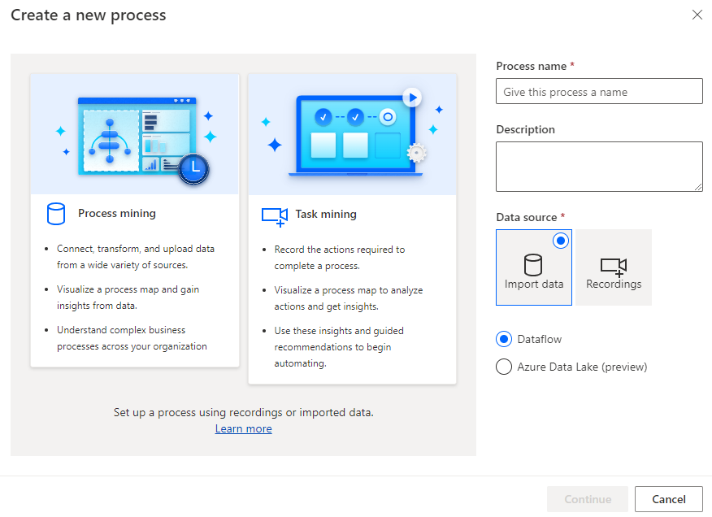
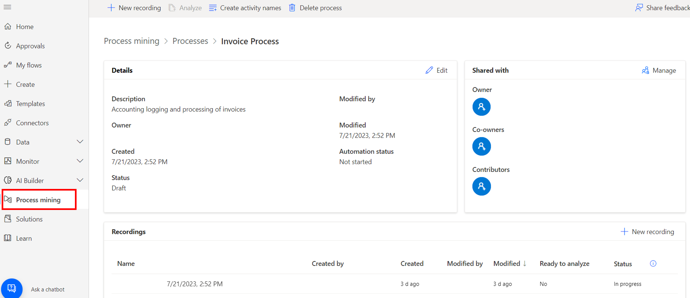

Process mining is built on the features and capabilities of Microsoft Power Platform to help generate insights. Microsoft Power Automate for desktop allows you to record actions that you perform on your computer. Microsoft Dataverse stores the information from your processes. As a result, you need access to these technologies, from a licensing and security perspective, to take advantage of process advisor. If process advisor isn't listed when you go to Power Automate, talk to your administrator about your permissions.

You can access process advisor through [Power Automate](https://flow.microsoft.com/?azure-portal=true) by selecting **Process mining** on the left navigation pane and then **Start here**.

On the **process mining** screen, you can create a new process or add recordings to an existing process.

> [!div class="mx-imgBorder"]
> 

Additionally, you can select a link to download Power Automate for desktop flow and view short instructional videos that describe various tasks in process advisor. Recordings are conducted through Power Automate for desktop flow, so make sure that you download this program.

> [!div class="mx-imgBorder"]
> 

Select **All processes** to view the details of existing processes that you own or co-own. If you don't have any processes, you can begin a new one.

Selecting a process lets you see the details that are involved, such as:

- The various recordings
- Who created them
- At what time
- Their status

> [!div class="mx-imgBorder"]
> 

The possible statuses for recordings are as follows:

- **In progress** - Recording is in progress, but it's also possible that the recording didn't start yet. Because recording happens in the desktop client, the web portal doesn't know about its status until it's saved. You can also view this status after the recording is saved because some processing is required after recording to make it ready to view.

- **Failed** - An error occurred during recording processing. Create a new recording.

- **Not analyzed** - The recording is processed and is available to view and edit, but it isn't marked as ready to analyze.

- **Ready to analyze** - The recording is marked as ready to analyze and will be considered the next time you analyze the process.

- **Analyzed** - The recording is analyzed and is part of the analyzed output that can be viewed through the **Analytics** screen.

Besides the recording information, you can view and manage the users who have access to your process.

> [!NOTE]
> Contributors have access to add recordings and manage recordings that they created, while co-owners have access to create recordings and manage the recordings of others, including their own.

Analytics and recommendations will be discussed later in the module; however, the next task is to learn how to add a recording.
