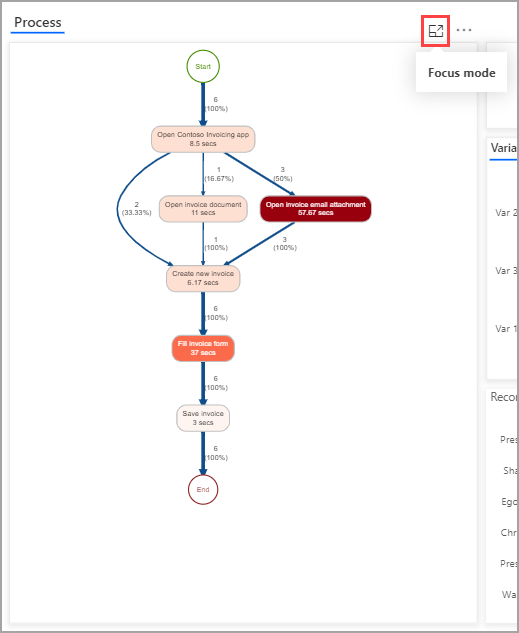
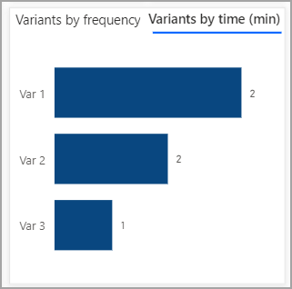
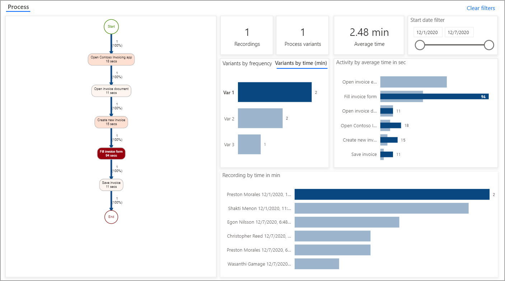

After you have a couple of recordings and have grouped the actions in those recordings into activities, you will be ready to analyze your process. While you can analyze a process with as few as two recordings, the more recordings that you have, the more valuable the analysis. When your recordings are prepared, go to your process and select **Analyze**.

> [!div class="mx-imgBorder"]
> 

In the following pop-up window, select **Confirm**. When your analysis is complete, the included recordings should switch status to **Analyzed**. Then, you can press **Analytics** to view the results.

> [!div class="mx-imgBorder"]
> 

The analytics screen will look similar to the following screenshot.

> [!div class="mx-imgBorder"]
> 

The preceding image shows many metrics that you need to consider. The first visual is the process map. You can enlarge the process map by selecting the **Focus mode** icon in the upper-right corner.

> [!div class="mx-imgBorder"]
> 

The process map breaks down each activity in order. It also shows the average amount of time for each activity and variations in the process. The process map shows that six recordings are being analyzed. In two recordings, the user opened the invoicing app and created a new invoice immediately. In one recording, the user opened an invoice document first. In three recordings, or 50 percent of the time, the user opened an invoice email attachment, which had the longest average time of any activity. The process map has thicker lines for the most traversed path in the process, and each activity is color-coded for the average length of time, with longer activities showing as a darker shade of red and shorter activities are a lighter shade of red. This feature allows you to understand the process at a glance. Every distinct path (same steps in the same sequence) in a process is referred to as a variant. While no other variants existed, the other activity (which took a while) was filling out the invoice form. Activities that take longer might be good opportunities for automation.

The other visuals will help to further break down the information in the process map. For example, the following screenshot shows the number of recordings, number of process variants, and average time to complete the process. Also shown is the **Start date filter**, which can be especially useful if something in your process changed on a specific date.

> [!div class="mx-imgBorder"]
> 

The next row of the visual shows the variants in terms of frequency and time. By comparing the two, notice that Variant 1 had the lowest frequency but the greatest time to complete.

> [!div class="mx-imgBorder"]
> 

> [!div class="mx-imgBorder"]
> 

You can select Variant 1 to filter all information on the analytics page to better understand this path.

> [!div class="mx-imgBorder"]
> 

In this recording, filling out the invoice form took longer than in the other recordings. In fact, the whole process took more than two minutes, the longest of all runs. The reason is likely because the user was typing information instead of copying and pasting, or the process could be an outlier. Regardless of the reason, you are gaining insights into the process.

In addition to information on your process, you can find analytics on the various applications that are being used in your process on the **Application** tab. For example, you can view which application was opened most often or used for the longest time. This application could be one for which automation would be the most valuable. 

> [!div class="mx-imgBorder"]
> 

Now you know how to determine where bottlenecks might exist in your process and where you can most easily automate.
