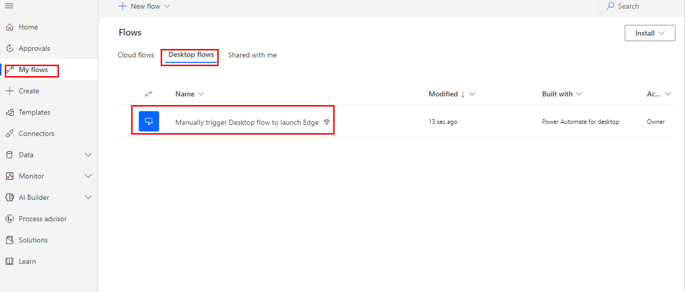
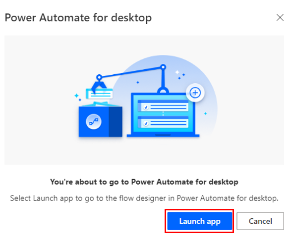
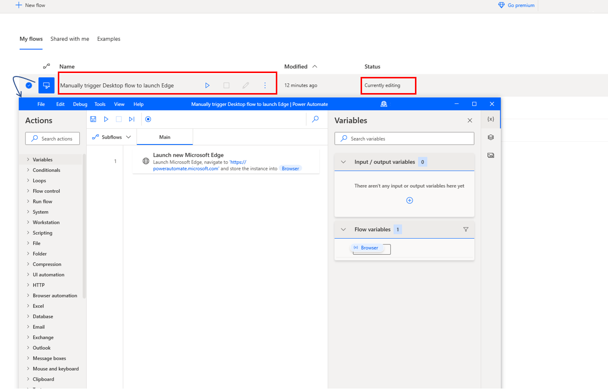

To access the new desktop flow that you've created, go to the [Power Automate maker portal](https://make.powerautomate.com) and then select **Flows > My flows**.

> [!div class="mx-imgBorder"]
> 

When you edit this flow, it will ask if you'd like to launch the app. Select the **Launch app** button.

> [!div class="mx-imgBorder"]
> 

Power Automate for desktop will open, showing a list of your flows, and another window will launch, which will open the desktop flow that you selected.

> [!div class="mx-imgBorder"]
> 
