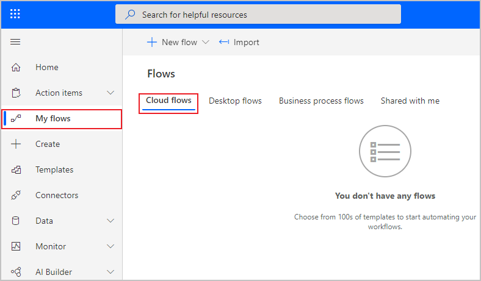
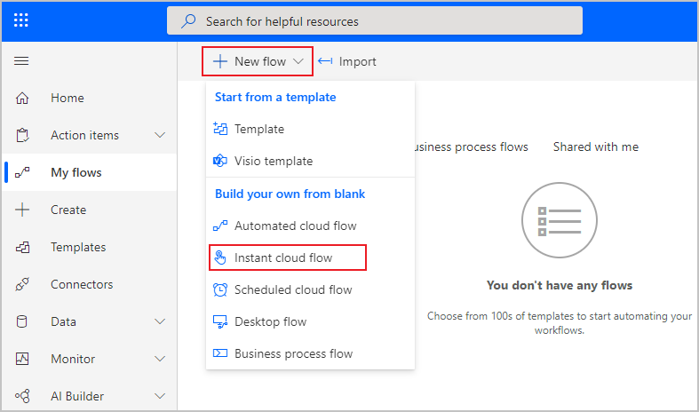
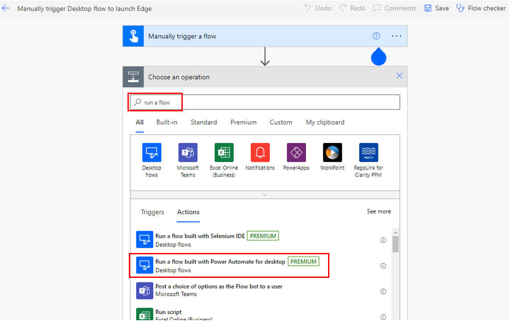
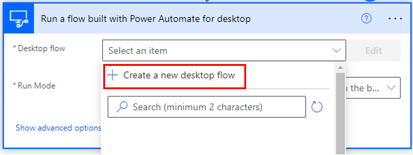
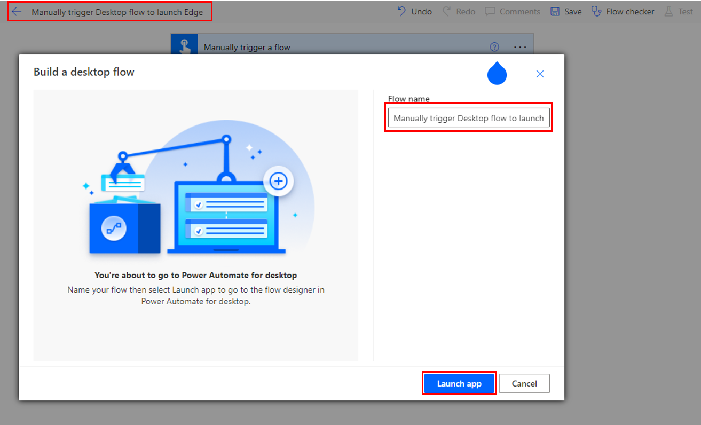
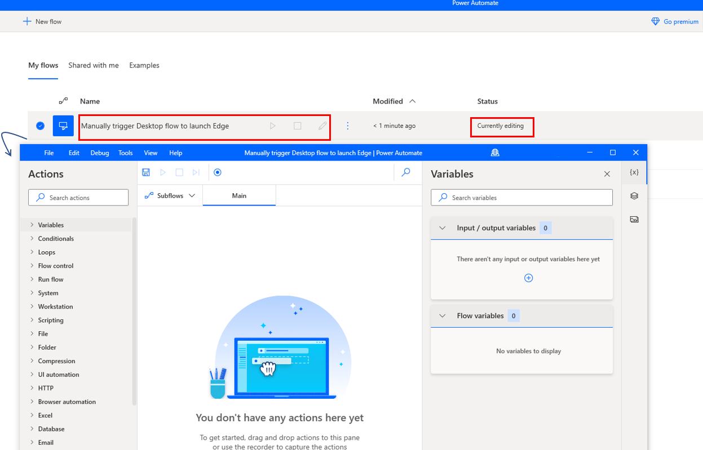
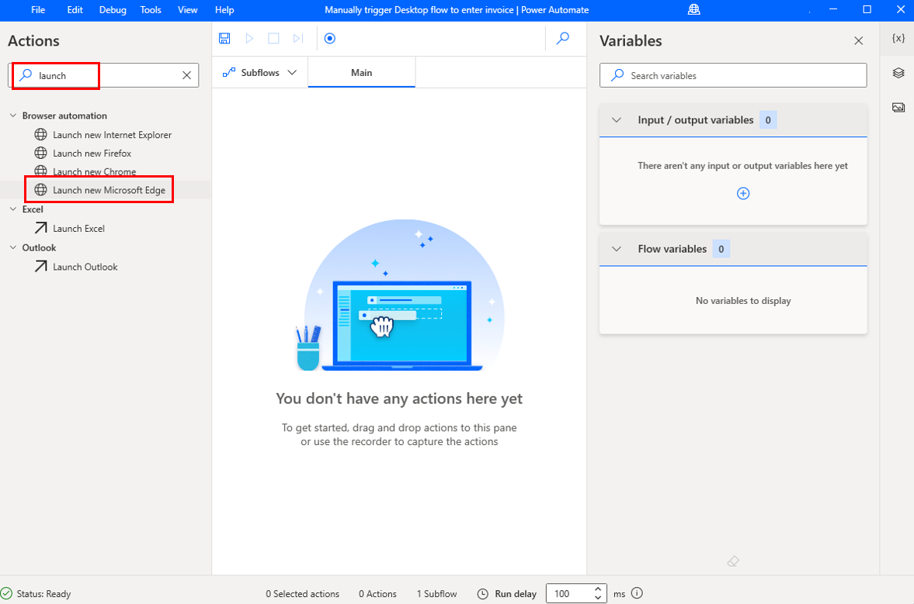
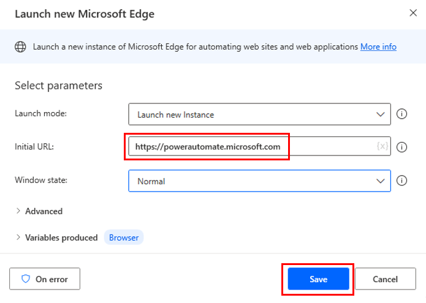
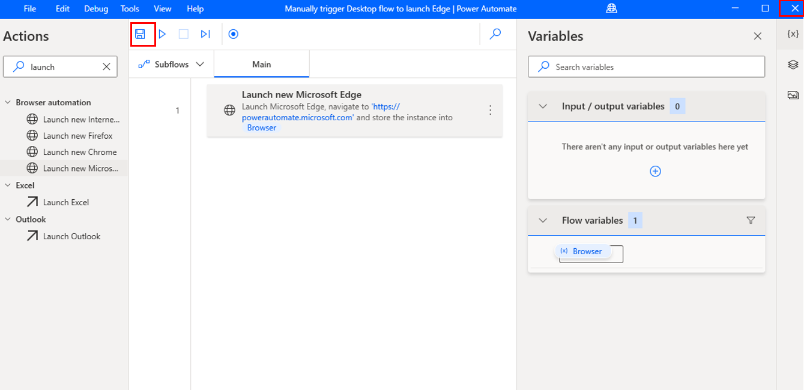

Now that you've established a gateway connection and have built a desktop flow, it's time to build a cloud flow with which to connect. Cloud flows are stored and run on the cloud, as opposed to desktop flows, which are stored and run on a desktop. Cloud flows have the advantage of hundreds of predefined connections with thousands of triggers and actions at your disposal. However, desktop flows can work in desktop programs without a predefined connection or existing actions. Both flows have their benefits. By combining these two types of flows, you'll gain the benefits of both.

Watch the following demo video of the steps that you'll complete in this exercise.

 > [!VIDEO https://www.microsoft.com/en-us/videoplayer/embed/RE5cFQQ]

To begin creating your cloud flow, open [Power Automate](https://flow.microsoft.com/?azure-portal=true) and select **My flows > Cloud flows**.

> [!div class="mx-imgBorder"]
> 

Next, select **New flow > Instant cloud flow**.

> [!div class="mx-imgBorder"]
> 

Name your flow. The following screenshot shows the name as **Manually trigger Desktop flow to launch Edge**. Select the **Manually trigger a flow** option and then select **Create**.

> [!div class="mx-imgBorder"]
> 

When the screen changes to the flow builder, select **New step** and then search for and select **Run a flow built with Power Automate for desktop**.

> [!div class="mx-imgBorder"]
> 

In the **Desktop flow** dropdown menu, select **+ Create a new desktop flow**.

> [!div class="mx-imgBorder"]
> 

In the **Build a desktop flow** window, add the same flow name and then select **Launch app**.

> [!div class="mx-imgBorder"]
> 

This action will automatically add the new flow in Power Automate for desktop and will open another window with the flow that's currently editing.

Under **Actions**, search for **launch** and then select **Launch new Microsoft Edge**.

In **Initial URL**, add **https://powerautomate.microsoft.com** and then select **Save**.

Select the **Save** button and then close the window.

> [!div class="mx-imgBorder"]
> 
