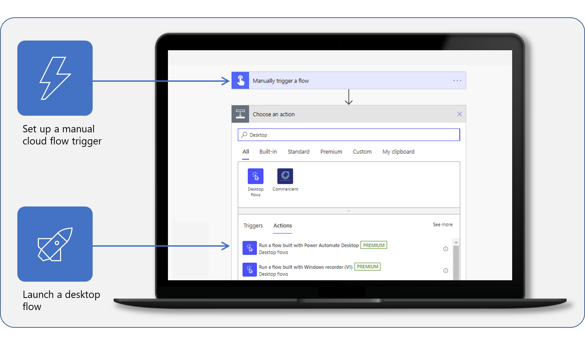

Taking full advantage of robotic process automation (RPA) and Microsoft Power Automate might require you to connect a desktop flow with other technology or cloud services. By setting up a gateway to your desktop, you'll be able to connect your desktop to these various technologies and systems. For example, with Power Automate for desktop and a gateway, you can use information from services, such as Microsoft Teams or Microsoft Outlook, in an automated document approval desktop flow.

**Create a manual trigger in a cloud flow to run a desktop flow.**

In this module, you'll:

- Install the Power Automate for desktop application.

- Create a desktop flow.

- Test the new flow.
