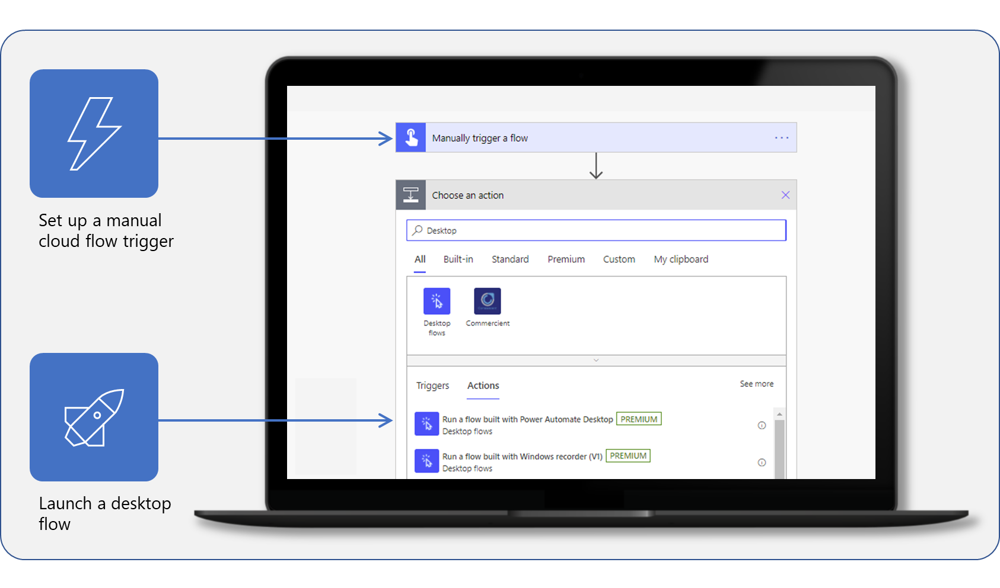

Microsoft Power Automate enables you to automate daily business process actions that use desktop applications that aren't hosted on the cloud. However, it’s likely that you have everyday tasks that require use of desktop applications and cloud services. Setting up a gateway to your desktop will help you to connect your desktop to these various technologies and cloud solutions. Gateways also enable you to combine desktop flows with cloud flows, allowing you to automate complex business processes. For example, with Power Automate for desktop and a gateway, you can use information from services such as Microsoft Teams or Microsoft Outlook in an automated document approval solution. 

**Create a manual trigger in a cloud flow to run a desktop flow.**

In this module, you learned how to:

- Install the Power Automate for desktop application and create a cloud flow.

- Set up an on-premises data gateway to enable the cloud flow to trigger a desktop flow to run on your device.

- Add the desktop flow to the new cloud flow.

- Test the new cloud flow.  

## Key takeaways

Three key takeaways from this module are:

- Desktop flows run on a desktop and can access legacy applications.

- Cloud flows run in the cloud and can access online services and information.

- By defining a gateway, you can combine cloud and desktop flows to automate any process completely.
