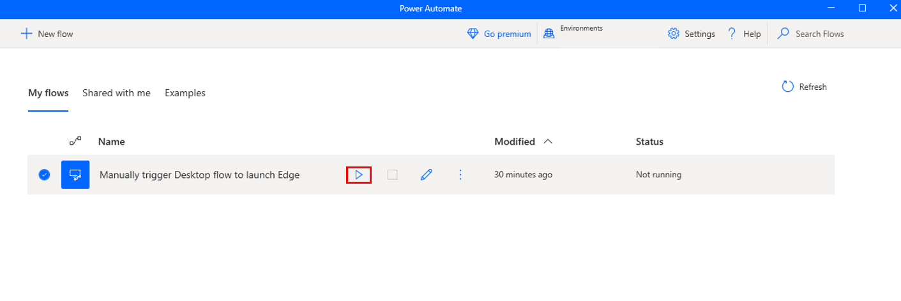
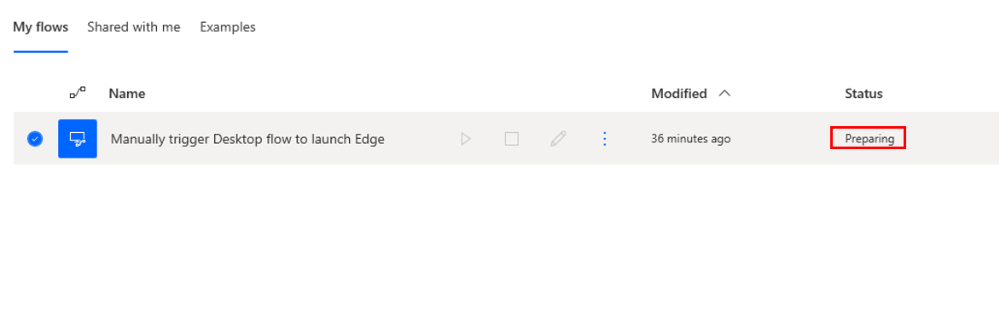
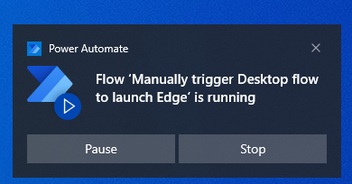
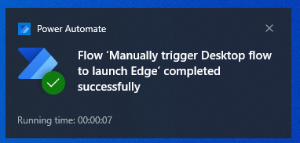
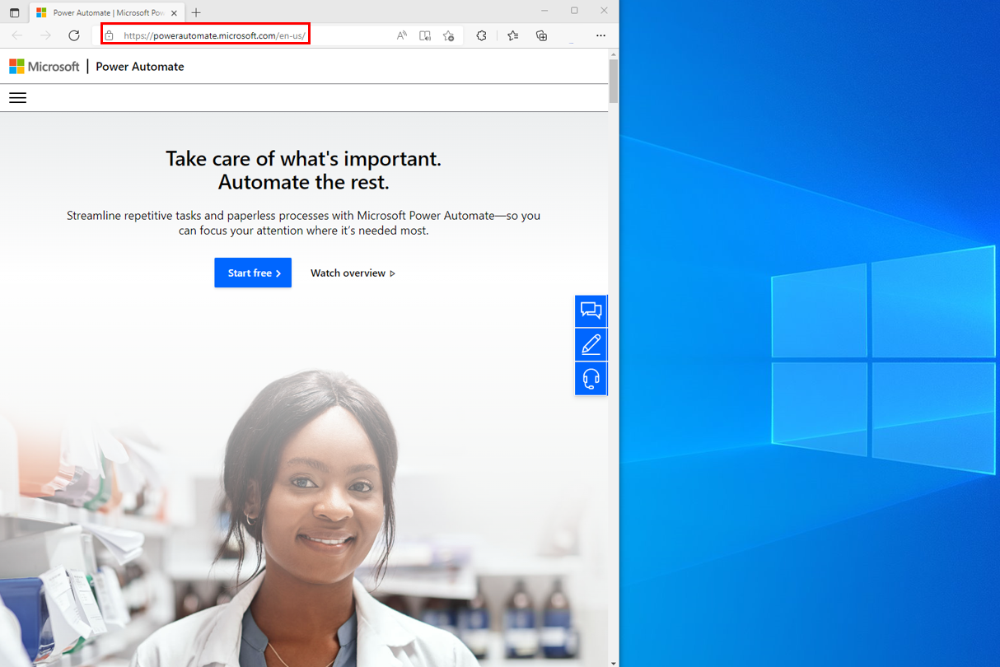

With the Power Automate desktop app running, select the **Manually trigger Desktop flow to launch Edge** option and then select the **play** button.

> [!div class="mx-imgBorder"]
> 

After a moment, the status will change to **Preparing** and then **Running**.

> [!div class="mx-imgBorder"]
> 

You'll receive notifications on your desktop, the first notification stating that the flow is running.

> [!div class="mx-imgBorder"]
> 

The second notification states that the flow has completed successfully.

> [!div class="mx-imgBorder"]
> 

The **Microsoft Edge** browser will launch with the Power Automate URL loaded.

> [!div class="mx-imgBorder"]
> 

Watch the following demo video of the steps that you completed in this unit.

 > [!VIDEO https://www.microsoft.com/en-us/videoplayer/embed/RE5cFQR]

Now, you've completed the process of building a desktop flow.
