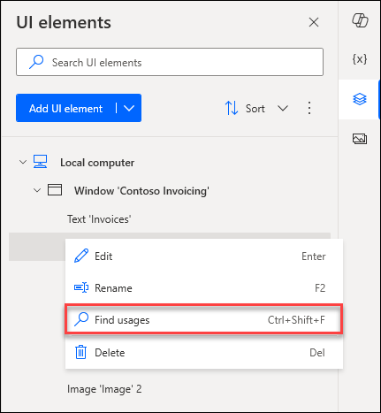
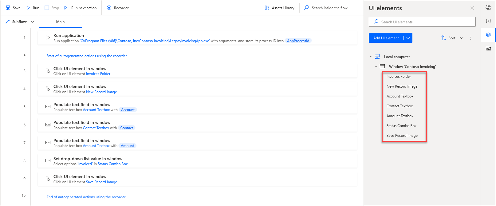

> [!NOTE]
> If you haven't done so already, make sure that you complete Lab 1 and then download  the [Automation in a Day files](https://pahandsonlab.blob.core.windows.net/documents/AutomationIAD-Learn-student-files.zip) for use in this module. Extract the contents of this download to your local computer.

> [!NOTE]
> You'll need to select **More Information** and **Run it anyway** during installation of the Contoso app if Windows Defender prompts that the app is coming from an untrusted source.

Now that you're more familiar with the Power Automate for desktop app, you can create a desktop flow that helps Contoso Coffee shop employees enter invoice information into the desktop management system. In the previous task, you learned how to create a desktop flow from within the Power Automate for desktop app. Now, you learn about another path for creating and managing desktop flows from the browser side.

1. Open a new web browser and then go to [https://powerautomate.microsoft.com](https://powerautomate.microsoft.com/?azure-portal=true). Sign in with your test account, the same one that you used in the previous labs.

   > [!NOTE]
   > For this workshop, don't use the **Flows** tab from powerapps.com.

1. If you're signing in to this site for the first time, you need to choose your country/region, and then select the **Get started** button.

   > [!div class="mx-imgBorder"]
   > 

   > [!NOTE]
   > Make sure that you've selected the correct environment (with database) to use for the labs. You can switch between different environments by selecting the **Environments** button in the title bar.

   > [!div class="mx-imgBorder"]
   > 

1. Select **Solutions** from the left menu and then select the **+ New solution** option in the upper part of the screen.

   > [!div class="mx-imgBorder"]
   > 

1. Name the new solution as `Invoice processing solution <MyUserName>`. Select **CDS Default Publisher** from the **Publisher** dropdown menu and then select **Create**.

   > [!div class="mx-imgBorder"]
   > 

   > [!NOTE]
   > When selecting the Publisher, the correct option always begins with **"CDS Default Publisher"**, but the numbers and letters within the parenthesis directly after may vary.

   > [!NOTE]
   > For the purposes of this lab, using **CDS Default Publisher** is acceptable. For production scenarios, we recommend that you create your own custom publisher. For more information, see [Solution publisher](/power-platform/alm/solution-concepts-alm?azure-portal=true#solution-publisher).

1. Wait for the solution to be created. You should automatically be taken to the solution that you created when it finishes.

1. At the top of the screen, select the **+ New** dropdown menu.

1. From the **+ New** dropdown menu, select **Automation > Desktop flow**.

   > [!div class="mx-imgBorder"]
   > 

1. In the **Build a desktop flow** dialog, in the **Flow name** box, name the new flow as `Enter an invoice`. Then, select the **Launch app** button in the lower right of the dialog.

   > [!div class="mx-imgBorder"]
   > 

1. If you're presented with a dialog that wants to open Power Automate, select the **Always allow** checkbox and then select **Open Power Automate** to open the Power Automate for desktop app.

   > [!div class="mx-imgBorder"]
   > 

1. When you're in the Power Automate for desktop app designer, in the **search bar** in the **Actions** pane, enter `run application` and then double-click the **Run application** action.

   > [!div class="mx-imgBorder"]
   > 

1. Within the **Run application** dialog, for the application path parameter, go to and select the location path of the **Contoso Invoicing app** under **Application path**. (This action opens the Contoso Invoicing app when you're running your flow). Usually, you can find this parameter under `C:\Program Files (x86)\Contoso, Inc\Contoso Invoicing\LegacyInvoicingApp.exe`; however, the path might be different on your computer.

1. Select the **Save** button in the lower-right corner of the dialog.

   > [!div class="mx-imgBorder"]
   > 

1. Now you have one action in your flow that opens the Contoso Invoicing app. You can select the **Run** button to quickly test your flow.

   > [!div class="mx-imgBorder"]
   > 

1. Minimize the Contoso Invoicing app manually and then select **Recorder**.

   > [!div class="mx-imgBorder"]
   > 

   > [!TIP]
   > Now, you can start recording. We recommend that you get familiar with the following steps until the recording is done. As a result, you can finish the recording in one instance without manually going back and forth. If your first few recordings aren't acceptable, you can delete the recording afterward by selecting the ellipsis (**...**) menu and then practice more until you have an acceptable recording.

   > [!TIP]
   > To help with the resilience of UI automation playbacks, we recommend that you minimize other apps from your desktop.

1. Reopen the Contoso Invoicing app and then select the **Record** button from the **Recorder** dialog.

   > [!div class="mx-imgBorder"]
   > 

1. In the Contoso Invoicing application, select **Invoices** from the left menu.

   > [!TIP]
   > As your mouse cursor hovers over controls in the app, a red outline will highlight each control. Don't record at fast speed and always wait between each mouse move. Wait until a blue highlight rectangle appears around the control first before you select the control. If the red highlight doesn't appear before you select, the action might not record properly.

   > [!div class="mx-imgBorder"]
   > 

1. Create a new record by selecting the **New record** icon from the ribbon in the upper left of the screen.

   > [!div class="mx-imgBorder"]
   > 

1. Use these sample values to complete the recording (you can also use any arbitrary values):

   - **Date** - Current date

   - **Account** - `WingTip Cups`

   - **Contact** - `b.friday@wingtipcups.com`

   - **Amount** - `$500`

   - **Status** - Invoiced

   > [!div class="mx-imgBorder"]
   > 

1. Select the **Save** icon from the ribbon in the upper left of the screen to keep your changes.

   > [!div class="mx-imgBorder"]
   > 

1. Select the **Done** button at the bottom of the **Recorder** and then close the Contoso Invoicing app.

   > [!NOTE]
   > The action of closing the app hasn't been recorded for simplicity purposes. The reason is so that you can view the result because the Contoso Invoicing app remains open after you test the desktop flow. In a real-world use case, you can decide whether to record the closing action or not.

   > [!NOTE]
   > By default, the desktop flow launches a new instance of the app whenever it runs. Even if you leave the app open, the next desktop flow run launches another new app window. You can also change this behavior to only attach to an existing app instead of launching another new instance from the portal (more details are provided in the following steps).

1. Within the Power Automate for desktop app, you can view the recorded script of each step.

   > [!div class="mx-imgBorder"]
   > 

   You can edit each step by selecting the ellipsis (**...**) icon to the right of the title and then by selecting **Edit** from the options list. You can also double-click each step to view the options list.

   > [!div class="mx-imgBorder"]
   > 

   > [!TIP]
   > You can also select the ellipsis (**...**) and then select the **Delete** option from the list to remove duplicate steps or the entire script.

   > [!div class="mx-imgBorder"]
   > 

1. You can select the **Run** icon at the top of the screen to play back and test your flow.

   > [!NOTE]
   > Don't interact with your device during testing. The recording will play back successfully.

   > [!div class="mx-imgBorder"]
   > 

1. Any captured UI elements are added to the UI elements pane. To access the UI elements pane, select the **UI elements** tab on the right-hand side of the flow designer.

   > [!div class ="mx-imgBorder"]
   > 

1. To find where a specific UI element is being used in the flow, **right-click** on it and select **Find usages**. The results display all the actions that use this UI element

   > [!div class ="mx-imgBorder"]
   > 

1. All UI elements consist of one or more selectors that pinpoint the UI or web component that Power Automate interacts with.

   To manage the selectors of a UI element, **right-click** on it and select **Edit**. This option brings up the **selector builder**, where you can edit the selectors with a visual or a text editor.

   Each selector consists of multiple elements representing the hierarchical structure of the UI element in the application or webpage. The attributes describe each element uniquely and distinguish it from other elements.

   > [!div class="mx-imgBorder"]
   > 

1. You can rename UI elements to better match the purpose and define each uniquely by **right-clicking** on the element, where you can select **rename**.

   > [!div class="mx-imgBorder"]
   > 

1. **Rename** each element using this list to match the provided image:

   -Text 'Invoices' -> `Invoices Folder`
   -Image 'Image' -> `New Record Image`
   -Edit 'TextBox' -> `Account Textbox`
   -Edit 'TextBox' 2 -> `Contact Textbox`
   -Edit 'TextBox' 3 -> `Amount Textbox`
   -Combo Box 'ComboBox' -> `Status Combo Box`
   -Image 'Image' 2 -> `Save Record Image`

   > [!div class="mx-imgBorder"]
   > 

1. Select the **Save** icon in the upper part of the screen to save the desktop flow.

   > [!div class="mx-imgBorder"]
   > 

1. Close the Power Automate application.

> [!TIP]
> If you want to reset the data that's saved in the Contoso Invoicing app, you can modify or delete the Microsoft Excel file under this folder: `%userprofile%\Documents\Contoso Invoicing - 1.0.15.0`
