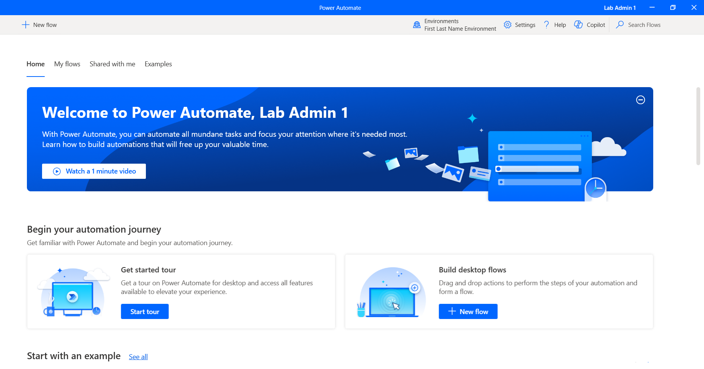

> [!NOTE]
> Make sure that you complete **Lab 1: Prerequisite - Install required software to the latest version of Power Automate for desktop**.

> [!NOTE]
> To complete the exercises, you need to use a few files. Download the [RPA in a Day files](https://pahandsonlab.blob.core.windows.net/documents/AutomationIAD-Learn-student-files.zip) for use in this module. Extract the contents of this download to your local computer.

To get more familiar with the Power Automate for desktop app, follow these steps.

1. Launch the Power Automate for desktop app from your computer and then sign in to your account.

   > [!div class="mx-imgBorder"]
   > 

1. Select the **Environments** dropdown menu in the upper part of the page to change your environment to the appropriate one.

   > [!div class="mx-imgBorder"]
   > 

1. Select the **+ New flow** button in the upper-left corner of the page to create a new Power Automate desktop flow.

   > [!div class="mx-imgBorder"]
   > 

1. Within the **Build a flow** dialog, in the **Flow name** field, name the new flow `testing`. Then, in the lower-right corner of the dialog, select **Create**.

   > [!div class="mx-imgBorder"]
   > 

1. A tour dialog appears if it's your first time signing in. You can choose to continue the tour or to skip it.

   > [!div class="mx-imgBorder"]
   > 

    Next, you're directed to the Power Automate for desktop designer, which consists of the following toolbars and panes:

   - **A: Toolbar** - Contains basic operations for use with actions (**Save**, **Undo**, **Copy**, **Debug**, and **Paste**) and the **Recorder** option to start the recording and to control the process implementation (**Start**/**Pause**/**Stop**).

   - **B: Subflows** - Allows you to create subflows under your main flow.

   - **C: Actions pane** - Contains all Power Automate for desktop actions and includes a search bar that helps you find specific actions by matching the action name to the text string.

   - **D: Workspace** - Contains all actions added to the process so far. Functions are separated into tabs.

   - **E: Copilot in Power Automate for Desktop** - Contains Copilot prompt and response area for Power Automate for Desktop.

   > [!div class="mx-imgBorder"]
   > 

1. From the tool bar in the upper part of the screen, select **Save**.

   > [!div class="mx-imgBorder"]
   > 

1. **Close** out of the testing flow that you created.

1. Select the ellipsis (**...**) menu to the right of the flow and then select **Delete** to delete the testing desktop flow.

   > [!div class="mx-imgBorder"]
   > 

1. Select **Yes** to confirm the deletion.

1. **Close** out of the Power Automate application.
