In this exercise, you use the web automation to convert the total amount into another currency and then add the new conversion to the Excel document.

1. Open a new web browser and then open Microsoft Edge by going to `edge://settings/system`, which brings you to the **System and performance** page. Under the **System and performance** section, turn off the **Continue running background extensions and apps when Microsoft Edge is closed** toggle. Then, close all browser tabs and sessions before you proceed.

   > [!div class="mx-imgBorder"]
   > [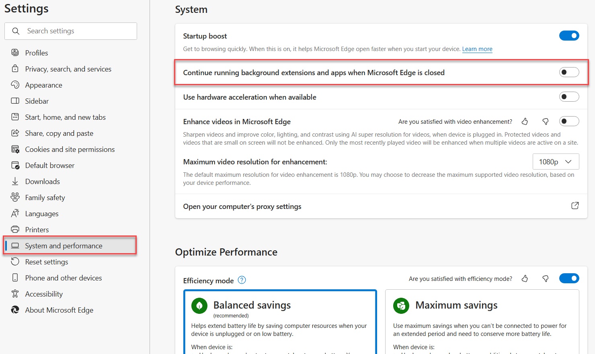](../media/background.png#lightbox)

1. Open the Power Automate for desktop app and then go to the **Enter an invoice** flow that you previously created. Select the ellipsis (**...**) menu to the right of the flow title and then select **Edit** from the options menu. (You can also select the **pencil icon** to go directly to the editing view for your flow.)

   > [!div class="mx-imgBorder"]
   > [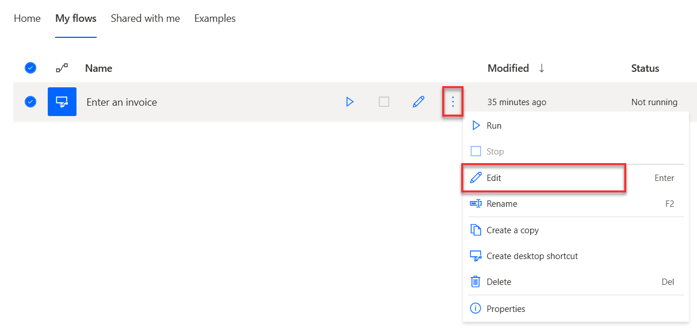](../media/edit-flow.png#lightbox)

1. From the tabs in the upper part of the screen, select the **Subflows** dropdown menu. Select **New subflow** to create a second subflow for the **Enter an invoice** flow.

   > [!div class="mx-imgBorder"]
   > [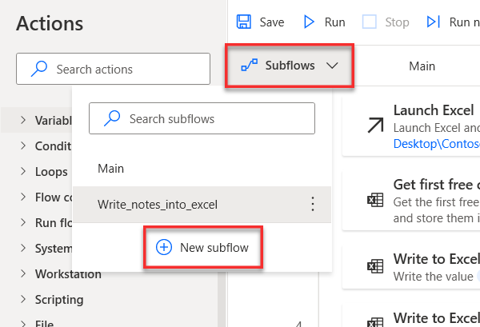](../media/create.png#lightbox)

1. In the **Edit subflow** dialog, in the **Subflow name** field, name your new subflow as **Currency_Converter** and then select **Save**.

   > [!NOTE]
   > Subflow names can't have spaces. If a space occurs within the name, make sure that you replace the space with an underscore ( **_** ).

   > [!div class="mx-imgBorder"]
   > [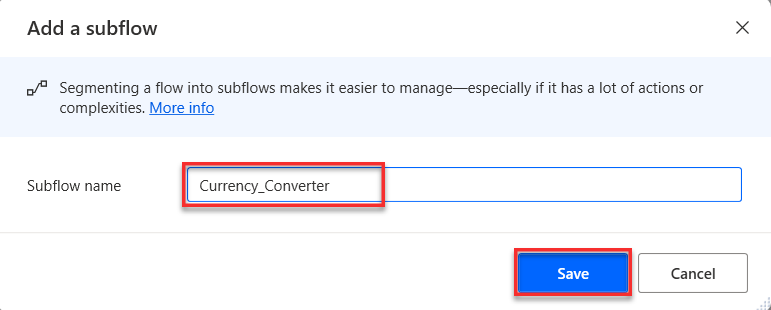](../media/edit-sub.png#lightbox)

1. From the **Actions** menu to the left of the screen, under the **Browser automation** folder, double-click the **Launch new Microsoft Edge** action.

   > [!div class="mx-imgBorder"]
   > [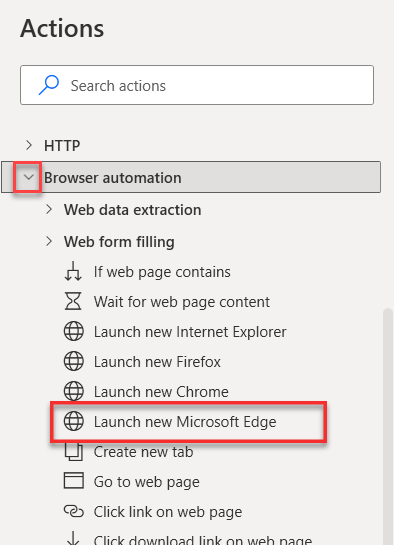](../media/launch.png#lightbox)

1. In the **Launch new Microsoft Edge** dialog, in the **Initial URL** field, enter the following URL: `https://wise.com/us/currency-converter/`

1. Select **Save**.

   > [!div class="mx-imgBorder"]
   > [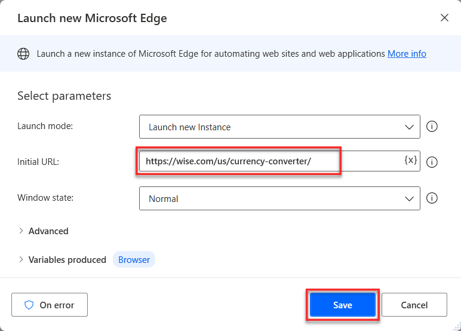](../media/initial.png#lightbox)

1. Open a new Microsoft Edge web browser and then go to [https://wise.com/us/currency-converter/](https://wise.com/us/currency-converter/?azure-portal=true).

   This website is the one that you use to look up real-time currency conversion rates.

   > [!div class="mx-imgBorder"]
   > [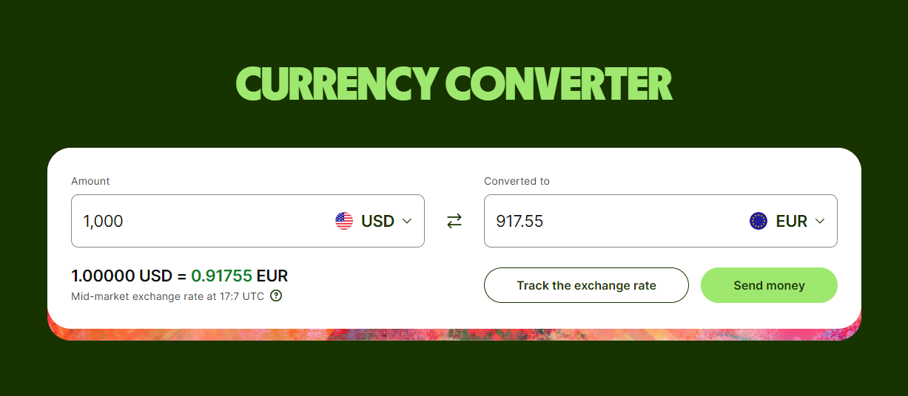](../media/converter.png#lightbox)

   Next, we enter the total amount value from the AI Builder model as the US dollar (USD) amount into the website input textbox to look up the converted value.

1. First, let's locate the **UI Element** on the webpage. Return to the **Enter an invoice** flow in Power Automate. Ensure that you're viewing the **Currency_Converter** subflow. From the **Actions** pane to the left of the screen, under the **Browser automation** section, expand the **Web form filling** subfolder.

1. From the **Web form filling** subfolder, drag and drop the **Populate text field on web page** action to below the first action in the design space pane.

   > [!div class="mx-imgBorder"]
   > [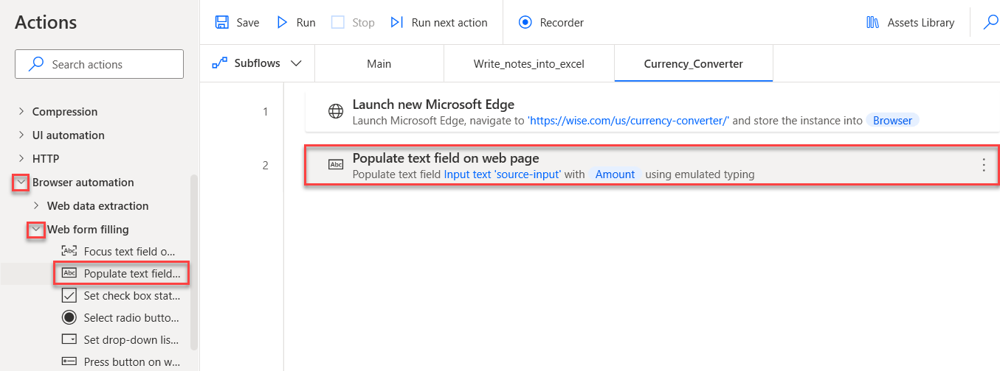](../media/populate-text.png#lightbox)

1. The **Web browser instance** is already populated with the **%Browser%** instance.

   > [!div class="mx-imgBorder"]
   > [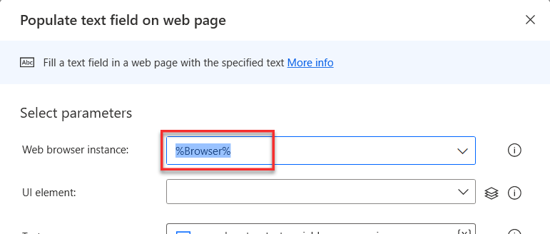](../media/browser.png#lightbox)

1. Identify the textbox **UI element** on the webpage that takes USD as input. To do so, select the **UI element** dropdown menu and then select **Add UI element**.

   > [!div class="mx-imgBorder"]
   > [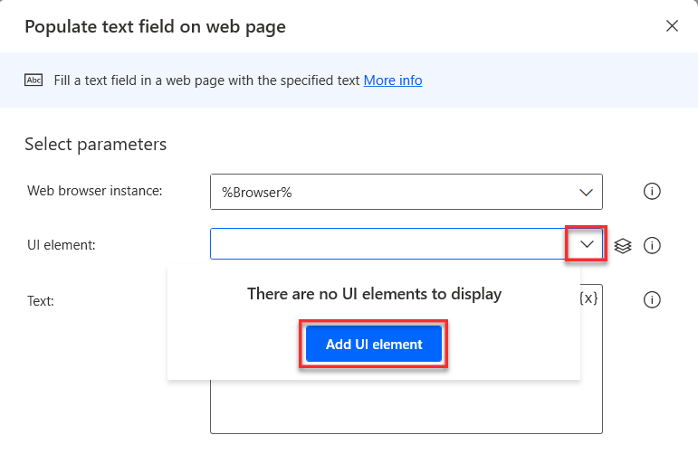](../media/text.png#lightbox)

1. A small tracking session window appears to capture UI elements. Open the browser webpage, and a red rectangle appears within the webpage while you hover the mouse cursor over different elements. Move the mouse cursor over the text field that contains the USD value and then use the **Ctrl + Left click** keyboard shortcut to select the element.

   > [!div class="mx-imgBorder"]
   > [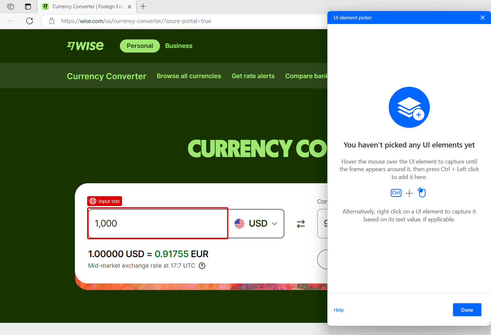](../media/rectangle-input.png#lightbox)

1. In the **Text** field of the dialog, select the variable **{X}** icon to the right of the field. In the menu, under the **Input/output** section, double-click the **Amount** variable.

1. Select **Save** in the lower part of the dialog.

   > [!div class="mx-imgBorder"]
   > [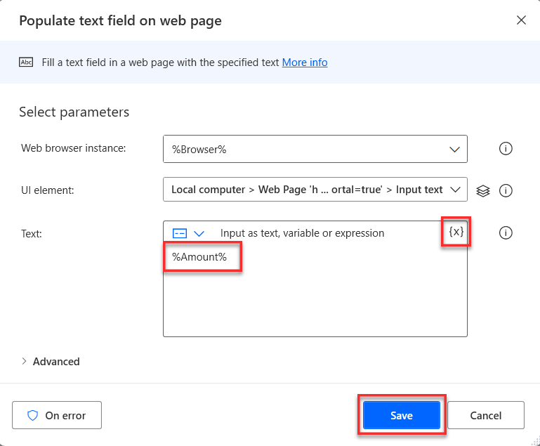](../media/populate.png#lightbox)

1. Add another action that sends the previous **Total amount** input value into the **UI element** field. From the **Actions** pane to the left of the screen, expand the **Web data extraction** subfolder within the **Browser automation** folder.

1. Drag and drop the **Get details of element on web page** action to below the second action in the design space.

   > [!div class="mx-imgBorder"]
   > [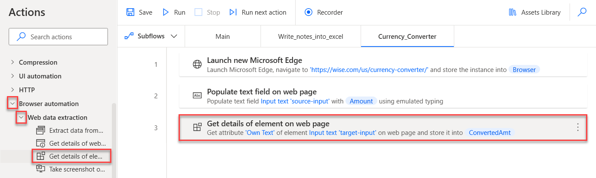](../media/get-details.png#lightbox)

1. In the **Get details of element on web page** dialog, the **%Broswer%** value is already used to fill in the **Web browser instance** field. Select the **UI element** dropdown menu.

1. From the **UI element** dropdown menu, select the **Add UI element** button.

   > [!div class="mx-imgBorder"]
   > [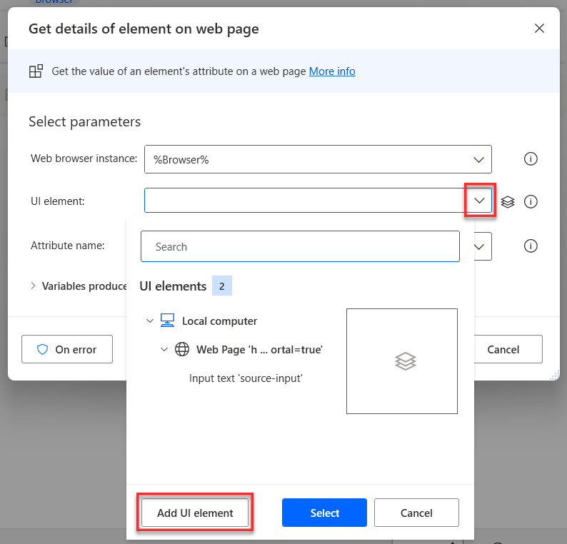](../media/element.png#lightbox)

1. Return to the web browser where you convert the USD dollar value. Use the same process as before to select the **Output value** by using the **Ctrl + Left click** action on the value.

   > [!div class="mx-imgBorder"]
   > [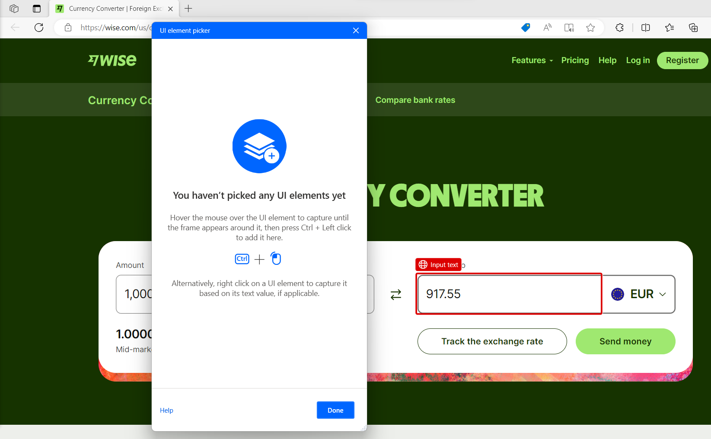](../media/rectangle.png#lightbox)

1. In the **Get details of element on web page** dialog, double-click the **Variables produced** value.

1. While leaving the percent symbols on either side of the value name, rename the value to **ConvertedAmt**.

1. Select **Save**.

   > [!div class="mx-imgBorder"]
   > [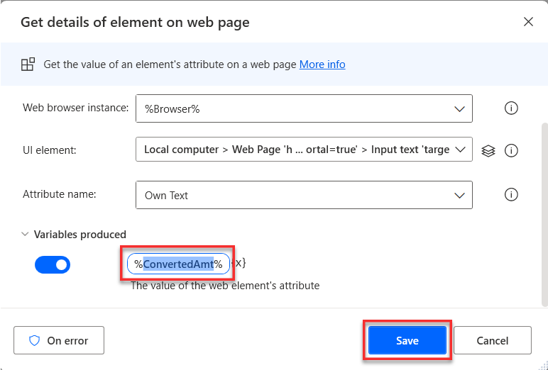](../media/details.png#lightbox)

   Next, let's remove the dollar symbol from the **Input Amount** variable.

1. From the right side of your screen, locate and hover the mouse cursor over the **Amount** variable within the **Input/output** variables section.

1. To the right of the variable name, select the ellipsis (**...**) menu.

   > [!div class="mx-imgBorder"]
   > [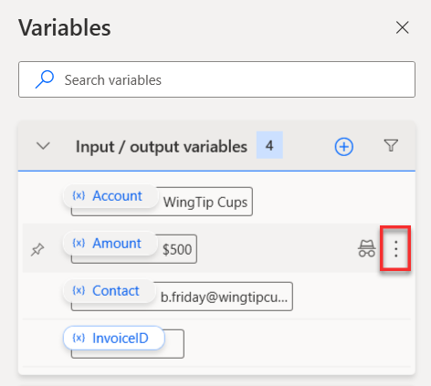](../media/actions.png#lightbox)

1. From the options menu, select **Edit**.

1. Select the **Default value** field and then delete only the US dollar (**$**) symbol to the left of the amount value. Select the **Save** button when you're finished.

   > [!div class="mx-imgBorder"]
   > [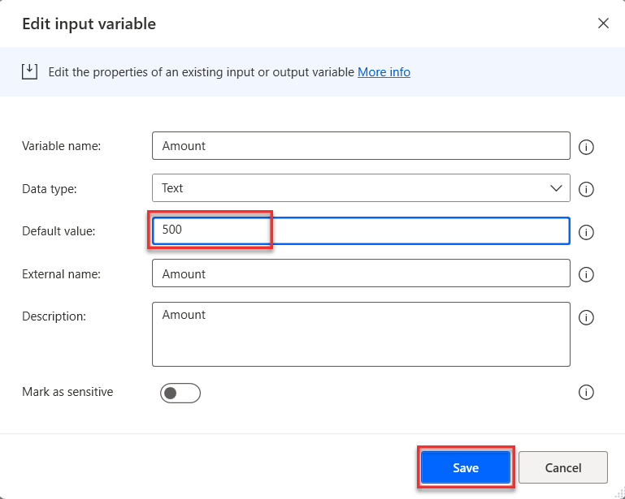](../media/input.png#lightbox)

1. From the upper toolbar, select the **Save** button to save all your changes.

1. Now, you test the subflow. While still viewing the **Currency_Converter** subflow, right-click the **first action**.

1. From the options menu, select **Run from here**.

   > [!div class="mx-imgBorder"]
   > [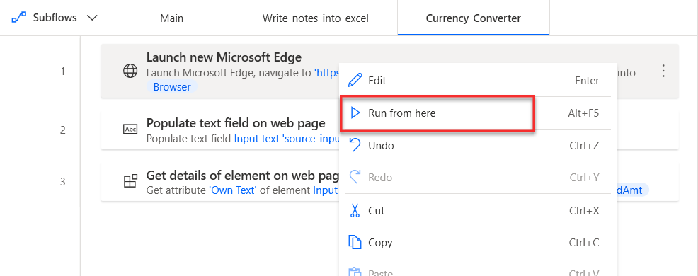](../media/here.png#lightbox)

1. The automation should run and convert the 500 USD amount (the default amount value) into another currency.

   > [!div class="mx-imgBorder"]
   > [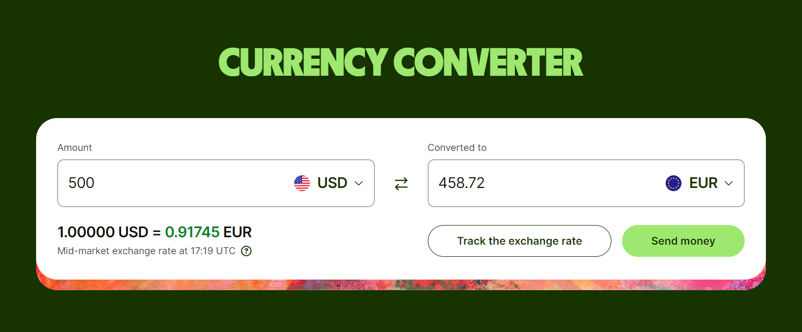](../media/currency.png#lightbox)

1. Capture the real-time converted value from the website by going to the **Write_notes_into_excel** subflow and selecting the tab in the upper part of the screen.

   > [!div class="mx-imgBorder"]
   > [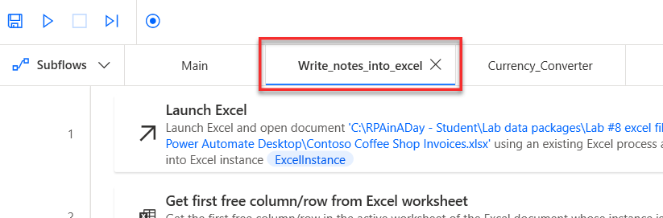](../media/selected.png#lightbox)

1. Hover your mouse cursor over and right-click the **Write to Excel worksheet** action with the **Amount** value set to column **D** within the subflow.

1. From the options menu, select **Copy**. Then, **Paste** the new **Write to Excel worksheet** action below the one in which you copied.

   > [!NOTE]
   > If did not complete the optional task within the previous exercise, then the newly pasted action will be the *last* action within the sub-flow. If you did complete the optional task previously, then there will be an additional action at the bottom of the flow labeled **Amount** and **Column F** (similar to what is shown within these images).

   > [!div class="mx-imgBorder"]
   > [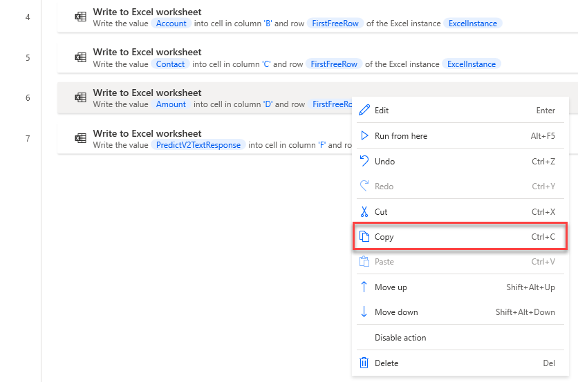](../media/copy.png#lightbox)

   > [!div class="mx-imgBorder"]
   > [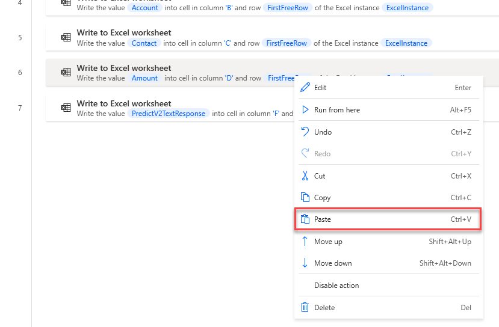](../media/paste.png#lightbox)

1. Hover your mouse cursor over the new **Write to Excel worksheet** action and then select the ellipsis (**...**) to the right. From the options menu, select **Edit**.

   > [!div class="mx-imgBorder"]
   > [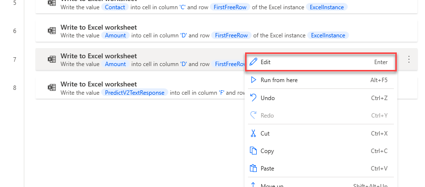](../media/edit-step.png#lightbox)

1. From the **Write to Excel worksheet** dialog, select the variable **{X}** icon to the right of the **Value to write** field.

1. From the menu, under the **Flow variables** section, double-click the **ConvertedAmt** variable that you added previously.

   > [!NOTE]
   > You might need to delete the previous variable within the field to correctly enter the new variable.

   > [!div class="mx-imgBorder"]
   > [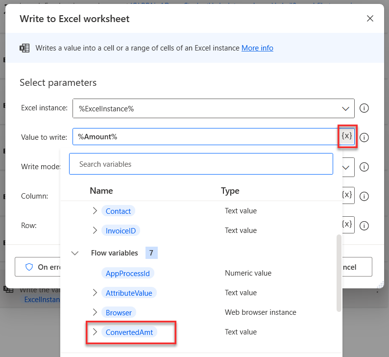](../media/write.png#lightbox)

1. Select the **Column** field, and then enter **E** as the new column.

1. For the **Row** field, leave it set to **%FirstFreeRow%**.

1. Select **Save** in the lower right of the dialog.

   > [!div class="mx-imgBorder"]
   > [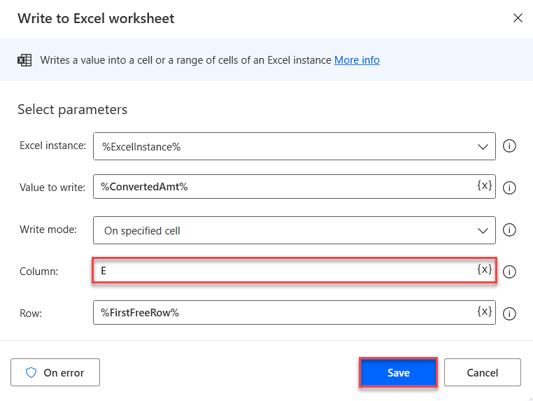](../media/excel-action.png#lightbox)

1. Now, let's add the **Currency_Converter** subflow into the **Main** flow, before the **Write_notes_into_excel** subflow. Return to your **Main** flow by selecting it from the tabs in the upper part of the screen.

   > [!div class="mx-imgBorder"]
   > [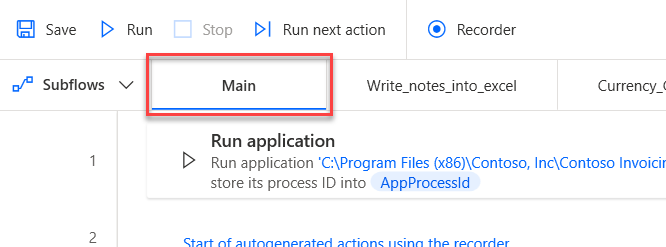](../media/main-flow.png#lightbox)

1. From the **Actions** pane to the left of the screen, within the **Flow control** folder, drag and drop the **Run subflow** action into the design space of the **Main** flow. Place it above the current Run sub-flow action within the flow.

   > [!NOTE]
   > If you completed the optional task within the previous exercise, then you will place the new **Run sub-flow** action below the **Create text with GPT on Azure OpenAI Service** action and above the current **Run sub-flow** action within the flow.

   > [!div class="mx-imgBorder"]
   > [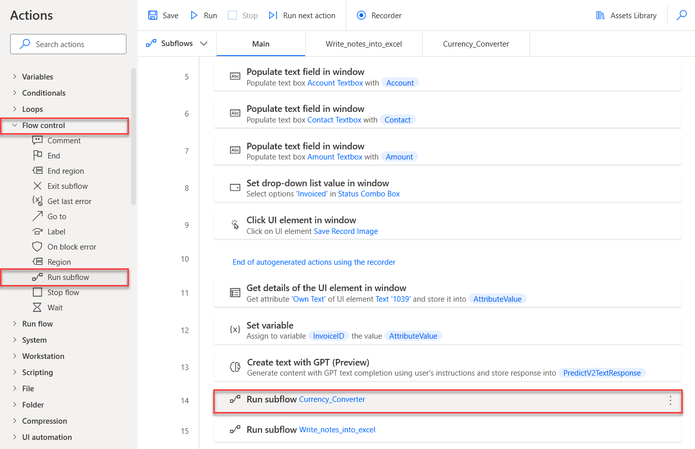](../media/run-sub.png#lightbox)

1. In the **Run subflow** dialog, select the **Run subflow** dropdown menu. From the list, select **Currency_Converter**.

1. Select **Save**.

   > [!div class="mx-imgBorder"]
   > [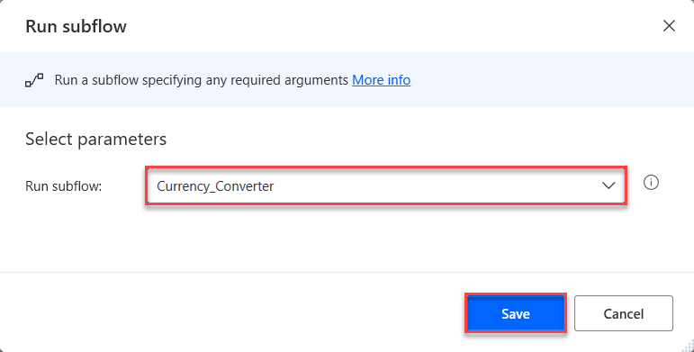](../media/sub-flow.png#lightbox)

1. From the upper toolbar, select the **Save** button and then wait for the flow to be saved.

   > [!div class="mx-imgBorder"]
   > [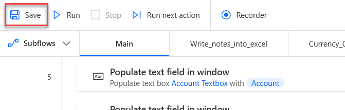](../media/save-flow.png#lightbox)

1. Now, you can run the **Main** flow. From the upper toolbar, select the **Run** button.

After the flow run completes, an entry will be added to the Excel file as it did in the previous exercise, with an extra cell containing the converted value.

> [!NOTE]
> If you completed the optional task within the previous lab, then you will see a text entry for the converted value within the Excel file.

> [!div class="mx-imgBorder"]
> [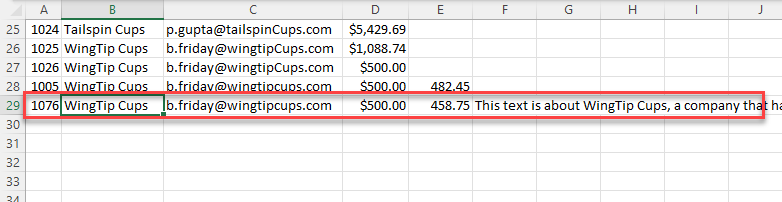](../media/converted.png#lightbox)
