In this exercise, you create a process within Power Automate for desktop that writes the values of variables that you created earlier into a Microsoft Excel file. Then, you use GPT from Azure OpenAI Service to automatically generate a summary of the invoice to also write into the Microsoft Excel file.

1. Go to [Power Automate](https://make.powerautomate.com/?azure-portal=true) and make sure that you select the correct environment.

1. Select **Solutions** and then open the **Invoice processing solution**.

1. Open the **Enter an invoice** desktop flow.

   > [!div class="mx-imgBorder"]
   > [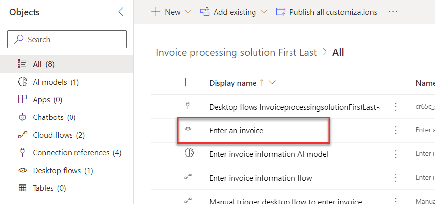](../media/desktop.png#lightbox)

1. Select **Edit** from the tool bar at the top of the page.

1. Select **Launch app** within the dialog.

1. After Power Automate launches, select the **Subflows** dropdown menu in the upper left part of the screen. Then, select **+ New subflow** to create a subflow for **Enter an invoice**.

   > [!div class="mx-imgBorder"]
   > [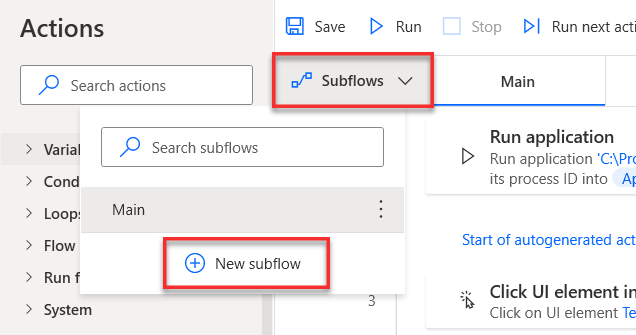](../media/create-sub.png#lightbox)

1. Name the subflow as `Write_notes_into_excel` and then select **Save**.

   > [!NOTE]
   > Subflow names can't have spaces.

   > [!div class="mx-imgBorder"]
   > [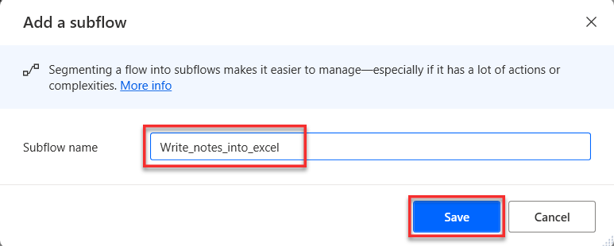](../media/save-sub.png#lightbox)

1. From the **Actions** pane to the left of the screen, expand the **Excel** menu and then double-click the **Launch Excel** action.

   > [!div class="mx-imgBorder"]
   > [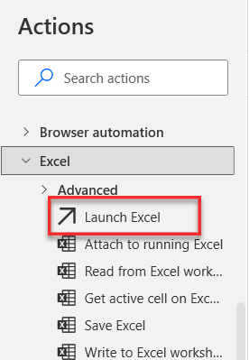](../media/launch-excel.png#lightbox)

1. In the **Launch Excel** dialog, from the **Launch Excel** dropdown menu, select **and open the following document**. Then, select the **file icon** within the **Document path** field.

   > [!div class="mx-imgBorder"]
   > [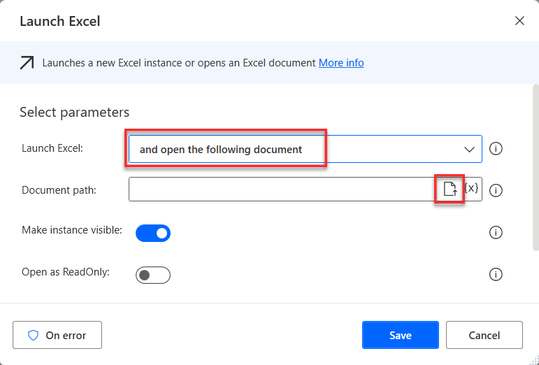](../media/options.png#lightbox)

1. Find and select the **Contoso Coffee Shop Invoices** Excel file, which is located in the **Lab #8 excel files to use in Power Automate** file of the **AutomationIAD-Learn-student-files** folder for this module. After you locate and select the Excel file, select **Open**.

   > [!div class="mx-imgBorder"]
   > [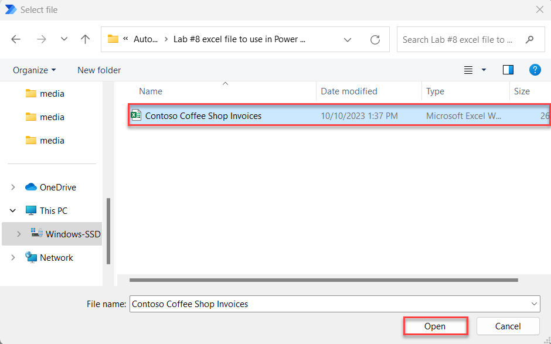](../media/explorer.png#lightbox)

   > [!NOTE]
   > The spreadsheet for this exercise doesn't contain a password. However, if it did, you could expand the **Advanced** section in this dialog and then provide a password.

1. In the **Launch Excel** dialog, select **Save**.

   > [!div class="mx-imgBorder"]
   > [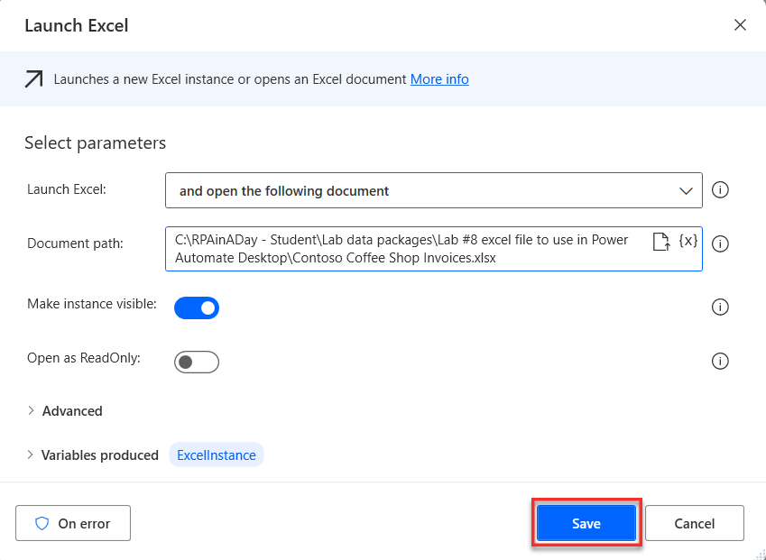](../media/password.png#lightbox)

1. From the **Actions** pane to the left of the screen, under the **Excel** expansion, double-click the **Get first free column/row from Excel worksheet** action.

   > [!div class="mx-imgBorder"]
   > [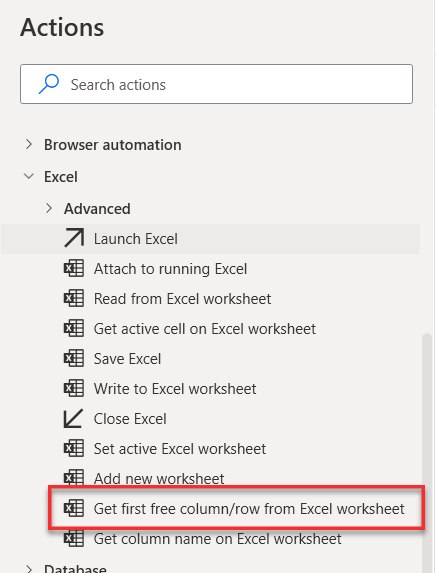](../media/free.png#lightbox)

1. Use the default settings for the **Get first free column/row from Excel worksheet** action and then select **Save**. This action retrieves the number of the first free row and the first free column and then stores them into variables.

   > [!div class="mx-imgBorder"]
   > [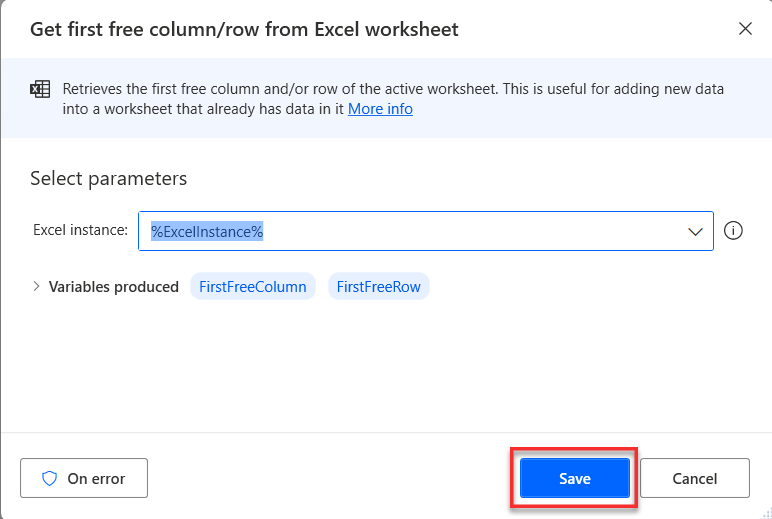](../media/first.png#lightbox)

1. Make sure that you have the **Get first free column/row from Excel worksheet** action that you added, and then from the **Actions** pane, under the **Excel** expansion, double-click the **Write to Excel worksheet** action.

   > [!div class="mx-imgBorder"]
   > [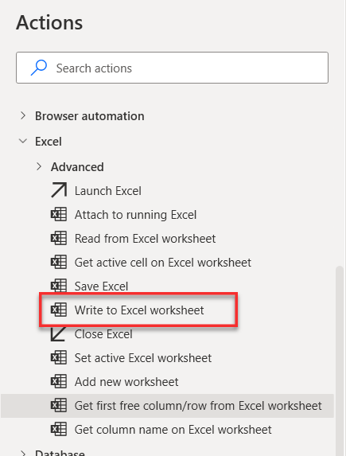](../media/worksheet.png#lightbox)

1. In the **Write to Excel worksheet** dialog, in the **Value to write** field, select the variable **{X}** icon. Then, double-click the **InvoiceID** variable under the **Input/output** section.

   > [!div class="mx-imgBorder"]
   > [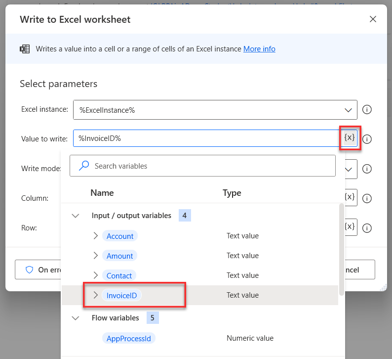](../media/invoice.png#lightbox)

1. In the **Column** field, enter the letter `A`. In the **Row** field, select the variable **{X}** icon and then double-click **FirstFreeRow** from the **Flow variables** section. Select **Save** in the lower part of the dialog.

   > [!div class="mx-imgBorder"]
   > [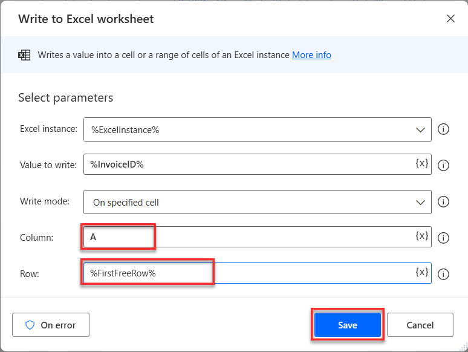](../media/write-excel.png#lightbox)

1. Use the previous process to add three more **Write to Excel worksheet** actions to the design space by using the values and information in the following table to fill in the fields.

   | Value to write | Column | Row |
   |----------------|--------|-----|
   | %Account% | B | %FirstFreeRow% |
   | %Contact% | C | %FirstFreeRow% |
   | %Amount% | D | %FirstFreeRow% |

1. When you complete the preceding steps, your subflow for writing notes into Excel should resemble the following figure. You should have six actions within the design space list.

   > [!div class="mx-imgBorder"]
   > [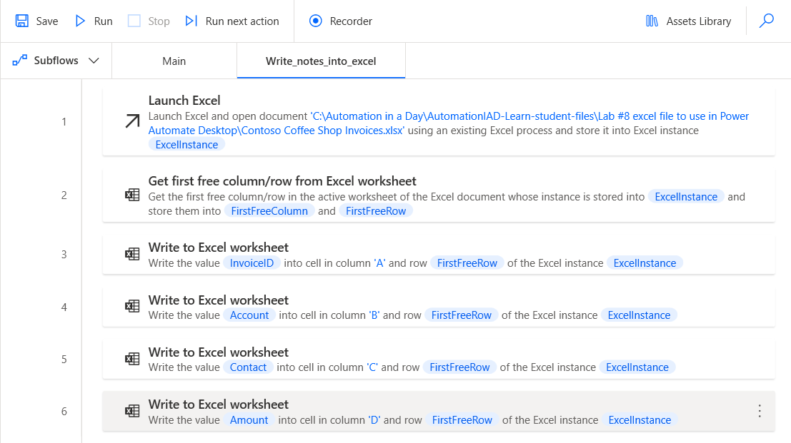](../media/sub-flow-actions.png#lightbox)

1. From the upper toolbar, select the **Save** button and then wait for the subflow to be saved.

1. Select the **Main** flow by selecting the **Main** tab in the upper part of the page.

1. In the **Main** flow, from the **Actions** pane, under the **Flow control** expansion, drag and drop the **Run subflow** action to below the last step in the design space pane.

   > [!div class="mx-imgBorder"]
   > [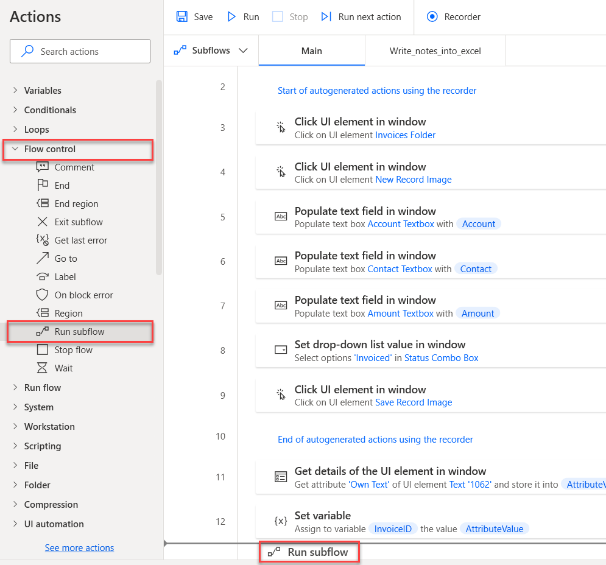](../media/drag.png#lightbox)

1. In the **Run subflow** dialog, in the **Run subflow** field, select **Write_notes_into_excel** from the dropdown menu and then select **Save**.

   > [!div class="mx-imgBorder"]
   > [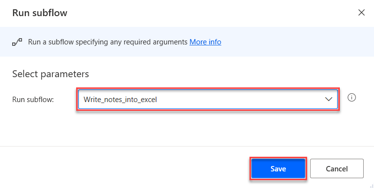](../media/sub.png#lightbox)

1. From the upper toolbar, select **Save** and then wait for the flow to be saved.

1. You can now run your flow by selecting the **Run** icon from the toolbar.

   > [!div class="mx-imgBorder"]
   > [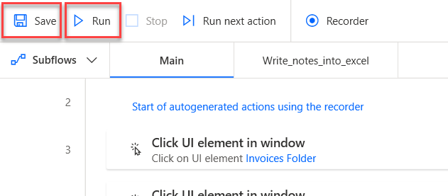](../media/save.png#lightbox)

1. After the automation runs, check the **Excel** file to make sure that the entry displayed in the following screenshot is added.

   > [!div class="mx-imgBorder"]
   > [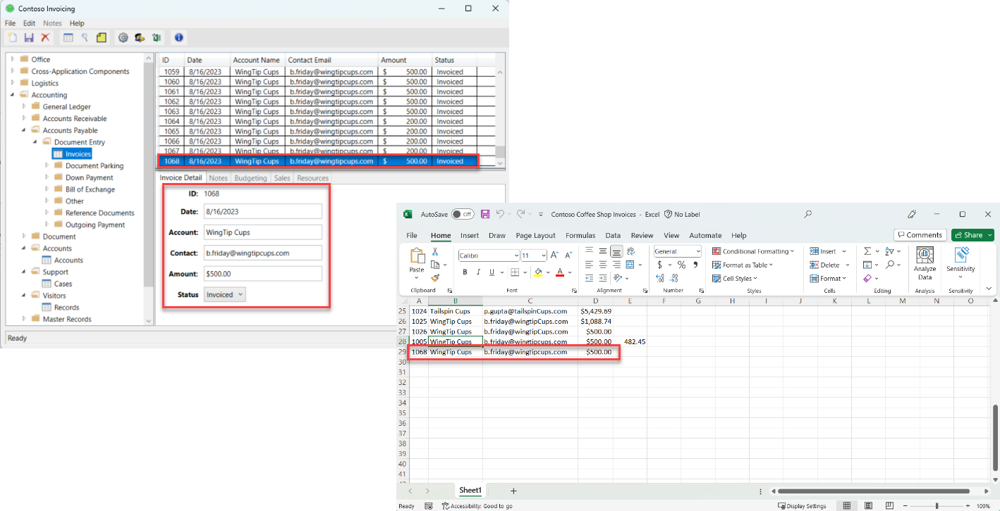](../media/row.png#lightbox)

   > [!NOTE]
   > A different invoice ID might display in your version.

## Task: Use AI Builder within Power Automate (optional)

> [!NOTE]
> In order to complete this section of the exercise, you must have the correct license that allows you to have the AI Builder capabilities. In order to check if you have the needed license to use this capability, select the **Settings** icon at the top of the screen for the Power Automate web browser. Then, select **View My Licenses**. Here you can see the list of license and capabilities that you currently have and are available for you to use.
>
> [!div class="mx-imgBorder"]
> [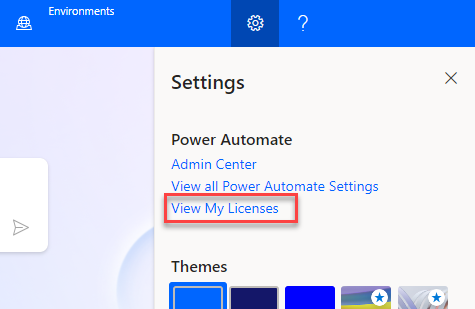](../media/view-my-licenses.png#lightbox)

To begin this task, start by having the **Power Automate Desktop app** open to the **Enter an Invoice** flow. Ensure that you're currently viewing the **Main** sub-flow.

1. From the **Actions** pane to the left of the screen, expand the **AI Builder** menu and then double-click the **Create text with GPT on Azure OpenAI Service** action.

   > [!div class="mx-imgBorder"]
   > [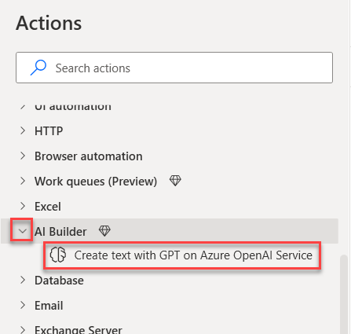](../media/builder-open-service.png#lightbox)

1. In the **Create text with GPT on Azure OpenAI Service** dialog, select **Create Instructions**.

   > [!div class="mx-imgBorder"]
   > [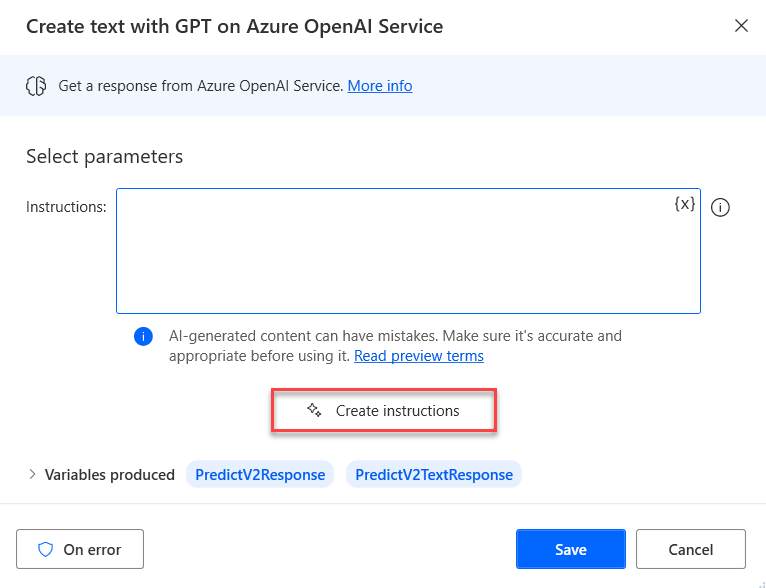](../media/create-instructions.png#lightbox)

1. Select **Summarize text** from the list of options.

   > [!div class="mx-imgBorder"]
   > [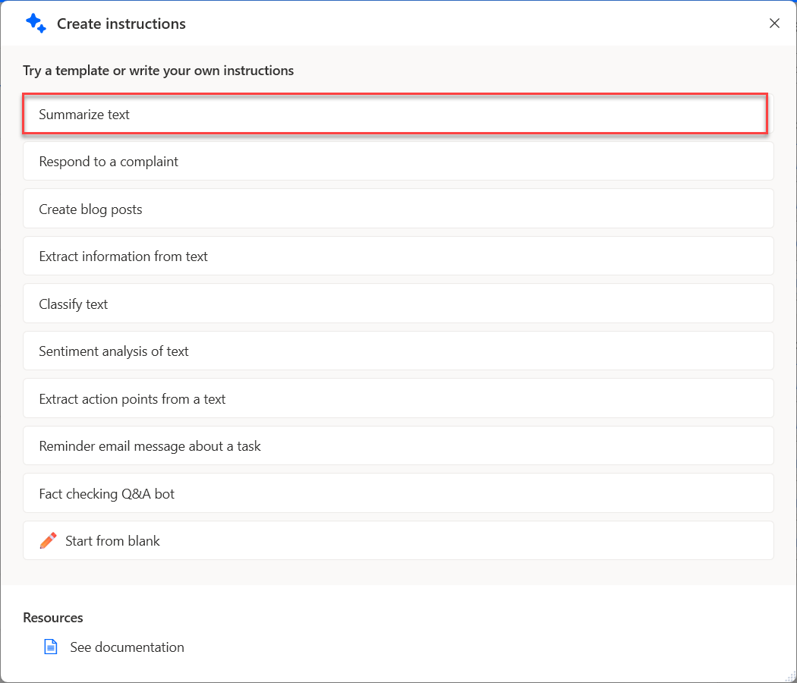](../media/summarize-text.png#lightbox)

1. Review the auto-generated instructions in the **Describe the text the model should create** area. **Remove the following parts of the prompt**: *"without adding new information.  If the text below has less than a few words or looks like a placeholder text, respond "Sorry, I can't summarize," otherwise respond with the summary"*
1. Select the **Use instructions in flow** button located at the bottom of the dialog.

   > [!div class="mx-imgBorder"]
   > [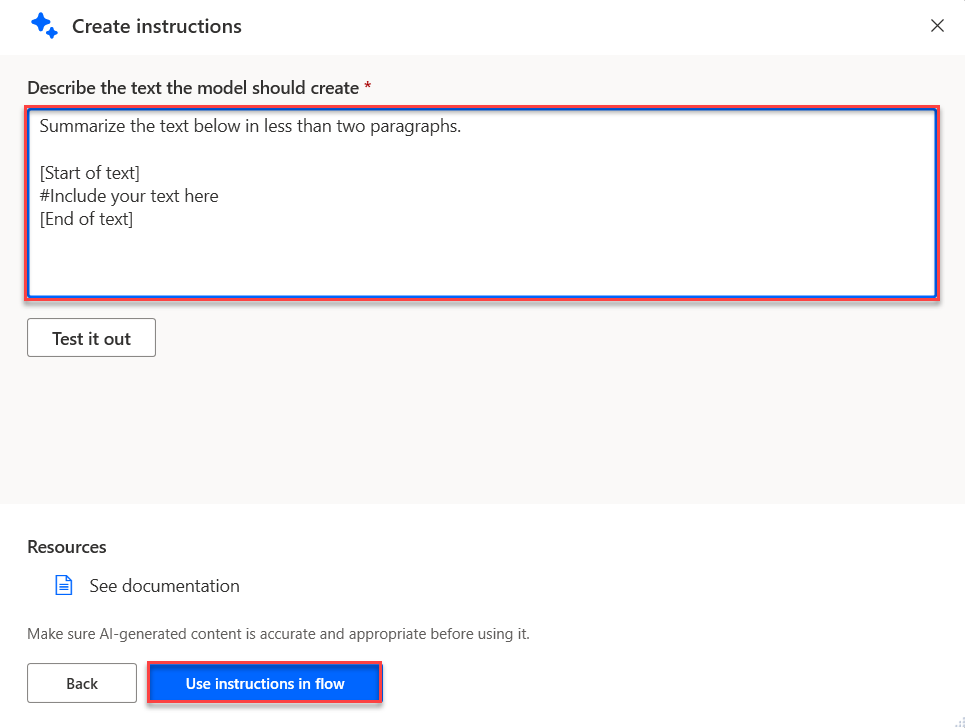](../media/new-instructions.png#lightbox)

1. Update the **Instructions** by replacing *"#Include your text here"* with the Input variables created for the flow. To add the variables, select the **{x}** icon in the right corner of the instructions area, then select the variables from the drop-down list. Remove any unnecessary spacing within the text.

   The instructions should now read:

   Summarize the text below in fewer than two paragraphs.
   [Start of text]
   %Account%
   %Contact%
   %Amount%
   [End of text]

   > [!div class="mx-imgBorder"]
   > [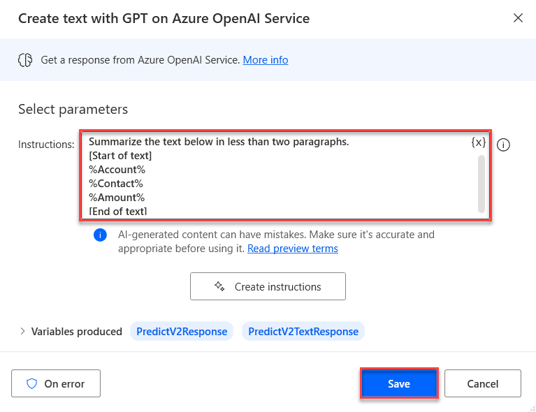](../media/completed-instructions.png#lightbox)

1. Select **Save** to add the action to the **Main** sub-flow. Ensure that the new action is positioned below the **Set variable** action and above the **Run subflow** action within the sub-flow.

   > [!div class="mx-imgBorder"]
   > [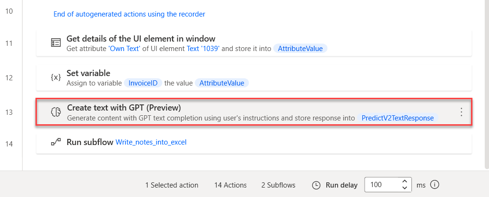](../media/new-action-main-sub-flow.png#lightbox)

1. From the **Actions** pane to the left of the screen, search for the **Display message** action and drag it below **Create text with GPT (Preview)** in the **Main** sub-flow. 

1. Edit the **Display message** action. For the title, enter **GPT Summary** and add the variable `%PredictV2TextResponse%` to the **Message to display** box, and select **Save**.

   > [!div class="mx-imgBorder"]
   > [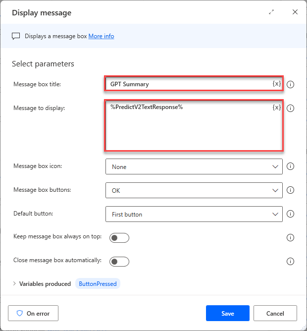](../media/display-message.png#lightbox)

1. Navigate to the subflow **Write_notes_into_excel**. Copy and paste one of the **Write to Excel worksheet** actions to be added to the bottom of the sub-flow.

1. Once pasted, **edit** the new **Write to Excel worksheet** action by double-clicking on the action.  Replace the **Value to write** with the newly generated flow variable `%PredictV2TextResponse%`. Replace the **Column to write** value with the column `F`. **Save** the action when complete.

   > [!div class="mx-imgBorder"]
   > [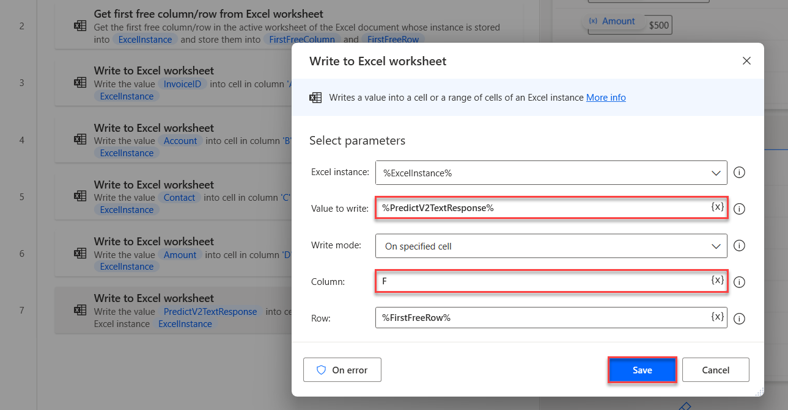](../media/new-write-excel-action.png#lightbox)

1. From the upper toolbar, select **Save** and then wait for the flow to be saved.

   > [!div class="mx-imgBorder"]
   > 

1. Run the flow by selecting **Run** from the toolbar to see how the GPT action works.

   > [!div class="mx-imgBorder"]
   > [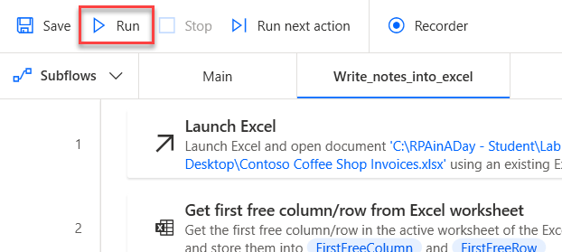](../media/run-flow.png#lightbox)
