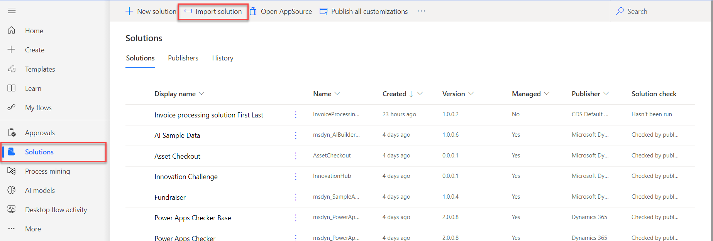
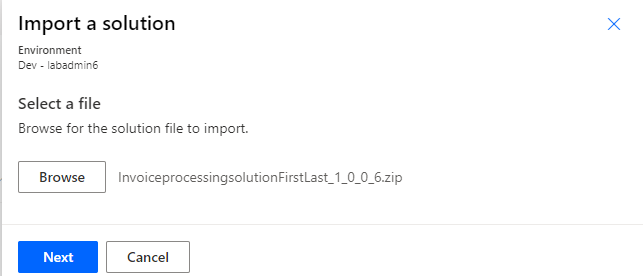
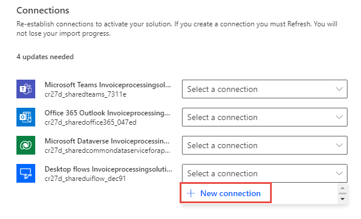
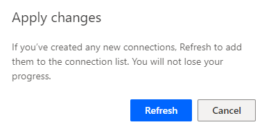
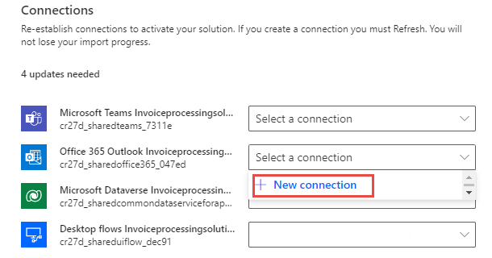
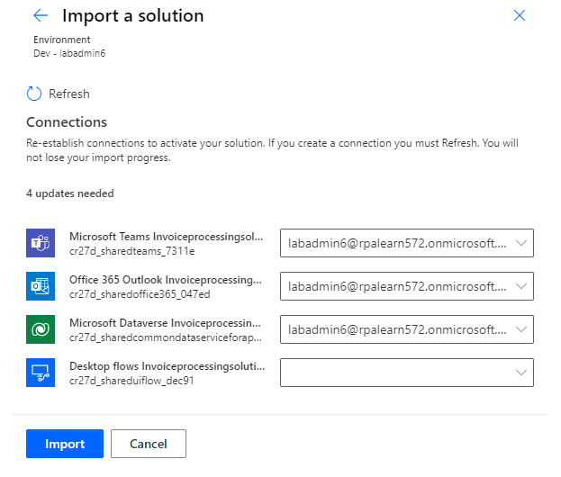
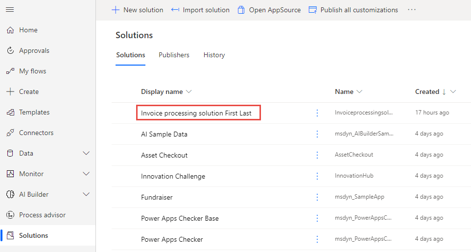
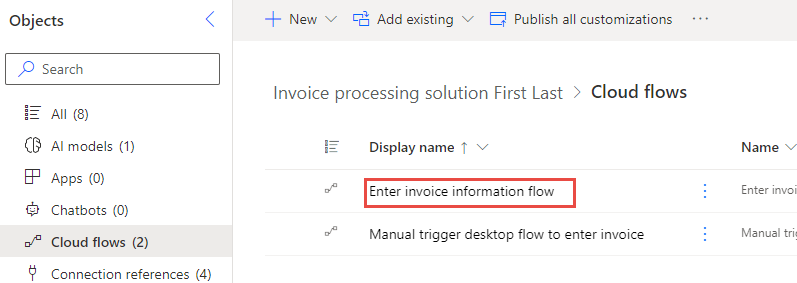
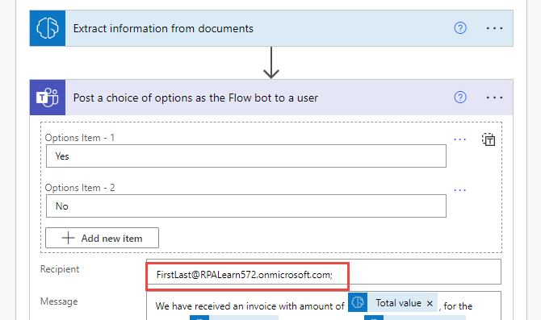

If you've already completed the module **Integrate with Microsoft Teams to get approvals - Online workshop**, skip to the next unit.

To import the solution, follow these steps.

1. Go to [Power Automate](https://powerautomate.microsoft.com/?azure-portal=true) and select the correct environment.

1. Select **Solutions** and then select **Import solution**.

   > [!div class="mx-imgBorder"]
   > 

1. Select **Browse**.

1. Select the **InvoiceprocessingsolutionFirstLast_1_0_0_6.zip** solution file located in the resources folder and then select **Open**.

1. Select **Next**.

   > [!div class="mx-imgBorder"]
   > 

1. Select **Next** again.

1. Select **New connection** for the desktop flow.

   > [!div class="mx-imgBorder"]
   > 

1. Select **Direct to machine**, select the machine that you registered in the module **Install required software - Online workshop**, provide your sign-in information, and then select **Create**.

   > [!div class="mx-imgBorder"]
   > 

1. Close the connections browser window or tab.

1. Select **Refresh**.

   > [!div class="mx-imgBorder"]
   > 

1. Select **New connection** for Microsoft Office 365.

   > [!div class="mx-imgBorder"]
   > 

1. Select **Create**.

1. Provide your credentials.

1. Close the connections browser window or tab.

1. Select **Refresh**.

1. Select **New connection** for Microsoft Dataverse.

1. Select **Create**.

1. Provide your credentials.

1. Close the connections browser window or tab.

1. Select **Refresh**.

1. Select **New connection** for Microsoft Teams.

1. Select **Create**.

1. Provide your credentials.

1. Close the connections browser window or tab.

1. Select **Refresh**.

1. You should now have a desktop flow and Office 365, Microsoft Dataverse, and Microsoft Teams connections. Select **Import**.

   > [!div class="mx-imgBorder"]
   > 

1. Wait for the solution to be imported.

1. Open the imported **Invoice processing solution**.

   > [!div class="mx-imgBorder"]
   > 

1. Select **Cloud flows** and then open **Enter invoice information flow**.

   > [!div class="mx-imgBorder"]
   > 

1. Select **Edit**.

1. Expand the **Apply to each** and the **Post a choice of options** steps.

1. Change the **Recipient** email to your user's email address.

   > [!div class="mx-imgBorder"]
   > 

1. Select **Save** and then wait for the flow to be saved.
