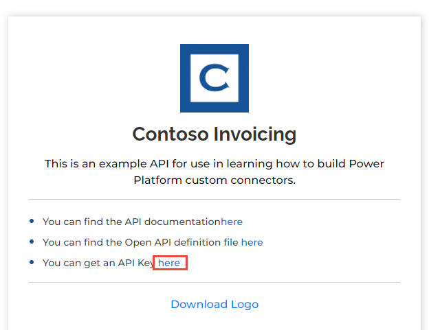
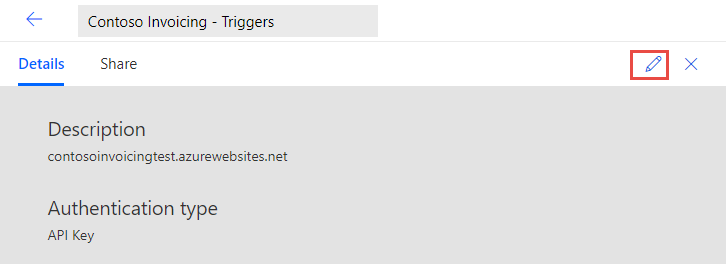
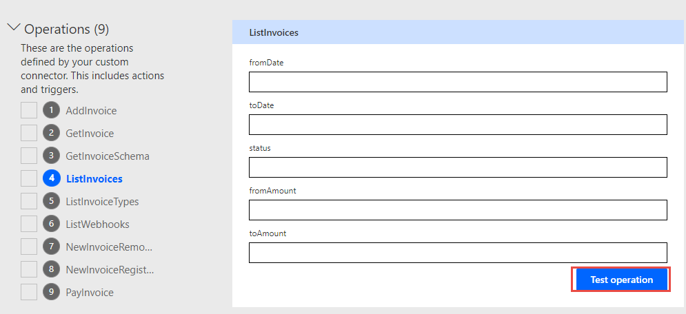
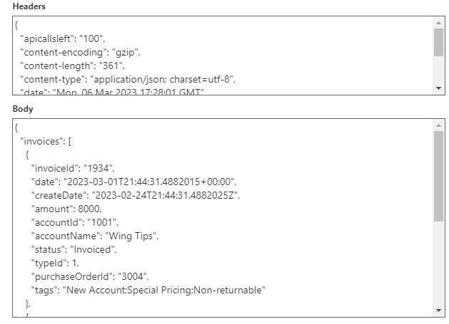
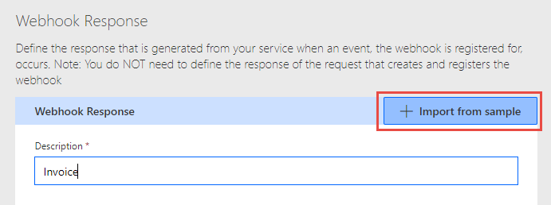
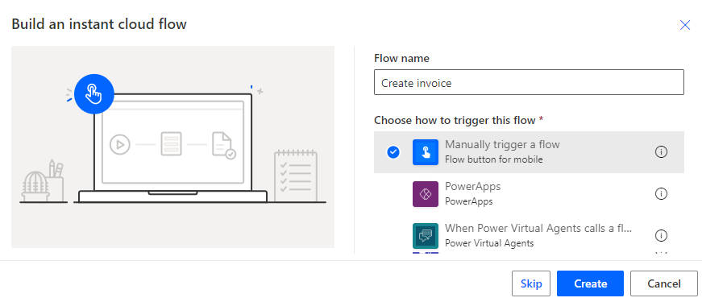
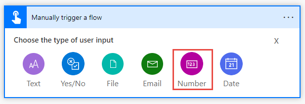
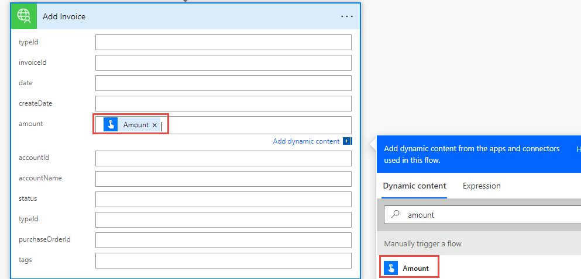
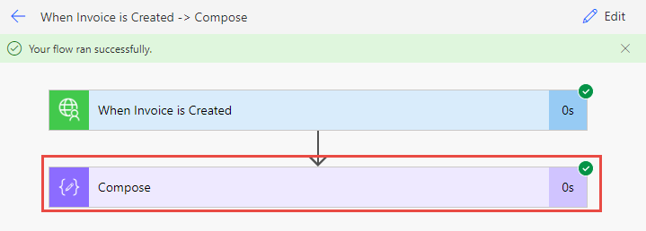
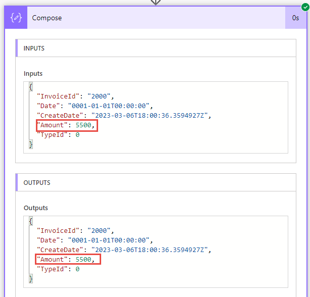

In this exercise, you'll add a webhook trigger to the custom connector for an existing Contoso Invoicing API.

> [!IMPORTANT]
> Use a test environment with Microsoft Dataverse provisioned. If you don't have one, you can sign up for the [community plan](https://powerapps.microsoft.com/communityplan/?azure-portal=true).

> [!NOTE]
> Download the following file to your local computer to complete this exercise [Contoso Invoicing Triggers](https://github.com/MicrosoftDocs/mslearn-developer-tools-power-platform/blob/master/power-automate-connectors/webhook/ContosoInvoicingTriggers_1_0_0_0.zip). Select the download button on the middle-right of the screen.

## Task 1: Import a solution with the custom connector

In this task, you'll import an unmanaged solution that contains a prebuilt custom connector for Contoso Invoicing API.

1.  Go to [Power Apps maker portal](https://make.powerapps.com/?azure-portal=true) and make sure that you are in the correct environment.

1.  Select **Solutions > Import solution**.

1.  Select **Browse**.

1.  Select the **ContosoInvoicingTriggers_1_0_0_0.zip** solution and then select **Open**.

1.  Select **Next**.

1.  Select **Import** and then wait for the import to complete. You should get a success message after the import completes.

1.  Select **Publish all customizations** and then wait for the publish to complete.

1.  Select to open the **Contoso importing triggers** solution that you imported.

    You should see the **Contoso invoicing triggers** custom connector component.

	> [!div class="mx-imgBorder"]
	> [](../media/contoso-invoicing-trigger.png#lightbox)

1. In a new tab, go to [Contoso Invoicing](https://contosoinvoicing.azurewebsites.net/?azure-portal=true).

1. Select the **API Key** link.

	> [!div class="mx-imgBorder"]
	> [](../media/api-key-link.png#lightbox)

1. Copy the **API Key** and keep it on a notepad. You'll use it a few times in this exercise.

1. Return to [Power Apps maker portal](https://make.powerapps.com/?azure-portal=true) and make sure that you are in the environment.

1. Select **Solutions** and select to open the **Contoso invoicing triggers** solution.

1. Select to open the **Contoso invoicing triggers** custom connector.

1. Select **Edit**.

	> [!div class="mx-imgBorder"]
	> [](../media/edit.png#lightbox)

1. Enter `contosoinvoicing.azurewebsites.net` for **Host**.

1. Select **Update connector**.

1. Select **Test > + New Connection**.

	> [!div class="mx-imgBorder"]
	> [](../media/new-connection.png#lightbox)

1. Paste the **API Key** and select **Create connection**.

	> [!div class="mx-imgBorder"]
	> [](../media/create-connection.png#lightbox)

1. Select **Refresh**. The connection that you created should be selected automatically.

1. Scroll down to the **Operations** section, select **ListInvoices**, and then select **Test operation**.

	> [!div class="mx-imgBorder"]
	> [](../media/test-operation.png#lightbox)

   You should see a list of invoices in the **Body** section.
    
	> [!div class="mx-imgBorder"]
	> [](../media/body-section.png#lightbox)

1. Don't navigate away from this page.

## Task 2: Add a webhook trigger

Follow these steps to add a webhook trigger:

1.  Select **Definition**.

	> [!div class="mx-imgBorder"]
	> [](../media/definition.png#lightbox)

1.  Scroll down to the **Triggers** section and select **+ New trigger**.

1.  Provide the following values:

    -  **Summary** - When Invoice is Created

    -  **Description** - When Invoice is Created

    -  **Operation ID** - InvoiceCreated

    -  **Trigger type** - Webhook

	> [!div class="mx-imgBorder"]
	> [](../media/new-trigger-values.png#lightbox)

1.  Go to the **Request** section and select **+ Import from sample**.

	> [!div class="mx-imgBorder"]
	> [](../media/import-sample.png#lightbox)

1.  Provide the following values and then select **Import**. With other APIs, you would get the sample from the API documentation.

    -  **Verb** - POST

    -  **URL** - `https://contosoinvoicing.azurewebsites.net/NewInvoiceNotification/`
       > [!NOTE]
       > Include the trailing foward slash on the URL. 

    -  **Body**
		```json
		{
		"targetUrl":"https://webhook.site"
		}
		```

	> [!div class="mx-imgBorder"]
	> [](../media/import-values.png#lightbox)

1.  Scroll to **Trigger configuration** and then select **targetUrl** for **Callback URL parameter**. This selection allows **targetUrl** to be populated at runtime by the custom connector.


	> [!div class="mx-imgBorder"]
	> [](../media/trigger-configuration.png#lightbox)

1.  Scroll up to the **Request** section, select **Body**, and then select **Edit**.

	> [!div class="mx-imgBorder"]
	> [](../media/body-edit.png#lightbox)

1.  Select **targetUrl** and then select **Edit**.

	> [!div class="mx-imgBorder"]
	> [](../media/url-edit.png#lightbox)

1.  Select **Yes** for **Is required** and select **internal** for **Visibility**.

	> [!div class="mx-imgBorder"]
	> [](../media/required-internal.png#lightbox)

1. Select the **Back** button.

	> [!div class="mx-imgBorder"]
	> [](../media/back.png#lightbox)

1. Select the **Back** button again.

1. Scroll down to the **Webhook Response** section, enter **Invoice** for the **Description**, and then select **+ Import from sample**. The Webhook Response defines what will be sent to your flow when the triggering event occurs.

	> [!div class="mx-imgBorder"]
	> [](../media/webhook-response-import.png#lightbox)

1. Paste the following JSON sample in the **Body** and then select **Import**.

	```json
	{
	"invoiceId": "1933",
	"date": "2021-01-26T04:02:52.1490835+00:00",
	"amount": 5000,
	"accountId": "1001",
	"accountName": "Wing Tips",
	"status": "Invoiced",
	"typeId": 1,
	"purchaseOrderId": "3002",
	"tags": "New Account;Special Pricing"
	}
	```
	> [!div class="mx-imgBorder"]
	> [](../media/body-import.png#lightbox)

1. Select **Update connector**.

	> [!NOTE]
	> If you receive an error message about "all paths must begin with '/'," open Swagger, find the line containing '':{} and then delete it.

1. Select **Close**.

## Task 3: Test the trigger

1.  Go to [Power Apps maker portal](https://make.powerapps.com/?azure-portal=true) and make sure that you are in the environment.

1.  Select **Solutions** and then open the **Contoso invoicing triggers** solution.

1.  Select **+ New > Automation > Cloud flow > Instant**.

1.  Enter **Create invoice** for the name, select **Manually trigger a flow** under **Triggers**, and then select **Create**.

	> [!div class="mx-imgBorder"]
	> [](../media/create-invoice-trigger.png#lightbox)

1.  Expand the trigger and select **+ Add an input**.

1.  Select **Number** for the input type.

	> [!div class="mx-imgBorder"]
	> [](../media/number-input.png#lightbox)

1.  Enter **Amount** for the input name and then select **+ New step**.

	> [!div class="mx-imgBorder"]
	> [](../media/new-step.png#lightbox)

1.  Select the **Custom** tab and then select the **Contoso invoicing** custom connector.

	> [!div class="mx-imgBorder"]
	> [](../media/contoso-invoicing-connector.png#lightbox)

1.  Select the **Add Invoice** action.

1. Enter **Contoso Connection** in the **Connection Name** field, paste the **API Key** that you copied in **Task 1: Import a solution with the custom connector**, and then select **Create**. You must use the same API key in both flows or your trigger flow won't run.

	> [!div class="mx-imgBorder"]
	> [](../media/contoso-invoicing-triggers-details.png#lightbox)

1. Select the **amount** field and select **Amount** from the **Dynamic content** pane.

	> [!div class="mx-imgBorder"]
	> [](../media/amount-field.png#lightbox)

1. Select **Save**.

1. Select the **<-** back button.

1. Make sure you're still in the **Contoso Invoicing - Triggers** solution.
15. Select **+ New > Automation > Cloud flow > Automated**.

1. Enter **Invoice Notification** for Flow name and select **Skip**.

17. Select the **Custom** tab, and then select the **Contoso invoicing** custom connector.

	> [!div class="mx-imgBorder"]
	> [](../media/invoice-notification.png#lightbox)

1. Select the **When Invoice is Created** trigger.

1. Select **+ New step**.

1. Search for **compose** and then select the **Compose** action.

1. Select the **Inputs** field and then select **body** from the **Dynamic content** pane.

	> [!div class="mx-imgBorder"]
	> [](../media/body.png#lightbox)

1. Select **Save**.

1. Select **Test**.

1. Select **Manually > Test**. The flow will start, and you should wait for notifications.

1. Open a new browser window and navigate to https://make.powerapps.com/ 
26. Make sure you have the correct environment selected.
27. Select **Solutions** and open the **Contoso Invoicing - Triggers**
28. Open the **Create invoice** cloud flow.
29. Select **Edit**.

1. Select **Test**.

1. Select **Manually > Test**.

1. Select **Continue**.

1. Enter **5500** for **Amount** and then select **Run flow**.

1. Select **Done**.

1. Switch to the **Invoice Notification** flow. The flow should run successfully.

1. Select to expand the **Compose** action.

	> [!div class="mx-imgBorder"]
	> [](../media/compose-action.png#lightbox)

   The **Inputs** and **Outputs** should show the amount that you provided in the **Create invoice** flow.

	> [!div class="mx-imgBorder"]
	> [](../media/inputs-outputs.png#lightbox)
