In this exercise, you'll add a new operation to an existing custom connector. Then, you'll use custom code to implement the operation and transform the response.

You'll modify the Contoso Invoicing custom connector that has a ListInvoice operation but doesn't have a **LastInvoice** operation. As a result, you'll add the **LastInvoice** operation to retrieve the most recent invoice that's been created. The network API for Contoso Invoicing doesn't support this operation, so you use custom code that's running on the **LastInvoice** operation to redirect the request to **ListInvoice** on the API and then transform the response to only return the last invoice that was created.

> [!IMPORTANT]
> Use a test environment with Microsoft Dataverse provisioned. If you don't already have one, go to Microsoft Power Apps Developer Plan to sign up for the developer plan.

## Task: Prepare your environment

In this task, you'll import a solution into your environment.

1.  Go to [Microsoft Power Automate](https://make.powerautomate.com/?azure-portal=true) and make sure that you're in the correct environment.

1.  Select **Data > Custom connectors** on the left navigation pane.

1.  Verify that you already have the **Contoso Invoicing** custom connector in your environment.

	> [!div class="mx-imgBorder"]
	> [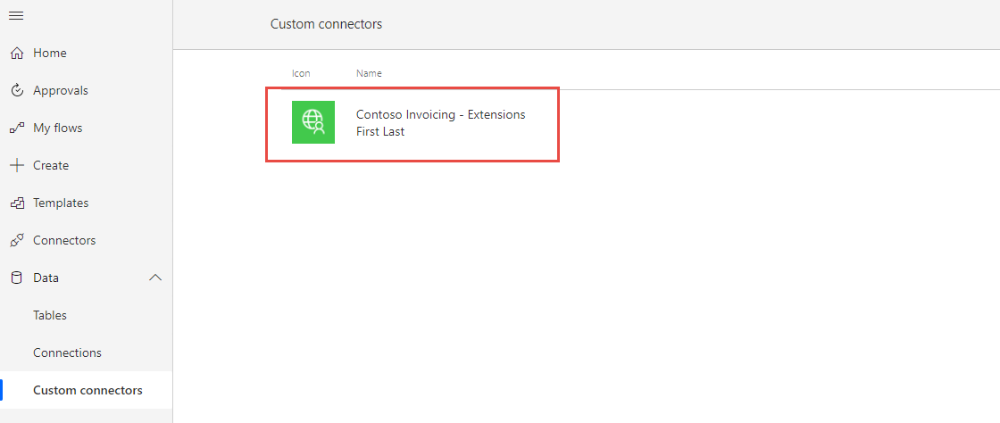](../media/custom-connector.png#lightbox)

1.  If you already have the **Contoso Invoicing** custom connector in your environment, skip to the next task in this exercise.
	If you don't have the custom connector, continue on to step 5.

1.  Select **Solutions > Import**.

1.  Select **Browse**.

1.  Select the **ContosoInvoicingExtensions\_1\_0\_0\_0.zip** solution that's located in the resources folder and then select **Open**.

1.  Select **Next**.

1.  Select **Import** and then wait for the import to complete. You should get a success message after the import completes.

1. Select **Publish all customizations** and then wait for the publish to complete. Don't navigate away from this page.

## Task: Create the LastInvoice operation

In this task, you'll create a new operation in the Contoso Invoicing custom connector.

1.  Select the **Contoso Invoicing - Extensions** solution that you've imported.
	The **Contoso Invoicing - Extensions** custom connector component should display.

1.  Select the **Contoso Invoicing - Extensions** connector and then select **Edit**. Your connector might not have **Extensions** in the name if you created it from a different exercise, which is OK.

	> [!div class="mx-imgBorder"]
	> [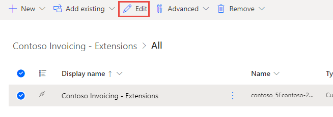](../media/edit.png#lightbox)

1.  Select the **Definition** tab and then select **+ New action**.

	> [!div class="mx-imgBorder"]
	> [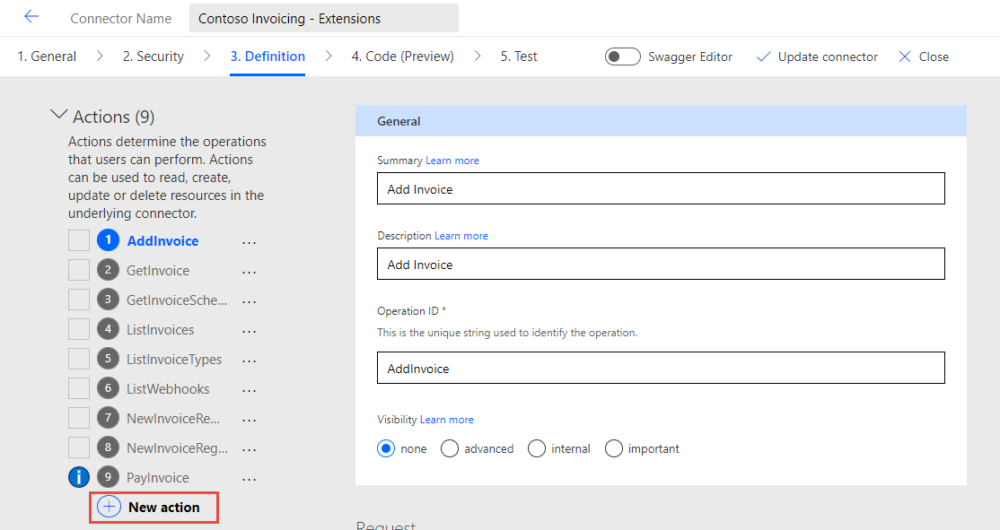](../media/new-action.png#lightbox)

1.  Go to the **Request** section and select **+ Import from sample**.

	> [!div class="mx-imgBorder"]
	> [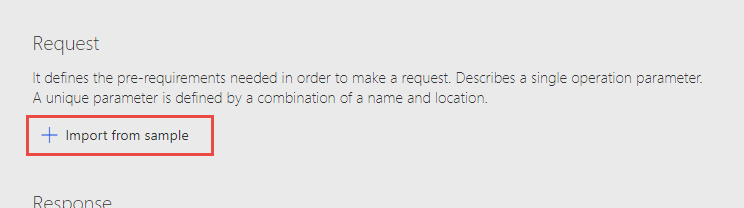](../media/import.png#lightbox)

1.  From the **Verb** section, select **Get**, paste `https://contosoinvoicingtest.azurewebsites.net/GetLastInvoice` into the **URL** box, and then select **Import**.

	> [!div class="mx-imgBorder"]
	> [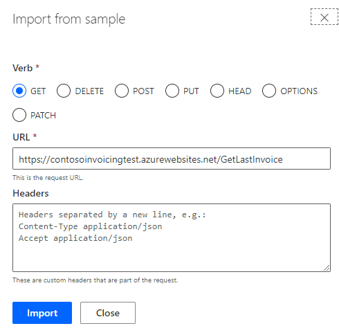](../media/import-request.png#lightbox)

1.  Scroll down to the **Response** section and select **+ Add default response**.

	> [!div class="mx-imgBorder"]
	> [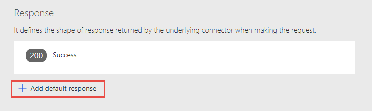](../media/add-default-response.png#lightbox)

1.  Paste the following JSON in the **Body** field and then select **Import**.

	```json
	{
	  "invoiceId": "1934",
	  "date": "2023-03-19T06:55:45.9039452+00:00",
	  "createDate": "2023-03-14T06:55:45.9039456Z",
	  "amount": 8000,
	  "accountId": "1001",
	  "accountName": "Wing Tips",
	  "status": "Invoiced",
	  "typeId": 1,
	  "purchaseOrderId": "3004",
	  "tags": "New Account;Special Pricing;Non-returnable"
	}
	```

1.  Select the **Test** tab, select **Update connector**, and then wait for the update to complete.

	> [!div class="mx-imgBorder"]
	> [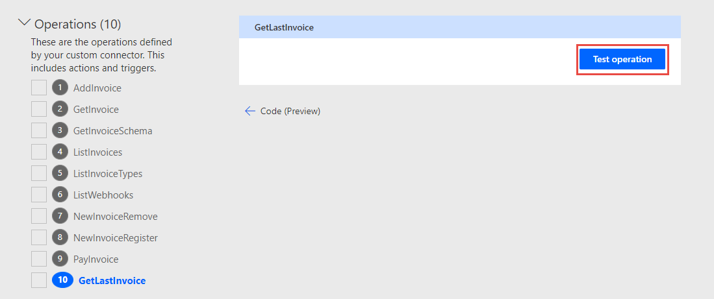](../media/update-connector.png#lightbox)

1.  Start a new browser window or tab and then go to [Contoso Invoicing](https://contosoinvoicingtest.azurewebsites.net/?azure-portal=true).

1. Select the **API Key** link.

1. Copy the **API Key**.

1. Save this key on a notepad.

1. Return to the connector, select the **Test** tab, and then select **+ New connection**.

	> [!div class="mx-imgBorder"]
	> [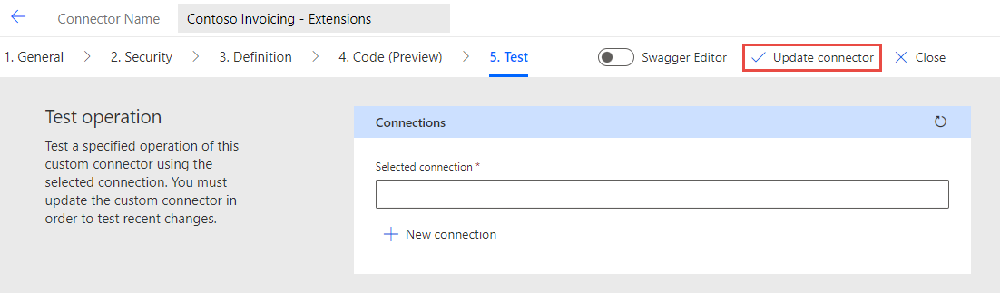](../media/add-new-connection.png#lightbox)

1. Paste the key that you've copied in the **API Key** field and then select **Create connection**.

1. Select **Refresh** **connections**.

1. Scroll down to the **Operations** section, select **GetLastInvoice**, and then select **Test operation**.

	> [!div class="mx-imgBorder"]
	> [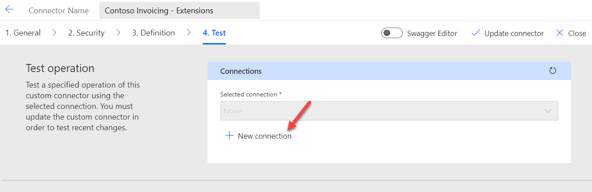](../media/test-operation.png#lightbox)

	You should get a 404 error because the API doesn't have a **GetLastInvoice** operation.

	> [!div class="mx-imgBorder"]
	> [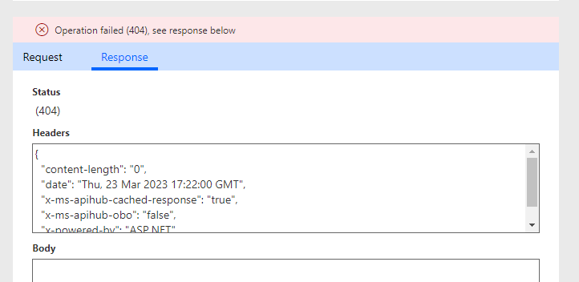](../media/failed-operation.png#lightbox)

    Don't navigate away from this page.

## Task: Add code to the connector

In this task, you'll add the code that performs the **GetLastInvoice** operation.

1.  Select the **Code** tab and then turn on the **Code Enabled** toggle.

	> [!div class="mx-imgBorder"]
	> [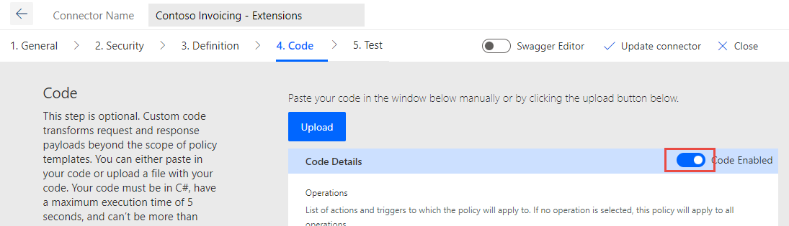](../media/enable-code.png#lightbox)

1.  Select the **Operations** dropdown menu and then select the **GetLastInvoice** operation.

	> [!div class="mx-imgBorder"]
	> [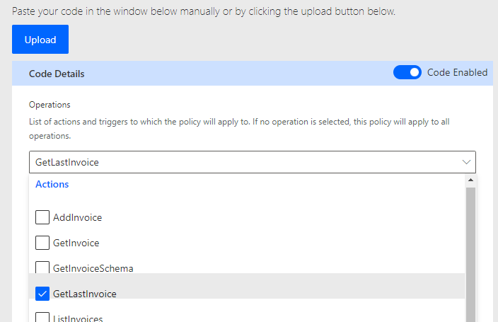](../media/operation.png#lightbox)

1.  Paste the following code in the **Code** field and then select the **Test** tab.

    ```json
	public class Script : ScriptBase
	{
	    public override async Task<HttpResponseMessage> ExecuteAsync()
	    {
	        // Check if the operation ID matches what is specified in the OpenAPI definition of the connector
	        if (String.Equals(this.Context.OperationId, "GetLastInvoice", StringComparison.OrdinalIgnoreCase))
	        {
	            this.Context.Request.RequestUri = ReplaceUri(this.Context.Request.RequestUri, "GetLastInvoice", "ListInvoices");
	            return await this.HandleGetLastInvoiceOperation().ConfigureAwait(false);
	        }
	        else
	        {
	            //pass-thru any other operation to the API directly
	            return await this.HandleForwardOperation().ConfigureAwait(false);
	        }
	    }
	    private Uri ReplaceUri(Uri original, string fromValue, string toValue)
	    {
	        try
	        {
	            var builder = new UriBuilder(original.ToString().Replace(fromValue, toValue));
	            return builder.Uri;
	        }
	        catch (Exception ex)
	        {
	            throw new Exception(original.ToString().Replace(fromValue, toValue));
	        }
	    }
	    private async Task<HttpResponseMessage> HandleGetLastInvoiceOperation()
	    {
	        JObject newResult = null;
	        // Use the context to send an HTTP request
	        HttpResponseMessage response = await this.Context.SendAsync(this.Context.Request, this.CancellationToken).ConfigureAwait(continueOnCapturedContext: false);
	        // Do the transformation if the response was successful, otherwise return error responses as-is
	        if (response.IsSuccessStatusCode)
	        {
	            if (response.StatusCode == HttpStatusCode.OK)
	            {
	                var responseString = await response.Content.ReadAsStringAsync().ConfigureAwait(continueOnCapturedContext: false);
	                var result = JObject.Parse(responseString);
	                // Wrap the original JSON object into a new JSON object with just two properties
	                if (result != null && result.ContainsKey("invoices") && result["invoices"].HasValues)
	                {
	                    var sortedArray = result["invoices"].OrderBy(jo => (DateTime)jo["date"]).ToArray();
	                    var lastInvoice = sortedArray[0];
	                    newResult = new JObject
	                    {
	                        ["invoiceid"]   = lastInvoice["invoiceid"],
	                        ["date"]        = lastInvoice["date"],
	                        ["createDate"]  = lastInvoice["createDate"],
	                        ["amount"]      = lastInvoice["amount"],
	                        ["accountId"]   = lastInvoice["accountId"],
	                        ["accountName"] = lastInvoice["accountName"],
	                        ["status"]      = lastInvoice["status"],
	                        ["typeId"]      = lastInvoice["typeId"],
	                        ["purchaseOrderId"] = lastInvoice["purchaseOrderId"],
	                        ["tags"]        = lastInvoice["tags"]
	                                        
	                    };
	                }
	                else
	                {
	                    newResult = new JObject
	                    {
	                        ["invoiceid"] = "-9999",
	                        ["status"] = "No Invoices",
	                    };
	                }
	            }
	            else
	            {
	                newResult = new JObject
	                    {
	                        ["invoiceid"] = "-9999",
	                        ["status"] = "Error retrieving invoices",
	                    };
	            }
	            response.Content = CreateJsonContent(newResult.ToString());
	            response.StatusCode = HttpStatusCode.OK;
	        }
	        return response;
	    }
	    private async Task<HttpResponseMessage> HandleForwardOperation()
	    {
	        // Use the context to forward/send an HTTP request
	        HttpResponseMessage response = await this.Context.SendAsync(this.Context.Request, this.CancellationToken).ConfigureAwait(continueOnCapturedContext: false);
	        return response;
	    }
	}
	```

	> [!div class="mx-imgBorder"]
	> [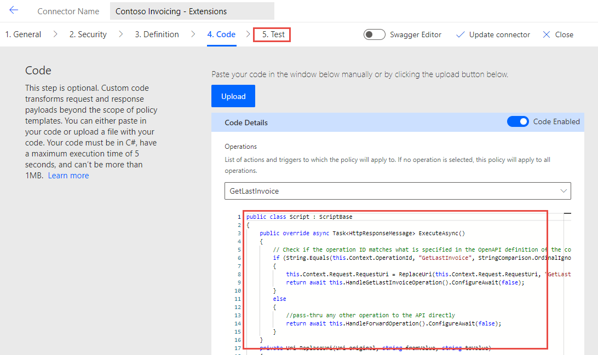](../media/code-test.png#lightbox)

1.  Review the code. The code should contain the following logic:

	-   Checks if it's the **GetLastInvoice** operation, and if not, it forwards the unmodified request to the network API
	
	-   Changes the request to use the **ListInvoice** operation on the network API
	
	-   Invokes the network API by using **SendAsync**
	
	-   Transforms the response to only include a single **Invoice** object that was the most recently created invoice

1.  Select the **Test** tab, select **Update connector**, and then wait for the update to complete.

1.  Scroll down to the **Operations** section, select **GetLastInvoice**, and then select **Test operation**.

	> [!div class="mx-imgBorder"]
	> [](../media/update-connector.png#lightbox)

You'll get a response showing the last invoice.

> [!div class="mx-imgBorder"]
> [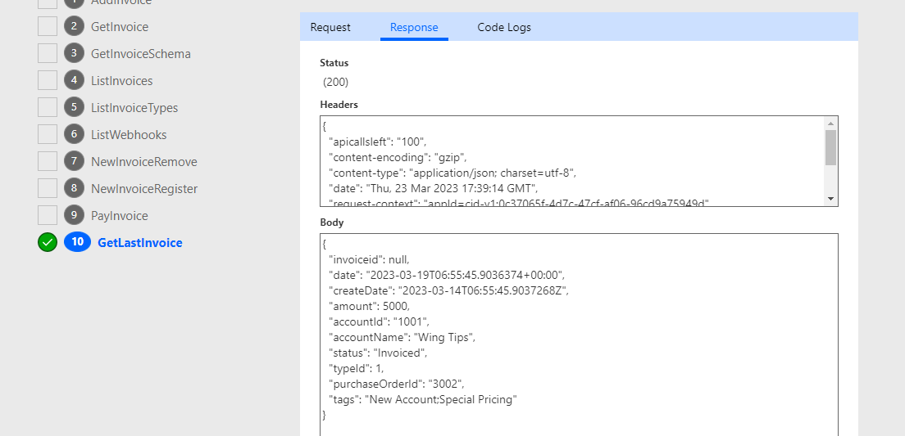](../media/response.png#lightbox)
