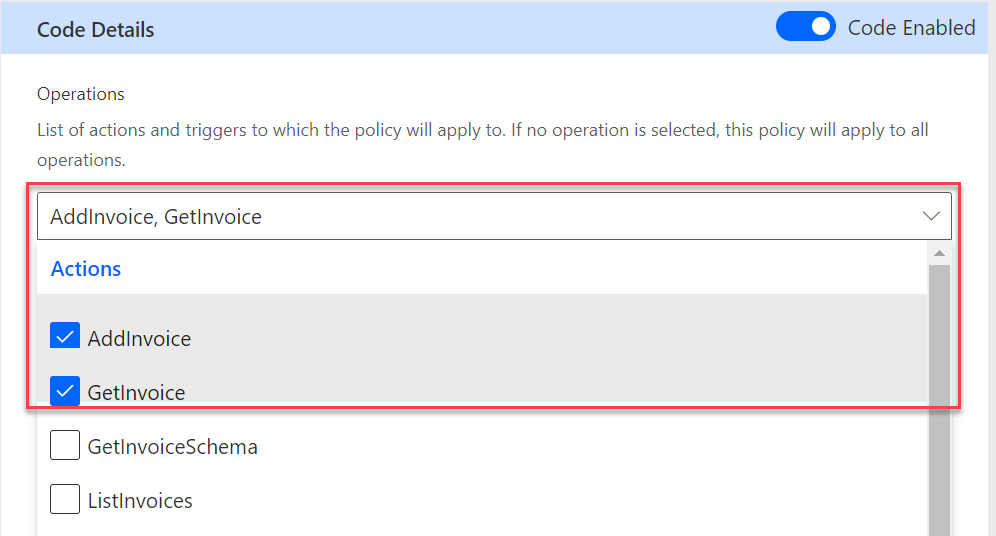

Custom connectors allow you to implement a connector for services that aren't available in the Microsoft Power Platform prebuilt connectors. Developers can use custom code to implement advanced transformation of the input and output of a connector's actions.

A basic custom connector definition defines the triggers and actions that are available to makers that use the connector. When a maker uses the action from an app or a flow, the operation of the API is invoked passing the request payload defined in the custom connector definition. The response payload from the service is expected to match the custom connector action response definition. No transformation occurs to the request and response payload.

## Policy templates

Connector action definitions can implement a no-code basic transformation of the request and response to the service, by applying custom connector policy templates. For example, policy templates can perform the following types of transformations:

-   Convert request or response data from an object to an array.

-   Convert request or response data from an array to an object.

-   Set the host URL for the request.

-   Set request HTTP header values.

-   Set a property value in the request or response.

-   Set request query string parameters.

You can use multiple policy templates together to transform the request and response. When you're setting up multiple templates, you'll also edit the order to control the sequence of the policy application.

Developers can implement custom code to go beyond what policy templates are capable of. In fact, when you implement custom code, the logic takes complete control over the request and response transformation, including the task of invoking the operation on the underlying service.

## Implement custom code

To implement custom code, you'll need to create a class named **Script**, which must inherit from the abstract base class **ScriptBase**. The **ScriptBase** class defines one abstract method, **ExecuteAsync,** that you need to implement in the **Script** class to successfully implement custom code in a connector. The **ExecuteAsync** method is expected to be the complete implementation of any transformation and invoking of the underlying service.

The following example shows a class that implements the required elements:

```json
public class Script : ScriptBase
{
    public override Task<HttpResponseMessage> ExecuteAsync()
    {
        // Your code here
    }
}
```

The **ExecuteAsync** method must provide the full implementation of any transformation and invoking of the underlying service. In the following example, the underlying service isn't invoked, and every response would be an object that contained a greeting property set to "Hello World!"

```json
public override async Task<HttpResponseMessage> ExecuteAsync()
{
    // Create a new response
    var response = new HttpResponseMessage();

    // Set the content
    // Initialize a new JObject and call .ToString() to get the serialized JSON
    response.Content = CreateJsonContent(new JObject
    {
        ["greeting"] = "Hello World!",
    }.ToString());

    return response;
}
```

To invoke the underlying service, you'll use the **SendAsync** method on the context object. The following **ExecAsync** method performs no transformations but forwards the request to the underlying service, and then return the response untouched.

```json
public override async Task<HttpResponseMessage> ExecuteAsync()
{
    HttpResponseMessage response = await this.Context.SendAsync(this.Context.Request, this.CancellationToken).ConfigureAwait(continueOnCapturedContext: false);
    return response;
}
```

The most common use of custom code is to provide transformation of the request before the **SendAsync** method call. Alternatively, you can transform the response from the **SendAsync** method prior to returning from the **ExecuteAsync** method.

## Create custom code for operations

You can enable custom code for a connector and then upload a valid .cs or .csx file that contains the code. You can only provide one script class for the connector, and it must handle actions that are set up for the connector. To do so, check the **OperationId** from the **Context** object to determine if you want to transform or forward the code to the underlying service. The following example shows this step in action.

```json
  if (this.Context.OperationId != "CreateProduct")
  {
     return await this.HandleForwardOperation().ConfigureAwait(false);
  } 
```

In this example, any action other than **CreateProduct** would be forwarded without transformation. This approach ensures that, if unexpected actions are set up to run the code, they're forwarded and not transformed.

You can also control which operations that the custom code runs on by setting it to run for specific operations. By default, after the code has been enabled, all operations will run the custom code. The following image shows that only **AddInvoice** and **GetInvoice** run the custom code.

> [!div class="mx-imgBorder"]
> [](../media/actions.png#lightbox)

If searching for these values in an exported connector, you find them stored in the apiProperties.json file.

```json
"scriptOperations": [
      "AddInvoice”,
      "GetInvoice”
    ],
```

Make sure that your selection of operations that run the custom code matches the expectations of conditional checks that you have in your code. If they're out of sync, it's common to have the custom code not run or encounter unexpected errors. If your connector has encountered errors, check that the connector definition, and the script code expect the same operations to be processed.

In the rest of the module, you'll explore more about how to create custom code transformations that you can implement with your custom connectors.

