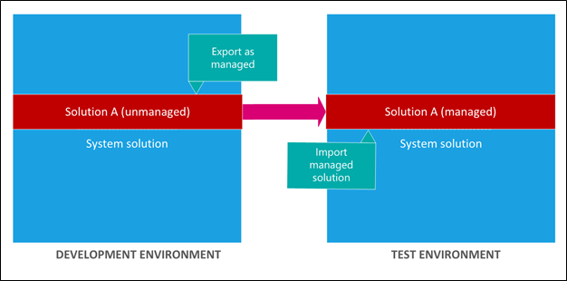

Solutions are containers that include the components of your solution and can be used to transport your components from one environment to another. Custom connectors are one of the available component types along with apps, flows, and many other item types. Solutions can be unmanaged or managed.

-   **Unmanaged solutions** - Used in development environments while you make changes to your components. Unmanaged solutions can be exported either as unmanaged or managed. Exported, unmanaged versions of your solutions should be checked into your source control system. The Solution Packager tool can be used to prepare solutions to be checked in. You can automate this process by using Microsoft Power Platform Build Tools.

-   **Managed solutions** - Used to deploy to any environment that isn't a development environment for that solution. Managed solution components can't be directly modified in the managed solution. However, you can include the component in an unmanaged solution and make changes there. This action creates a dependency on the managed solution. Managed solutions can be serviced independently from other managed solutions in an environment. While you can manually export an unmanaged solution as managed, managed solutions are recommended to be generated as a build artifact from an automated build process.

The following screenshot highlights the building of a custom connector in a development environment and installing a copy in test as a managed solution.

> [!div class="mx-imgBorder"]
> 

When you build a custom connector, we recommend that you first create a solution for your connector, and then create the custom connector inside that solution. One solution can contain multiple connectors. Currently, we recommend that your apps and flows that use the connectors are contained in their own solution, separate from the one that contains custom connectors. This approach allows a proper reference and dependency to be established and tracked in the solution that has your connectors. Currently, placing the custom connector in the same solution as the apps and flows that use it doesn't work.

## Connectors

When your connector is transported from one environment to another by using a solution, all definitions that you configured are maintained. This scenario includes triggers, actions, policy templates, and connection properties. Any sensitive information on the custom connector definitions such as OAuth client ID, secret, and resource aren't transported with the solution. Prior to the first use of the connector by an application or flow, you must edit the custom connector and provide those values. You must provide the same values anytime that you update the connector, and they'll be blanked out by the import of an update.

## Connections

When an app or a flow uses your connector in a solution, a connection reference is created to abstract the actual connection that is specific to an environment. The connection reference becomes a component in the solution that uses the custom connector and is transported from one environment to the next. When you import a solution that has a connection reference to a custom connector, during the import process, it will prompt for you to establish a connection that is associated with that connection reference. The connection reference ensures that when updates are done, you don't have to reestablish the connection each time that the solution is imported. The following image shows the first time when a solution is imported that references a custom connector as it prompts the user to provide a connection.

> [!div class="mx-imgBorder"]
> 

When you're ready to update your custom connector, make the changes in your development environment, and then export the solution as managed. Then, you would import the new managed solution version into your other environments. All changes that you have made become available for apps and flows after the upgrade has completed, except for sensitive configuration information that must be entered each time, and no other editing is required each time an update is done.

Using solutions to manage the life cycle of your custom connector provides a consistent way of doing it with how you manage other Microsoft Power Platform resources. The same techniques that you use for automating the export, import, and source control of your assets can be consistently applied for custom connectors as well. This module will later describe automating the process by using Microsoft Power Platform Build Tools. 

For more information, see [Application lifecycle management (ALM) with Microsoft Power Platform](/power-platform/alm/?azure-portal=true).
