Microsoft Power Automate provides tools to help you build flows that monitor incoming emails and then save its metadata to Microsoft Lists and its attachment to a document library.

## Save attachments from emails to SharePoint libraries

Microsoft Outlook has a trigger called **When a new email arrives**, which will be used for this unit's example to monitor incoming emails and save the attachments to a SharePoint document library. The trigger is watching to determine if the email has attachments and if it has been sent from a specific person with the words "Monthly Report" in the **Subject** field.

To create a new document library, select the **settings** gear icon and then select **Site contents**.

> [!div class="mx-imgBorder"]
> [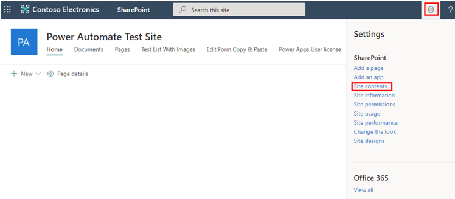](../media/5-10-test-site.png#lightbox)

Select **+ New** and then select **Document library**.

> [!div class="mx-imgBorder"]
> [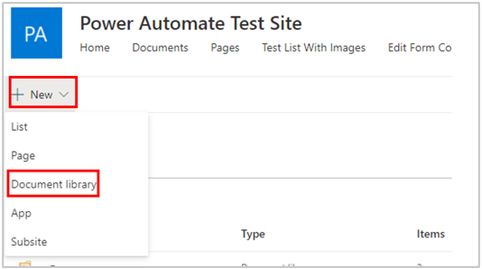](../media/5-11-new.png#lightbox)

In the **Create document library** dialog box, enter **Incoming Emails** in the **Name** field, and then select **Create**.

> [!div class="mx-imgBorder"]
> [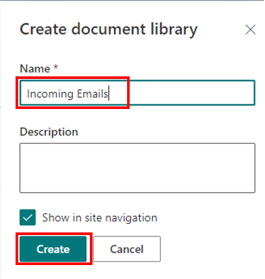](../media/5-12-create-library.png#lightbox)

The following table provides an overview of the column types that you need to add for the library.

| **Column** | **Type** | **Required** | **Additional information** |
|------------|----------|--------------|----------------------------|
| From Name | Single line of text | No | |
| From Email | Single line of text | No | |

You now have a document library created. Next, go to [https://flow.microsoft.com](https://flow.microsoft.com/?azure-portal=true), select **+ Create**, and then select **Automated cloud flow**.

> [!div class="mx-imgBorder"]
> [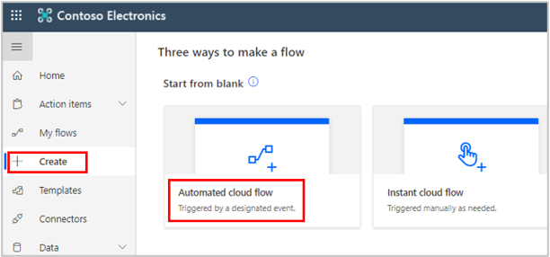](../media/5-15-create-automated.png#lightbox)

Select **Skip**.

> [!div class="mx-imgBorder"]
> [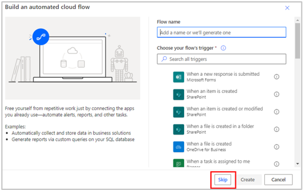](../media/5-16-build.png#lightbox)

Name the flow **Incoming Emails**. In the search box, look for **outlook** and then select **When a new email arrives (V3)**.

> [!div class="mx-imgBorder"]
> [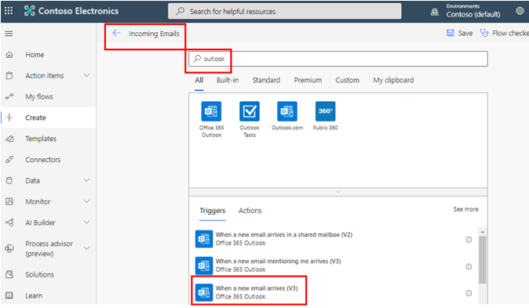](../media/5-17-incoming-outlook.png#lightbox)

Select **Show advanced options**.

> [!div class="mx-imgBorder"]
> [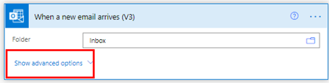](../media/5-18-advanced.png#lightbox)

Add the options to help monitor the incoming emails closely and only capture the attachments from those who match your criteria. This example is monitoring the **To**, **From**, **Include Attachments**, and **Subject Filter** fields.

> [!div class="mx-imgBorder"]
> [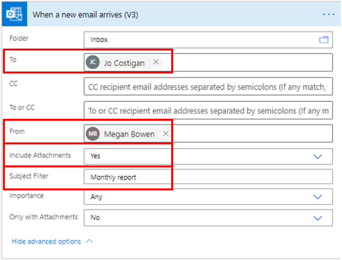](../media/5-19-new-email-options.png#lightbox)

Select **+ Next** step. Search for **sharepoint** and then select **Create file**.

> [!div class="mx-imgBorder"]
> [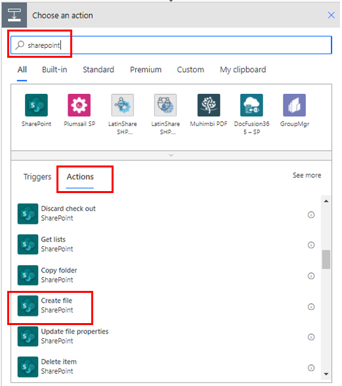](../media/5-20-choose-action.png#lightbox)

Add the **Site Address** and **Folder Path**.

> [!div class="mx-imgBorder"]
> [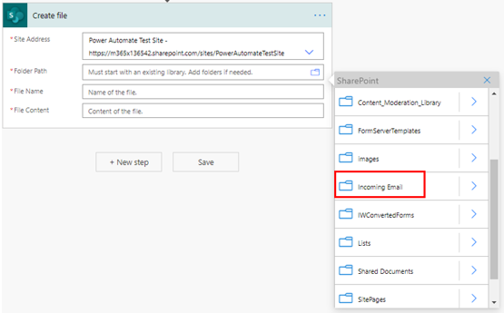](../media/5-21-folder-path.png#lightbox)

For **File Name**, select **Attachments Name**, and for **File Content**, select **Attachments Content**.

> [!div class="mx-imgBorder"]
> [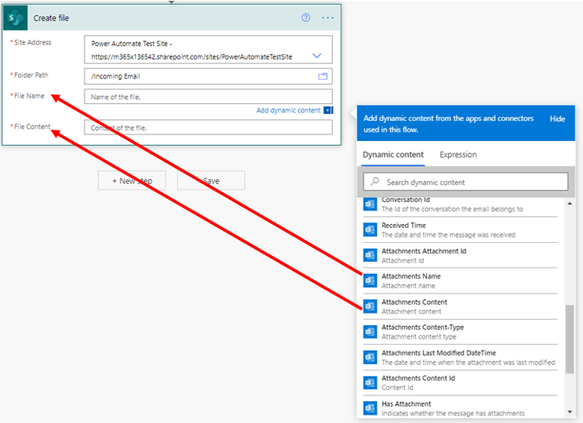](../media/5-22-name-content.png#lightbox)

After you have completed the previous step, the **Create file** action will be added to **Apply to each** automatically. This result is optimal because it will make sure that all attachments from the email are uploaded to the SharePoint library.

> [!div class="mx-imgBorder"]
> [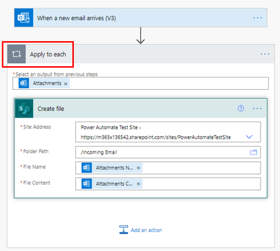](../media/5-23-apply-each.png#lightbox)

Select **Add an action** again, search for **sharepoint**, and then select **Update file properties**.

In the **Update file properties** dialog box, add the information that is shown in the following screenshot.

> [!div class="mx-imgBorder"]
> [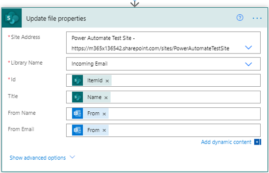](../media/5-24-update.png#lightbox)

Your task is complete. Make sure that you select **Flow checker** and then **Save**.

When Jo Costigan receives an email from Megan Bowen, it has an attachment. If the **Subject** field contains the words "monthly report," the attachments will be picked up by the flow automatically and then saved in the SharePoint library.

> [!div class="mx-imgBorder"]
> [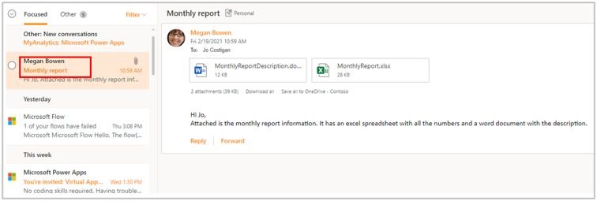](../media/5-25-monthly.png#lightbox)

The following screenshot shows what the SharePoint library looks like.

> [!div class="mx-imgBorder"]
> [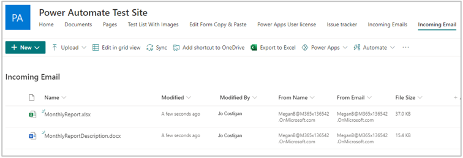](../media/5-26-library.png#lightbox)