Dataverse has specific column data types for files and images. When using these data types, you must use separate actions to modify the column values and access the full column data contents.

The **Upload a file or an image** action is what you would use to modify an existing data row column with the contents of a file or an image. When creating new data rows, you would first use the Add a row action to create the row, then use the row ID on the upload action to modify the file or image columns.

The **Download a file or an image** action is what you would use to get full access to the binary data contents for either data type. You can retrieve the thumbnail and an image URL using the **Get row by id** action or the **List rows** action when working with image columns. The thumbnail contains the binary data for a small image version; you can use it in subsequent steps from the dynamic contents list. The thumbnail is in the dynamics contents column list with a name that matches the image column display name, for example, Product Image. You can also get a URL to download the image using the get or list rows actions. Remember that the download URL is intended for authorized users, and it wouldn't be appropriate to expose it to non-Dataverse users. This property doesn't show in the dynamic content, so you must do a workflow expression to access the value. The format of the item you would reference is column logical name plus "_url". The following assumes a column logical name of entityimage and gets the value from the results of a List rows action.

`item()?['entityimage_url']`

This would retrieve the following URL

`/Image/download.aspx?Entity=sample_product&Attribute=entityimage&Id=27f5c0ed-b221-e811-a845-000d3a33a3ac&Timestamp=638371120614954283`

## Exercise - Work with files

In the following exercise, you create a flow that creates a new **Product** table row and uploads an image for the product. The flow then queries any new products and then downloads the image from each and uses AI Builder to generate a description.

### Prerequisites

Access to an environment with Dataverse with sample apps installed if you want to do the following exercise.

### Task - Create flow

1. Navigate to [Power Automate](https://make.powerapps.com/?azure-portal=true) and select the correct environment.

1. Select **Create** from the left navigation, and then select **Instant cloud flow**.

    > [!div class="mx-imgBorder"]
    > 

1. Enter **Add New Product** for Flow name, select **Manually trigger a flow**, and then select **Create**.

    > [!div class="mx-imgBorder"]
    > 

1. Select the trigger, change the trigger name to **Add product**, and then select **Add an input**.

    > [!div class="mx-imgBorder"]
    > 

1. Select **Text** for input type.

1. Name the input **Product Name** and select **Add an input** again.

1. Select **File** for input type.

1. The trigger should now have two inputs. Select the **Insert a new step** button and then select **Add an action**.

    > [!div class="mx-imgBorder"]
    > 

1. Search for "add row" and select **Add a new row** from the Microsoft Dataverse connector.

1. Rename the step **Add a new product row**, select **Products** for Table Name.

1. Type **/** in the Name field and then select **Insert Dynamic Content**.

    > [!div class="mx-imgBorder"]
    > 

1. Select **Product Name** from the dynamic content pane.

    > [!div class="mx-imgBorder"]
    > 

1. Select the **Insert a new step** button and then select **Add an action**.

1. Search for upload image and select **Upload a file or an image** from the Microsoft Dataverse connector.

1. Rename the action **Upload product image**, type **/** in the Content Name field and then select **Insert Dynamic Content**.

1. Select **File Content name** from the dynamic content pane.

1. Select **Products** for Table Name, type **/** in the Row ID field and then select **Insert Dynamic Content**.

1. Select **Product** from the dynamic content pane.

1. Select **Product Image** for Column Name.

1. Type **/** in the Content field and then select **Insert Dynamic Content**.

1. Select **File Content contentBytes** from the dynamic content pane.

1. The upload product image action should now look like this image. Select the **Insert a new step** button and then select **Add an action**.

    > [!div class="mx-imgBorder"]
    > 

1. Search for list rows and select **List rows** from the Microsoft Dataverse connector.

1. Rename the step **List products**, select **Products** for Table Name, and then select **Show all** button.

1. Paste this expression in the **Filter Rows** field. This setting filters the rows returned to only those created today.

    `Microsoft.Dynamics.CRM.Today(PropertyName='createdon')`

    > [!div class="mx-imgBorder"]
    > 

1. Select the **Insert a new step** button and then select **Add an action**.

1. Search download and select **Download a file or an image** from Microsoft Dataverse connector.

1. Rename the step **Download product image**, select **Products** for Table Name.

1. Type **/** in the Row ID field and then select **Insert Dynamic Content**.

1. Select **Product** of the **List products** from the dynamic content pane.

    > [!div class="mx-imgBorder"]
    > 

1. Power Automate should create For each and add the **Generate description of an image** action inside the For each. Select **Product Image** for Column Name.

1. Select the **Insert a new step** button inside the For each and then select **Add an action**.

    > [!div class="mx-imgBorder"]
    > 

1. Search for generate and select **Generate description of an image** from the AI Builder connector.

1. Type **/** in the Image field and then select **Insert Dynamic Content**.

1. Select **File or image content** from the dynamic content pane.

1. Select the **Insert a new step** button inside the For each and then select **Add an action**.

    > [!div class="mx-imgBorder"]
    > 

1. Search for update row and select **Update a row** from the Microsoft Dataverse connector.

1. Rename the step **Update product description**, select **Products** for Table Name, type **/** in the Row ID field, and then select **Insert Dynamic Content**.

1. Select **Product** of the List products from the dynamic content pane.

1. Select **Show all**.

1. Locate the **Product Description 1 field**, type **/** and then select **Insert Dynamic Content**.

1. Select the **Description** of the Generate description of an image from the dynamic content pane.

    > [!div class="mx-imgBorder"]
    > 

1. The completed flow should now look like this image. Select **Save** and wait for the flow to be saved.

    > [!div class="mx-imgBorder"]
    > 

1. Select **Test**

1. Select **Manually** and then select **Test**.

1. Type **New Surface Laptop** for Product Name, and select **Import**.

1. Select any image from your machine.

1. Select **Run flow**, after you select an image.

1. Select **Done**.

1. The flow run should succeed.

1. Navigate to [Power App maker portal](https://make.powerapps.com/?azure-portal=true) and select the correct environment.

1. Select **Apps** and launch the **Asset Checkout** application.

1. Locate the **New Surface Laptop** row the flow created and open it.

1. You should see the image you uploaded, and the description generated by AI Builder from the image.

    > [!div class="mx-imgBorder"]
    > 