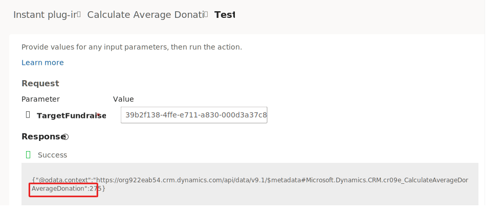
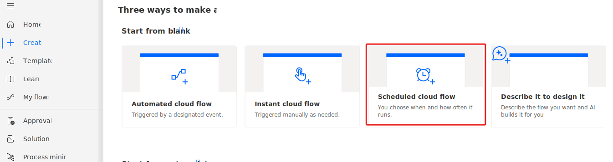

In addition to the basic operations to create, update, delete and query Dataverse data there are also other custom actions that can be used. These actions can be generic utility logic like **AISummarize**  or custom logic specific to a solution. For example, you might have an action  **ScheduleVisit** and when called would find an available technician and assign it to the visit. When using actions, you can provide input information and it can return results as output. You generally don't worry about the logic used by the action internally to accomplish the task. A significant advantage of actions like this is multiple flows and apps can use them, and they consistently do the work the same way. If a change is necessary to the logic, you only have to change the action and then all apps and flows take advantage of the change.

These actions can be [native to Dataverse](/power-apps/developer/data-platform/webapi/reference/actions/?azure-portal=true), created by code-first developers using the [Dataverse Custom API](/power-apps/developer/data-platform/custom-api/?azure-portal=true) feature, or made using an instant [low-code plug-ins](/power-apps/maker/data-platform/low-code-plug-ins/?azure-portal=true) using Power Fx. When you use an action to build your cloud flow, you don’t necessarily know how it was created, just that it's available for you to include in your cloud flow. Actions can be used to make data changes such as creating or updating rows in Dataverse, or can just contain reusable logic.

Actions can be bound or unbound. Bound actions target a specific table row. When you use a bound action, you must provide a reference to the row from that table.  Unbound actions aren't bound to a specific table, and are used without the context of a specific table or row.  The Dataverse connector has two operations, **Perform a bound action** and **Perform an unbound action** that you can use to invoke the actions. When you're creating your cloud flow, you choose a bound action or an unbound action for that step.

> [!div class="mx-imgBorder"]
> 

A low-code maker might use a low-code plug-in to create an action to perform a calculation.  For example, using input from selected currency columns of a table to calculate a debt ratio.  From there, you could add logic to enforce policy based on the results of the calculations. In the example below you can see an unbound action in Power Automate to do this.

> [!div class="mx-imgBorder"]
> 

In the following exercise, you use an action in a cloud flow to send a weekly email with some summary information about active fundraisers.  You first need to create the action as a low-code-plug-in.

## Exercise - Create a low-code plug-in and use it from a cloud flow

In this exercise, you create an instant low-code plug-in that calculates the average donations for a fundraiser. You then invoke this logic from a cloud flow.

### Prerequisites

Access to an environment with Dataverse with sample apps installed if you want to do the following exercise

### Task - Create the low-code plug-in

1. Navigate to [Power Platform maker portal](https://make.powerapps.com/?azure-portal=true) and select the correct environment.

1. Select **Apps** from the left navigation, select **All** and then launch the **Dataverse Accelerator App**.

    > [!div class="mx-imgBorder"]
    > 

1. Select **Create instant plug-in**.

1. Enter **Calculate Average Donation** for Display name and then select the **New input parameter** button.

    > [!div class="mx-imgBorder"]
    > 

1. Enter **TargetFundraiser** for Label, select **EntityReference** for Data type, select **sample_fundraiser**, and then select the **New out parameter** button.

    > [!div class="mx-imgBorder"]
    > 

1. Enter **AverageDonation** for Label and select **Decimal** for Data type.

1. Paste this expression in the **Expression** field and then select the **Save** button.

    `{AverageDonation: LookUp(Fundraisers, sample_fundraiserid = TargetFundraiser.sample_fundraiserid).'Total Donations' / CountIf(Donations, Regarding = TargetFundraiser)}`

    > [!div class="mx-imgBorder"]
    > 

1. You now get a fundraiser ID that you can use to test the plugin. Start a new browser session, navigate to [Power Platform maker portal](https://make.powerapps.com/?azure-portal=true) and select the correct environment.

1. Select **Apps** from the left navigation, select **All** and then launch the **Fundraiser** application.

1. Select **Fundraisers** from the left navigation and open the **Scholarship Fund**.

1. Go to the URL and copy the ID of this fundraiser.

    > [!div class="mx-imgBorder"]
    > 

1. You can close the Fundraiser application.

1. Go back to the plug-in and select the **Test** button.

1. Paste the ID you copied in the **Value** field and then select **Run**.

    > [!div class="mx-imgBorder"]
    > 

1. The plug-in should run successfully and return the average donation.

    > [!div class="mx-imgBorder"]
    > 

1. You can close the Dataverse accelerator application.

### Task - Create flow and use the plug-in

In this task, you use the plug-in you created.

1. Navigate to [Power Automate](https://make.powerapps.com/?azure-portal=true) and select the same environment you created the plug-in.

1. Select **Create** from the left navigation, and then select **Scheduled cloud flow**.

    > [!div class="mx-imgBorder"]
    > 

1. Enter **Weekly Fundraiser Report** for Flow name, select to repeat 1 every week and run on Mondays, and then select **Create**.

    > [!div class="mx-imgBorder"]
    > 

1. Select the **Insert a new step** button and then select **Add an action**.

    > [!div class="mx-imgBorder"]
    > 

1. Search for list rows and select **List rows** from the Microsoft Dataverse connector.  Follow the prompts to create the connection if needed.

1. Change the action name to **List fundraisers**, select **Fundraisers** for Table Name.

    > [!div class="mx-imgBorder"]
    > 

1. Select the **Insert a new step** button and then select **Add an action**.

1. Search for initialize and select **Initialize variable**.

1. Rename the action **Initialize averages**, enter **Donation averages** for Name, and select **Array** for Type.

    > [!div class="mx-imgBorder"]
    > 

1. Select the **Insert a new step** button and then select **Add an action**.

1. Search for perform unbound action and select **Perform an unbound action** from the Microsoft Dataverse connector.

1. Rename the step **Calculate average**, select the **CaluculateAverageDonation** plugin you created for Action Name, and then select the **Show all** button.

    > [!div class="mx-imgBorder"]
    > 

1. Type **/** on the **Item/TargetFundraiser/Sample_fundraiser** field and then select **Insert Dynamic Content**.

    > [!div class="mx-imgBorder"]
    > 

1. Search for fund and select **Fundraiser** from the dynamic content pane.

    > [!div class="mx-imgBorder"]
    > 

1. Power Automate creates a **For each** and place the Calculate average action inside the for each.

1. Select the **For each** and rename it **For each fundraiser**.

1. Select the **Insert a new step** button below the **Calculate average** action and then select **Add an action**.

    > [!div class="mx-imgBorder"]
    > 

1. Search for append and select **Append to array variable**.

1. Rename the action **Append to donation averages**, select **Donation averages** for Name, and paste this JSON in the **Value** field.  You add the dynamic values to this JSON.

   `{"Name":, "Total Donation":, "Average Donation":}`

1. Type **/** after **"Name":** and then select **Insert Dynamic Content**.

    > [!div class="mx-imgBorder"]
    > 

1. Select **Name** from the dynamic content pane.

1. Type **/** after **"Total Donation":** and then select **Insert Dynamic Content**.

1. Select **Total Donations** from the dynamic content pane.

1. Type **/** after **"Average Donation":** and then select **Insert Dynamic Content**.

1. Select **AverageDonation** from the dynamic content pane.

1. The for each should now look like this image. Select the **Insert a new step** outside the **For each fundraiser** action and then select **Add an action**.

    > [!div class="mx-imgBorder"]
    > 

1. Search for HTML table and select **Create HTML table** from the Data Operation connector.

1. Type **/** in the From field and then select **Insert Dynamic Content**.

1. Select **Donation averages** from the dynamic content pane.

1. Select the **Insert a new step** button after the **Create HTML table** action and then select **Add an action**.

    > [!div class="mx-imgBorder"]
    > 

1. Search for send email and select **Send an email (V2)**. Follow the prompts to create the connection if needed.

1. Rename the send email action **Send report**, provide your user's email for To, type **Fundraisers Report** as Subject.

1. Type **/** in the Body field and then select **Insert Dynamic Content**.

1. Select **Output** of the Create HTML table from the dynamic content pane.

    > [!div class="mx-imgBorder"]
    > 

1. Select **Save** and wait for the flow to be saved.

1. Don't navigate away from this page.

### Task - Test flow

1. Select the **Test** button.

    > [!div class="mx-imgBorder"]
    > 

1. Select **Manually**, and then select **Test**.

1. Select **Run flow**.

1. Select **Done**.

1. The flow should run should succeed.

    > [!div class="mx-imgBorder"]
    > 

1. Navigate to [Outlook](https://outlook.office.com/?azure-portal=true).

1. You should receive the fundraiser report email sent by the flow.

1. The report should like this email.

    > [!div class="mx-imgBorder"]
    > 
