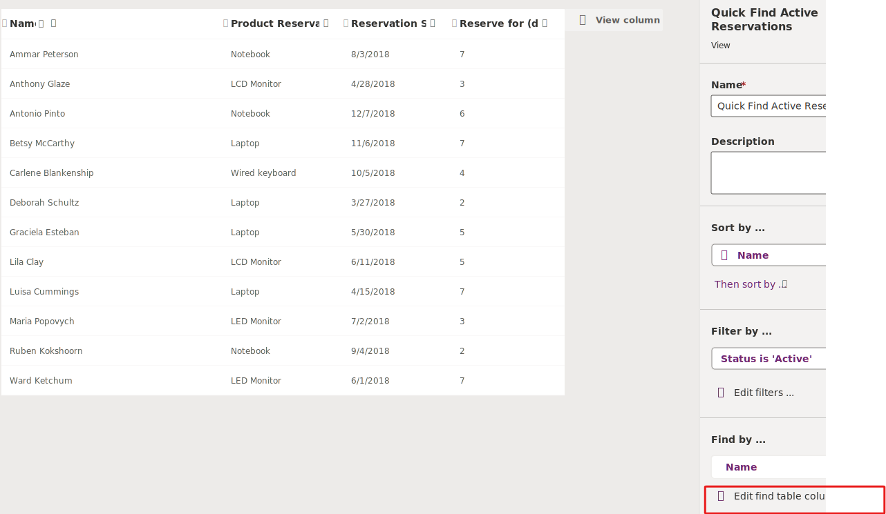

The Microsoft Dataverse connector **Search rows** action allows you to use the Dataverse search capability within your Power Automate cloud flows. Dataverse search delivers fast and comprehensive results across multiple tables.

Before you can use Dataverse search in your Power Automate flows, you must first:

- Enable Dataverse search for your environment.

- Select searchable tables for Dataverse search.

- Specify the columns to search and columns to return.

We give you quick instructions on how to configure your environment for Microsoft Dataverse search here, but if you want step-by-step instructions, navigate to [Configure Dataverse search for your environment](/power-platform/admin/configure-relevance-search-organization#what-is-dataverse-search/?azure-portal=true).

## Enable Dataverse search

To enable Dataverse search for your environment, navigate to the [Power Platform admin center](https://admin.powerplatform.microsoft.com/?azure-portal=true) and go to the settings of the environment you want to enable Dataverse search for. From the settings page, expand the Product section and select Features. You can enable or disable Dataverse search in the Search section, using the toggle button.

> [!div class="mx-imgBorder"]
> 

## Select searchable tables

To select the tables for search, open the solution where the tables reside, select the **Manage search index** link button located in the **Overview** tab. Here, you can select the tables you to index for Dataverse search.

## Specify columns

The table's Quick Find View drives the searchable columns and filters for a table enabled for Dataverse search. You can configure the columns to search via the **Edit find table columns** button located in the **Find by...** section.

> [!div class="mx-imgBorder"]
> 

You can also create a Quick view designed for Dataverse search that has its own filter, sort, and columns.

## Use the Dataverse search rows action

Using the Dataverse search rows action for basic search is straightforward; the only required input is the search term; you can use dynamic content from a previous step as the search term. For this example, we use a manually triggered flow with an input parameter. Then, we select the input from the trigger as the search term for our Dataverse search rows action. We're simplifying here, but the input can be from any previous action.

> [!div class="mx-imgBorder"]
> 

Dataverse search rows return all the rows that match the search term; this result could sometimes be from a single table or across multiple tables. In most cases, the columns of results from multiple tables wouldn't match and require you to configure the returned results before they reach their final destination.

In this example, the Dataverse search rows action returns results from the Contact, Reservation, and Review tables. Knowing that the returned columns aren't the same, we transformed the data into an array variable with common columns before creating an HTML table.

> [!div class="mx-imgBorder"]
> 

Firstly, we created an array variable to store the combined search results. After that, we added a parse JSON step to interpret the results received from the Dataverse search rows action. The apply to each action was then employed to iterate through each result.

We introduced a switch control to manage each table's item result appropriately. This step was crucial in ensuring we could use the unique columns from each table via the dynamic content. Finally, we incorporated the results into the search results array variable.

By implementing these steps, we effectively addressed the issue of mismatched columns and transformed the data to facilitate the creation of the HTML table.

### Table filter

The Dataverse search rows action allows you to select what table or tables you want to search.
In this example, our Dataverse search was configured to search across multiple tables, but we're restricting the Dataverse search rows action inside the Power Automate flow to search just the contact table.

> [!div class="mx-imgBorder"]
> 

### Row filter

You can employ OData style filter expression to restrict the search. If you would like the search to return only contacts from Redmond, you would provide this expression as Row Filter.

`address1_city eq 'Redmond'`

In this example, our Dataverse search was configured to search across multiple tables, but we're restricting the Dataverse search rows action inside the Power automate to search just the contact table.

### Sort

If you want to sort the returned results by search score in descending order and then by full name in ascending order, use these expressions as sort orders.

**Sort by Item - 1**: `@search.score desc`

**Sort by Item - 2**: `fullname asc`
